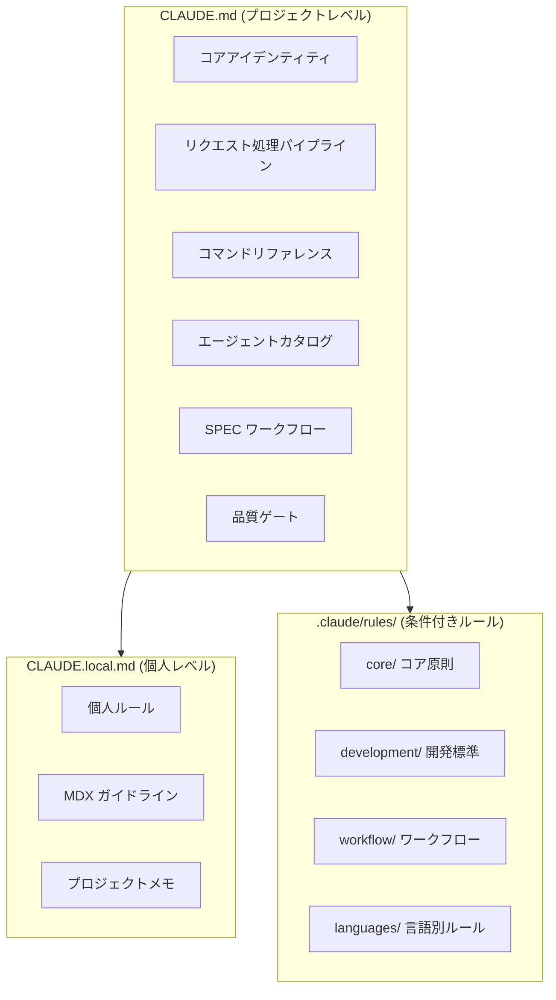
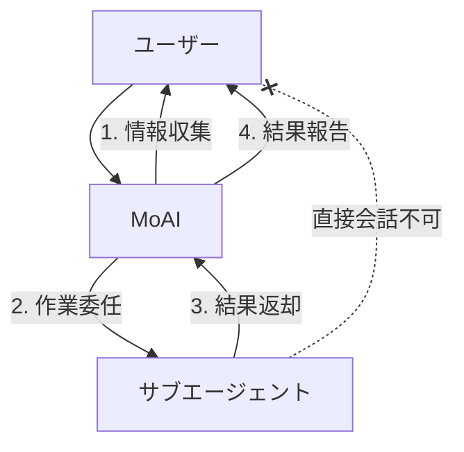
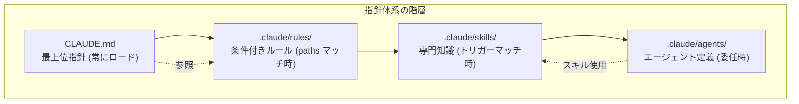

Claude Code のコア指針ファイル体系を詳しく解説します。`CLAUDE.md` は毎セッション必ずロードされるファイルなので、このファイルの一行一行がそのまま常時コンテキストコストです — 指針体系の設計はハーネス設計であると同時にトークノミクスでもあります。


**ひと言要約**: `CLAUDE.md` はプロジェクトの **憲法** です。Claude Code がプロジェクトをどう理解し、どのルールに従い、どのエージェントを呼び出すかがすべてこのファイルで決まります。


## CLAUDE.md とは?

`CLAUDE.md` は Claude Code がセッション開始時に **最初に読む指針ファイル** です。このファイルにプロジェクトのルール、エージェント構造、ワークフロー、品質基準などが定義されています。

人が新しい会社に入社したら社員ハンドブックを読むように、Claude Code はセッション開始時に `CLAUDE.md` を読んでプロジェクトの文脈を把握します。

## ファイル構造

MoAI-ADK は 2 つの指針ファイルとルールディレクトリを使用します。


```mermaid
flowchart TD
    subgraph MAIN["CLAUDE.md (プロジェクトレベル)"]
        M1["コアアイデンティティ"]
        M2["リクエスト処理パイプライン"]
        M3["コマンドリファレンス"]
        M4["エージェントカタログ"]
        M5["SPEC ワークフロー"]
        M6["品質ゲート"]
    end

    subgraph LOCAL["CLAUDE.local.md (個人レベル)"]
        L1["個人ルール"]
        L2["MDX ガイドライン"]
        L3["プロジェクトメモ"]
    end

    subgraph RULES[".claude/rules/ (条件付きルール)"]
        R1["core/ コア原則"]
        R2["development/ 開発標準"]
        R3["workflow/ ワークフロー"]
        R4["languages/ 言語別ルール"]
    end

    MAIN --> LOCAL
    MAIN --> RULES

```

| ファイル/ディレクトリ | 用途 | Git 追跡 | 更新時 |
|---------------|------|----------|-------------|
| `CLAUDE.md` | MoAI-ADK コア指針 | はい | 上書き |
| `CLAUDE.local.md` | 個人カスタム指針 | いいえ | 保存 |
| `.claude/rules/moai/` | 条件付き詳細ルール | はい | 上書き |
| `.claude/rules/local/` | 個人カスタムルール | いいえ | 保存 |

## MoAI CLAUDE.md 主要セクション

### 1. コアアイデンティティ

MoAI オーケストレーターの役割と HARD ルールを定義します。

```markdown
## 1. コアアイデンティティ

MoAI は Claude Code の戦略的オーケストレーターです。

### HARD ルール (必須)
- [HARD] 言語認識応答: ユーザーの conversation_language で応答
- [HARD] 並列実行: 独立したツール呼び出しは並列実行
- [HARD] XML タグ非表示: ユーザー向け応答に XML 非表示
- [HARD] Markdown 出力: すべてのコミュニケーションに Markdown 使用
```

### 2. リクエスト処理パイプライン (Analyze-First)

すべてのリクエストは入力言語と無関係に、1 つの順序化されたパイプラインを通ります。v3.0 の核心は **意図分析が常に先** という点です — 英語キーワードマッチングではなく、言語独立の意味分類でルーティングします。

| ステージ | 説明 |
|------|------|
| 1. 意図分析 | リクエストの意図を言語独立に分類 (Analyze-First) |
| 2. コンテキスト充足性チェック | 不足していれば実行前に Socratic インタビューで確認 |
| 3. 実行計画の構成 | スキル/エージェント/ワークフローチェーン + オーケストレーションモード選択 |
| 4. 承認ゲート | 実装着手承認 (plan→run ヒューマンゲート) を含む |
| 5. 実行 → 検証 → 反復 | 受け入れ基準に対する検証、goal が設定されれば goal 評価者が終了判定 |

### 3. コマンドリファレンス

`/moai` がすべての MoAI 開発ワークフローの単一エントリポイントです。

| 種別 | コマンド | 用途 |
|------|--------|------|
| SPEC パイプライン | `/moai plan`, `/moai run`, `/moai sync` | 3-phase 開発ワークフロー |
| ループ/修正 | `/moai goal`, `/moai loop`, `/moai fix` | 条件宣言ループ、反復修正、単発修正 |
| プロジェクト/ハーネス | `/moai project`, `/moai harness` | プロジェクトドキュメント + ハーネス生成/管理 |
| 品質/ユーティリティ | `/moai review`, `/moai gate`, `/moai clean`, `/moai mx`, `/moai codemaps`, `/moai feedback` | レビュー、ゲート、クリーンアップ、注釈、ドキュメント、フィードバック |
| (自然言語) | `/moai "リクエスト"` | Analyze-First ルーティング → 自律パイプライン |

### 4. エージェントカタログ

MoAI-ADK は **11 個の保持エージェント** (10 個の MoAI-custom + 1 個の Anthropic built-in) で構成されます。アーキテクチャ簡素化により、manager-strategy、manager-quality、manager-brain、manager-project など 12 個の archived エージェントは、特定ドメインへの per-spawn `Agent(general-purpose)` delegation に置き換えられました。

| 分類 | エージェント | 役割 |
|------|----------|------|
| Manager (5) | manager-spec, manager-develop, manager-docs, manager-git, manager-design | コアライフサイクル各フェーズの専門家 |
| Evaluator (2) | plan-auditor, sync-auditor | 計画/完了フェーズの独立品質評価 |
| Builder (1) | builder-harness | 動的なプロジェクト別ハーネス生成 |
| Advisor (1) | super-advisor | 高推論コンサルティング (E1-E4 エスカレーション) |
| Specialist (1) | e2e-specialist | ウェブ/モバイル/デスクトップの E2E テスト実行 |
| Built-in (1) | Explore (Anthropic) | 読み取り専用のコードベース探索 |

### 5. SPEC ワークフロー

3 段階の SPEC ベース開発ワークフローを定義します。

```bash
# Plan: SPEC ドキュメント生成 (30K トークン)
> /moai plan "機能の説明"

# Run: DDD 実装 (180K トークン)
> /moai run SPEC-XXX

# Sync: ドキュメント同期 (40K トークン)
> /moai sync SPEC-XXX
```

### 6. 品質ゲート

TRUST 5 フレームワークと LSP 品質ゲートを定義します。

| 品質基準 | 要求事項 |
|-----------|----------|
| Tested | 85%+ カバレッジ、LSP 型エラー 0 |
| Readable | 明確な命名、LSP リントエラー 0 |
| Unified | 一貫したスタイル、LSP 警告 10 以下 |
| Secured | OWASP 準拠、LSP セキュリティ警告 0 |
| Trackable | 明確なコミット、LSP 状態追跡 |

### 7. ユーザーインタラクションアーキテクチャ

サブエージェントはユーザーと直接会話できません。ユーザーとの接点は MoAI 一つに固定されます。


```mermaid
flowchart TD
    USER["ユーザー"] --> MOAI["MoAI"]
    MOAI -->|"1. 情報収集"| USER
    MOAI -->|"2. 作業委任"| AGENT["サブエージェント"]
    AGENT -->|"3. 結果返却"| MOAI
    MOAI -->|"4. 結果報告"| USER

    AGENT -.-x|"直接会話不可"| USER

```

### 8. 構成リファレンス

言語設定、ユーザー設定、プロジェクトルールを参照します。

```yaml
language:
  conversation_language: ko           # ユーザー応答言語
  agent_prompt_language: en           # エージェント内部言語
  git_commit_messages: en             # Git コミットメッセージ
  code_comments: en                   # コードコメント
  documentation: en                   # ドキュメントファイル
```

## CLAUDE.local.md 活用法

`CLAUDE.local.md` は個人的なルールとメモを書くファイルです。MoAI-ADK の更新と無関係に保存されます。

### 作成例

```markdown
# プロジェクトローカル設定

## ドキュメント作成ガイドライン

### MDX レンダリングエラー防止
- 強調表示と括弧の間に必ずスペース

### Mermaid ダイアグラムの方向
- すべてのダイアグラムは縦方向 (flowchart TD)

## 個人メモ
- DB マイグレーション前にバックアップ必須
- API エンドポイント命名: kebab-case を使用
```

### 活用のヒント

| 用途 | 内容の例 |
|------|-----------|
| コーディングルール | 「変数名は camelCase、ファイル名は kebab-case」 |
| プロジェクトメモ | 「認証は JWT、期限 24 時間、更新 7 日」 |
| 禁止事項 | 「console.log をプロダクションコードに残さない」 |
| 好みのパターン | 「React コンポーネントは関数型のみ使用」 |
| MDX ルール | 「強調と括弧の間にスペース必須」 |

## .claude/rules/ システム

`.claude/rules/` ディレクトリには **条件付きでロードされる詳細ルール** が保存されます。すべてのルールを CLAUDE.md に入れず条件付きファイルに分離する理由はただ一つ — 使わないルールがコンテキストを占有しないようにするためです。

### ディレクトリ構造

```
.claude/rules/moai/
├── core/                          # コア原則
│   └── moai-constitution.md       # TRUST 5、コアルール
├── development/                   # 開発標準
│   ├── skill-authoring.md         # スキル作成ガイド
│   └── coding-standards.md        # コーディング標準
├── workflow/                      # ワークフロー
│   ├── workflow-modes.md          # Plan/Run/Sync 定義
│   └── spec-workflow.md           # SPEC ワークフロー
└── languages/                     # 言語別ルール (16 個)
    ├── python.md
    ├── typescript.md
    ├── javascript.md
    └── ...
```

### 条件付きロード (paths frontmatter)

ルールファイルは `paths` フロントマターを通じて **特定ファイルの作業時のみロード** されます。

```yaml
---
paths:
  - "**/*.py"
  - "**/pyproject.toml"
---

# Python コーディングルール
- ruff フォーマッターを使用
- type hints 必須
- docstring は Google スタイル
```

このルールは Python ファイルを修正するときだけロードされ **トークンを節約** します。

### ルールファイルの種類

| ディレクトリ | ファイル | ロード条件 |
|----------|------|-----------|
| `core/` | `moai-constitution.md` | 常にロード |
| `development/` | `skill-authoring.md` | スキル関連の作業時 |
| `development/` | `coding-standards.md` | コード作業時 |
| `workflow/` | `workflow-modes.md` | ワークフローコマンド時 |
| `workflow/` | `spec-workflow.md` | SPEC 関連の作業時 |
| `languages/` | `python.md` など | 該当言語ファイルの修正時 |

## サイズ制限

`CLAUDE.md` は **40,000 文字以下** を維持する必要があります。MoAI-ADK 自体も v3 期間中に CLAUDE.md をダイエットし続けてきました — 常時ロードの指針は短いほどすべてのセッションが安くなります。

### サイズ超過時の対応方法


```mermaid
flowchart TD
    CHECK{"CLAUDE.md<br>40,000 文字超過?"}

    CHECK -->|はい| MOVE["詳細内容を<br>.claude/rules/ へ移動"]
    CHECK -->|いいえ| OK["正常維持"]

    MOVE --> REF["CLAUDE.md には<br>参照だけ残す"]
    REF --> SLIM["コアルールのみ<br>CLAUDE.md に維持"]
```

**対応戦略:**

1. **詳細内容の移動**: 長い説明は `.claude/rules/` ファイルへ分離
2. **参照の使用**: `CLAUDE.md` から `@ファイルパス` で参照
3. **核心のみ維持**: アイデンティティ、HARD ルール、エージェントカタログのみ維持
4. **スキルへの転換**: 長いパターン説明はスキルに変換

## 実践例: CLAUDE.local.md カスタムルール

### フロントエンドプロジェクト

```markdown
# プロジェクトローカル設定

## React ルール
- コンポーネントは必ず関数型で作成
- Props インターフェースはコンポーネントファイル上部に定義
- 状態管理は Zustand を使用
- CSS は Tailwind CSS のみ使用

## 命名ルール
- コンポーネント: PascalCase (UserProfile.tsx)
- ユーティリティ: camelCase (formatDate.ts)
- 定数: UPPER_SNAKE_CASE (MAX_RETRY_COUNT)
- API エンドポイント: kebab-case (/api/user-profiles)

## 禁止事項
- any 型の使用禁止
- console.log をプロダクションコードに禁止
- default export 禁止 (named export のみ使用)
```

### バックエンドプロジェクト

```markdown
# プロジェクトローカル設定

## Python ルール
- FastAPI を使用
- 非同期関数優先 (async/await)
- Pydantic v2 モデルを使用
- SQLAlchemy 2.0 スタイル

## データベースルール
- マイグレーション前に必ずバックアップ
- インデックスはクエリパターン分析後に追加
- soft delete パターンを使用 (is_deleted フラグ)

## API ルール
- RESTful エンドポイント命名
- 応答形式の統一: {"data": ..., "message": ...}
- エラーコードの標準化
```

## CLAUDE.md、rules、skills の関係

指針体系は 4 階層に分かれ、下の階層に行くほどロード条件が狭くなります。


```mermaid
flowchart TD
    subgraph HIERARCHY["指針体系の階層"]
        CLAUDE["CLAUDE.md<br>最上位指針 (常にロード)"]
        RULES[".claude/rules/<br>条件付きルール (paths マッチ時)"]
        SKILLS[".claude/skills/<br>専門知識 (トリガーマッチ時)"]
        AGENTS[".claude/agents/<br>エージェント定義 (委任時)"]
    end

    CLAUDE --> RULES
    RULES --> SKILLS
    SKILLS --> AGENTS

    CLAUDE -.->|"参照"| RULES
    AGENTS -.->|"スキル使用"| SKILLS

```

| 階層 | ファイル | ロード時点 | 役割 |
|------|------|-----------|------|
| 1. CLAUDE.md | `CLAUDE.md` | 常に | プロジェクトアイデンティティ、コアルール |
| 2. Rules | `.claude/rules/*.md` | ファイルパターンマッチ時 | 条件付き詳細ルール |
| 3. Skills | `.claude/skills/*/skill.md` | トリガーマッチ時 | 専門知識、パターン |
| 4. Agents | `.claude/agents/*.md` | 委任時 | 専門家の役割定義 |

## 関連ドキュメント

- [スキルガイド](/ja/advanced/skill-guide) - スキルシステム詳細
- [エージェントガイド](/ja/advanced/agent-guide) - エージェントシステム詳細
- [settings.json ガイド](/ja/advanced/settings-json) - 設定ファイル管理
- [Hooks ガイド](/ja/advanced/hooks-guide) - イベント自動化


**ヒント**: `CLAUDE.md` を直接修正するより、`CLAUDE.local.md` に個人ルールを追加することをお勧めします。MoAI-ADK の更新時にも個人ルールが安全に保存されます。

