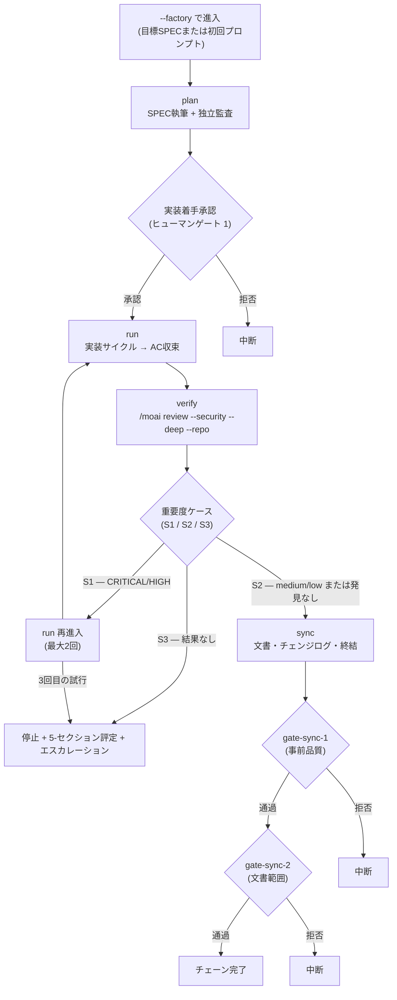




 <strong>所属価値</strong>: エージェンティックループエンジニアリング · エージェンティックハーネス

<!-- @value: self-learning, agentic-harness -->

セッションランチャーに`--factory`(短く`-f`)スイッチを付けると、オーケストレータ(作業を指揮する指揮者)が`plan → run → verify → sync`の4段階を1つのセッションの中で一度に回し、SPEC(要件仕様書)1つを計画から終了まで一気に押し進めます。新しいサブコマンドでも、新しいランタイムでもありません。すでにあった`/moai goal`の無限持続ループの上に、`factory_chain`というゴールプリセット(完了条件をあらかじめ決めておいた束)を載せるための進入契約にすぎません。

このページは、ファクトリモードでSPEC1つを最後まで押し切る手順を4段階に分けて説明します。ワークフローコマンド観点の短い紹介は、[`/moai` 統合コマンド](/ja/workflow-commands/)のファクトリモード項目を先にご覧ください。ここでは進入条件、チェーンの各段階、4つのヒューマンゲート(人が承認する決定門)、重要度の分岐、終了条件、そして「何が自動化されないのか」までをもう1枚深く扱います。

## このページが扱うこと

ファクトリモードは、`full-pipeline`契約(1つのSPECに対しrun→syncの自動チェーンを結ぶ約定)を拡張する進入契約です。ちょうど2つを追加で載せます。

1. **plan-phaseのチェーン頭** — チェーンがフェーズを1つずつ呼ぶ代わりに、planから始まります。
2. **verifyの出入ゲート** — run-phaseの出口に自動セキュリティレビュー(`/moai review --security --deep --repo`)を置きます。

残りのチェイニング規則は継承された通りです。2つ目のチェイニング機構が別にあるわけではありません。チェーン全体の流れは下図1つで収まります。



## Step 1 — ファクトリモードでセッションを開く


**スラッシュコマンドではありません**: ファクトリモードはClaude Codeの対話欄の`/`コマンドではなく、セッションそのものを開くスイッチです。端末でセッションを始めるときに付けます。対話欄の中ではオン/オフできません。


端末でセッションランチャーに`--factory`を付けて始めます。SPEC識別子を同時に与えればそのSPECを目標とし、落とせば初回プロンプトでplan-phaseを始めます。

```bash
# SPECを目標にファクトリチェーンへ進入
$ claude --factory SPEC-AUTH-001

# 短い形式
$ claude -f SPEC-AUTH-001

# 目標SPECなし — 初回プロンプトで plan を開始
$ claude --factory

# moai cc ランチャーで同じ進入
$ moai cc --factory SPEC-AUTH-001
```

進入が成功すると、ランチャーはセッションの中に2つのものを差し込みます。第1に、このあと見る`factory_chain`ゴールプリセットを(実装着手承認が出た後に)武装します。第2に、Claude Codeランタイムの連続ブロック上限(`CLAUDE_CODE_STOP_HOOK_BLOCK_CAP`、既定8)を`MOAI_FACTORY`環境変数で200まで引き上げます。この引き上げはゲートを越えるものではありません — ヒューマンゲートはブロック上限ではなく`AskUserQuestion`で発火するので、上限が8でも200でもゲートの発火条件は同じです。セッションが終われば`defer`で進入前の値に戻し、大域環境には触れません。

```bash
# 概念的な流れ — ランチャーがセッション開始/終了に差し込む
# (ユーザーが直接環境変数を触る必要はない)
enter_factory_session():
    set CLAUDE_CODE_STOP_HOOK_BLOCK_CAP=200 via MOAI_FACTORY
    defer restore original CAP value
    start factory_chain preset
```

1つだけ堅い境界があります。ファクトリモードは混成バックエンドランチャーである`moai cg`で拒否されます。`moai cg`はあるバックエンドでリーダーを、別のバックエンドでチームメイトを回しますが、これはチェーンが前提とする「1セッション / 1バックエンド / 1チェーン」に矛盾します — verify段階がどちらのバックエンドで回ったか決定できなくなります。拒否センチネル`FACTORY_MODE_UNSUPPORTED_BACKEND`とともにセッションは開かれません。適応して迂回する抜け穴ではなく、意図的な境界です。

## Step 2 — plan の通過と実装着手承認

plan段階はSPEC文書を執筆し、独立監査(plan-auditorサブエージェント)がその内容を検証します。この部分はファクトリモードでなくても同じように回る、チェーンの頭です。

planが終わっても、チェーンはすぐにはrunに進みません。**実装着手承認**(Implementation Kickoff Approval)という最初のヒューマンゲートがplanとrunの間に立ちます。オーケストレータが`AskUserQuestion`でユーザーに「このSPECのまま実装を始めるか」を尋ね、承認が出て初めてrun-phaseに入ります。このゲートはファクトリモードが新しく作ったものではなく、継承されたものです — `/moai run`が普段も守る同じ扉です。

このゲートを通る場所が、ゴールプリセットを武装する場所でもあります。チェーンはその後にはユーザー選好を尋ねる術がないため、選好がすべて抜けるまさにこの扉を抜けたあとに`factory_chain`を武装します。武装規則は3つあります。

- **ゲート1通過後にのみ武装。** ユーザー選好がすべて抜ける場所はplan→runゲートです。
- **作業とともに武装、作業の代わりではなく。** `arm-only`なので条件を登録するだけで何も始めません。だからオーケストレータはプリセットが駆動するフェーズを始める同じターンにプリセットを武装します。
- **散文ではなくフラグで縛る。** `--max-turns 0 --max-duration 14400` — 無限ターン、4時間の壁時計上限(wall-clock、経過時間に基づく限度)。条件文に「20ターン後に止まれ」と散文で書いても評価器がパースしないため、信じた上限は働きません。

`factory_chain`の完了条件は**完全にモデル条件**(対話記録を判定する述語)で組み立てられます。毎ターンの終わりに既存の`stop-goal` Stop-フック評価器が評価します。新しいランタイム、新しいフック、新しい評価器は1つも入りません — すでにある機械の上に条件を1つ載せたものです。

```text
The plan-phase artifacts for the targeted SPEC are surfaced as authored and
the plan audit verdict is surfaced as PASS; AND every blocking acceptance
criterion has its PASS evidence surfaced in the conversation; AND the verify
stage is surfaced as having produced a readable result, with its severity case
(S1 / S2 / S3) and its rung stated in the transcript; AND the sync phase is
surfaced as closed, with the SPEC status transition recorded. All of these
hold — that is the end state.
```

各文は、オーケストレータが作業しながら対話に書き込む何かを指します。もしファイルパスを開かなければならない述語だったなら、モデル条件ではなく、静かに収束できなかったでしょう。許容されるリスクも明示的に置きます — 無人のファクトリrunは壁時計上限が発火する前に最大4時間のトークンを消費し得ます。合法的に多くのターンが必要なチェーンが途中で切れないように意図されたトレードオフです。望まないなら、この上限で武装しないでください。

## Step 3 — run の仕上げと verify の重要度分岐

run段階では、設定された実装サイクル(TDDやDDD)が受入基準(Acceptance Criterion, AC — SPECが満たすべき通過条件)に収束するまでコードを実装します。この段階自体はファクトリモードでなくても同じです。

ファクトリチェーンが導入する構造的な装置はrun-phaseの出口にあります。runが終わるとverify段階が1度回り、ここで`/moai review --security --deep --repo`がセキュリティレビュー結果を出します。結果が出たら重要度に従って3つに分かれます。この分岐こそが、ファクトリチェーンが新しく追加するヒューマンゲートの生まれる場所です。

```bash
# S1 — CRITICAL/HIGH の発見: run に戻って fix を書き直す
plan(そのまま) → run(再進入) → verify(再評価)

# S2 — medium/low または発見なし: 発見を前に持って sync へ進む
plan(完了) → run(完了) → verify(S2) → sync

# S3 — 読める結果自体がない: 再進入 ceiling に含めて数えない
verify(S3) → 停止 + 5-セクション評定 + エスカレーション
```

S1はブロックです。発見されたCRITICAL/HIGHをrun-phaseが修正したあとverifyを再度回します。再進入は**最大2回**で、3回目の試行でもS1が出ればチェーンは停止し、5-セクション評定(主張/証拠/baseline帰属/未検証/残余リスク)をエスカレーションします。このceilingは無限再進入ループを防ぐ安全装置です。S2はブロックではありません — medium/lowの発見をsync段階へ前進しながら後ろに伝えます。発見を無視するのではなく、「syncが処理できる重さ」へ載せ替えるのです。S3はS1/S2とは違う種類の失敗です。verifyがタイムアウト、ツール失敗、形式不一致で結果を出せなければ、チェーンは直ちに停止します。S3は再進入ceiling(2回)に**含めて数えません** — 「もう一度回せば出るだろう」という推測でceilingを浪費しないためです。

CRITICAL/HIGHが発見されたときオーケストレータが尋ねる`AskUserQuestion`ラウンドこそ、ファクトリモードが導入する**新しいヒューマンゲート**(ゲート2)です。ファクトリモードが新しく作ったゲートはこれ1つだけで、残り3つは継承です。

verify結果は重要度とともに**rung**(レビューツールの信頼等級)という属性をもう1つ持ってきます。rungはレビューツールがどの等級まで動いたかを3つの枠で表します。

| rung | 意味 | sync への影響 |
|------|------|----------------|
| `PRIMARY` | 基本検査ツールが正常動作 | sync Phase 8 のセキュリティレビュー段階を正常に実行 |
| `FALLBACK` | 基本が失敗し予備ツールへ迂回 | sync Phase 8 を同じように実行(内容は fallback 結果に基づく) |
| `DEGRADED` | セキュリティレビューを飛ばしたまま run 終了 | sync Phase 8 のセキュリティレビュー抑制を**強制的にオフにする**(Step 0.55.1) |

`DEGRADED`の枠は重要です。「runは最後まで終えるが、syncでセキュリティレビューを飛ばした状態のままにはしない」という意味だからです。runで抜けたセキュリティレビューをsyncで補うように仕向ける装置です。

## Step 4 — sync の仕上げとチェーン終結

sync段階は文書を更新し、チェンジログを書き、フェーズを終結します。ここでも継承された2つのヒューマンゲートが発火します — 事前品質を検査する`gate-sync-1`(ゲート3)と、文書範囲を検査する`gate-sync-2`(ゲート4)です。どちらのゲートも`/moai sync`が普段も守る同じ扉です。

ファクトリチェーンのverifyは、sync段階と「runの最後にどのセキュリティ検査を回したか」を記録としてやり取りします。この記録が、sync Phase 8に同じ検査を再び回さないようにします。設計が**拒否リストではなく許可リスト**である点が重要です — 検査を引く側ではなく、runで既に回した検査を明示的に認める側に組み立てられています。

```bash
# 検査 revision-match 述語 (概念的)
# run の最後のコミットのスキャン結果 vs sync で回そうとする検査
if revision_match(scanned_commit, current_commit):
    skip_duplicate_scan()    # run で既に見た検査は飛ばす
    record_skip_reason("already scanned at <sha>")
else:
    run_scan_normally()      # 差があれば正常に回す
```

述語が偽なら — すなわちrunでセキュリティ検査を回したコミットとsyncが見ようとするコミットが違えば — syncは正常にセキュリティレビュー段階を実行します。飛ばしは純粋に同じコミットで既に観察された結果にだけ適用されます。飛ばした検査は結果ディレクトリとマッチした`scanned_commit`で明示的に記録に残され、「なぜこの検査が抜けたか」を後で追跡できます。依存関係マニフェスト監査(`go.mod`, `package-lock.json`など)はこの契約で**例外なく常に実行されます** — 依存関係の変更はコミットを問わず毎回検査しなければならない無条件領域です。

チェーンは次のうち最初に来たもので終わります。5つ目の出口はありません。

- **条件が成立** — チェーン完了。
- **4時間の壁時計上限** — `--max-duration 14400` が発火。
- **停滞ガード** — ゴールエンジンがN回連続の進展なしを掴んで止める。
- **ヒューマンゲートの拒否** — 4つのゲートのいずれかで拒否。
- **S3 または S1 ceiling 到達** — verify が読める結果を出せないか、再進入2回でも S1 が出れば停止。

ファクトリセッションは`.moai/state/factory/`以下にセッションキー単位でレコードを1つ持ちます。ランチャーが進入時に1つ書き、セッションが終われば整理します。レコードは`session_id`, `spec_id`, `backend`, `entered_at`, `deepscan_dir`, `verify_rung`, `verify_reentries`フィールドを含み、セッションが中断されたまま終わればどこで止まったかを知らせます。再進入時に最初から始めるか繋ぐかは運用者の判断に任されます — ファクトリモード自身は自動の再継ぎを約束しません。

## いつ使い、いつ使わないか


**1つのSPEC、1つのセッション、1つのバックエンド。** ファクトリモードは一度に1つのSPECです。このSPECが終わればチェーンも終わります。次のSPECを続けて回すには、新しいファクトリセッションを開かなければなりません。


**使うとき** — SPEC1つを終了まで一度に押し切るとき。壁時計上限(4時間)以内に終わるという合理的な前提があるとき。単一バックエンドで作業するとき。

**使わないとき** — フェーズの間ごとに人が直接判断して中間成果物を査察したいとき(この場合は通常の`plan → run → sync`をターン単位で進めてください)。混成バックエンド(`moai cg`)を使わなければならないとき。1〜2ターンで終わる短い作業に4時間上限の無限ループを武装するのは過剰です。

## このページがしないこと (範囲の境界)

- **新しいサブコマンドではありません** — `--factory`はランチャースイッチであって、`/moai factory`のような対話コマンドではありません。
- **新しいランタイムではありません** — `stop-goal`評価器、`full-pipeline`チェイニング、4つのヒューマンゲートはすべて既存の機械をそのまま使います。
- **ヒューマンゲートを飛ばしません** — 4つのゲートは変更なく発火します。ブロック上限を引き上げることがゲートを越えるわけではありません。
- **混成バックエンドでは動きません** — `moai cg`ランチャーで拒否されます。

## 関連文書

- [`/moai` 統合コマンド — ファクトリモード](/ja/workflow-commands/) — ワークフローコマンド観点の短い紹介
- [`/moai goal`](/ja/workflow-commands/moai-goal) — ファクトリチェーンを駆動する `factory_chain` プリセットが載るゴールエンジン
- [自律連続ループ](/ja/advanced/autonomous-loops) — `/moai goal`, `/moai loop`, ネイティブ `/goal` の所有権とガードレールの比較
- [`/moai run`](/ja/workflow-commands/moai-run) — run-phase 自律性の配線(`ac_converge`)、ファクトリチェーンの run 段階が継承するもの
- [ハーネスエンジニアリング](/ja/core-concepts/harness-engineering) — フェーズのチェイニングと観察がハーネス設計の上でどう位置づくか
