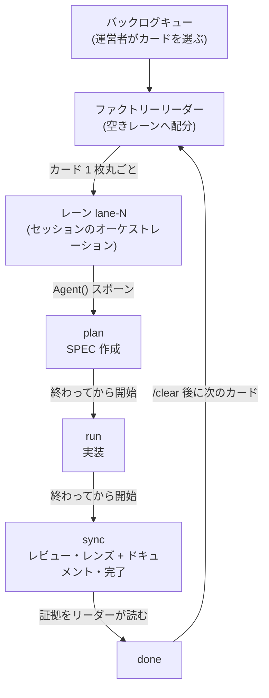



# ファクトリーモード (Factory Mode)


 <strong>属する価値</strong>: マルチセッションオーケストレーション · トークノミクス


ファクトリーモードは、カンバンモードの 2 つ目の形です。カンバンが「3 つのロールの同伴セッションが 1 枚のカードを列の間で運ぶ」ボードなら、ファクトリーは**番号付きレーン N つ**が複数のカードを同時に運ぶ組立ラインです。カードは列の間を移り歩きません — 空きレーン 1 つに**丸ごと**入り、そのレーンがセッションの中で `plan → run → sync` を順番に最後まで担います。

進入は専用トークン `-f` です。カンバンチェーンが `-k` を使うように、ファクトリーは `-f` を使います。キュー・証拠の読み取り・統合・廃棄の規則はカンバンと完全に同じです — 変わるのは、カードがボードを流れる形だけです。

## カンバンと分かれる点

| | カンバンモード (`-k`) | ファクトリーモード (`-f`) |
|---|---|---|
| セッション構成 | リーダー 1 + ロール同伴セッション 3 (`plan`·`run`·`sync`) | **ファクトリーリーダー** 1 + レーン `lane-1` … `lane-N` |
| カードの移動 | 列の間をセッションからセッションへ | 1 つのレーンへ丸ごと、レーンの中で段階を順番に |
| 段階の実行 | 各列の同伴セッションが担当 | レーンが各段階を `Agent()` 下位エージェントとしてスポーンして実行 |
| カードクラス | A/B/C がカードの**通る列**を定義 | A/B/C がカードの**飛ばす儀式**だけを名指す — どのカードもセッションを乗り換えない |
| `/clear` 境界 | 段階と段階の間 | カードとカードの間 |

カンバンではカードクラスが近道の形を定めていました — クラス A は `plan` 列を、クラス B も `plan` 列を飛ばしました。ファクトリーには列ごとに座るセッションがないため、この区別は消えます。クラスは今もカードが飛ばす儀式(クラス B は `plan` なしで進むので SPEC が存在せず、クラス A は即時クローズへ直行する)を名指しますが、どのセッションがカードを扱うかはもう変えません。すべてのレーンは、自分のカードに残っている段階が何であれ、それを直列に遂行します。

## 進入 — リーダーとレーンを開く

```bash
# リーダー — ファクトリーリーダーを開きます(レーン 1 つ、lane-1)
$ moai cc -f

# レーン — 各自自分のターミナルで、ロールトークンで次の空き番号に合流します
$ moai cc -f lane
$ moai cc -f lane
$ moai cc -f lane

# 番号を直接選んで、その番号のレーンとして合流することもできます
$ moai cc -f lane-3

# GLM バックエンドのレーンも同じ形式
$ moai glm -f lane
```

`-f` に値を付けなければ、ファクトリーリーダーが開きます。レーンとして合流するには `-f lane`(次の空き番号に自動合流)または `-f lane-<n>`(その番号ちょうど)を使います — レーンはカンバンの同伴セッションと同じく、**人がそれぞれのターミナルで直接**立ち上げます。セッションが別のセッションの代わりに立ち上げる経路はありません。

**番号が生存中のレーンと重なると。** `-f lane-<n>` で直接選んだ番号を生存中のセッションが握っていると、合流は拒否されます。`-f lane` で次の空き番号を自動取得する場合は拒否されず、握られていて飛ばした番号を知らせます — 例: `factory: lane-2 is held by a live session; launching as lane-3`。

**旧綴りはもう解析されません。** 旧綴りで合流しようとすると正規形を名指してエラーが出ます — `-f lane` で合流するか、`-f lane-<n>` で正確な番号を選んでください。リネーム前のバイナリが残した実行記録が生存している場合も、合流は拒否されてその事実が知らされます。

1 回の実行に付けられる進入トークンは 1 つです — `-k` と `-f` を一緒に使うとエラーになります。v1.2.0 の統一進入形式である `-k <N>`(リーダー)と `-k <N> --name lane-<i>`(レーン)は、そのまま有効です(N なしで `-k --name lane-<i>` だけを使うと既定 8 レーン)。カンバンリーダーのソケットが `/tmp/moai-socket-kanban/<run-id>` に開くように、ファクトリーリーダーのソケットは `/tmp/moai-socket-factory/<run-id>` に開き、ブートストラップ案内が実際のパスも一緒に知らせます。CG は廃止されました。`moai migrate cg` で移行先を確認してください。

## リーダーのルーティング — カードは空きレーンへ丸ごと

ファクトリーリーダーの仕事は、カンバンリーダーとは違います。カンバンリーダーが 1 枚のカードの段階の間を調整するのに対し、ファクトリーリーダーは**すでに選ばれたカードを空きレーンへ配分**します。ここで「空きレーン」とは、前のカードが `done` に届き、その証拠をリーダーが読み終えたことを指します — カードを持つレーンは呼ばれず、すべてのレーンが忙しければ、カードは配分されずキューで待ちます。

カードを選ぶ主体は、つねに運営者です(`moai todo next <n>`)。ファクトリーリーダーがキューを見渡してカードを並べることはありません。カンバンのフォアマンループ(単独の `/loop`)も例外ではなく、すでに `picked` と印の付いた次のカードを配車するだけで、自分で選ぶことはありません。配車ブロックの形式はカンバンと同じで、`cmd` フィールドがクラスの定める進入段階を指します — クラス C は `/moai plan`、クラス B は `/moai run`、クラス A は即時クローズです。レーンは残りの段階を、追加の配車なしに自ら進みます。

## レーンの中の 3 段階 — 直列ステージ

レーン 1 つがカード 1 枚をどう通過するかは、3 文にまとまります。**plan が終わってはじめて run が始まり、run が終わってはじめて sync が始まります** — レーンが同じカードの 2 つの段階を同時に回すことはありません。各段階の実行はレーンが `Agent()` 下位エージェントとしてスポーンし、レーン自身はオーケストレーションだけを行います。下位エージェントの出力はそのセッションのウィンドウにとどまり、レーンは彼らが残した証拠を読んで結果を組み立てます。


```mermaid
flowchart TD
    Queue["バックログキュー<br/>(運営者がカードを選ぶ)"] --> Lead["ファクトリーリーダー<br/>(空きレーンへ配分)"]
    Lead -->|"カード 1 枚丸ごと"| Lane["レーン lane-N<br/>(セッションのオーケストレーション)"]
    Lane -->|"Agent() スポーン"| Plan["plan<br/>SPEC 作成"]
    Plan -->|"終わってから開始"| Run["run<br/>実装"]
    Run -->|"終わってから開始"| Sync["sync<br/>レビュー・レンズ + ドキュメント・完了"]
    Sync -->|"証拠をリーダーが読む"| Done["done"]
    Done -->|"/clear 後に次のカード"| Lead
```

段階が進んでいる間も、ヒューマンゲートはそのまま発火します。実装着手承認のような人の承認地点は、レーンの中でも自動的に通されることはありません。

## 並列の上限と隔離

レーンはそれぞれ**最大 10 個のエージェントを同時に**実行できます — ランチャーがレーンセッションに `CLAUDE_CODE_MAX_CONCURRENT_SUBAGENTS` の上限を注入するため、レーン N つが同時にファンアウトを回しても、マシンの容量は運営者の自制ではなく構造的に分割されます。

並列には 2 つの軸があり、互いに混ぜません:

- **カードの間 (ファンアウト)** — カードごとにレーンを付けて、複数枚を同時に進められます。レーンはそれぞれ自分のカードディレクトリ(`.moai/specs/<SPEC-ID>/`)にだけ書くので、並行する書き込みは衝突しません。
- **カードの中 (ステージ)** — 1 枚のカードの段階は直列です。同じカードに書き込みエージェントを 2 つ並行に付けることはありません — 1 枚のカードに、同時に 1 つの書き手です。

書き込みを担う下位エージェントを並行にスポーンするときは、必ず worktree 隔離(`isolation: "worktree"`)を付けます — 各書き込みエージェントが自分の worktree 複製の中で作業するため、カードディレクトリの外でもファイル書き込みは衝突せず、レーンは証拠とマージで統合します。読み取り専用の調査・監査ファンアウトは隔離しません — worktree の設定コストが何も買わない場所です。

### 順次起動とモデルオーバーライドの禁止

レーンを立ち上げるとき、けっして全員を同時に活性化しないでください。まず最初のレーンを立ち上げ、実際に出力を出し始めた証拠(最初の作業の実行、または進行の痕跡)を確認してから残りのレーンを活性化します — 同時のリクエストはまだ書き込み中のキャッシュ項目を読めないため、同時起動はキャッシュ効率を壊します。同じ理由で、配分メッセージにモデルオーバーライドを載せて送らないでください — GLM のティアマッピングは `ANTHROPIC_DEFAULT_*_MODEL` のスロット環境変数を通って入るため、スポーンごとにオーバーライドを付けるとキャッシュが分断され、スロット→GLM のマッピングを迂回しかねません。

## レーン番号の所有 — factory.db

どの番号をどのレーンが握っているかは、`~/.moai/db/<project-key>/factory/factory.db` に記録されます。起点ディレクトリが一時ディレクトリであるプロジェクト（絶対 `MOAI_HOME` オーバーライドなし）は、このデータベースをプロジェクトローカルの `<base>/.moai/db/<project-key>/factory/factory.db` に置きます — バックログキューと同じ例外です。新しいレーンを立ち上げると、番号は**生存セッションが握っているものだけを飛ばして**次の空き番号に付きます — 死んだレーンの claim はその番号をもう塞がなくなり（残った claim もデータベースから払い落とされます）— 直接選んだ `-f lane-<n>` はその番号をすぐに再利用できますが、`-f lane` の自動割り当ては常に生存中の最高番号+1を取るだけで、途中の空き番号を埋めることはありません。従来の `.moai/state/factory/workers.json` は一度だけ取り込まれ、ロールバック用の証跡として残ります。レーン名は `-f lane-<n>` 形式がすでに名前を定めるため、`--name`/`-n` と一緒に使うとエラーになります。

## 変わらないもの

ファクトリーが変えるのは、カードの流れる形だけです。残りの規則は、カンバンと同じ文言のまま立ちます:

- **委任のチャネルはディスク上のキューです。** 配車はポインタであって複製ではなく、メッセージは催促であって委任そのものではありません。
- **完了は読んだ証拠だけで判定します。** レーンが返事をしたかどうかではなく、進行記録を読んだかどうかでカードを進めます。最終の PASS/FAIL 判定はつねにリーダーのものです — 仕事を作ったレーンが自分の出力を審査する形は許されません。
- **`/clear` 境界はカードの間です。** 段階間の引き継ぎが消えることがこのモードの要点ですが、カード間の引き継ぎは消えません — カードが `done` に届いたら、次のカードを受ける前にそのレーンを `/clear` します。
- **カードの worktree は、リモートのマージが終わるまで廃棄しません。** ブランチがまだマージされていなければ、worktree がその仕事の唯一の複製です。

## 関連ドキュメント

- [カンバンモード](/ja/advanced/kanban-mode) — 3 つのロールがカードを列の間で運ぶ最初の形。カードクラスと、ボード・キューの共通規則
- [`/moai todo`](/ja/utility-commands/moai-todo) — カードをボードに入れるバックログキュー。カードを選ぶ主体は運営者
- [manager-lead リーダーコーディネーター](/ja/advanced/manager-lead) — カンバン・ファクトリーのリーダーセッションがディスパッチを担う調整エージェント
- [`/moai loop`](/ja/utility-commands/moai-loop) — bare `/loop` で駆動する無人フォアマン。ファクトリーリーダーと同じ「選ばず、運ぶだけ」の境界
- [カンバンボード用語](/ja/core-concepts/kanban-board-terms) — カード・列・レーン・リーダーの定義と例を備えた正式な用語集
