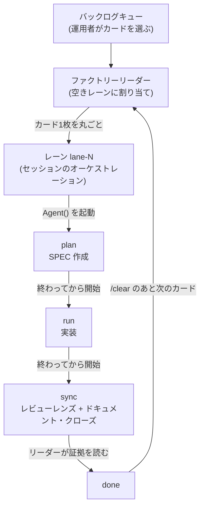



# ファクトリーモード (Factory Mode)


 <strong>属する価値</strong>: マルチセッションオーケストレーション · トークノミクス


ファクトリーモードは、**リーダー**セッション1つと、番号付きの**レーン**セッション複数で、カードを何枚も同時に運ぶ組み立てラインです。カードは列を渡り歩きません。空いているレーンに**丸ごと**入り、そのレーンが自分のセッションの中で `plan → run → sync` を順番に最後まで受け持ちます。

進入トークンは2つだけで、どちらも引数を取りません。`-f` がリーダーを開き、`-l` がレーンとして合流します。これらのトークンはセッションを開始または合流させるだけで、パイプラインを動かしたり、ゴールを設定したり、SPEC を選んだりはしません。

## 進入の形

| やりたいこと | コマンド | 役割 |
|--------------|----------|------|
| ファクトリーリーダーを開く | `moai cc -f` · `moai glm -f` (長い形 `--factory`) | リーダー |
| 稼働中のファクトリーにレーンとして合流する | `moai cc -l` · `moai glm -l` · `moai codex -l` (長い形 `--lane`) | レーン |

- `-l` は稼働中のファクトリーに合流し、**次のレーン番号を自動で**受け取ります。番号は運用者が選ぶものではなく、生きているレーンの最大番号の次が割り当てられます。稼働中のファクトリーがなければ、合流は拒否されます。
- `moai codex` にリーダーの進入はありません。レーンとしてだけ合流でき、リーダーは `moai cc -f` か `moai glm -f` で開きます。
- 1回の起動に付けられる進入トークンは1つだけです。`-f` と `-l` を同時に付けるとエラーになります。

```bash
# リーダー: ファクトリーリーダーを開きます
$ moai cc -f

# レーン: それぞれ自分のターミナルで。次の番号 (lane-1, lane-2, ...) で合流します
$ moai cc -l
$ moai cc -l
$ moai glm -l      # GLM バックエンドのレーンも同じ形です
$ moai codex -l    # Codex のレーン
```

レーンは**人が別々のターミナルで直接**起動します。セッションが別のセッションを代わりに起動する経路はありません。

### 拒否される形

値が付いた進入は、1行のエラーで拒否されます。エラー文には正しい形が示されます。

| 拒否される形 | 理由 |
|--------------|------|
| `moai cc -f <値>` (SPEC ID、数字、レーンのラベル) | `-f` は引数を取りません。リーダーは `-f` だけで開き、レーンは `-l` で合流します |
| `moai cc -l <値>` (`lane-2` のような名前) | レーンは自分で名前を決めません。番号は自動で割り当てられます |
| `moai codex` の `-f` | Codex にリーダーの進入はありません (`moai cc -f` か `moai glm -f` を使います) |
| `-f` と `-l` を同時に指定 | 進入トークンは1つしか許されません |
| 廃止された `-k` 進入 | かつてのマルチセッションボードのモードは削除されました。エラー文が `-f` と `-l` を案内します |
| `moai cg`、`moai gpt` | `moai cg` は廃止済みで、移行案内を出して終了します (`moai migrate cg` でプレビュー)。`moai gpt` は存在せず、GPT モデルは `moai codex` で動かします |

## 実行が複数生きているとき

レーンの合流は、まず実行記録を読みます。`-l` と一緒に使えるセレクターは2つあります。

| セレクター | 役割 |
|------------|------|
| `--leader <名前>` | 合流先のリーダーセッションを指定します (既定値 `leader`)。`-l` または `--lane` とだけ組み合わせられ、進入トークンの短縮形ではありません |
| `--factory-run <run-id>` | 合流する実行を id で指定します |

`--leader` と `--factory-run` は別々のセレクターなので、一緒には使えません。生きている実行が複数あって合流先を決められないときは合流が拒否され、エラーが `-l` と一緒に `--factory-run <run-id>` か `--leader <リーダー名>` のどちらかを選ぶよう案内します。持ち主が死んでいる実行は `moai factory runs --retire <run-id>` で退役させられます。

**実行記録がなくても、リーダーが生きていれば合流できます。** 有効な記録がひとつもないとき (記録が自動で退役した、リーダーが記録しなかった、など) でも、合流はすぐには拒否されません。このプロジェクトで生きているリーダーセッションを pid とプロセス開始の指紋で検証し、そのリーダーの身元で実行記録を復元してから、通常のゲートで合流します。検証できたリーダーが複数いれば、候補をすべて挙げて失敗として閉じ、ひとつもなければ拒否がそのまま残ります。

## レーンのオプション

次のオプションは `moai cc -l` と `moai glm -l` で、レーンにだけ付きます。Codex のレーンはポリシーを受け取りません。

| オプション | 効果 |
|------------|------|
| `--clear-policy <値>` | カードを終えたあと、レーンがコンテキストをどう空けるかを決めます。`clear-each` (既定値。カードごとに `/clear` を求める)、`clear-when-full` (コンテキスト使用量がモデルごとの引き継ぎ閾値に届いたときだけ求める)、`relaunch` (セッションの終了を求め、監督ランチャーが次のカード用に新しいセッションを起動する) |
| `--no-auto-dispatch` | レーンを手動モードで起動します。既定は**自己配車**レーンで、リーダーの割り当てを待たず、`moai factory next` でキューの次のカードを自分で借り受けます。このオプションを付けると、リーダーが送ったカードだけを受け取ります |

## カードが流れる形

リーダーの仕事は、**すでに選ばれたカードを空いているレーンに割り当てる**ことです。空いているレーンとは、前のカードが `done` に届き、その証拠をリーダーが読み終えたレーンを指します。全レーンがふさがっていれば、カードは割り当てられずキューで待ちます。

カードを選ぶのは常に運用者です。リーダーがキューを眺めて勝手にカードを並べ替えることはありません。自己配車レーンもこの決まりを変えません。レーンがキューに対してすることは、すでに載っている次のカードを `moai factory next` で借り受けることだけで、カードの作成、削除、編集といったキューの変更はレーンには許されていません。

配車ブロックは `card`、`cmd`、`wt`、`evidence` の固定フィールドでできていて、10行を超えません。`cmd` はカードのクラスが定める入口の段階を指します。設計変更 (クラス C) は `/moai plan`、原因不明の不具合 (クラス B) は `/moai run`、1行で済む雑務 (クラス A) は直接クローズです。残りの段階は、レーンが追加の配車なしで自分で進めます。

## レーンの中で3段階が回る仕組み

1つのレーンが1枚のカードを運ぶ流れは、3つの文に収まります。**plan が終わってから run が始まり、run が終わってから sync が始まります。** レーンが同じカードの2つの段階を同時に動かすことはありません。各段階の実行はレーンが `Agent()` サブエージェントとして起動し、レーン自身はオーケストレーションだけを行います。サブエージェントの出力はそのエージェントのウィンドウに留まり、レーンは彼らが残した証拠を読んで結果をまとめます。


```mermaid
flowchart TD
    Queue["バックログキュー<br/>(運用者がカードを選ぶ)"] --> Lead["ファクトリーリーダー<br/>(空きレーンに割り当て)"]
    Lead -->|"カード1枚を丸ごと"| Lane["レーン lane-N<br/>(セッションのオーケストレーション)"]
    Lane -->|"Agent() を起動"| Plan["plan<br/>SPEC 作成"]
    Plan -->|"終わってから開始"| Run["run<br/>実装"]
    Run -->|"終わってから開始"| Sync["sync<br/>レビューレンズ + ドキュメント・クローズ"]
    Sync -->|"リーダーが証拠を読む"| Done["done"]
    Done -->|"/clear のあと次のカード"| Lead
```

カードのクラスが示すのは、レーンが省く手続きだけです。クラス B は `plan` なしで進むので SPEC がなく、クラス A は直接クローズへ向かいます。どのカードもセッションを乗り換えることはなく、すべてのレーンが、自分のカードに残った段階を直列でこなします。段階が進んでいる間も、実装着手の承認のようなヒューマンゲートはそのまま働きます。

レーンは `run` を終えて統合する前に、`card-review` という段階をもうひとつ通ります。カード範囲のセルフレビューで、結果は `.moai/reports/<card-id>/card-review.md` に残ります。参考用のシグナルにすぎず、リーダーの証拠の読み取りや独立監査の代わりにはなりません。

## 並列の上限と分離

レーンはそれぞれ**最大10個のエージェントを同時に**動かせます。ランチャーがレーンのセッションに `CLAUDE_CODE_MAX_CONCURRENT_SUBAGENTS=10` を設定するので (すでに値があればそのままです)、N 個のレーンが同時にファンアウトしても、マシンの容量は運用者の自制ではなく設定によって分けられます。

並列には2つの軸があり、混ぜません。

- **カードの間 (ファンアウト)**: カードごとにレーンを付ければ、何枚も同時に進められます。レーンはそれぞれ自分のカードディレクトリ (`.moai/specs/<SPEC-ID>/`) にだけ書くので、並列の書き込みがぶつかりません。
- **カードの中 (ステージ)**: 1枚のカードの段階は直列です。同じカードに書き込み担当のエージェントを2つ並列で付けることはしません。1枚のカードにつき、同時に書くのは1人です。

書き込みを担当するサブエージェントを並列に起動するときは、必ずワークツリー分離 (`isolation: "worktree"`) を付けます。各書き込みエージェントが自分のワークツリーのコピーで作業するため、カードディレクトリの外でもファイルの書き込みが衝突せず、レーンは証拠とマージで統合します。読み取り専用の調査・監査のファンアウトは分離しません。ワークツリーを作るコストに見合う利点がないからです。

レーンは一斉に立ち上げないでください。最初のレーンを先に起動し、実際に出力が出始めたのを確かめてから残りを立ち上げます。同時リクエストは、まだ書き込み中のキャッシュエントリを読めないため、同時起動はキャッシュ効率を損ないます。

## レーン番号と実行記録

どの番号をどのレーンが握っているかは、`~/.moai/db/<project-key>/factory/factory.db` に記録されます。新しいレーンは、生きているレーンのうち**最大の番号の次**を受け取り、途中の空き番号は埋めません。生きているレーンが lane-1 と lane-3 なら、新しいレーンは lane-4 です。死んだレーンの claim は、もう番号をふさぎません。実行がレーン数を固定して記録している場合は、`moai codex -l` はその範囲内で最も小さい空き番号を受け取ります。レーン番号は自動で割り当てられるため、`--name`/`-n` を併用するとエラーになります。

リーダーのソケットは `/tmp/moai-socket-factory/<run-id>` に開き、ブートストラップの案内が実際のパスを知らせます。リーダーとレーンのセッションは、開始時に役割・バックエンド・進入時刻を記した1件のセッションレコードを `.moai/state/todo/<session-id>.json` に書きます。

ファクトリーのセッションは、起動時に連続 Stop フックのブロック上限を `CLAUDE_CODE_STOP_HOOK_BLOCK_CAP=200` に引き上げます。これは無人実行をより長く許す設定であり、ゲートを飛ばす仕組みではありません。人の承認ゲートは Stop フックのブロックではなく、オーケストレーターが投げる質問だからです。

## 変わらないこと

- **委任のチャネルはディスク上のキューです。** 配車はポインターであってコピーではなく、メッセージは催促にすぎず、委任そのものではありません。
- **完了は、読んだ証拠だけで判定します。** レーンが返信したかではなく、進捗記録を読んだかどうかでカードを進めます。最終的な PASS/FAIL の判定は常にリーダーのもので、作業を作ったレーンが自分の出力を審査することは認められません。
- **`/clear` の境目はカードとカードの間です。** カードが `done` に届いたら、次のカードを受ける前にそのレーンを `/clear` します (`--clear-policy` で変えられます)。
- **カードのワークツリーは、リモートへのマージが終わるまで破棄しません。** ブランチがまだマージされていなければ、そのワークツリーが作業の唯一の写しです。
- **カード1枚につきワークツリー1つ。** 新しいカードは新しいワークツリーで始まり、レーンのセッションは自分のカードのワークツリーの中で起動して、そこに留まります。

## 関連ドキュメント

- [セッション系譜チェーン](/ja/advanced/origin-trail-chain)(worktree セッションの系譜の記録と、`moai chain` での照会)
- [`/moai todo`](/ja/utility-commands/moai-todo)(カードを入れるバックログキュー。カードを選ぶのは運用者)
- [manager-lead リーダーコーディネーター](/ja/advanced/manager-lead)(ファクトリーリーダーセッションの配車を担う調整エージェント)
- [`/moai loop`](/ja/utility-commands/moai-loop)(bare `/loop` で動く無人フォアマン。ファクトリーリーダーと同じ「選ばず運ぶだけ」の境界)
- [moai cc / glm ランチャー](/ja/cli-reference/launchers)(`-f` と `-l` を含むランチャーフラグの全体)
