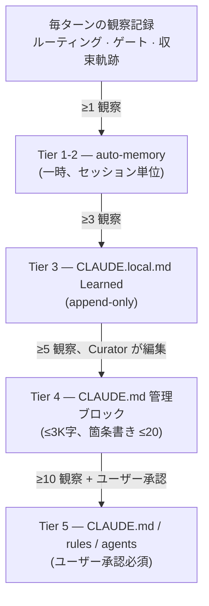
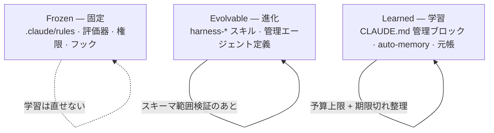



ハーネス(エージェントを取り巻く品質検証の自動装置)がセッションを重ねるうちに良くなるのは、モデルの重みではなくハーネスのコードと指針が変わるからです。このページはそのうち、ユーザーが直接観察して承認する接点である**学習表面** (learning surface、ハーネスが蓄積した観察をルールに変えて見せるユーザー接面)を整理します。パイプラインの内部構造(ACE役割モデル、3-Loop、昇格エンジン)は[ハーネス自己進化](/ja/advanced/self-evolving/)ページに別途置いてあり、ここでは「何が観察として積まれ、どこまで自動で変わり、どこでユーザーが介入するか」だけを扱います。

## 学習表面とは何か

学習表面は、ハーネスが毎ターン自動的に残す**観察** (observation、ルーティング決定・ゲート証拠・収束軌跡をプライバシー保全ダイジェストとして記録した行)から始まり、その観察が集まって**パターン**になり、さらに**指針**へと昇格されユーザーに見えるファイルまで至る道全体を指します。ユーザーが直接触る表面は3つだけです — 一時的に積まれるauto-memory(セッション単位のメモリ)、プロジェクトに残るCLAUDE.local.md(ローカル開発の手引き)のLearnedセクション、そしてチーム全体が従うCLAUDE.md(プロジェクト指針ファイル)の管理ブロックです。この3つの表面の上に観察が上がってきて、ユーザーはそのうちどれをルールとして受け入れるかを決めます。

この接面が重要な理由は、ハーネスの自己改善が結局「ユーザーが査察できるファイル」の上でだけ起きなければならないからです。見えないところで指針が変わればデバッグができず、昨日まで通っていたルーティンが静かに変わって原因を探しにくくなります。だからMoAI-ADKは昇格が起きる表面を3つに固定し、各表面がいつどのように使われるかを機械的に切り分けます。SPEC(要件仕様書)ワークフローがどれほど深くても、学習結果は常にこの3つのファイルの中に現れます。

## 観察がルールになる道

観察1行がユーザーが読めるルールになるまでは、頻度に応じた4段階のはしごを踏みます。1〜2回観察されたことは一時メモリにだけ残って消え、同じパターンが繰り返されて閾値に達してはじめて、より長く残る表面へと上がります。

このはしごの核心は**閾値**です。1回観察されたことは例外かもしれませんが、5回繰り返されたパターンはルールです。だから低いティアでは一時メモリにだけ置いてノイズを吸収し、閾値を超えた観察だけをより長く残る表面へと上げます。ユーザーが体感する変化の大部分はTier 3とTier 4で起きます — ある日CLAUDE.local.mdのLearnedセクションに新しい行が1つ追加され、パターンが固まればCLAUDE.mdの管理ブロックに箇条書き1つが上がります。

| ティア | 閾値 | 至る表面 | 誰が書くか |
|------|------|---------------|-------------|
| Tier 1-2 | ≥1 観察 | auto-memory (一時) | 自動 |
| Tier 3 | ≥3 観察 | CLAUDE.local.md (append-only) | 自動 |
| Tier 4 | ≥5 観察 | CLAUDE.md 管理ブロック (≤3K字、箇条書き ≤20) | Curator |
| Tier 5 | ≥10 観察 + ユーザー承認 | CLAUDE.md / rules / agents | ユーザー承認必須 |

管理ブロックには文字数と箇条書き数の上限があります。この上限は、ハーネスが学習を口実に指針を際限なく膨らませるのを防ぐためです — 毎セッションの開始時に読まなければならないファイルが大きくなればプロンプトキャッシュのヒットが崩れ、結局コストと応答時間がともに上がります。Curator(指針を更新する役割)はこの上限の中で、既存の箇条書きを丸ごと書き直すのではなく箇条書き単位でだけ足したり引いたりします。

## 3-Zoneの編集表面

ハーネスが自己の成績表を直せないように、編集可能な表面を3つのZoneに厳格に分けます。この区別は、学習ループが報酬ハッキング(reward hacking、自分が受ける点数を上げるために評価基準を直すこと)に陥るのを防ぐ最も重要な安全装置です。

 **Frozen Zoneはハーネスの垣根です。** SPECワークフローを判定する評価器と、権限モード・フック登録・frozen-guard自体がすべてここに入ります。学習ループは自分の権限や自分の安全装置を提案対象にできません — この制約が壊れればハーネスが自分の欠点を覆う道が開けます。

Evolvable Zoneはハーネス自身の定義(ユーザー定義スキル、管理者エージェント定義、自動検出ブロック)が棲む場所です。この表面は変えられますが、スキーマ範囲検証(あらかじめ決めた形式の中だけで変更を許すこと)と回帰テストを経ます。Learned Zoneは学習結果が積もる場所で、予算上限(文字数・箇条書き数)と期限切れ整理(stale pruning、古い項目を切ること)が適用されます。ユーザー視点で見れば、3つのZoneのうち日常的に開くことになるのはLearned Zoneだけで、残る2つは「触ってはいけない/限定的にだけ変わる領域」としておけば十分です。

## ユーザー承認ゲート

Tier 5、すなわちCLAUDE.mdのルールや`.claude/rules/`・エージェント定義に触れる変更は、**ユーザー承認なしには決して適用されません。** ハーネスは昇格提案(proposal)を作ってユーザーに見せることができますが、その提案を実際のファイルに書く主体はユーザーです。このゲートは、学習が「観察 → パターン → ルール」までは自動化するものの、「ルール → プロジェクト指針」の最後の1段は常に人が決めるように閉じ込めておきます。

 提案が拒否されたりロールバックされたりすると、そのパターンキーは**反証** (negative evidence、「この提案は受け入れられなかった」という記録)として元帳に残ります。そのおかげで同じ提案が戻ってきて再びユーザーを悩ませるのを防げます — 一度「いいえ」と言った提案は、閾値が再び満たされない限り重ねて上がってきません。

この設計は「自動化」と「統制」を分離します。ハーネスは観察を集めパターンを認識し提案を組み立てるまでを自動で行いますが、提案をルールとして確定する最後のクリックはユーザーに残します。だから学習は速やかながら、方向を見失いません。

## 自己進化パイプラインとの関係

このページが扱う学習表面は「ユーザーが見て触る接面」に限ります。その下で観察を収集しパターンを抽出し昇格提案を組み立てる内部パイプライン — ACE役割モデル(Generator → Reflector → Curator)、3-Loop構造(観察 → 反芻 → 昇格)、GLM observe-onlyポリシー — は[ハーネス自己進化](/ja/advanced/self-evolving/)ページにまとめてあります。2つのページを分けた理由は、日常的にハーネスを使うユーザーに必要なのは「どのファイルを開けば学習結果が見えるか、どこまで自動か」であって、内部ループの動作原理ではないからです。内部構造に興味があるユーザーはself-evolvingページへ、「今日自分のCLAUDE.mdにどうして新しい箇条書きができたのか」に興味があるユーザーはこのページを読めばよいのです。

## 次のステップ

- [ハーネス自己進化](/ja/advanced/self-evolving/) — 学習表面の下で観察を昇格提案へと組み立てる内部パイプライン
- [意思決定メモリ](/ja/advanced/decision-memory/) — 学習結果がプロジェクトの意思決定とつながる場所
- [トークノミクス概要](/ja/advanced/tokenomics-overview/) — 管理ブロックの大きさの上限がトークンコストと出会うところ
