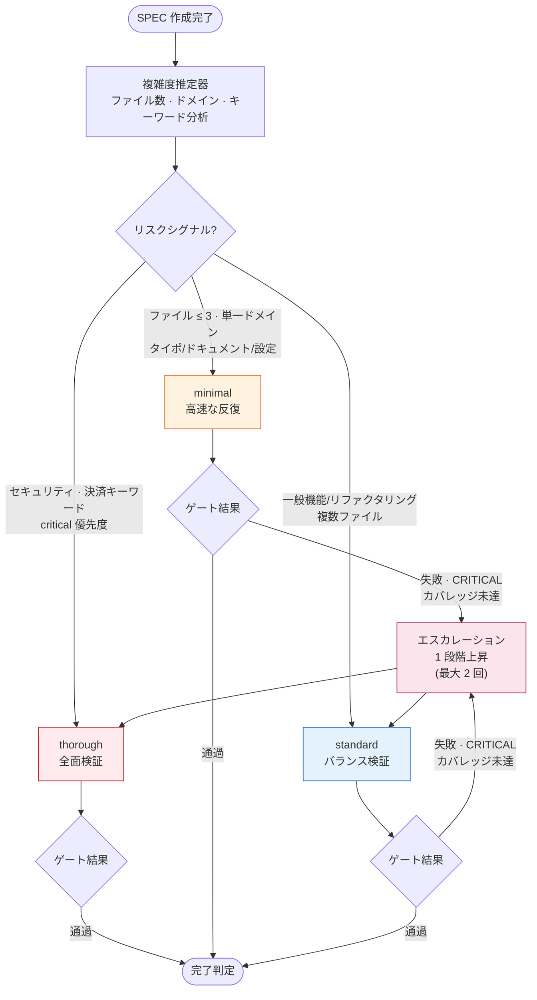
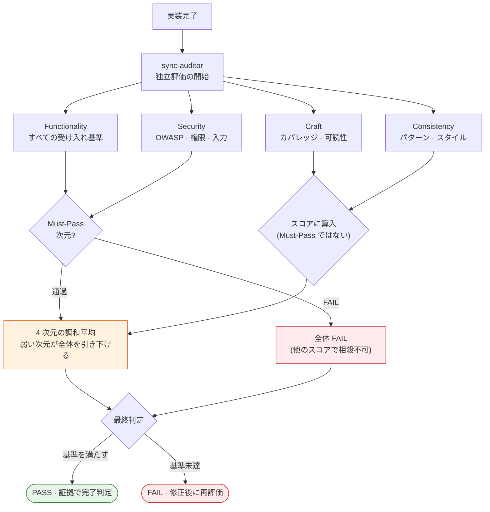

タイポ 1 行を直すのに全面セキュリティ監査を回せばトークンが漏れ、逆に決済システムに手を入れるのに軽い確認しか通さなければ事故が起きます。すべての変更に同じ深さの検証を注ぎ込むと、この 2 つの失敗のどちらかは避けられません。MoAI-ADK が解く問題はまさにここにあります — 変更の重さに合わせて検証の深さを自ら調整し、評価はコードを書いた側ではなく独立した評価エージェントに任せることです。


**ひとことで:** 検証の深さは SPEC (要件仕様書) の複雑度に合わせて自動で決まり、完了の判定は「できた気がする」ではなく独立評価者のスコアと根拠で下されます。


## 2 つの考えがひとつに噛み合う

ハーネス (harness、品質検証を自動的に実行する仕掛け) システムは、性質の異なる 2 つの考えが噛み合って回ります。ひとつは**深さの適応**、もうひとつは**評価の独立**です。

**深さの適応** — SPEC の規模とリスクを見て、検証段階の深さを 3 段階のうちの 1 つに選びます。タイポ修正に全面監査を回さず、決済ドメインに手を入れるときに軽い確認で通しません。作業にぴったりの検証強度をシステムが握ってくれるおかげで、人が毎回レベルを選ぶ手間が消え、検証コストが成果のリスクに比例します。

**評価の独立** — コードを作ったエージェント (自ら判断して働く AI の助手) が自分の成果物に点数を付けると、点数は必ず甘くなります。そこで評価は別個のエージェントである sync-auditor が担い、作る側と評価する側を構造的に分離します。計画を立てたエージェントも、実装したエージェントも、評価に手を出せません。

## 3 階層ハーネスレベル

検証の深さは 3 段階に分かれます。各レベルは、スキップする段階、評価者の参加、ゲートの厳格さが異なります。

| レベル | いつ使われるか | 評価者 | 特徴 |
|------|--------------|--------|------|
| **minimal** | 単純な変更 — タイポ、ドキュメント、設定の修正、ファイル 3 個以下の単一ドメイン | 省略 | 高速な反復。検証段階の大半をスキップする |
| **standard** | 一般的な開発 — 新機能、リファクタリング、複数ファイル | 最終パス 1 回 | バランスの取れた品質確認。大半の作業はここに該当 |
| **thorough** | リスクの高い変更 — セキュリティ · 決済キーワード、認証 · 移行 · 公開 API、critical 優先度 | スプリントごとの反復評価 | 全体検証 + TRUST 5 ゲート + 交差検証 |

レベルは、SPEC の範囲を読んで**複雑度推定器** (Complexity Estimator) が自動で決めます。ファイル数、ドメイン数、SPEC タイプ、そしてセキュリティ · 決済キーワードと critical 優先度を条件に、minimal · standard · thorough のどれかを選びます。タイポ修正に thorough 検証を回さないこと、それ自体がコストを成果のリスクに比例させる設計です。

レベルは一度決まったら最後まで固定されるわけではありません。検証の途中で品質ゲートが失敗したり、レビューで CRITICAL 段階が出たり、カバレッジが 70% を下回ったりすると、1 段階上がります。この**エスカレーション**は最大 2 回まで起こり、決められた深さで始めても途中でリスクが明らかになればより深い検証へ移るため、「簡単な変更」に分類された作業が抜け穴を残しません。

1 つだけ注意点があります。minimal レベルは検証段階の大半をスキップしますが、**計画監査 (plan-auditor) ゲートだけは例外なく有効**です。かつて minimal レベルで計画監査が無効だったため、30 個の SPEC が監査を通らないまま作られ、386 件の交差欠陥が一気に噴き出したことがあります。この事件以降、計画監査ゲートはレベルにかかわらず常に動くよう大域的に固定されました — 検証の深さは節約しても、計画そのものが検査されない事態は二度と起こしません。

CG モード (Claude リーダー + GLM ワーカーのハイブリッド実行) では、レベルの自動検出にかかわらず常に thorough に置きます。実装を GLM ワーカーに、評価を Claude リーダーに任せる構造が、自然に生成者-評価者 (Generator-Evaluator) 分離になるためです。

## 4 次元スコアリング

独立評価者である sync-auditor は、成果物を 4 つの次元で点検します。各次元は、それぞれ問う質問が異なります。

| 次元 | 問う質問 | デフォルト重み | Must-Pass |
|------|----------|------------|-----------|
| **Functionality** (機能) | 意図した目的を達成したか — すべての受け入れ基準を通過したか | 40% |  はい |
| **Security** (セキュリティ) | 安全か — OWASP、認証、権限、入力検証に穴はないか | 25% |  はい |
| **Craft** (職人芸) | よく作られているか — 可読性、構造、テストカバレッジ | 20% |  いいえ |
| **Consistency** (一貫性) | プロジェクトのルールに従ったか — コードスタイル、パターンの遵守 | 15% |  いいえ |

### 調和平均 — 弱い次元が全体を引き下げる

4 次元のスコアを合成するとき、MoAI-ADK は単純平均ではなく**調和平均** (harmonic mean) を使います。両者の差は、結果のひとつでも底に沈んでいるときに劇的に開きます。

セキュリティで 0.25 点を受けた成果物が、機能で満点の 1.00 点を受けたとしましょう。単純平均なら (1.00 + 0.25) / 2 = 0.625 で「まあまあ」と通せてしまいます。しかし調和平均は弱い側に鋭く反応します — ひとつの次元が底なら、他の次元がどれほど高くても全体を引き上げられません。ここでの意図は明確です。セキュリティの穴を卓越した機能性で「相殺」できないということです。強い次元と弱い次元を足し合わせて埋め合わせする道を、構造的に塞ぐのです。

### Must-Pass ファイアウォール

調和平均よりさらに強い仕掛けが **Must-Pass ファイアウォール**です。Functionality と Security は Must-Pass 次元です — この 2 つは他の次元のスコアで埋めることができません。Security で Critical または High 段階の脆弱性が 1 つでも見つかれば、Functionality と Craft で満点でも、全体の判定はただちに FAIL になります。「セキュリティに穴があるが機能は優れているので通過」という妥協が構造的に不可能です。

Craft と Consistency は Must-Pass ではありません。この 2 つは全体スコアに貢献し品質シグナルを残しますが、単独では合格を遮りません — コード品質と一貫性も重要だが、機能とセキュリティほど即時の遮断理由ではないという判断です。

## スコアの足場となるルーブリックアンカー

LLM 評価者を放置すると、スコアは評価者の「気分」に揺れます。今日は寛容で明日は厳しい判定が出る事態を防ぐため、すべてのスコアには 4 段階の**ルーブリックアンカー**が付きます。評価者は 0.25 / 0.50 / 0.75 / 1.00 のうちの 1 つを選びながら、なぜそのアンカーに該当するのかの根拠を必ず添えなければなりません。

| スコア | 水準 | 意味 |
|------|------|------|
| 0.25 | 未達 | 基本要件を満たしていない |
| 0.50 | 一部 | 一部を満たすが改善が必要 |
| 0.75 | 達成 | 大部分を満たし、小規模な改善のみが残る |
| 1.00 | 優秀 | すべての基準を完全に満たす |

スコアは連続的な数値ではなく、4 つの固定された足場です。評価者が「0.6 くらい」という曖昧な値を出せないようにすることで、判定が評価者の状態ではなく根拠に寄りかかるようにします。

## 評価者のバイアスを抑える 5 つの仕掛け

スコアが惰性に乗らないよう、5 つの仕掛けが同時に働きます。どれか 1 つでは足りず、重ねて初めて評価が一貫します。

| # | 仕掛け | 何をするか |
|---|------|--------|
| 1 | **ルーブリックアンカリング** | すべてのスコアにルーブリックの根拠を必須にする |
| 2 | **回帰ベースライン監視** | 前のプロジェクトよりスコアが異常に跳ねればバイアスと疑う |
| 3 | **Must-Pass ファイアウォール** | Functionality · Security の失敗を他の次元のスコアで覆えなくする |
| 4 | **独立再評価** | 反復評価の間の偏差が閾値を超えればスコアを再調整する |
| 5 | **アンチパターン交差検査** | 既知のアンチパターンが見つかれば該当次元のスコア上限を下げる |

5 つの仕掛けに共通する方向は 1 つです — 評価者が「なんとなく良さそう」と PASS を下す道を何重にも狭めることです。

## 評価プロファイル — 作業の性格に合わせて基準を変える

`.moai/config/evaluator-profiles/`に 4 つのプロファイルが入っています。同じ 4 次元でも、作業の性格によってどこに重みを置くか、通過の敷居をどの値にするかが変わります。

| プロファイル | 性格 | Must-Pass の敷居 | 向いている作業 |
|--------|------|---------------|--------------|
| `default` | バランスの取れた基本 | Functionality 全体 PASS · Security に Critical/High なし | 大半の通常作業 |
| `strict` | 最も厳格 | 4 次元すべて個別 0.80 以上 · Security の脆弱性ゼロ | セキュリティ · 決済 · 移行 · 公開 API |
| `lenient` | 寛容 | Security に Critical がなければよい · 未検証を許容 | プロトタイプ · 実験 · 非運用コード |
| `frontend` | UI/UX 特化 | フロントエンドの品質基準に合わせる | 画面 · インタラクション作業 |

`strict` は thorough レベルと対になります — 認証や決済のようなリスクドメインでは、検証の深さを上げると同時に評価基準まで引き上げ、両側から抜け穴を捉えます。逆に `lenient` はプロトタイプ段階での「動けばよい」という判断を許し、速い実験が過剰な検証コストに潰されないようにします。

## 反復ごとに新しく始める評価者

GAN Loop (生成者-評価者の敵対ループ、品質改善のための反復検証パターン) が 1 周するたびに、sync-auditor は**新しいコンテキスト**でやり直します。直前の反復の判断根拠は新しいプロンプトには載らず、反復の間を受け渡すのは Sprint Contract (スプリント契約、各反復の目標と状態を記した合意書) の状態だけです。

この設計は意図的です。評価者が自分の以前の判断に囚われて、スコアを惰性で付けることを防ぐためです。一度「まあ大丈夫」と判定した成果物を次の反復でもその惰性で通すのではなく、毎回新しい目で見直させるのです。このメモリ範囲は設定で変えられないよう **FROZEN** (凍結、システムが強制する変更不能の規則) 処理されています。

## 設定

すべての値は `.moai/config/sections/harness.yaml` に集まっています。主要な項目は次のとおりです。

- **デフォルト評価プロファイル** — SPEC がプロファイルを個別に指定しなければ `default` を使います。
- **メモリ範囲** — `per_iteration` に固定されており、変更できません。
- **自動検出ルール** — minimal · standard · thorough それぞれの参入条件 (ファイル数、ドメイン、キーワード、優先度) が記載されています。
- **エスカレーション** — 品質ゲート失敗 · CRITICAL レビュー · カバレッジ未達が 1 段階上げるトリガーで、最大 2 回までです。
- **effort マッピング** — 各レベルがモデルの推論の深さ (minimal→low、standard→medium、thorough→high) にどうつながるかを定義します。
- **計画監査の大域固定** — レベルにかかわらず計画監査ゲートが常に有効になるよう強制します。

このファイルを直接編集すれば、自動検出の感度、エスカレーション回数、レベル別のスキップ段階をプロジェクトに合わせて調整できます。ただし、メモリ範囲と計画監査の大域固定は設計上変更できません。

## なぜここまでやるのか

検証の深さを作業に合わせ、評価を作った側から切り離し、スコアに足場を与え、評価者の記憶を毎回消すこと — これらすべての仕掛けは、1 つの結論を守るためです。「コードが完成した」という判定が、誰かの勘や惰性ではなく、証拠と独立した判断の上に立つようにすることです。検証は成果のリスクに比例すべきで、完了判定は疑いから出発すべきです。この 2 つの原則をシステムが外から強制するからこそ、セッションが変わっても作業が変わっても、同じ物差しがコードに当てられるのです。

## 関連ドキュメント

- [ハーネスエンジニアリング](/ja/core-concepts/harness-engineering) — ハーネス概念の全体像
- [TRUST 5 品質](/ja/core-concepts/trust-5) — Tested · Readable · Unified · Secured · Trackable の 5 つの品質基準
- [Constitution システム](/ja/core-concepts/constitution) — FROZEN (凍結) ルールと Evolvable (進化) ルールの区別
- [ハーネス学習](/ja/advanced/harness-learning) — 観察がルールとして積み上がる学習の表面
