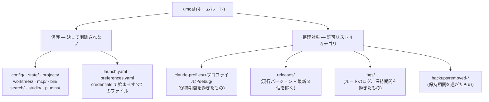
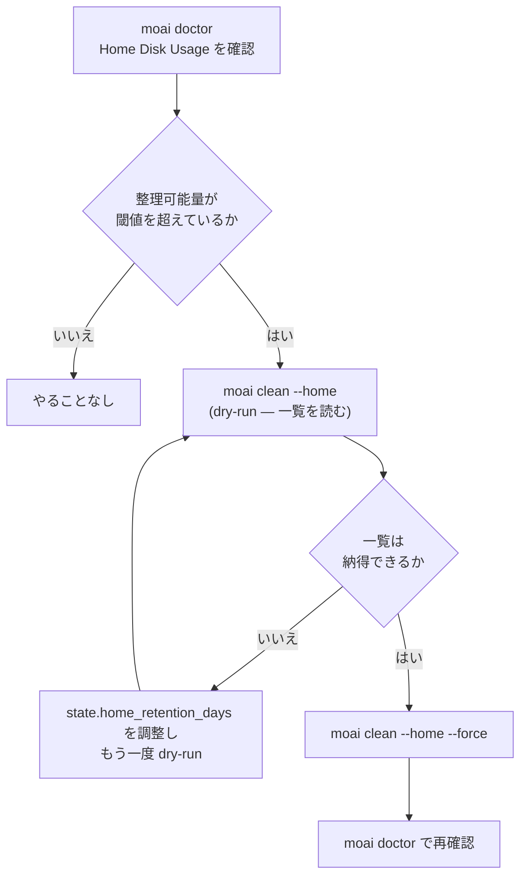



# ホームディレクトリ衛生 (~/.moai)

MoAI がプロジェクトの外に置く状態は、すべて `~/.moai` の一箇所に集まります。プロファイルごとのデバッグログ、ダウンロードしたリリースバイナリ、セッションレジストリ、ワークツリー台帳、バックアップがここに溜まっていきます。長く使ったマシンでは、このディレクトリは静かに数ギガバイトまで育ちます — 誰も見ない場所なので、ディスクが埋まるまで気づかれません。


**一行でいうと**: `MOAI_HOME` がホームルートの場所を決め、`moai doctor` がどれだけ埋まっているかを教え、`moai clean --home` が許可リストの内側だけを整理します。三つの表面でひとつの話です。


## 何がどこに溜まるか



許可リストにないものはスキャナからそもそも見えません。そして保護は許可リストの**内側でも**勝ちます — 古い `backups/removed-*` ディレクトリの中に `credentials` で始まるファイルが一つでもあれば、そのディレクトリは丸ごとスキップされます。部分削除でバックアップを半端にするくらいなら、まったく手を触れません。

`~/.claude` はどの経路でも削除されません。`moai doctor` はサイズを**報告するだけ**で、`moai clean --home` は読みもしません。

## `MOAI_HOME` — ホームルートを移す

`~/.moai` の位置を別の場所に移すには、`MOAI_HOME` 環境変数にルートのパスを指定します。

```bash
export MOAI_HOME=/Volumes/work/moai-home
```

規則は三つです。

| 値 | 動作 |
|---|---|
| 空でない**絶対パス** | そのパスがホームルートになります |
| 空文字列 | 未設定と同じ — `~/.moai` に戻ります |
| 相対パス | 無視されます — `~/.moai` に戻ります |


 **シェルフックは `MOAI_HOME` に従いません。** この変数を読むのは Go バイナリ(`moai` CLI とそのサブコマンド)だけです。`.claude/hooks/` 配下のシェルスクリプトラッパーや、`~/.moai` のパスを文字列として直接書く外部ツールはこの変数を参照しないため、既定の位置を見続けます。つまり `MOAI_HOME` を移すと**Go 側の状態だけ**が付いてきて、シェルフックが使うパスとは分かれます。この制約を受け入れられるときだけ使ってください。


ユーザーのホーム自体は HOME 優先で解決されます。`HOME` が空でなければその値をそのまま使い、空のときだけ OS のホーム照会にフォールバックします。おかげでテストやコンテナで `HOME` を差し替えると、どのプラットフォームでも同じように効きます。

## `moai doctor` — まずどれだけ埋まっているかを見る

`moai doctor` の診断一覧に **Home Disk Usage** 項目が並びます。勧告 (advisory) の性格なので、超過しても他のコマンドを止めません。

```bash
moai doctor
```

この項目が報告するもの:

| 項目 | 内容 |
|---|---|
| 全体サイズ | `~/.moai` の総容量と上位 3 項目 |
| プロファイル別内訳 | `claude-profiles/<プロファイル>` それぞれのサイズとカテゴリ分解 |
| リリース数 | `releases/` に残るバイナリ数と現行バージョン |
| 整理可能量 | 下の `moai clean --home` が実際に削除できる推定バイト数 |
| `~/.claude` | サイズのみ報告 — 決して整理対象ではない |

整理可能量が閾値(コンパイル既定値 500 MB)を超えると状態が WARN に変わり、メッセージが `moai clean --home` を勧めます。それ未満なら OK のままです。整理可能量の推定は `moai clean --home` が使うのと**同じスキャナ**を呼ぶので、doctor が言う数字と clean が削除する一覧がずれることはありません。

## `moai clean --home` — 許可リストの内側だけを整理

```bash
# 既定は dry-run — 何が削除されるかを報告するだけ
$ moai clean --home

# 実際に削除
$ moai clean --home --force
```

- **dry-run が既定**です。`--force` を明示しないかぎり何も削除されません。
- 削除範囲は上の図の許可リスト 4 カテゴリだけです。
- `releases/` では**現在実行中のバージョン**と**残りのうち最新 3 個**が保護され、それ以外のバイナリと対になる `.sha256` ファイルが候補になります。`version.json` と `LATEST` は候補になりません。
- 残り三つのカテゴリ(`debug/`、ルートの `logs/`、`backups/removed-*`)は**保持期間**を過ぎたものだけが候補になります。

### `state.home_retention_days`

保持期間は **HOME ティア**の設定ファイル `~/.moai/config/sections/state.yaml` から読まれます。

```yaml
state:
  home_retention_days: 30
```

| 値 | 動作 |
|---|---|
| キーなし / ファイルなし | コンパイル既定値の **30 日** |
| 正の整数 | その日数より古い項目だけが候補 |
| `0` | 整理**無効** — 候補が一つも出ません |


このキーは、プロジェクトの `.moai/config/sections/state.yaml` にある `state.retention_days`(プロジェクトの実行成果物の保持)とは**別のキーで別のティア**です。ホームは一つなのにプロジェクトは複数あるため、プロジェクトごとに異なる保持期間で同じホームを整理してしまわないよう、読む場所を分けてあります。


## 手を動かす順序



## 関連ドキュメント

- [/moai clean](/ja/utility-commands/moai-clean) — プロジェクトのデッドコード整理と `--home` 表面の違い
- [moai doctor 診断](/ja/cli-reference/doctor) — 診断項目の全体とサブコマンド
- [config セクションリファレンス](/ja/advanced/config-sections) — 設定ティアとセクションファイルの構造
- [moai update](/ja/cli-reference/update) — `backups/removed-*` を作る側
