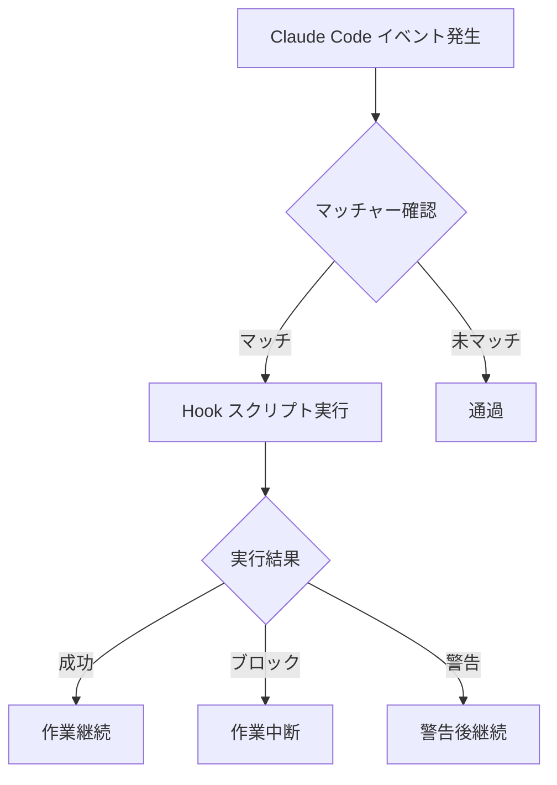
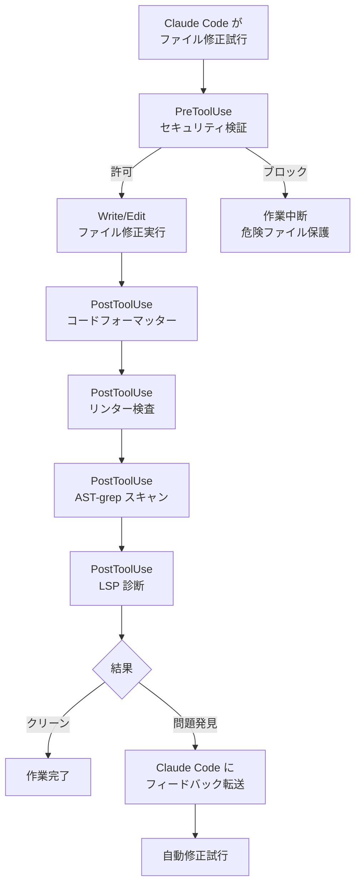

# Hooks ガイド

Claude Code の Hooks システムと MoAI-ADK の基本 Hook スクリプトを詳細に解説します。


**一言でいうと**: Hooks は Claude Code の**自動反射神経**です。ファイルを保存すると自動的にフォーマットし、危険なコマンドは自動的にブロックします。


## Hooks とは？

Hooks は Claude Code の特定イベントに反応して**自動的に実行されるスクリプト**です。

医師の反射神経検査に例えると、膝を叩く (イベント発生) と脚が自動的に上がる (スクリプト実行) ように、Claude Code がファイルを修正すると (PostToolUse イベント) フォーマッターが自動的に実行されます (コード整理)。



## Hook イベントタイプ

Claude Code は**10 イベントタイプ**をサポートします。

### 全イベントリスト

| イベント | 実行時点 | 主な用途 |
|--------|-----------|----------|
| `Setup` | `--init`, `--init-only`, `--maintenance` フラグで開始時 | 初期設定、環境チェック |
| `SessionStart` | セッション開始時 | プロジェクト情報表示、環境初期化 |
| `SessionEnd` | セッション終了時 | 整理作業、コンテキスト保存 |
| `PreCompact` | コンテキスト圧縮前 (`/clear` 等) | 重要コンテキストバックアップ |
| `PreToolUse` | ツール使用前 | セキュリティ検証、危険コマンドブロック |
| **`PermissionRequest`** | 権限ダイアログ表示時 | 自動許可/拒否決定 |
| `PostToolUse` | ツール使用後 | コードフォーマット、リント検査、LSP 診断 |
| **`UserPromptSubmit`** | ユーザーがプロンプト提出時 | プロンプト前処理、検証 |
| **`Notification`** | Claude Code が通知送信時 | デスクトップ通知カスタマイズ |
| `Stop` | 応答完了後 | ループ制御、完了条件確認 |
| **`SubagentStop`** | 下位エージェント作業完了後 | 下位作業結果処理 |

### イベント詳細説明

#### 1. Setup
Claude Code が `--init`、`--init-only`、または `--maintenance` フラグで開始されるときに実行されます。初期設定作業と環境チェックに使用します。

#### 2. SessionStart
セッションが開始されるか既存セッションを再開するときに実行されます。プロジェクト状態表示、環境初期化に使用します。

#### 3. SessionEnd
Claude Code セッションが終了するときに実行されます。整理作業、コンテキスト保存、メトリクス収集に使用します。

#### 4. PreCompact
Claude Code がコンテキスト圧縮作業 (`/clear` コマンド等) を実行する前に実行されます。重要なコンテキストをバックアップするのに使用します。

#### 5. PreToolUse
ツールが呼び出される**前に**実行されます。ツール呼び出しをブロックまたは修正できます。セキュリティ検証、危険コマンドブロックに使用します。

#### 6. PermissionRequest
権限ダイアログがユーザーに表示されるときに実行されます。自動的に許可または拒否できます。

#### 7. PostToolUse
ツール呼び出しが**完了した後**に実行されます。コードフォーマット、リント検査、LSP 診断収集に使用します。

#### 8. UserPromptSubmit
ユーザーがプロンプトを提出するときに実行され、Claude が処理する**前**です。プロンプト前処理、検証に使用します。

#### 9. Notification
Claude Code が通知を送信するときに実行されます。デスクトップ通知、サウンド通知などにカスタマイズできます。

#### 10. Stop
Claude Code が応答を完了したときに実行されます。ループ制御、完了条件確認に使用します。

#### 11. SubagentStop
下位エージェント作業が完了したときに実行されます。下位作業結果を処理するのに使用します。

### MoAI-ADK で実装されているイベント

MoAI-ADK は以下のイベントを実際に実装しています:

| イベント | 状態 | Hook ファイル |
|--------|------|-----------|
| `SessionStart` | ✅ | `session_start__show_project_info.py` |
| `PreToolUse` | ✅ | `pre_tool__security_guard.py` |
| `PostToolUse` | ✅ | `post_tool__code_formatter.py`, `post_tool__linter.py`, `post_tool__ast_grep_scan.py`, `post_tool__lsp_diagnostic.py` |
| `PreCompact` | ✅ | `pre_compact__save_context.py` |
| `SessionEnd` | ✅ | `session_end__auto_cleanup.py` |
| `Stop` | ✅ | `stop__loop_controller.py` |
| `Setup` | ⚪ | 公式例参照 |
| `PermissionRequest` | ⚪ | 公式例参照 |
| `UserPromptSubmit` | ⚪ | 公式例参照 |
| `Notification` | ⚪ | 公式例参照 |
| `SubagentStop` | ⚪ | 公式例参照 |

### イベント実行順序

一般的なファイル修正作業で Hook が実行される順序です。



## Claude Code 公式例

これらの例は Claude Code 公式ドキュメントで提供されている標準パターンです。

### Bash コマンドロギング Hook

すべての Bash コマンドをログファイルに記録します。

```json
{
  "hooks": {
    "PreToolUse": [
      {
        "matcher": "Bash",
        "hooks": [
          {
            "type": "command",
            "command": "jq -r '\"\\(.tool_input.command) - \\(.tool_input.description // \"No description\")\"' >> ~/.claude/bash-command-log.txt"
          }
        ]
      }
    ]
  }
}
```

### TypeScript フォーマット Hook

TypeScript ファイルを編集した後に自動的に Prettier を実行します。

```json
{
  "hooks": {
    "PostToolUse": [
      {
        "matcher": "Edit|Write",
        "hooks": [
          {
            "type": "command",
            "command": "jq -r '.tool_input.file_path' | { read file_path; if echo \"$file_path\" | grep -q '\\.ts$'; then npx prettier --write \"$file_path\"; fi; }"
          }
        ]
      }
    ]
  }
}
```

### Markdown フォーマッター Hook

Markdown ファイルの言語タグを自動的に検出して追加します。

```json
{
  "hooks": {
    "PostToolUse": [
      {
        "matcher": "Edit|Write",
        "hooks": [
          {
            "type": "command",
            "command": "\"$CLAUDE_PROJECT_DIR\"/.claude/hooks/markdown_formatter.py"
          }
        ]
      }
    ]
  }
}
```

`.claude/hooks/markdown_formatter.py` ファイル:

```python
#!/usr/bin/env python3
"""
Markdown formatter for Claude Code output.
Fixes missing language tags and spacing issues while preserving code content.
"""
import json
import sys
import re
import os

def detect_language(code):
    """Best-effort language detection from code content."""
    s = code.strip()

    # JSON detection
    if re.search(r'^\\s*[{\\[]', s):
        try:
            json.loads(s)
            return 'json'
        except:
            pass

    # Python detection
    if re.search(r'^\\s*def\\s+\\w+\\s*\\(', s, re.M) or \
       re.search(r'^\\s*(import|from)\\s+\\w+', s, re.M):
        return 'python'

    # JavaScript detection
    if re.search(r'\\b(function\\s+\\w+\\s*\\(|const\\s+\\w+\\s*=)', s) or \
       re.search('=>|console\\.(log|error)', s):
        return 'javascript'

    # Bash detection
    if re.search(r'^#!.*\\b(bash|sh)\\b', s, re.M) or \
       re.search(r'\\b(if|then|fi|for|in|do|done)\\b', s):
        return 'bash'

    return 'text'

def format_markdown(content):
    """Format markdown content with language detection."""
    # Fix unlabeled code fences
    def add_lang_to_fence(match):
        indent, info, body, closing = match.groups()
        if not info.strip():
            lang = detect_language(body)
            return f"{indent}```{lang}\\n{body}{closing}\\n"
        return match.group(0)

    fence_pattern = r'(?ms)^([ \\t]{0,3})```([^\\n]*)\\n(.*?)(\\n\\1```)\\s*$'
    content = re.sub(fence_pattern, add_lang_to_fence, content)

    # Fix excessive blank lines
    content = re.sub(r'\\n{3,}', '\\n\\n', content)

    return content.rstrip() + '\\n'

# Main execution
try:
    input_data = json.load(sys.stdin)
    file_path = input_data.get('tool_input', {}).get('file_path', '')

    if not file_path.endswith(('.md', '.mdx')):
        sys.exit(0)  # Not a markdown file

    if os.path.exists(file_path):
        with open(file_path, 'r', encoding='utf-8') as f:
            content = f.read()

        formatted = format_markdown(content)

        if formatted != content:
            with open(file_path, 'w', encoding='utf-8') as f:
                f.write(formatted)
            print(f"✓ Fixed markdown formatting in {file_path}")

except Exception as e:
    print(f"Error formatting markdown: {e}", file=sys.stderr)
    sys.exit(1)
```

### デスクトップ通知 Hook

Claude が入力を待っているときデスクトップ通知を表示します。

```json
{
  "hooks": {
    "Notification": [
      {
        "matcher": "",
        "hooks": [
          {
            "type": "command",
            "command": "notify-send 'Claude Code' 'Awaiting your input'"
          }
        ]
      }
    ]
  }
}
```

### ファイル保護 Hook

機密ファイルの修正をブロックします。

```json
{
  "hooks": {
    "PreToolUse": [
      {
        "matcher": "Edit|Write",
        "hooks": [
          {
            "type": "command",
            "command": "python3 -c \"import json, sys; data=json.load(sys.stdin); path=data.get('tool_input',{}).get('file_path',''); sys.exit(2 if any(p in path for p in ['.env', 'package-lock.json', '.git/']) else 0)\""
          }
        ]
      }
    ]
  }
}
```

## MoAI 基本 Hooks

MoAI-ADK は**11 の基本 Hook スクリプト**を提供します。

### Hook リスト

| Hook ファイル | イベント | マッチャー | 役割 | タイムアウト |
|-----------|--------|------|------|----------|
| `session_start__show_project_info.py` | SessionStart | 全体 | プロジェクト状態表示、更新確認 | 5 秒 |
| `pre_tool__security_guard.py` | PreToolUse | `Write\|Edit\|Bash` | 危険ファイル修正/コマンドブロック | 5 秒 |
| `post_tool__code_formatter.py` | PostToolUse | `Write\|Edit` | 自動コードフォーマット | 30 秒 |
| `post_tool__linter.py` | PostToolUse | `Write\|Edit` | 自動リント検査 | 60 秒 |
| `post_tool__ast_grep_scan.py` | PostToolUse | `Write\|Edit` | AST ベースセキュリティスキャン | 30 秒 |
| `post_tool__lsp_diagnostic.py` | PostToolUse | `Write\|Edit` | LSP 診断結果収集 | デフォルト |
| `pre_compact__save_context.py` | PreCompact | 全体 | `/clear` 前コンテキスト保存 | 3 秒 |
| `session_end__auto_cleanup.py` | SessionEnd | 全体 | セッション終了時整理作業 | 5 秒 |

| `stop__loop_controller.py` | Stop | 全体 | Ralph ループ制御および完了確認 | デフォルト |
| `quality_gate_with_lsp.py` | 手動 | 全体 | LSP ベース品質ゲート検証 | デフォルト |

### SessionStart: プロジェクト情報表示

セッション開始時にプロジェクトの現在状態を表示します。

**表示情報:**
- MoAI-ADK バージョンおよび更新有無
- 現在のプロジェクト名と技術スタック
- Git ブランチ、変更内容、最終コミット
- Git 戦略 (Github-Flow モード、Auto Branch 設定)
- 言語設定 (会話言語)
- 前回セッションコンテキスト (SPEC 状態、作業リスト)
- 個人化された歓迎メッセージまたは設定ガイド

### PreToolUse: Security Guard (セキュリティガード)

ファイル修正/コマンド実行前に**危険な作業を保護**します。

**保護対象ファイル:**

| カテゴリー | 保護ファイル | 理由 |
|----------|-----------|------|
| シークレット | `secrets/`, `*.secrets.*`, `*.credentials.*` | 機密情報保護 |
| SSH 鍵 | `~/.ssh/*`, `id_rsa*`, `id_ed25519*` | サーバーア接続キー保護 |
| 証明書 | `*.pem`, `*.key`, `*.crt` | 証明書ファイル保護 |
| クラウド資格情報 | `~/.aws/*`, `~/.gcloud/*`, `~/.azure/*`, `~/.kube/*` | クラウドアカウント保護 |
| Git 内部 | `.git/*` | Git リポジトリ完全性 |
| トークンファイル | `*.token`, `.tokens/*`, `auth.json` | 認証トークン保護 |

**注意:** `.env` ファイルは保護しません。開発者が環境変数を編集できるように許可しています。

**ブロック動作:**
- 保護対象ファイルへの Write/Edit 試行を検知
- JSON 形式で `"permissionDecision": "deny"` 応答を返す
- Claude Code が該当ファイル修正を中断

**危険な Bash コマンドブロック:**
- データベース削除: `supabase db reset`, `neon database delete`
- 危険なファイル削除: `rm -rf /`, `rm -rf .git`
- Docker 全体削除: `docker system prune -a`
| 強制プッシュ: `git push --force origin main`
- Terraform 破壊: `terraform destroy`

### PostToolUse: Code Formatter (コードフォーマッター)

ファイル修正後**自動的にコードを整理**します。

**サポート言語およびフォーマッター:**

| 言語 | フォーマッター (優先順位) | 設定ファイル |
|------|------------------|----------|
| Python | `ruff format`, `black` | `pyproject.toml` |
| TypeScript/JavaScript | `biome`, `prettier`, `eslint_d` | `.prettierrc`, `biome.json` |
| Go | `gofmt`, `goimports` | デフォルト |
| Rust | `rustfmt` | `rustfmt.toml` |
| Ruby | `prettier` | `.prettierrc` |
| PHP | `prettier` | `.prettierrc` |
| Java | `prettier` | `.prettierrc` |
| Kotlin | `prettier` | `.prettierrc` |
| Swift | `swiftformat` | `.swiftformat` |
| C# | `prettier` | `.prettierrc` |

**除外対象:**
- `.json`, `.lock`, `.min.js`, `.svg` 等
- `node_modules`, `.git`, `dist`, `build` ディレクトリ

### PostToolUse: Linter (リンター)

ファイル修正後**コード品質を自動検査**します。

**サポート言語およびリンター:**

| 言語 | リンター (優先順位) | 検査項目 |
|------|----------------|----------|
| Python | `ruff check`, `flake8` | PEP 8、タイプヒント、複雑度 |
| TypeScript/JavaScript | `eslint`, `biome lint`, `eslint_d` | コーディング標準、潜在的バグ |
| Go | `golangci-lint` | コード品質、パフォーマンス |
| Rust | `clippy` | Rust 互換性、パフォーマンス |

### PostToolUse: AST-grep スキャン

ファイル修正後**構造的セキュリティ脆弱性をスキャン**します。

**サポート言語:**
Python, JavaScript/TypeScript, Go, Rust, Java, Kotlin, C/C++, Ruby, PHP

**スキャンパターン例:**
- SQL Injection 脆弱性 (文字列連結クエリ)
- ハードコードされた秘密鍵 (API キー、トークン)
- 安全でない関数呼び出し
- 未使用のインポート

**設定:** `.claude/skills/moai-tool-ast-grep/rules/sgconfig.yml` またはプロジェクトルートの `sgconfig.yml`

### PostToolUse: LSP 診断

ファイル修正後**LSP (Language Server Protocol) 診断情報を収集**します。

**サポート言語:**
Python, TypeScript/JavaScript, Go, Rust, Java, Kotlin, Ruby, PHP, C/C++

**Fallback 診断:**
LSP を使用できない場合はコマンドラインツールを使用します:
- Python: `ruff check --output-format=json`
- TypeScript: `tsc --noEmit`

**設定:** `.moai/config/sections/ralph.yaml`

```yaml
ralph:
  enabled: true
  hooks:
    post_tool_lsp:
      enabled: true
      severity_threshold: error  # error | warning | info
```

### PreCompact: コンテキスト保存

`/clear` 実行前に**現在のコンテキストをファイルに保存**します。

**保存場所:** `.moai/memory/context-snapshot.json`

**保存内容:**
- 現在アクティブ SPEC 状態 (ID、フェーズ、進捗率)
- 進行中の作業リスト (TodoWrite)
- 完了した作業リスト
- 修正されたファイルリスト
- Git 状態情報 (ブランチ、コミットされていない変更)
- コア決定事項

**アーカイブ:** 以前のスナップショットは `.moai/memory/context-archive/` に自動保存されます。

### SessionEnd: 自動クリーンアップ

セッション終了時に以下の作業を実行します。

**P0 作業 (必須):**
- セッションメトリクス保存 (修正ファイル数、コミット数、作業した SPEC)
- 作業状態スナップショット保存 (`.moai/memory/last-session-state.json`)
- コミットされていない変更警告

**P1 作業 (選択):**
- 一時ファイル整理 (7 日以上のファイル)
- キャッシュファイル整理
- ルートドキュメント管理違反スキャン
- セッション要約生成

### Stop: ループ制御

Ralph Engine フィードバックループを制御します。

**完了条件確認:**
- LSP エラー数 (0 エラー目標)
- LSP 警告数
- テスト通過有無
- カバレッジ目標 (デフォルト 85%)
- 完了マーカー (`<moai>DONE</moai>`, `<moai>COMPLETE</moai>`) 検出

**状態ファイル:** `.moai/cache/.moai_loop_state.json`

**設定:** `.moai/config/sections/ralph.yaml`

```yaml
ralph:
  enabled: true
  loop:
    max_iterations: 10
    auto_fix: false
    completion:
      zero_errors: true
      zero_warnings: false
      tests_pass: true
      coverage_threshold: 85
```

### Quality Gate with LSP

LSP 診断を使用して品質ゲートを検証します。

**品質基準:**
- 最大エラー数: 0 (デフォルト)
- 最大警告数: 10 (デフォルト)
- タイプエラー: 0 許容
- リントエラー: 0 許容

**設定:** `.moai/config/sections/quality.yaml`

```yaml
constitution:
  quality_gate:
    max_errors: 0
    max_warnings: 10
    enabled: true
```

**結果例:**
```json
{
  "lsp_errors": 0,
  "lsp_warnings": 2,
  "type_errors": 0,
  "lint_errors": 0,
  "passed": true,
  "reason": "Quality gate passed: LSP diagnostics clean"
}
```

## lib/ 共有ライブラリ

MoAI Hooks は共有機能のために `lib/` ディレクトリにモジュールを提供します。

```
.claude/hooks/moai/lib/
├── __init__.py
├── atomic_write.py           # 原子的書き込み演算
├── checkpoint.py             # チェックポイント管理
├── common.py                 # 共通ユーティリティ
├── config.py                 # 設定管理
├── config_manager.py         # 設定マネージャー (高度)
├── config_validator.py       # 設定妥当性検証
├── context_manager.py        # コンテキスト管理 (スナップショット、アーカイブ)
├── enhanced_output_style_detector.py  # 出力スタイル検出
├── file_utils.py             # ファイルユーティリティ
├── git_collector.py          # Git データ収集
├── git_operations_manager.py # Git 演算マネージャー (最適化済み)
├── language_detector.py      # 言語検出
├── language_validator.py     # 言語妥当性検証
├── main.py                   # メインエントリーポイント
├── memory_collector.py       # メモリ収集
├── metrics_tracker.py        # メトリクス追跡
├── models.py                 # データモデル
├── path_utils.py             # パスユーティリティ
├── project.py                # プロジェクト関連
├── renderer.py               # レンダラー
├── timeout.py                # タイムアウト処理
├── tool_registry.py          # ツールレジストリ (フォーマッター、リンター)
├── unified_timeout_manager.py # 統合タイムアウトマネージャー
├── update_checker.py         # 更新確認
├── version_reader.py         # バージョン読み取り
├── alfred_detector.py        # Alfred 検出
└── shared/utils/
    └── announcement_translator.py  # お知らせ翻訳
```

**主要モジュール:**

- **tool_registry.py**: 16 プログラミング言語のフォーマッター/リンター自動検出
- **git_operations_manager.py**: 接続プーリング、キャッシングによる最適化 Git 演算
- **unified_timeout_manager.py**: 統合タイムアウト管理と優雅な劣化
- **context_manager.py**: コンテキストスナップショット、アーカイブ、Memory MCP ペ�イロード生成

## settings.json で Hook 設定

Hooks は `.claude/settings.json` ファイルの `hooks` セクションで設定します。

```json
{
  "hooks": {
    "SessionStart": [
      {
        "matcher": "",
        "hooks": [
          {
            "type": "command",
            "command": "${SHELL:-/bin/bash} -l -c 'uv run \"$CLAUDE_PROJECT_DIR/.claude/hooks/moai/session_start__show_project_info.py\"'"
          }
        ]
      }
    ],
    "PreToolUse": [
      {
        "matcher": "Write|Edit",
        "hooks": [
          {
            "type": "command",
            "command": "${SHELL:-/bin/bash} -l -c 'uv run \"$CLAUDE_PROJECT_DIR/.claude/hooks/moai/pre_tool__security_guard.py\"'",
            "timeout": 5000
          }
        ]
      }
    ],
    "PostToolUse": [
      {
        "matcher": "Write|Edit",
        "hooks": [
          {
            "type": "command",
            "command": "${SHELL:-/bin/bash} -l -c 'uv run \"$CLAUDE_PROJECT_DIR/.claude/hooks/moai/post_tool__code_formatter.py\"'",
            "timeout": 30000
          },
          {
            "type": "command",
            "command": "${SHELL:-/bin/bash} -l -c 'uv run \"$CLAUDE_PROJECT_DIR/.claude/hooks/moai/post_tool__linter.py\"'",
            "timeout": 60000
          },
          {
            "type": "command",
            "command": "${SHELL:-/bin/bash} -l -c 'uv run \"$CLAUDE_PROJECT_DIR/.claude/hooks/moai/post_tool__ast_grep_scan.py\"'",
            "timeout": 30000
          },
          {
            "type": "command",
            "command": "${SHELL:-/bin/bash} -l -c 'uv run \"$CLAUDE_PROJECT_DIR/.claude/hooks/moai/post_tool__lsp_diagnostic.py\"'"
          }
        ]
      }
    ],
    "PreCompact": [
      {
        "matcher": "",
        "hooks": [
          {
            "type": "command",
            "command": "${SHELL:-/bin/bash} -l -c 'uv run \"$CLAUDE_PROJECT_DIR/.claude/hooks/moai/pre_compact__save_context.py\"'",
            "timeout": 5000
          }
        ]
      }
    ],
    "SessionEnd": [
      {
        "matcher": "",
        "hooks": [
          {
            "type": "command",
            "command": "${SHELL:-/bin/bash} -l -c 'uv run \"$CLAUDE_PROJECT_DIR/.claude/hooks/moai/session_end__auto_cleanup.py\"'",
            "timeout": 5000
          }
        ]
      }
    ],
    "Stop": [
      {
        "matcher": "",
        "hooks": [
          {
            "type": "command",
            "command": "${SHELL:-/bin/bash} -l -c 'uv run \"$CLAUDE_PROJECT_DIR/.claude/hooks/moai/stop__loop_controller.py\"'"
          }
        ]
      }
    ]
  }
}
```

### 設定構造

| フィールド | 説明 | 例示 |
|------|------|------|
| `matcher` | ツール名マッチングパターン (正規表現) | `"Write\|Edit"` |
| `type` | Hook タイプ | `"command"` |
| `command` | 実行するコマンド | Shell スクリプトパス |
| `timeout` | 実行制限時間 (ミリ秒) | `5000` (5 秒) |

### マッチャーパターン

| パターン | 説明 |
|------|------|
| `""` (空文字列) | すべてのツールにマッチ |
| `"Write"` | Write ツールのみにマッチ |
| `"Write\|Edit"` | Write または Edit ツールにマッチ |
| `"Bash"` | Bash ツールのみにマッチ |

## カスタム Hook 作成法

### 基本テンプレート

カスタム Hook スクリプトは Python で作成できます。

```python
#!/usr/bin/env python3
"""カスタム PostToolUse Hook: ファイル修正後特定検査実行"""

import json
import sys

def main():
    # stdin から Hook 入力データを読み込み
    input_data = json.loads(sys.stdin.read())

    tool_name = input_data.get("tool_name", "")
    tool_input = input_data.get("tool_input", {})
    file_path = tool_input.get("file_path", "")

    # 検査ロジック
    if file_path.endswith(".py"):
        # Python ファイルに対するカスタム検査
        result = check_python_file(file_path)

        if result["has_issues"]:
            # Claude Code にフィードバック転送
            output = {
                "hookSpecificOutput": {
                    "hookEventName": "PostToolUse",
                    "additionalContext": result["message"]
                }
            }
            print(json.dumps(output))
            return

    # 問題なし場合は出力抑制
    output = {"suppressOutput": True}
    print(json.dumps(output))

def check_python_file(file_path: str) -> dict:
    """Python ファイルカスタム検査"""
    # 検査ロジック実装
    return {"has_issues": False, "message": ""}

if __name__ == "__main__":
    main()
```

### Hook 応答形式

| フィールド | 値 | 動作 |
|------|-----|------|
| `suppressOutput` | `true` | 何も表示しない |
| `hookSpecificOutput` | オブジェクト | 追加コンテキスト提供 |
| `permissionDecision` | `"allow"` | 作業許可 (PreToolUse) |
| `permissionDecision` | `"deny"` | 作業ブロック (PreToolUse) |
| `permissionDecision` | `"ask"` | ユーザー確認要求 (PreToolUse) |

### Hook 入力データ

Hook スクリプトは標準入力 (stdin) で JSON データを受け取ります。

```json
{
  "tool_name": "Write",
  "tool_input": {
    "file_path": "/path/to/file.py",
    "content": "ファイル内容..."
  },
  "tool_output": "ファイル出力結果 (PostToolUse のみ)"
}
```

## Hook ディレクトリ構造

```
.claude/hooks/moai/
├── __init__.py                        # パッケージ初期化
├── session_start__show_project_info.py # セッション開始
├── pre_tool__security_guard.py         # セキュリティガード
├── post_tool__code_formatter.py        # コードフォーマッター
├── post_tool__linter.py                # リンター
├── post_tool__ast_grep_scan.py         # AST-grep スキャン
├── post_tool__lsp_diagnostic.py        # LSP 診断
├── pre_compact__save_context.py        # コンテキスト保存
├── session_end__auto_cleanup.py        # 自動クリーンアップ

├── stop__loop_controller.py            # ループ制御
├── quality_gate_with_lsp.py            # 品質ゲート
└── lib/                                # 共有ライブラリ
    ├── atomic_write.py                 # 原子的書き込み
    ├── checkpoint.py                   # チェックポイント
    ├── common.py                       # 共通ユーティリティ
    ├── config.py                       # 設定
    ├── config_manager.py               # 設定マネージャー
    ├── config_validator.py             # 設定妥当性検証
    ├── context_manager.py              # コンテキスト管理
    ├── git_operations_manager.py       # Git 演算管理
    ├── tool_registry.py                # ツールレジストリ
    ├── unified_timeout_manager.py      # タイムアウト管理
    └── ...                             # その他モジュール
```


**注意**: Hook スクリプトのタイムアウトを長すぎると設定すると Claude Code の応答が遅くなります。フォーマッターは 30 秒、リンターは 60 秒、セキュリティガードは 5 秒以内を推奨します。


## 環境変数で Hook 無効化

特定 Hook を環境変数で無効化できます:

| Hook | 環境変数 |
|------|-----------|
| AST-grep スキャン | `MOAI_DISABLE_AST_GREP_SCAN=1` |
| LSP 診断 | `MOAI_DISABLE_LSP_DIAGNOSTIC=1` |
| ループ制御器 | `MOAI_DISABLE_LOOP_CONTROLLER=1` |

```bash
export MOAI_DISABLE_AST_GREP_SCAN=1
```

## 関連ドキュメント

- [settings.json ガイド](/advanced/settings-json) - Hook 設定方法
- [CLAUDE.md ガイド](/advanced/claude-md-guide) - プロジェクトガイド管理
- [エージェントガイド](/advanced/agent-guide) - エージェントと Hook 連携


**ヒント**: Hook は MoAI-ADK の品質保証の中核です。コードフォーマットとリント検査を自動化して開発者がロジックに only 集中できるようにします。カスタム Hook を追加してプロジェクトに合わせた自動化を構築してください。

