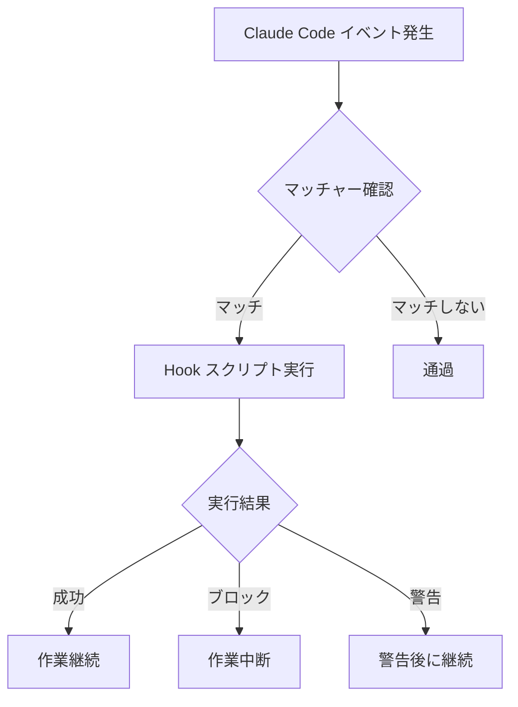
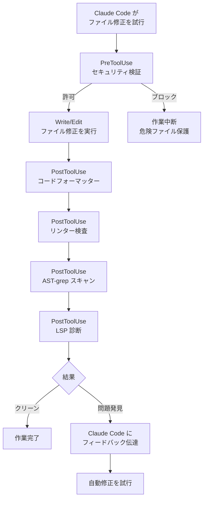

Claude Code の Hooks システムと MoAI-ADK のデフォルト Hook スクリプトを詳しく解説します。エージェンティック・ハーネスにおいて、プロンプトは「従うべき指針」ですが、フックは「必ず実行されるコード」です — 品質ゲートとセキュリティ防衛線を確率ではなく決定論の上に築くレイヤーがフックです。


**ひと言要約**: Hooks は Claude Code の **自動反射神経** です。ファイルを保存すると自動でフォーマットし、危険なコマンドは自動でブロックします。


## Hooks とは?

Hooks は Claude Code の特定イベントに反応して **自動的に実行されるスクリプト** です。

医師の反射神経検査にたとえると、膝を叩くと (イベント発生) 脚が自動的に上がる (スクリプト実行) ように、Claude Code がファイルを修正すると (PostToolUse イベント) フォーマッターが自動的に実行されます (コード整理)。


```mermaid
flowchart TD
    EVENT["Claude Code イベント発生"] --> MATCH{マッチャー確認}

    MATCH -->|マッチ| HOOK["Hook スクリプト実行"]
    MATCH -->|マッチしない| SKIP["通過"]

    HOOK --> RESULT{実行結果}
    RESULT -->|成功| CONTINUE["作業継続"]
    RESULT -->|ブロック| BLOCK["作業中断"]
    RESULT -->|警告| WARN["警告後に継続"]
```

## Hook イベントの種類

このガイドではよく使うコアイベントを扱います。(全 29 イベントは [Hooks イベントリファレンス](/ja/advanced/hooks-reference)を参照してください。)

### 主要イベント一覧

| イベント | 実行タイミング | 主な用途 |
|--------|-----------|----------|
| `Setup` | `--init`, `--init-only`, `--maintenance` フラグで起動時 | 初期設定、環境チェック |
| `SessionStart` | セッション開始時 | プロジェクト情報表示、環境初期化 |
| `SessionEnd` | セッション終了時 | クリーンアップ、コンテキスト保存 |
| `PostSession` | セッション終了後 (self-hosted runner, CC 2.1.169+) | セッション後のクリーンアップ/テレメトリ; セッションが完全に解放された後、`SessionEnd` より遅く発火します。MoAI-ADK は現在このフックを wiring していません — self-hosted デプロイ向けの利用可能なオプションとして文書化されています。 |
| `PreCompact` | コンテキスト圧縮前 (`/clear` など) | 重要コンテキストのバックアップ |
| `PreToolUse` | ツール使用前 | セキュリティ検証、危険コマンドのブロック |
| **`PermissionRequest`** | 権限ダイアログ表示時 | 自動許可/拒否の決定 |
| `PostToolUse` | ツール使用後 | コードフォーマット、リント検査、LSP 診断 |
| **`UserPromptSubmit`** | ユーザーがプロンプト送信時 | プロンプト前処理、検証 |
| **`Notification`** | Claude Code が通知送信時 | デスクトップ通知のカスタマイズ |
| `Stop` | 応答完了後 | ループ制御、完了条件確認 |
| **`SubagentStop`** | サブエージェントの作業完了後 | サブ作業の結果処理 |

### イベント詳細説明

#### 1. Setup
Claude Code が `--init`, `--init-only`, または `--maintenance` フラグで起動されたときに実行されます。初期設定作業と環境チェックに使います。

#### 2. SessionStart
セッションの開始時、または既存セッションの再開時に実行されます。プロジェクト状態の表示、環境初期化に使います。

#### 3. SessionEnd
Claude Code セッションが終了するときに実行されます。クリーンアップ、コンテキスト保存、メトリクス収集に使います。

#### 4. PreCompact
Claude Code がコンテキスト圧縮作業 (`/clear` コマンドなど) を行う前に実行されます。重要なコンテキストのバックアップに使います。

#### 5. PreToolUse
ツールが呼び出される **前** に実行されます。ツール呼び出しをブロックまたは修正できます。セキュリティ検証、危険コマンドのブロックに使います。

#### 6. PermissionRequest
権限ダイアログがユーザーに表示されるときに実行されます。自動的に許可または拒否できます。

#### 7. PostToolUse
ツール呼び出しが **完了した後** に実行されます。コードフォーマット、リント検査、LSP 診断収集に使います。

#### 8. UserPromptSubmit
ユーザーがプロンプトを送信するときに実行され、Claude が処理する **前** です。プロンプト前処理、検証に使います。

#### 9. Notification
Claude Code が通知を送るときに実行されます。デスクトップ通知、サウンド通知などにカスタマイズできます。

#### 10. Stop
Claude Code が応答を終えたときに実行されます。ループ制御、完了条件の確認に使います — `/moai loop` と goal エンジンはこのイベントの上で動作します。

#### 11. SubagentStop
サブエージェントの作業が完了したときに実行されます。サブ作業の結果処理に使います。

### MoAI-ADK で実装されているイベント

MoAI-ADK は次のイベントを実際に実装しています (✓ = 実装、— = 公式例を参照)。

| イベント | 状態 | Hook ファイル |
|--------|------|-----------|
| `SessionStart` | ✓ | `session_start__show_project_info.py` |
| `PreToolUse` | ✓ | `pre_tool__security_guard.py` |
| `PostToolUse` | ✓ | `post_tool__code_formatter.py`, `post_tool__linter.py`, `post_tool__ast_grep_scan.py`, `post_tool__lsp_diagnostic.py` |
| `PreCompact` | ✓ | `pre_compact__save_context.py` |
| `SessionEnd` | ✓ | `session_end__auto_cleanup.py` |
| `Stop` | ✓ | `stop__loop_controller.py` |
| `Setup` | — | 公式例を参照 |
| `PermissionRequest` | — | 公式例を参照 |
| `UserPromptSubmit` | — | 公式例を参照 |
| `Notification` | — | 公式例を参照 |
| `SubagentStop` | — | 公式例を参照 |
| `TeammateIdle` | ✓ | チームメンバーの idle 検出と品質検証 |
| `TaskCompleted` | ✓ | タスク完了検証 |


**SubagentStop ハンドラー未実装の問題 (v2.9.0)**: `SubagentStop` イベントは settings.json に登録されていますが、Go ハンドラーが `deps.go` に未登録の状態です。現在は空応答 (`{}`) のみを返します。


### Agent Teams イベント詳細 (v2.9.0)

#### TeammateIdle イベント
チームメンバーが作業を完了し idle 状態に入るときに実行されます。

- `continue: false` (exit code 2) → idle 拒否、メンバーが追加作業を実行
- `continue: true` (デフォルト) → idle 承認

#### TaskCompleted イベント
チームメンバーがタスクを完了したときに実行されます。

- Exit code 2 → 完了拒否 (修正が必要)
- Exit code 0 (デフォルト) → 完了承認

#### Team Shutdown Sequence [HARD]

チーム終了時は次の順序を **必ず** 守ってください。

1. **shutdown_request 送信**: 各メンバーに `SendMessage(shutdown_request)` を送信
2. **応答待機**: 各メンバーから `shutdown_response approve:true` を受信
3. **[HARD] tmux pane クリーンアップ**: tmux pane を明示的に終了
   - `~/.claude/teams/{team-name}/config.json` を読む
   - 各メンバーの `tmuxPaneId` を抽出 (例: "%184")
   - `tmux kill-pane -t {paneId}` を実行 (高いインデックスから)

チームディレクトリのクリーンアップはセッション終了時に自動で行われます。明示的な teardown 呼び出しは不要です (明示的なチーム teardown ツールは Claude Code v2.1.178 で削除されました — すべてのセッションは暗黙のチームを 1 つ持ち、クリーンアップは自動です)。


**なぜ tmux pane クリーンアップが必須なのか?** `shutdown_response` はメンバーを論理的に完了マークしますが、tmux pane プロセスを終了しません。チームディレクトリのクリーンアップはセッション終了時に自動で行われますが、これも tmux pane プロセスを終了しません。明示的な pane 終了なしでは pane が無限に生き続け、Leader が「Drain」状態で止まります。


### イベント実行順序

一般的なファイル修正作業で Hook が実行される順序です。


```mermaid
flowchart TD
    A["Claude Code が<br>ファイル修正を試行"] --> B["PreToolUse<br>セキュリティ検証"]

    B -->|許可| C["Write/Edit<br>ファイル修正を実行"]
    B -->|ブロック| BLOCK["作業中断<br>危険ファイル保護"]

    C --> D["PostToolUse<br>コードフォーマッター"]
    D --> E["PostToolUse<br>リンター検査"]
    E --> F["PostToolUse<br>AST-grep スキャン"]
    F --> G["PostToolUse<br>LSP 診断"]

    G --> H{結果}
    H -->|クリーン| I["作業完了"]
    H -->|問題発見| J["Claude Code に<br>フィードバック伝達"]
    J --> K["自動修正を試行"]
```

このパイプラインがエージェンティック・ループのフィードバックの半分を担います — エージェントが書き、フックが検査し、問題があれば次のターンの修正入力になります。

## Claude Code 公式例

これらの例は Claude Code 公式ドキュメントで提供されている標準パターンです。

### Bash コマンドロギング Hook

すべての Bash コマンドをログファイルに記録します。

```json
{
  "hooks": {
    "PreToolUse": [
      {
        "matcher": "Bash",
        "hooks": [
          {
            "type": "command",
            "command": "jq -r '\"\\(.tool_input.command) - \\(.tool_input.description // \"No description\")\"' >> ~/.claude/bash-command-log.txt"
          }
        ]
      }
    ]
  }
}
```

### TypeScript フォーマット Hook

TypeScript ファイルの編集後に自動で Prettier を実行します。

```json
{
  "hooks": {
    "PostToolUse": [
      {
        "matcher": "Edit|Write",
        "hooks": [
          {
            "type": "command",
            "command": "jq -r '.tool_input.file_path' | { read file_path; if echo \"$file_path\" | grep -q '\\.ts$'; then npx prettier --write \"$file_path\"; fi; }"
          }
        ]
      }
    ]
  }
}
```

### Markdown フォーマッター Hook

Markdown ファイルの言語タグを自動検出して追加します。

```json
{
  "hooks": {
    "PostToolUse": [
      {
        "matcher": "Edit|Write",
        "hooks": [
          {
            "type": "command",
            "command": "\"$CLAUDE_PROJECT_DIR\"/.claude/hooks/markdown_formatter.py"
          }
        ]
      }
    ]
  }
}
```

`.claude/hooks/markdown_formatter.py` ファイル:

```python
#!/usr/bin/env python3
"""
Markdown formatter for Claude Code output.
Fixes missing language tags and spacing issues while preserving code content.
"""
import json
import sys
import re
import os

def detect_language(code):
    """Best-effort language detection from code content."""
    s = code.strip()

    # JSON detection
    if re.search(r'^\\s*[{\\[]', s):
        try:
            json.loads(s)
            return 'json'
        except:
            pass

    # Python detection
    if re.search(r'^\\s*def\\s+\\w+\\s*\\(', s, re.M) or \
       re.search(r'^\\s*(import|from)\\s+\\w+', s, re.M):
        return 'python'

    # JavaScript detection
    if re.search(r'\\b(function\\s+\\w+\\s*\\(|const\\s+\\w+\\s*=)', s) or \
       re.search(r'=>|console\\.(log|error)', s):
        return 'javascript'

    # Bash detection
    if re.search(r'^#!.*\\b(bash|sh)\\b', s, re.M) or \
       re.search(r'\\b(if|then|fi|for|in|do|done)\\b', s):
        return 'bash'

    return 'text'

def format_markdown(content):
    """Format markdown content with language detection."""
    # Fix unlabeled code fences
    def add_lang_to_fence(match):
        indent, info, body, closing = match.groups()
        if not info.strip():
            lang = detect_language(body)
            return f"{indent}```{lang}\\n{body}{closing}\\n"
        return match.group(0)

    fence_pattern = r'(?ms)^([ \\t]{0,3})```([^\\n]*)\\n(.*?)(\\n\\1```)\\s*$'
    content = re.sub(fence_pattern, add_lang_to_fence, content)

    # Fix excessive blank lines
    content = re.sub(r'\\n{3,}', '\\n\\n', content)

    return content.rstrip() + '\\n'

# Main execution
try:
    input_data = json.load(sys.stdin)
    file_path = input_data.get('tool_input', {}).get('file_path', '')

    if not file_path.endswith(('.md', '.mdx')):
        sys.exit(0)  # Not a markdown file

    if os.path.exists(file_path):
        with open(file_path, 'r', encoding='utf-8') as f:
            content = f.read()

        formatted = format_markdown(content)

        if formatted != content:
            with open(file_path, 'w', encoding='utf-8') as f:
                f.write(formatted)
            print(f"✓ Fixed markdown formatting in {file_path}")

except Exception as e:
    print(f"Error formatting markdown: {e}", file=sys.stderr)
    sys.exit(1)
```

### デスクトップ通知 Hook

Claude が入力を待っているときにデスクトップ通知を表示します。

```json
{
  "hooks": {
    "Notification": [
      {
        "matcher": "",
        "hooks": [
          {
            "type": "command",
            "command": "notify-send 'Claude Code' 'Awaiting your input'"
          }
        ]
      }
    ]
  }
}
```

### ファイル保護 Hook

機密ファイルの修正をブロックします。

```json
{
  "hooks": {
    "PreToolUse": [
      {
        "matcher": "Edit|Write",
        "hooks": [
          {
            "type": "command",
            "command": "python3 -c \"import json, sys; data=json.load(sys.stdin); path=data.get('tool_input',{}).get('file_path',''); sys.exit(2 if any(p in path for p in ['.env', 'package-lock.json', '.git/']) else 0)\""
          }
        ]
      }
    ]
  }
}
```

## MoAI デフォルト Hooks

MoAI-ADK は **11 個のデフォルト Hook スクリプト** を提供します。

### Hook 一覧

| Hook ファイル | イベント | マッチャー | 役割 | タイムアウト |
|-----------|--------|------|------|----------|
| `session_start__show_project_info.py` | SessionStart | 全体 | プロジェクト状態表示、更新確認 | 5 秒 |
| `pre_tool__security_guard.py` | PreToolUse | `Write\|Edit\|Bash` | 危険ファイル修正/コマンドのブロック | 5 秒 |
| `post_tool__code_formatter.py` | PostToolUse | `Write\|Edit` | 自動コードフォーマット | 30 秒 |
| `post_tool__linter.py` | PostToolUse | `Write\|Edit` | 自動リント検査 | 60 秒 |
| `post_tool__ast_grep_scan.py` | PostToolUse | `Write\|Edit` | AST ベースのセキュリティスキャン | 30 秒 |
| `post_tool__lsp_diagnostic.py` | PostToolUse | `Write\|Edit` | LSP 診断結果の収集 | デフォルト |
| `pre_compact__save_context.py` | PreCompact | 全体 | `/clear` 前のコンテキスト保存 | 3 秒 |
| `session_end__auto_cleanup.py` | SessionEnd | 全体 | セッション終了時のクリーンアップ | 5 秒 |
| `stop__loop_controller.py` | Stop | 全体 | Ralph ループ制御と完了確認 | デフォルト |
| `quality_gate_with_lsp.py` | 手動 | 全体 | LSP ベースの品質ゲート検証 | デフォルト |

### SessionStart: プロジェクト情報表示

セッション開始時にプロジェクトの現在の状態を表示します。

**表示情報:**
- MoAI-ADK バージョンと更新の有無
- 現在のプロジェクト名と技術スタック
- Git ブランチ、変更点、最後のコミット
- Git 戦略 (Github-Flow モード、Auto Branch 設定)
- 言語設定 (会話言語)
- 前セッションのコンテキスト (SPEC 状態、作業リスト)
- パーソナライズされたウェルカムメッセージまたは設定ガイド

### PreToolUse: Security Guard (セキュリティガード)

ファイル修正/コマンド実行前に **危険な操作を保護** します。

**保護対象ファイル:**

| カテゴリ | 保護ファイル | 理由 |
|----------|-----------|------|
| シークレットストレージ | `secrets/`, `*.secrets.*`, `*.credentials.*` | 機密情報の保護 |
| SSH キー | `~/.ssh/*`, `id_rsa*`, `id_ed25519*` | サーバーアクセスキーの保護 |
| 証明書 | `*.pem`, `*.key`, `*.crt` | 証明書ファイルの保護 |
| クラウド認証情報 | `~/.aws/*`, `~/.gcloud/*`, `~/.azure/*`, `~/.kube/*` | クラウドアカウントの保護 |
| Git 内部 | `.git/*` | Git リポジトリの整合性 |
| トークンファイル | `*.token`, `.tokens/*`, `auth.json` | 認証トークンの保護 |

**注意:** `.env` ファイルは保護しません。開発者が環境変数を編集できるよう許可します。

**ブロック動作:**
- 保護対象ファイルへの Write/Edit の試行を検出
- JSON 形式で `"permissionDecision": "deny"` 応答を返す
- Claude Code が該当ファイルの修正を中断

**危険な Bash コマンドのブロック:**
- データベース削除: `supabase db reset`, `neon database delete`
- 危険なファイル削除: `rm -rf /`, `rm -rf .git`
- Docker 全削除: `docker system prune -a`
- 強制プッシュ: `git push --force origin main`
- Terraform 破壊: `terraform destroy`

### PostToolUse: Code Formatter (コードフォーマッター)

ファイル修正後 **自動でコードを整理** します。

**対応言語とフォーマッター:**

| 言語 | フォーマッター (優先順) | 設定ファイル |
|------|------------------|----------|
| Python | `ruff format`, `black` | `pyproject.toml` |
| TypeScript/JavaScript | `biome`, `prettier`, `eslint_d` | `.prettierrc`, `biome.json` |
| Go | `gofmt`, `goimports` | デフォルト |
| Rust | `rustfmt` | `rustfmt.toml` |
| Ruby | `prettier` | `.prettierrc` |
| PHP | `prettier` | `.prettierrc` |
| Java | `prettier` | `.prettierrc` |
| Kotlin | `prettier` | `.prettierrc` |
| Swift | `swiftformat` | `.swiftformat` |
| C# | `prettier` | `.prettierrc` |

**除外対象:**
- `.json`, `.lock`, `.min.js`, `.svg` など
- `node_modules`, `.git`, `dist`, `build` ディレクトリ

### PostToolUse: Linter (リンター)

ファイル修正後 **コード品質を自動検査** します。

**対応言語とリンター:**

| 言語 | リンター (優先順) | 検査項目 |
|------|----------------|----------|
| Python | `ruff check`, `flake8` | PEP 8、型ヒント、複雑度 |
| TypeScript/JavaScript | `eslint`, `biome lint`, `eslint_d` | コーディング標準、潜在バグ |
| Go | `golangci-lint` | コード品質、性能 |
| Rust | `clippy` | Rust の慣用性、性能 |

### PostToolUse: AST-grep スキャン

ファイル修正後 **構造的なセキュリティ脆弱性をスキャン** します。

**対応言語:**
Python, JavaScript/TypeScript, Go, Rust, Java, Kotlin, C/C++, Ruby, PHP

**スキャンパターン例:**
- SQL Injection 脆弱性 (文字列連結クエリ)
- ハードコードされた秘密鍵 (API キー、トークン)
- 安全でない関数呼び出し
- 未使用のインポート

**設定:** `.claude/skills/moai-tool-ast-grep/rules/sgconfig.yml` またはプロジェクトルートの `sgconfig.yml`

### PostToolUse: LSP 診断

ファイル修正後 **LSP (Language Server Protocol) 診断情報を収集** します。

**対応言語:**
Python, TypeScript/JavaScript, Go, Rust, Java, Kotlin, Ruby, PHP, C/C++

**フォールバック診断:**
LSP が使えない場合はコマンドラインツールを使います:
- Python: `ruff check --output-format=json`
- TypeScript: `tsc --noEmit`

**設定:** `.moai/config/sections/ralph.yaml`

```yaml
ralph:
  enabled: true
  hooks:
    post_tool_lsp:
      enabled: true
      severity_threshold: error  # error | warning | info
```

### PreCompact: コンテキスト保存

`/clear` 実行前に **現在のコンテキストをファイルに保存** します。コンテキストの閾値でセッションを切って続けるハンドオフフローの安全網です。

**保存場所:** `.moai/memory/context-snapshot.json`

**保存内容:**
- 現在アクティブな SPEC 状態 (ID、フェーズ、進捗率)
- 進行中の作業リスト (TodoWrite)
- 完了した作業リスト
- 修正されたファイルリスト
- Git 状態情報 (ブランチ、未コミット変更)
- 主要な決定事項

**アーカイブ:** 以前のスナップショットは `.moai/memory/context-archive/` に自動保管されます。

### SessionEnd: 自動クリーンアップ

セッション終了時に次の作業を行います。

**P0 作業 (必須):**
- セッションメトリクス保存 (修正ファイル数、コミット数、作業した SPEC)
- 作業状態スナップショット保存 (`.moai/memory/last-session-state.json`)
- 未コミット変更の警告

**P1 作業 (選択):**
- 一時ファイルのクリーンアップ (7 日以上経過したファイル)
- キャッシュファイルのクリーンアップ
- ルートディレクトリのドキュメント管理違反スキャン
- セッションサマリーの生成

### Stop: ループコントローラー

Ralph Engine フィードバックループを制御します。`/moai loop` が「全部直すまで繰り返す」ことができるのは、このフックが毎ターン終了時点で完了条件を機械的に判定するからです。

**完了条件の確認:**
- LSP エラー数 (0 エラー目標)
- LSP 警告数
- テスト合格の有無
- カバレッジ目標 (デフォルト 85%)
- 完了文の検出 (自然言語ループ終了シグナル)

**状態ファイル:** `.moai/cache/.moai_loop_state.json`

**設定:** `.moai/config/sections/ralph.yaml`

```yaml
ralph:
  enabled: true
  loop:
    max_iterations: 10
    auto_fix: false
    completion:
      zero_errors: true
      zero_warnings: false
      tests_pass: true
      coverage_threshold: 85
```

### Quality Gate with LSP

LSP 診断を使って品質ゲートを検証します。

**品質基準:**
- 最大エラー数: 0 (デフォルト)
- 最大警告数: 10 (デフォルト)
- 型エラー: 0 許容
- リントエラー: 0 許容

**設定:** `.moai/config/sections/quality.yaml`

```yaml
constitution:
  quality_gate:
    max_errors: 0
    max_warnings: 10
    enabled: true
```

**結果例:**
```json
{
  "lsp_errors": 0,
  "lsp_warnings": 2,
  "type_errors": 0,
  "lint_errors": 0,
  "passed": true,
  "reason": "Quality gate passed: LSP diagnostics clean"
}
```

## lib/ 共有ライブラリ

MoAI Hooks は共有機能のために `lib/` ディレクトリにモジュールを提供します。

```
.claude/hooks/moai/lib/
├── __init__.py
├── atomic_write.py           # アトミックな書き込み演算
├── checkpoint.py             # チェックポイント管理
├── common.py                 # 共通ユーティリティ
├── config.py                 # 設定管理
├── config_manager.py         # 設定マネージャー (高度)
├── config_validator.py       # 設定バリデーション
├── context_manager.py        # コンテキスト管理 (スナップショット、アーカイブ)
├── enhanced_output_style_detector.py  # 出力スタイル検出
├── file_utils.py             # ファイルユーティリティ
├── git_collector.py          # Git データ収集
├── git_operations_manager.py # Git 演算マネージャー (最適化済み)
├── language_detector.py      # 言語検出
├── language_validator.py     # 言語バリデーション
├── main.py                   # メインエントリポイント
├── memory_collector.py       # メモリ収集
├── metrics_tracker.py        # メトリクス追跡
├── models.py                 # データモデル
├── path_utils.py             # パスユーティリティ
├── project.py                # プロジェクト関連
├── renderer.py               # レンダラー
├── timeout.py                # タイムアウト処理
├── tool_registry.py          # ツールレジストリ (フォーマッター、リンター)
├── unified_timeout_manager.py # 統合タイムアウトマネージャー
├── update_checker.py         # 更新確認
├── version_reader.py         # バージョン読み取り
├── alfred_detector.py        # Alfred 検出
└── shared/utils/
    └── announcement_translator.py  # アナウンス翻訳
```

**主要モジュール:**

- **tool_registry.py**: 16 のプログラミング言語に対するフォーマッター/リンターの自動検出
- **git_operations_manager.py**: コネクションプーリング、キャッシングによる最適化 Git 演算
- **unified_timeout_manager.py**: 統合タイムアウト管理とグレースフルな低下
- **context_manager.py**: コンテキストスナップショット、アーカイブ、Memory MCP ペイロード生成

## settings.json での Hook 設定

Hooks は `.claude/settings.json` ファイルの `hooks` セクションで設定します。

```json
{
  "hooks": {
    "SessionStart": [
      {
        "matcher": "",
        "hooks": [
          {
            "type": "command",
            "command": "${SHELL:-/bin/bash} -l -c 'uv run \"$CLAUDE_PROJECT_DIR/.claude/hooks/moai/session_start__show_project_info.py\"'"
          }
        ]
      }
    ],
    "PreToolUse": [
      {
        "matcher": "Write|Edit",
        "hooks": [
          {
            "type": "command",
            "command": "${SHELL:-/bin/bash} -l -c 'uv run \"$CLAUDE_PROJECT_DIR/.claude/hooks/moai/pre_tool__security_guard.py\"'",
            "timeout": 5000
          }
        ]
      }
    ],
    "PostToolUse": [
      {
        "matcher": "Write|Edit",
        "hooks": [
          {
            "type": "command",
            "command": "${SHELL:-/bin/bash} -l -c 'uv run \"$CLAUDE_PROJECT_DIR/.claude/hooks/moai/post_tool__code_formatter.py\"'",
            "timeout": 30000
          },
          {
            "type": "command",
            "command": "${SHELL:-/bin/bash} -l -c 'uv run \"$CLAUDE_PROJECT_DIR/.claude/hooks/moai/post_tool__linter.py\"'",
            "timeout": 60000
          },
          {
            "type": "command",
            "command": "${SHELL:-/bin/bash} -l -c 'uv run \"$CLAUDE_PROJECT_DIR/.claude/hooks/moai/post_tool__ast_grep_scan.py\"'",
            "timeout": 30000
          },
          {
            "type": "command",
            "command": "${SHELL:-/bin/bash} -l -c 'uv run \"$CLAUDE_PROJECT_DIR/.claude/hooks/moai/post_tool__lsp_diagnostic.py\"'"
          }
        ]
      }
    ],
    "PreCompact": [
      {
        "matcher": "",
        "hooks": [
          {
            "type": "command",
            "command": "${SHELL:-/bin/bash} -l -c 'uv run \"$CLAUDE_PROJECT_DIR/.claude/hooks/moai/pre_compact__save_context.py\"'",
            "timeout": 5000
          }
        ]
      }
    ],
    "SessionEnd": [
      {
        "matcher": "",
        "hooks": [
          {
            "type": "command",
            "command": "${SHELL:-/bin/bash} -l -c 'uv run \"$CLAUDE_PROJECT_DIR/.claude/hooks/moai/session_end__auto_cleanup.py\"'",
            "timeout": 5000
          }
        ]
      }
    ],
    "Stop": [
      {
        "matcher": "",
        "hooks": [
          {
            "type": "command",
            "command": "${SHELL:-/bin/bash} -l -c 'uv run \"$CLAUDE_PROJECT_DIR/.claude/hooks/moai/stop__loop_controller.py\"'"
          }
        ]
      }
    ]
  }
}
```

### 設定構造

| フィールド | 説明 | 例 |
|------|------|------|
| `matcher` | ツール名マッチングパターン (正規表現) | `"Write\|Edit"` |
| `type` | Hook 種別 | `"command"` |
| `command` | 実行するコマンド | Shell スクリプトのパス |
| `timeout` | 実行制限時間 (ミリ秒) | `5000` (5 秒) |

### マッチャーパターン

| パターン | 説明 |
|------|------|
| `""` (空文字列) | すべてのツールにマッチ |
| `"Write"` | Write ツールのみにマッチ |
| `"Write\|Edit"` | Write または Edit ツールにマッチ |
| `"Bash"` | Bash ツールのみにマッチ |

## カスタム Hook の書き方

### 基本テンプレート

カスタム Hook スクリプトは Python で書けます。

```python
#!/usr/bin/env python3
"""カスタム PostToolUse Hook: ファイル修正後に特定の検査を実行"""

import json
import sys

def main():
    # stdin から Hook 入力データを読む
    input_data = json.loads(sys.stdin.read())

    tool_name = input_data.get("tool_name", "")
    tool_input = input_data.get("tool_input", {})
    file_path = tool_input.get("file_path", "")

    # 検査ロジック
    if file_path.endswith(".py"):
        # Python ファイルに対するカスタム検査
        result = check_python_file(file_path)

        if result["has_issues"]:
            # Claude Code にフィードバックを伝達
            output = {
                "hookSpecificOutput": {
                    "hookEventName": "PostToolUse",
                    "additionalContext": result["message"]
                }
            }
            print(json.dumps(output))
            return

    # 問題なければ出力を抑制
    output = {"suppressOutput": True}
    print(json.dumps(output))

def check_python_file(file_path: str) -> dict:
    """Python ファイルのカスタム検査"""
    # 検査ロジックの実装
    return {"has_issues": False, "message": ""}

if __name__ == "__main__":
    main()
```

### Hook 応答形式

| フィールド | 値 | 動作 |
|------|-----|------|
| `suppressOutput` | `true` | 何も表示しない |
| `hookSpecificOutput` | オブジェクト | 追加コンテキストの提供 |
| `permissionDecision` | `"allow"` | 操作を許可 (PreToolUse) |
| `permissionDecision` | `"deny"` | 操作をブロック (PreToolUse) |
| `permissionDecision` | `"ask"` | ユーザー確認を要求 (PreToolUse) |

### Hook 入力データ

Hook スクリプトは標準入力 (stdin) で JSON データを受け取ります。

```json
{
  "tool_name": "Write",
  "tool_input": {
    "file_path": "/path/to/file.py",
    "content": "ファイル内容..."
  },
  "tool_output": "ファイル出力結果 (PostToolUse でのみ)"
}
```

## Hook ディレクトリ構造

```
.claude/hooks/moai/
├── __init__.py                        # パッケージ初期化
├── session_start__show_project_info.py # セッション開始
├── pre_tool__security_guard.py         # セキュリティガード
├── post_tool__code_formatter.py        # コードフォーマッター
├── post_tool__linter.py                # リンター
├── post_tool__ast_grep_scan.py         # AST-grep スキャン
├── post_tool__lsp_diagnostic.py        # LSP 診断
├── pre_compact__save_context.py        # コンテキスト保存
├── session_end__auto_cleanup.py        # 自動クリーンアップ
├── stop__loop_controller.py            # ループコントローラー
├── quality_gate_with_lsp.py            # 品質ゲート
└── lib/                                # 共有ライブラリ
    ├── atomic_write.py                 # アトミック書き込み
    ├── checkpoint.py                   # チェックポイント
    ├── common.py                       # 共通ユーティリティ
    ├── config.py                       # 設定
    ├── config_manager.py               # 設定マネージャー
    ├── config_validator.py             # 設定バリデーション
    ├── context_manager.py              # コンテキスト管理
    ├── git_operations_manager.py       # Git 演算管理
    ├── tool_registry.py                # ツールレジストリ
    ├── unified_timeout_manager.py      # タイムアウト管理
    └── ...                             # その他モジュール
```


**注意**: Hook スクリプトのタイムアウトを長くしすぎると Claude Code の応答が遅くなります。フォーマッターは 30 秒、リンターは 60 秒、セキュリティガードは 5 秒以内を推奨します。


## 環境変数での Hook 無効化

特定の Hook を環境変数で無効化できます。

| Hook | 環境変数 |
|------|-----------|
| AST-grep スキャン | `MOAI_DISABLE_AST_GREP_SCAN=1` |
| LSP 診断 | `MOAI_DISABLE_LSP_DIAGNOSTIC=1` |
| ループコントローラー | `MOAI_DISABLE_LOOP_CONTROLLER=1` |

```bash
export MOAI_DISABLE_AST_GREP_SCAN=1
```

## 関連ドキュメント

- [Hooks イベントリファレンス](/ja/advanced/hooks-reference) - 29 イベント全体リファレンス
- [settings.json ガイド](/ja/advanced/settings-json) - Hook 設定方法
- [CLAUDE.md ガイド](/ja/advanced/claude-md-guide) - プロジェクト指針の管理
- [エージェントガイド](/ja/advanced/agent-guide) - エージェントと Hook の連携


**ヒント**: Hook は MoAI-ADK の品質保証の核心です。コードフォーマットとリント検査を自動化し、開発者がロジックに集中できるようにします。カスタム Hook を追加してプロジェクトに合った自動化を構築してください。

