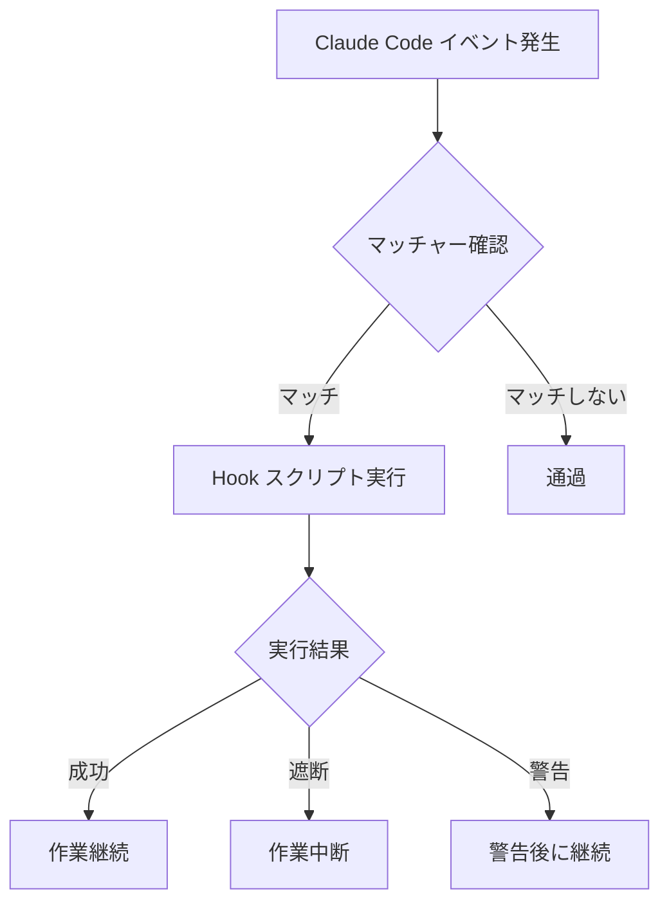
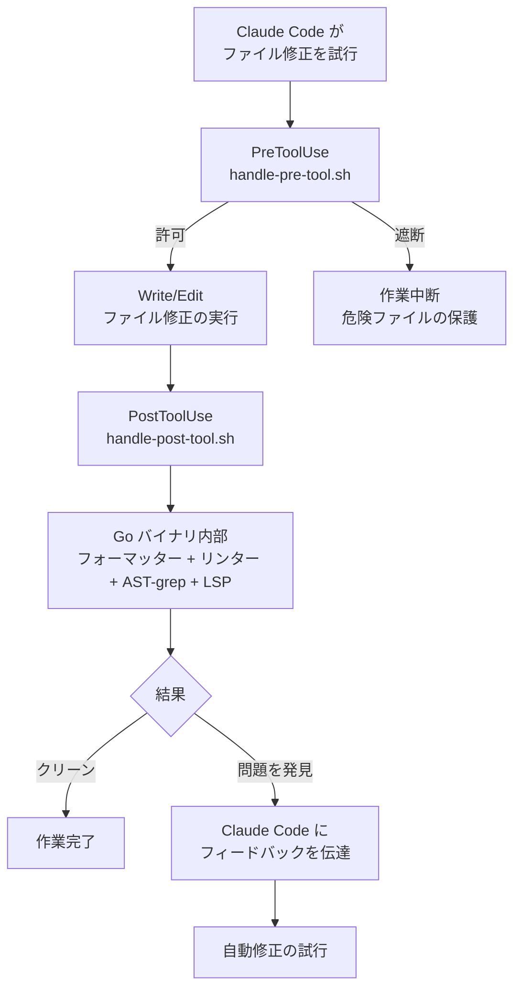

Claude Code の Hooks システムと MoAI-ADK の基本 Hook スクリプトを詳しく案内します。エージェンティックハーネスでプロンプトは「従うべき指針」ですが、フックは「必ず実行されるコード」です — 品質ゲートとセキュリティ防衛線を確率ではなく決定論の上に立てる層がまさにフックです。


**一行要約**: Hooks は Claude Code の **自動反射神経** です。ファイルを保存すると自動的にフォーマットし、危険なコマンドは自動的に遮断します。


## Hooks とは?

Hooks は Claude Code の特定のイベントに反応して **自動的に実行されるスクリプト** です。

医師の反射神経検査にたとえると、膝を叩くと (イベント発生) 足が自動的に上がる (スクリプト実行) ように、Claude Code がファイルを修正すると (PostToolUse イベント) フォーマッターが自動的に実行されます (コードの整理)。


```mermaid
flowchart TD
    EVENT["Claude Code イベント発生"] --> MATCH{マッチャー確認}

    MATCH -->|マッチ| HOOK["Hook スクリプト実行"]
    MATCH -->|マッチしない| SKIP["通過"]

    HOOK --> RESULT{実行結果}
    RESULT -->|成功| CONTINUE["作業継続"]
    RESULT -->|遮断| BLOCK["作業中断"]
    RESULT -->|警告| WARN["警告後に継続"]
```

## Hook イベントタイプ

このガイドではよく使う核心イベントを扱います。(Claude Code の 30 個のイベントタイプの全カタログは [Hooks イベントリファレンス](/ja/advanced/hooks-reference) を参照してください。)

### 主要イベント一覧

| イベント | 実行タイミング | 主な用途 |
|--------|-----------|----------|
| `Setup` | `--init`, `--init-only`, `--maintenance` フラグで起動時 | 初期設定、環境点検 |
| `SessionStart` | セッションが開始するとき | プロジェクト情報の表示、環境初期化 |
| `SessionEnd` | セッションが終了するとき | 整理作業、コンテキスト保存 |
| `PostSession` | セッション終了後 (self-hosted runner, CC 2.1.169+) | セッション後の整理/テレメトリ; セッションが完全に解放された後、`SessionEnd` より遅く発火します。MoAI-ADK は現在このフックを wiring しません — self-hosted 配布のための利用可能なオプションとして文書化されます。 |
| `PreCompact` | コンテキスト圧縮前 (`/clear` など) | 重要なコンテキストのバックアップ |
| `PreToolUse` | ツール使用前 | セキュリティ検証、危険なコマンドの遮断 |
| **`PermissionRequest`** | 権限ダイアログ表示時 | 自動許可/拒否の決定 |
| `PostToolUse` | ツール使用後 | コードフォーマット、リント検査、LSP 診断 |
| **`UserPromptSubmit`** | ユーザーがプロンプトを送信時 | プロンプトの前処理、検証 |
| **`Notification`** | Claude Code が通知を送信時 | デスクトップ通知のカスタマイズ |
| `Stop` | 応答完了後 | ループ制御、完了条件の確認 |
| **`SubagentStop`** | 下位エージェントの作業完了後 | 下位作業の結果処理 |

### イベントの詳細説明

#### 1. Setup
Claude Code が `--init`, `--init-only`, または `--maintenance` フラグで起動されるとき実行されます。初期設定作業と環境点検に使います。

#### 2. SessionStart
セッションが開始するか既存のセッションを再開するとき実行されます。プロジェクト状態の表示、環境初期化に使います。

#### 3. SessionEnd
Claude Code セッションが終了するとき実行されます。整理作業、コンテキスト保存、メトリクス収集に使います。

#### 4. PreCompact
Claude Code がコンテキスト圧縮作業 (`/clear` コマンドなど) を行う前に実行されます。重要なコンテキストをバックアップするために使います。

#### 5. PreToolUse
ツールが呼び出される **前** に実行されます。ツール呼び出しを遮断または修正できます。セキュリティ検証、危険なコマンドの遮断に使います。

#### 6. PermissionRequest
権限ダイアログがユーザーに表示されるとき実行されます。自動的に許可または拒否できます。

#### 7. PostToolUse
ツール呼び出しが **完了した後** に実行されます。コードフォーマット、リント検査、LSP 診断の収集に使います。

#### 8. UserPromptSubmit
ユーザーがプロンプトを送信するとき実行され、Claude が処理する **前** です。プロンプトの前処理、検証に使います。

#### 9. Notification
Claude Code が通知を送るとき実行されます。デスクトップ通知、音通知などにカスタマイズできます。

#### 10. Stop
Claude Code が応答を終えたとき実行されます。ループ制御、完了条件の確認に使います — `/moai loop` と goal エンジンがこのイベントの上で動作します。

#### 11. SubagentStop
下位エージェントの作業が完了したとき実行されます。下位作業の結果を処理するために使います。

### MoAI-ADK で実装されたイベント

MoAI-ADK は **シェルラッパースクリプト + Go バイナリ** アーキテクチャでフックを実装します。settings.json の `command` は `.claude/hooks/moai/handle-<event>.sh` シェルラッパーを指し、このラッパーが stdin JSON を `moai hook <event>` Go サブコマンドに渡して実際のロジックを実行します。Python や `uv run` の依存性がありません — シェルスクリプトと単一の Go バイナリだけで動作します。

| イベント | 状態 | シェルラッパー | Go サブコマンド |
|--------|------|---------|---------------|
| `SessionStart` |  | `handle-session-start.sh` | `moai hook session-start` |
| `PreToolUse` |  | `handle-pre-tool.sh` | `moai hook pre-tool` |
| `PostToolUse` |  | `handle-post-tool.sh` | `moai hook post-tool` |
| `PreCompact` |  | `handle-compact.sh` | `moai hook compact` |
| `SessionEnd` |  | `handle-session-end.sh` | `moai hook session-end` |
| `Stop` |  | `handle-stop.sh` | `moai hook stop` |
| `SubagentStart` |  | `handle-subagent-start.sh` | `moai hook subagent-start` |
| `SubagentStop` |  | `handle-subagent-stop.sh` | `moai hook subagent-stop` |
| `PermissionRequest` |  | `handle-permission-request.sh` | `moai hook permission-request` |
| `UserPromptSubmit` |  | `handle-user-prompt-submit.sh` | `moai hook user-prompt-submit` |
| `Notification` |  | `handle-notification.sh` | `moai hook notification` |
| `TeammateIdle` |  | `handle-teammate-idle.sh` | `moai hook teammate-idle` |
| `TaskCompleted` |  | `handle-task-completed.sh` | `moai hook task-completed` |

Go バイナリは上記 13 種以外にも `PostToolUseFailure`, `StopFailure`, `PostCompact`, `InstructionsLoaded`, `ConfigChange`, `TaskCreated`, `CwdChanged`, `FileChanged`, `PermissionDenied`, `WorktreeCreate`, `WorktreeRemove`, `Elicitation`, `ElicitationResult` など合計 38 個のサブコマンドを実装します。(全一覧は `moai hook --help` で確認できます。)

### チームメイト協業イベント

MoAI の静的 Agent Teams オーケストレーション階層は RETIRED されましたが、Claude Code のネイティブなチームメイトランタイム (tmux pane ベース) は依然として対応され、`TeammateIdle`・`TaskCompleted` フックイベントが動作します。

#### TeammateIdle イベント
チームメイトが作業を完了して idle 状態に入るとき実行されます。

- `continue: false` (exit code 2) → idle 拒否、チームメイトが追加作業を実行
- `continue: true` (デフォルト値) → idle 承認

#### TaskCompleted イベント
チームメイトがタスクを完了したとき実行されます。

- Exit code 2 → 完了拒否 (修正が必要)
- Exit code 0 (デフォルト値) → 完了承認

#### Team Shutdown Sequence [HARD]

チーム終了時に次の順序を **必ず** 従ってください。

1. **shutdown_request 送信**: 各チームメイトに `SendMessage(shutdown_request)` を送信
2. **応答待ち**: 各チームメイトから `shutdown_response approve:true` を受信
3. **[HARD] tmux pane 整理**: tmux pane を明示的に終了
   - `~/.claude/teams/{team-name}/config.json` を読む
   - 各メンバーの `tmuxPaneId` を抽出 (例: "%184")
   - `tmux kill-pane -t {paneId}` を実行 (高いインデックスから)

チームディレクトリの整理はセッション終了時に自動的に行われます。明示的な teardown 呼び出しは必要ありません (明示的なチーム teardown ツールは Claude Code v2.1.178 で除去されました — すべてのセッションは暗黙的なチームを 1 つ持ち、整理は自動です)。


**なぜ tmux pane の整理が必須か?** `shutdown_response` はチームメイトを論理的に完了マークしますが tmux pane プロセスを終了しません。チームディレクトリの整理はセッション終了時に自動的に行われますが、これは tmux pane プロセスを終了しません。明示的な pane 終了なしには pane が無限に生き続け、Leader が "Drain" 状態で止まります。


### イベント実行順序

一般的なファイル修正作業で Hook が実行される順序です。


```mermaid
flowchart TD
    A["Claude Code が<br>ファイル修正を試行"] --> B["PreToolUse<br>handle-pre-tool.sh"]

    B -->|許可| C["Write/Edit<br>ファイル修正の実行"]
    B -->|遮断| BLOCK["作業中断<br>危険ファイルの保護"]

    C --> D["PostToolUse<br>handle-post-tool.sh"]
    D --> D1["Go バイナリ内部<br>フォーマッター + リンター + AST-grep + LSP"]

    D1 --> H{結果}
    H -->|クリーン| I["作業完了"]
    H -->|問題を発見| J["Claude Code に<br>フィードバックを伝達"]
    J --> K["自動修正の試行"]
```

このパイプラインがエージェンティックループのフィードバックの半分を担います — エージェントが書き、フックが検査し、問題があれば次のターンの修正入力になります。

## Claude Code 公式の例

これらの例は Claude Code 公式ドキュメントで提供される標準パターンです。

### Bash コマンドロギング Hook

すべての Bash コマンドをログファイルに記録します。

```json
{
  "hooks": {
    "PreToolUse": [
      {
        "matcher": "Bash",
        "hooks": [
          {
            "type": "command",
            "command": "jq -r '\"\\(.tool_input.command) - \\(.tool_input.description // \"No description\")\"' >> ~/.claude/bash-command-log.txt"
          }
        ]
      }
    ]
  }
}
```

### TypeScript フォーマット Hook

TypeScript ファイルを編集した後に自動的に Prettier を実行します。

```json
{
  "hooks": {
    "PostToolUse": [
      {
        "matcher": "Edit|Write",
        "hooks": [
          {
            "type": "command",
            "command": "jq -r '.tool_input.file_path' | { read file_path; if echo \"$file_path\" | grep -q '\\.ts$'; then npx prettier --write \"$file_path\"; fi; }"
          }
        ]
      }
    ]
  }
}
```

### Markdown フォーマッター Hook

Markdown ファイルの言語タグを自動的に検出して追加します。

```json
{
  "hooks": {
    "PostToolUse": [
      {
        "matcher": "Edit|Write",
        "hooks": [
          {
            "type": "command",
            "command": "\"$CLAUDE_PROJECT_DIR/.claude/hooks/markdown_formatter.sh\""
          }
        ]
      }
    ]
  }
}
```

`.claude/hooks/markdown_formatter.sh` ファイル:

```bash
#!/bin/bash
# Markdown フォーマッター: コードフェンスの言語タグ欠落を修正、過剰な空行を整理

input_data=$(cat)
file_path=$(echo "$input_data" | jq -r '.tool_input.file_path // ""')

# Markdown ファイルでなければ通過
case "$file_path" in
  *.md|*.mdx) ;;
  *) exit 0 ;;
esac

[ -f "$file_path" ] || exit 0

# 過剰な空行を整理 (3 行以上 → 2 行)
content=$(cat "$file_path")
formatted=$(echo "$content" | awk 'BEGIN{blank=0} /^$/{blank++; if(blank<=2) print; next} {blank=0; print}')

if [ "$formatted" != "$content" ]; then
  echo "$formatted" > "$file_path"
  echo "Markdown フォーマット修正: $file_path" >&2
fi
```

### デスクトップ通知 Hook

Claude が入力を待つときにデスクトップ通知を表示します。

```json
{
  "hooks": {
    "Notification": [
      {
        "matcher": "",
        "hooks": [
          {
            "type": "command",
            "command": "notify-send 'Claude Code' 'Awaiting your input'"
          }
        ]
      }
    ]
  }
}
```

### ファイル保護 Hook

機密ファイルの修正を遮断します。

```json
{
  "hooks": {
    "PreToolUse": [
      {
        "matcher": "Edit|Write",
        "hooks": [
          {
            "type": "command",
            "command": "f=$(jq -r '.tool_input.file_path // \"\"'); case \"$f\" in *.env|*package-lock.json|*.git/*) exit 2;; esac"
          }
        ]
      }
    ]
  }
}
```

## MoAI 基本 Hooks

MoAI-ADK は **シェルラッパー + Go バイナリ** アーキテクチャで Hook を提供します。各 `handle-<event>.sh` ラッパーは stdin JSON を `moai hook <event>` サブコマンドに渡し、フォーマット・リント・セキュリティスキャン・LSP 診断などの実際のロジックはすべて Go バイナリ内部で実行されます。Python ランタイムや `uv` の依存性は必要ありません。

### Hook 一覧

| シェルラッパー | Go サブコマンド | イベント | マッチャー | 役割 | タイムアウト |
|---------|---------------|--------|------|------|----------|
| `handle-session-start.sh` | `session-start` | SessionStart | 全体 | プロジェクト状態の表示、アップデート確認 | 30 秒 |
| `handle-pre-tool.sh` | `pre-tool` | PreToolUse | `Write\|Edit\|Bash` | 危険なファイル修正/コマンドの遮断 | 5 秒 |
| `handle-post-tool.sh` | `post-tool` | PostToolUse | `Write\|Edit` | コードフォーマット、リント、AST-grep スキャン、LSP 診断 | 10 秒 |
| `handle-compact.sh` | `compact` | PreCompact | 全体 | `/clear` 前のコンテキスト保存 | 30 秒 |
| `handle-session-end.sh` | `session-end` | SessionEnd | 全体 | セッション終了時の整理作業 | 10 秒 |
| `handle-stop.sh` | `stop` | Stop | 全体 | ループ制御および完了確認 | デフォルト値 |
| `handle-subagent-stop.sh` | `subagent-stop` | SubagentStop | 全体 | 下位エージェントの作業結果処理 | デフォルト値 |
| `handle-permission-request.sh` | `permission-request` | PermissionRequest | 全体 | 権限の自動許可/拒否の決定 | 5 秒 |

### SessionStart: プロジェクト情報の表示

セッションが開始するときプロジェクトの現在の状態を見せます。

**表示情報:**
- MoAI-ADK バージョンおよびアップデートの有無
- 現在のプロジェクト名と技術スタック
- Git ブランチ、変更事項、最後のコミット
- Git 戦略 (Github-Flow モード、Auto Branch 設定)
- 言語設定 (会話言語)
- 以前のセッションコンテキスト (SPEC 状態、作業一覧)
- パーソナライズされたウェルカムメッセージまたは設定ガイド

### PreToolUse: Security Guard (セキュリティガード)

ファイル修正/コマンド実行前に **危険な作業を保護** します。

**保護対象ファイル:**

| カテゴリ | 保護ファイル | 理由 |
|----------|-----------|------|
| 秘密ストレージ | `secrets/`, `*.secrets.*`, `*.credentials.*` | 機密情報の保護 |
| SSH キー | `~/.ssh/*`, `id_rsa*`, `id_ed25519*` | サーバーアクセスキーの保護 |
| 証明書 | `*.pem`, `*.key`, `*.crt` | 証明書ファイルの保護 |
| クラウド資格情報 | `~/.aws/*`, `~/.gcloud/*`, `~/.azure/*`, `~/.kube/*` | クラウドアカウントの保護 |
| Git 内部 | `.git/*` | Git リポジトリの整合性 |
| トークンファイル | `*.token`, `.tokens/*`, `auth.json` | 認証トークンの保護 |

**注意:** `.env` ファイルは保護しません。開発者が環境変数を編集できるように許可します。

**遮断動作:**
- 保護対象ファイルへの Write/Edit の試行を検出
- JSON 形式で `"permissionDecision": "deny"` 応答を返す
- Claude Code が該当ファイルの修正を中断

**危険な Bash コマンドの遮断:**
- データベース削除: `supabase db reset`, `neon database delete`
- 危険なファイル削除: `rm -rf /`, `rm -rf .git`
- Docker 全削除: `docker system prune -a`
- 強制プッシュ: `git push --force origin main`
- Terraform 破壊: `terraform destroy`

### PostToolUse: Code Formatter (コードフォーマッター)

ファイル修正後に **自動的にコードを整理** します。

**対応言語およびフォーマッター:**

| 言語 | フォーマッター (優先順位) | 設定ファイル |
|------|------------------|----------|
| Python | `ruff format`, `black` | `pyproject.toml` |
| TypeScript/JavaScript | `biome`, `prettier`, `eslint_d` | `.prettierrc`, `biome.json` |
| Go | `gofmt`, `goimports` | デフォルト値 |
| Rust | `rustfmt` | `rustfmt.toml` |
| Ruby | `prettier` | `.prettierrc` |
| PHP | `prettier` | `.prettierrc` |
| Java | `prettier` | `.prettierrc` |
| Kotlin | `prettier` | `.prettierrc` |
| Swift | `swiftformat` | `.swiftformat` |
| C# | `prettier` | `.prettierrc` |

**除外対象:**
- `.json`, `.lock`, `.min.js`, `.svg` など
- `node_modules`, `.git`, `dist`, `build` ディレクトリ

### PostToolUse: Linter (リンター)

ファイル修正後に **コード品質を自動検査** します。

**対応言語およびリンター:**

| 言語 | リンター (優先順位) | 検査項目 |
|------|----------------|----------|
| Python | `ruff check`, `flake8` | PEP 8、型ヒント、複雑度 |
| TypeScript/JavaScript | `eslint`, `biome lint`, `eslint_d` | コーディング標準、潜在的なバグ |
| Go | `golangci-lint` | コード品質、性能 |
| Rust | `clippy` | Rust の慣用性、性能 |

### PostToolUse: AST-grep スキャン

ファイル修正後に **構造的なセキュリティ脆弱性をスキャン** します。

**対応言語:**
Python, JavaScript/TypeScript, Go, Rust, Java, Kotlin, C/C++, Ruby, PHP

**スキャンパターンの例:**
- SQL Injection の脆弱性 (文字列連結クエリ)
- ハードコードされた秘密鍵 (API キー、トークン)
- 安全でない関数呼び出し
- 未使用の import

**設定:** `.moai/config/astgrep-rules/` (デフォルトの配布ルールセットは `go-hardcoding.yml`)

### PostToolUse: LSP 診断

ファイル修正後に **LSP (Language Server Protocol) 診断情報を収集** します。

**対応言語:**
Python, TypeScript/JavaScript, Go, Rust, Java, Kotlin, Ruby, PHP, C/C++

**Fallback 診断:**
LSP を使用できない場合はコマンドラインツールを使います:
- Python: `ruff check --output-format=json`
- TypeScript: `tsc --noEmit`

**設定:** `.moai/config/sections/ralph.yaml`

```yaml
ralph:
  enabled: true
  hooks:
    post_tool_lsp:
      enabled: true
      severity_threshold: error  # error | warning | info
```

### PreCompact: コンテキスト保存

`/clear` 実行前に **現在のコンテキストをファイルに保存** します。コンテキスト閾値でセッションを切って続ける handoff フローの安全網です。

**保存場所:** `.moai/state/session-memo.md`

**保存内容:**
- 現在のアクティブ SPEC 状態 (ID、ステップ、進行率)
- 進行中の作業一覧 (TodoWrite)
- 完了した作業一覧
- 修正されたファイル一覧
- Git 状態情報 (ブランチ、コミットされていない変更)
- 核心的な決定事項

**状態ファイル:** アクティブなワークツリー・セッション状態は `.moai/state/` (例: `worktrees.json`, `active-sessions.json`) に記録されます。

### SessionEnd: 自動整理

セッション終了時に次の作業を行います。

**P0 作業 (必須):**
- セッションメトリクスの保存 (修正ファイル数、コミット数、作業した SPEC)
- 作業状態スナップショットの保存 (`~/.moai/state/last-session-state.json`)
- コミットされていない変更の警告

**P1 作業 (オプション):**
- 一時ファイルの整理 (7 日以上経過したファイル)
- キャッシュファイルの整理
- ルートディレクトリのドキュメント管理違反のスキャン
- セッション要約の生成

### Stop: ループ制御器

Ralph Engine のフィードバックループを制御します。`/moai loop` が「全部直すまで反復」できるのは、このフックが毎ターン終了時点で完了条件を機械的に判定するからです。

**完了条件の確認:**
- LSP エラー数 (0 エラー目標)
- LSP 警告数
- テスト通過の有無
- カバレッジ目標 (デフォルト 85%)
- 完了文の検出 (自然言語のループ終了信号)

**状態ファイル:** `.moai/cache/.moai_loop_state.json`

**設定:** `.moai/config/sections/ralph.yaml`

```yaml
ralph:
  enabled: true
  loop:
    max_iterations: 10
    auto_fix: false
    completion:
      zero_errors: true
      zero_warnings: false
      tests_pass: true
      coverage_threshold: 85
```

### Quality Gate with LSP

LSP 診断を使って品質ゲートを検証します。

**品質基準:**
- 最大エラー数: 0 (デフォルト値)
- 最大警告数: 10 (デフォルト値)
- 型エラー: 0 許容
- リントエラー: 0 許容

**設定:** `.moai/config/sections/quality.yaml`

```yaml
constitution:
  quality_gate:
    max_errors: 0
    max_warnings: 10
    enabled: true
```

**結果の例:**
```json
{
  "lsp_errors": 0,
  "lsp_warnings": 2,
  "type_errors": 0,
  "lint_errors": 0,
  "passed": true,
  "reason": "Quality gate passed: LSP diagnostics clean"
}
```

## Go バイナリアーキテクチャ

MoAI Hooks の共有ロジックは Python の `lib/` ディレクトリではなく **`moai` Go バイナリ内部** にコンパイルされます。シェルラッパー (`handle-<event>.sh`) は薄い伝達層に過ぎず、次の機能がすべて Go バイナリの中に実装されています:

- **16 言語のフォーマッター/リンターレジストリ**: プロジェクト言語を自動検出後に該当ツールチェーンを実行 (Go: gofmt/golangci-lint、Python: ruff/black、Rust: cargo fmt/clippy など)
- **Git データ収集**: ブランチ・変更事項・コミット情報のキャッシュで反復クエリを最適化
- **統合タイムアウト管理**: 各フックイベント別のタイムアウトと優雅な低下処理
- **コンテキストスナップショット**: `/clear` 前のコンテキストアーカイブ、メモリペイロードの生成
- **LSP 診断収集**: 言語サーバープロトコルベースの診断結果の集計

このアーキテクチャの利点: Python ランタイム (`uv`、仮想環境) のインストールが不要で、単一バイナリ (`moai`) だけが PATH にあればすべてのフックが動作します。バイナリがない場合ラッパーは安全に終了 (exit 0) して Claude Code のフローを遮断しません。

## settings.json での Hook 設定

Hooks は `.claude/settings.json` ファイルの `hooks` セクションで設定します。

```json
{
  "hooks": {
    "SessionStart": [
      {
        "matcher": "",
        "hooks": [
          {
            "type": "command",
            "command": "\"$CLAUDE_PROJECT_DIR/.claude/hooks/moai/handle-session-start.sh\"",
            "timeout": 30
          }
        ]
      }
    ],
    "PreToolUse": [
      {
        "matcher": "Write|Edit|Bash",
        "hooks": [
          {
            "type": "command",
            "command": "\"$CLAUDE_PROJECT_DIR/.claude/hooks/moai/handle-pre-tool.sh\"",
            "timeout": 5
          }
        ]
      }
    ],
    "PostToolUse": [
      {
        "matcher": "Write|Edit",
        "hooks": [
          {
            "type": "command",
            "command": "\"$CLAUDE_PROJECT_DIR/.claude/hooks/moai/handle-post-tool.sh\"",
            "timeout": 10
          }
        ]
      }
    ],
    "PreCompact": [
      {
        "matcher": "",
        "hooks": [
          {
            "type": "command",
            "command": "\"$CLAUDE_PROJECT_DIR/.claude/hooks/moai/handle-compact.sh\"",
            "timeout": 30
          }
        ]
      }
    ],
    "SessionEnd": [
      {
        "matcher": "",
        "hooks": [
          {
            "type": "command",
            "command": "\"$CLAUDE_PROJECT_DIR/.claude/hooks/moai/handle-session-end.sh\"",
            "timeout": 10
          }
        ]
      }
    ],
    "Stop": [
      {
        "matcher": "",
        "hooks": [
          {
            "type": "command",
            "command": "\"$CLAUDE_PROJECT_DIR/.claude/hooks/moai/handle-stop.sh\""
          }
        ]
      }
    ]
  }
}
```

### 設定構造

| フィールド | 説明 | 例 |
|------|------|------|
| `matcher` | ツール名のマッチングパターン (正規表現) | `"Write\|Edit"` |
| `type` | Hook タイプ | `"command"` |
| `command` | 実行するコマンド | Shell スクリプトのパス |
| `timeout` | 実行制限時間 (秒) | `5` (5 秒) |

### マッチャーパターン

| パターン | 説明 |
|------|------|
| `""` (空文字列) | すべてのツールにマッチ |
| `"Write"` | Write ツールにのみマッチ |
| `"Write\|Edit"` | Write または Edit ツールにマッチ |
| `"Bash"` | Bash ツールにのみマッチ |

## カスタム Hook の書き方

### 基本テンプレート

カスタム Hook スクリプトはシェルスクリプト (bash) で書けます。Claude Code は stdin で JSON データを渡し、stdout で JSON 応答を期待します。`jq` を使うと JSON パースが簡単です。

```bash
#!/bin/bash
# カスタム PostToolUse Hook: ファイル修正後に特定の検査を実行

# stdin から Hook 入力データを読む
input_data=$(cat)
file_path=$(echo "$input_data" | jq -r '.tool_input.file_path // ""')

# 検査ロジック
if [[ "$file_path" == *.env ]]; then
  # 危険ファイル検出時に Claude Code へフィードバックを伝達
  jq -n --arg msg ".env ファイルが修正されました。機密情報が露出していないか確認してください。" \
    '{hookSpecificOutput: {hookEventName: "PostToolUse", additionalContext: $msg}}'
  exit 0
fi

# 問題なければ出力を抑制
echo '{"suppressOutput": true}'
```

### Hook 応答形式

| フィールド | 値 | 動作 |
|------|-----|------|
| `suppressOutput` | `true` | 何も表示しない |
| `hookSpecificOutput` | オブジェクト | 追加コンテキストを提供 |
| `permissionDecision` | `"allow"` | 作業を許可 (PreToolUse) |
| `permissionDecision` | `"deny"` | 作業を遮断 (PreToolUse) |
| `permissionDecision` | `"ask"` | ユーザー確認を要請 (PreToolUse) |

### Hook 入力データ

Hook スクリプトは標準入力 (stdin) で JSON データを受け取ります。

```json
{
  "tool_name": "Write",
  "tool_input": {
    "file_path": "/path/to/file.py",
    "content": "ファイル内容..."
  },
  "tool_output": "ファイル出力結果 (PostToolUse でのみ)"
}
```

## Hook ディレクトリ構造

```
.claude/hooks/moai/
├── handle-session-start.sh          # SessionStart → moai hook session-start
├── handle-pre-tool.sh               # PreToolUse → moai hook pre-tool
├── handle-post-tool.sh              # PostToolUse → moai hook post-tool
├── handle-compact.sh                # PreCompact → moai hook compact
├── handle-post-compact.sh           # PostCompact → moai hook post-compact
├── handle-session-end.sh            # SessionEnd → moai hook session-end
├── handle-stop.sh                   # Stop → moai hook stop
├── handle-stop-goal.sh              # Stop (goal エンジン) → moai hook stop-goal
├── handle-stop-failure.sh           # StopFailure → moai hook stop-failure
├── handle-subagent-start.sh         # SubagentStart → moai hook subagent-start
├── handle-subagent-stop.sh          # SubagentStop → moai hook subagent-stop
├── handle-notification.sh           # Notification → moai hook notification
├── handle-user-prompt-submit.sh     # UserPromptSubmit → moai hook user-prompt-submit
├── handle-permission-request.sh     # PermissionRequest → moai hook permission-request
├── handle-permission-denied.sh      # PermissionDenied → moai hook permission-denied
├── handle-teammate-idle.sh          # TeammateIdle → moai hook teammate-idle
├── handle-task-completed.sh         # TaskCompleted → moai hook task-completed
├── handle-task-created.sh           # TaskCreated → moai hook task-created
├── handle-config-change.sh          # ConfigChange → moai hook config-change
├── handle-cwd-changed.sh            # CwdChanged → moai hook cwd-changed
├── handle-file-changed.sh           # FileChanged → moai hook file-changed
├── handle-instructions-loaded.sh    # InstructionsLoaded → moai hook instructions-loaded
├── handle-worktree-create.sh        # WorktreeCreate → moai hook worktree-create
├── handle-worktree-remove.sh        # WorktreeRemove → moai hook worktree-remove
├── handle-elicitation.sh            # Elicitation → moai hook elicitation
├── handle-elicitation-result.sh     # ElicitationResult → moai hook elicitation-result
├── handle-post-tool-failure.sh      # PostToolUseFailure → moai hook post-tool-failure
├── handle-agent-hook.sh             # Agent フック汎用ラッパー
├── status-transition-ownership.sh    # SPEC 状態遷移の監査 (PostToolUse)
├── handle-harness-observe-stop.sh   # ハーネス観察 (Stop)
├── handle-harness-observe-subagent-stop.sh  # ハーネス観察 (SubagentStop)
└── handle-harness-observe-user-prompt-submit.sh  # ハーネス観察 (UserPromptSubmit)
```


**注意**: Hook スクリプトのタイムアウトを長く設定しすぎると Claude Code の応答が遅くなります。セキュリティガード (pre-tool) は 5 秒、フォーマッター・リント (post-tool) は 10 秒以内を推奨します。SessionStart と PreCompact はコンテキストロードのために 30 秒まで許容されます。


## 関連ドキュメント

- [Hooks イベントリファレンス](/ja/advanced/hooks-reference) - Claude Code 30 個のイベントタイプの全リファレンス
- [settings.json ガイド](/ja/advanced/settings-json) - Hook 設定方法
- [CLAUDE.md ガイド](/ja/advanced/claude-md-guide) - プロジェクト指針の管理
- [エージェントガイド](/ja/advanced/agent-guide) - エージェントと Hook の連携


**ヒント**: Hook は MoAI-ADK の品質保証の核心です。コードフォーマットとリント検査を自動化して開発者がロジックだけに集中できるようにします。カスタム Hook を追加してプロジェクトに合った自動化を構築してください。

