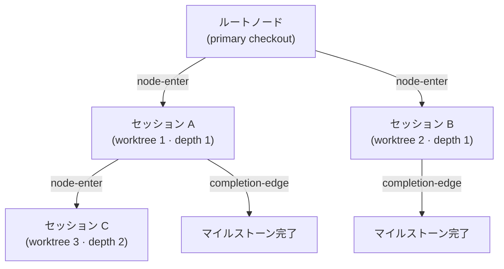
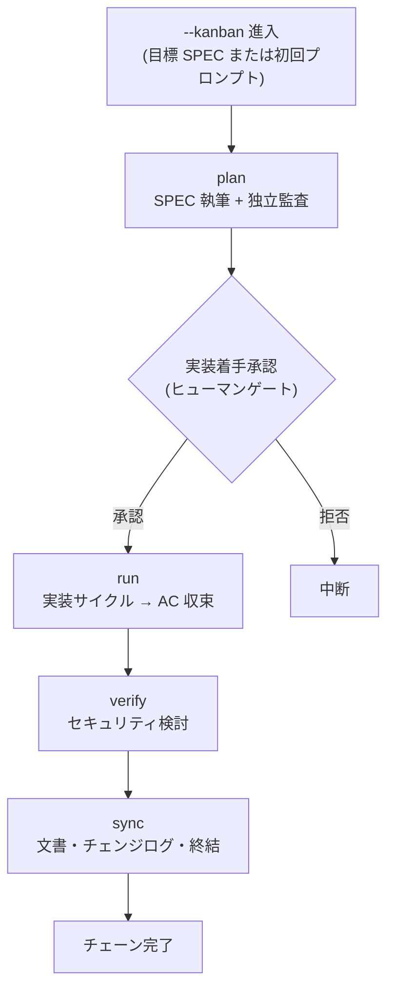



# カンバンモード (Kanban Mode)


 <strong>所属価値</strong>: エージェンティックループエンジニアリング · マルチセッションオーケストレーション

<!-- @value: self-learning, multi-session-orchestration -->

カンバンモードは、一度に1つの SPEC を単一セッションで押し進めていた旧モデルから、**マルチセッションボード**へ進化する方向を示します。ボードのリードセッションが1つ指揮し、複数の run セッションがそれぞれの worktree で同時に働き、完了したカードがボードを伝って流れていきます。そのボードの骨格が Origin-Trail Chain です。

セッションランチャーに `--kanban`（短く `-k`）スイッチを付けて開始します。新しいサブコマンドでも、新しいランタイムでもありません — カンバンチェーン（`kanban_chain`）というゴールプリセット（完了条件をあらかじめ決めておいた束）が載る進入契約にすぎません。チェーンの4段階（plan → run → verify → sync）とヒューマンゲートは、既存の `/moai goal` エンジンと `full-pipeline` チェイニング規則をそのまま継承します。

このページは、カンバンモードの進入条件、Origin-Trail Chain 設計、チェーン段階、そして「何が自動化されないのか」までを扱います。ワークフローコマンド観点の短い紹介は、[`/moai` 統合コマンド](/ja/workflow-commands/)を先にご覧ください。

## なぜ「カンバン」なのか


**比喩**: カンバンボードの各カードは1つの worktree セッションです。カードがボードの上を流れるように、セッションがチェーンを伝って流れます。


旧モデルでは、1つの SPEC を1つのセッションが最初から最後まで担いました — plan を書き、run で実装し、verify で検討し、sync で文書を整理します。SPEC が大きくなると1つのセッションでは捌ききれず、コンテキストウィンドウの限界にぶつかればセッションを分ける必要があります。

カンバンモードはこの構造を**ボード観点**に変えます:

- **リードセッション**が1つ、plan を書き進行を調整します。
- **run セッション**が複数、それぞれの worktree で並列に実装します。
- 各セッションはボードの**カード**で、カードは段階を経て流れていきます。

このマルチセッションボードが動作するには、「このセッションはどこから来たのか」「親セッションは生きているか」「どこまで終えたか」を失ってはなりません。この役割を **Origin-Trail Chain** が担います。

## Origin-Trail Chain — 設計方向

Origin-Trail Chain は、マルチセッション worktree 系譜（lineage）を追跡する append-only ツリーです。各 worktree セッションがノードになり、親-子エッジが「このセッションはあのセッションから分かれた」を記録します。

### append-only JSONL イベントストリーム

チェーンは `.moai/state/chain/events.jsonl` に保存されます。すべての書き込みは `O_APPEND` で1行ずつ追記します — 上書きも、切り取りもしません。カーネルが同時 append を直列化するため、複数のセッションが同時に書いても1行が別の行を壊しません。



3つのイベントタイプがストリームに記録されます:

| イベント | 記録時点 | 内容 |
|--------|-----------|------|
| `node-enter` | worktree スポーン時点 | ノード ID、親ノード、深さ、系譜チェーン、worktree パス、SPEC ID、進入時刻 |
| `node-update` | 子 SessionStart またはマイルストーン完了 | セッション ID の backfill、またはマイルストーン状態更新 |
| `completion-edge` | セッション終了（SubagentStop フック） | 親-子ノード、完了したマイルストーン、次の再開ゴール |

イベントストリームは**フラットな（flat）ファイル**ですが、読み取り時に `BuildNodes()` がイベントを再生して現在のノード状態を導出します。変更可能な（mutable）ツリーファイルは存在しません。

### WorktreeNode — 13フィールド

各ノードは読み取り時に13フィールドを持つ状態ビューに再構成されます:

| フィールド | 意味 |
|------|------|
| `node_id` | 単調ソート可能な一意 ID（ミリ秒タイムスタンプ + 乱数） |
| `parent_node_id` | スポーンした親ノード。ルートなら空値 |
| `depth` | ネスト深さ。primary checkout が0、最初の worktree が1 |
| `origin_chain` | ルートからこのノードまでの ID 経路（探索なしで O(1) 系譜照会） |
| `worktree_path` | worktree 絶対パス |
| `session_id` | ランタイムが割り当てた Claude Code セッション ID（two-phase backfill で埋まる） |
| `spec_id` | このノードが作業する SPEC 識別子 |
| `milestone` | 現在のマイルストーンラベル |
| `entered_at` | ノード生成時刻（RFC 3339） |
| `exited_at` | セッション終了時刻。ハートビート古びから導出（exit イベントではない） |
| `last_completed_milestone` | 直近で完了マークされたマイルストーン |
| `resume_target` | 再開時にやるべきことの1行説明 |
| `resume_command` | 再開時に実行する単一コマンド |

### CWD 衝突の解決

同じ worktree パスを再利用するセッション同士が衝突しうります — worktree を消して同じパスに再作成すると、2つのセッションが同じ `worktree_path` を持ちます。チェーンは `(worktree_path, session_id)` の組でこれを区別します:

1. **一次キー**: `(worktree_path, session_id)` の組で正確に一致するノードを探します。
2. **fallback**: `session_id` が空、または一致するノードがなければ、そのパスで最も最近進入したノードに帰着します。

このメカニズムが `/clear` 後にセッションを再開するとき「このパスの現在のノードは何か」を正確に復元します。

### 2つの核心問題と解決

Origin-Trail Chain が解く2つの問題があります:

**深さ健忘（depth amnesia）** — 深くネストした worktree で `/clear` 後に再進入すると、「このセッションの祖先は誰か」を失います。grep やスクロールバック考古学で復元する必要がありました。チェーンは `origin_chain` フィールドにルートからリーフまでの全 ID 経路を非正規化（denormalize）しておき、探索なしで O(1) に系譜を復元します。

**dead leader socket** — リードセッションが死んだのに、子セッションがその事実を知らない状態です。子は死んだリーダーを待ったまま止まっています。チェーンは `completion-edge` イベントでセッション終了を記録するため、ハートビート古び（`exited_at` 導出）とともに子が親の状態を検出できます。

### 深さ上限（depth ceiling）

無限に深くネストするセッションツリーは複雑度を制御不能にします。チェーンは深さに上限を置き複雑度を管理します — 上限を超えればより深いスポーンを拒否し、より浅い階層で作業するよう誘導します。

### セッション ID two-phase backfill

worktree をスポーンする時点ではまだセッション ID を知りません — Claude Code ランタイムが子プロセスを起動した後にセッション ID を割り当てるからです。そこで2段階に分けます:

1. **スポーン時点**: `node-enter` イベントを append するが `session_id` は空値のままにします。このとき `MOAI_CHAIN_NODE_ID` 環境変数で子プロセスにノード ID を渡します。
2. **子 SessionStart**: ランタイムがセッション ID を割り当てたら、`node-update` イベントで `session_id` を backfill します。

このプロトコルのおかげで、スポーン時点とセッション ID 割り当て時点の間の隙間を埋められます。

## 現在の実装状態


Origin-Trail Chain は現在 **Phase 1**（internal/chain/ パッケージ — append-only JSONL ストア層）までマージされています。

`moai chain` / `moai kanban` CLI 表面とマルチセッションボードのリード/ランカラムは後続フェーズで導入予定です。この文書は rename 後の目標状態を説明します — まだ動作しない機能を「すでに動作する」と記述しません。


Phase 1 が提供するもの:

- `internal/chain/store.go` — append-only JSONL writer/reader。`O_APPEND` で1行ずつ追記し、corrupt line を skip + warn で飛ばします。
- `internal/chain/node.go` — `WorktreeNode`（13フィールド）+ `ChainEvent` 型定義。
- `internal/chain/populate.go` — `Populator`: スポーン時点ノード生成、セッション ID backfill、マイルストーン更新、completion-edge 記録、現在ノード解釈。
- `GenerateNodeID` — 単調タイムスタンプ + 乱数で外部依存なしに ID 生成。

Phase 1 がまだ提供しないもの:

- `moai chain status` / `moai chain lineage` / `moai kanban` CLI コマンド
- マルチセッションボードのリード/ランカラム表面
- `--kanban` / `-k` ランチャースイッチの実際の配線

## カンバンモードでセッションを開く


**スラッシュコマンドではありません**: カンバンモードは Claude Code 対話窓の `/` コマンドではなく、セッションそのものを開くスイッチです。端末でセッションを開始するときに付けます。


端末でセッションランチャーに `--kanban` を付けて開始します。SPEC 識別子を同時に与えればその SPEC を目標とし、落とせば初回プロンプトで plan-phase を始めます。

```bash
# SPEC を目標にカンバンチェーン進入
$ claude --kanban SPEC-AUTH-001

# 短い形式
$ claude -k SPEC-AUTH-001

# 目標 SPEC なし — 初回プロンプトで plan 開始
$ claude --kanban

# moai cc ランチャーで同じ進入
$ moai cc -k SPEC-AUTH-001
```

進入が成功すると、ランチャーはセッションの中に `kanban_chain` ゴールプリセットを（実装着手承認が出た後に）武装します。ゴールプリセットは `stop-goal` Stop-フック評価器が毎ターンの終わりに評価する完了条件です — 新しいランタイムや新しいフックではなく、すでにある機械の上に条件を1つ載せたものです。

## チェーン段階

カンバンチェーンは `full-pipeline` 契約（1つの SPEC に対し run → sync の自動チェーンを結ぶ約定）を拡張します。4つの段階が順に進みます:



各段階の詳細手順は既存のチェイニング規則を継承します:

- **plan** — SPEC 文書を執筆し、独立監査（plan-auditor）が内容を検証します。[`/moai plan`](/ja/workflow-commands/moai-plan) 参照。
- **run** — 実装サイクル（TDD または DDD）が受容基準（AC）に収束するまでコードを実装します。[`/moai run`](/ja/workflow-commands/moai-run) 参照。
- **verify** — `/moai review --security --deep --repo` でセキュリティ検討結果を出します。重要度に応じて run に戻るか sync に進みます。
- **sync** — 文書を更新し、チェンジログを書き、フェーズを終結します。[`/moai sync`](/ja/workflow-commands/moai-sync) 参照。

カンバンモードが新しく載せるのは**マルチセッションボード観点**です — リードセッションが調整し、run セッションが並列に働き、Origin-Trail Chain がその系譜を追跡します。チェーン段階そのものの詳細規則は `/moai` 統合コマンドと `/moai goal` を参照してください。

## いつ使い、いつ使わないか


**1 SPEC、1セッション（現在）、マルチセッションボード（目標）。** カンバンモードの設計方向はマルチセッションボードですが、現在の実装は Phase 1（ストア層）に留まっています。


**使うとき** — 複数の worktree セッションで1つの SPEC（または複数 SPEC）を同時に進めるとき。Origin-Trail Chain でセッション系譜を追跡する必要があるとき。1つの SPEC を終了まで一気に押し切るとき。

**使わないとき** — フェーズごとに人が直接判断しながら中間産物を検討したいとき（この場合は通常の `plan → run → sync` をターン単位で進めてください）。1〜2ターンで終わる短い作業。混合バックエンド（`moai cg`）を使わなければならないとき。

## 範囲境界

このページがしないことを明示します:

- **新しいサブコマンドではありません** — `--kanban` はランチャースイッチであって、`/moai kanban` のような対話コマンドではありません。
- **ヒューマンゲートを飛ばしません** — 実装着手承認、事前品質ゲート、文書範囲ゲートはそのまま発火します。チェーンが自動的に流れても各ゲートで人の承認が必要です。
- **対応しないバックエンド** — 混合バックエンドランチャーである `moai cg` ではカンバンモードが拒否されます。`moai cg` はあるバックエンドでリーダーを、別のバックエンドでチームメイトを回しますが、これはチェーンが前提とする「1セッション / 1バックエンド / 1チェーン」に矛盾するからです。拒否センチネルとともにセッションは開かれません。

## 関連文書

- [`/moai` 統合コマンド](/ja/workflow-commands/) — ワークフローコマンド観点の短い紹介
- [`/moai goal`](/ja/workflow-commands/moai-goal) — カンバンチェーンを駆動するゴールエンジン
- [自律連続ループ](/ja/advanced/autonomous-loops) — `/moai goal`, `/moai loop`, ネイティブ `/goal` の所有権とガードレール比較
- [`/moai run`](/ja/workflow-commands/moai-run) — run-phase 自律性配線、カンバンチェーンの run 段階が継承する規則
- [ハーネスエンジニアリング](/ja/core-concepts/harness-engineering) — フェーズチェイニングと観察がハーネス設計の上でどう位置づいたか
- [ステータスライン](/ja/advanced/statusline) — セッション系譜と worktree 状態がステータスラインにどう表示されるか
