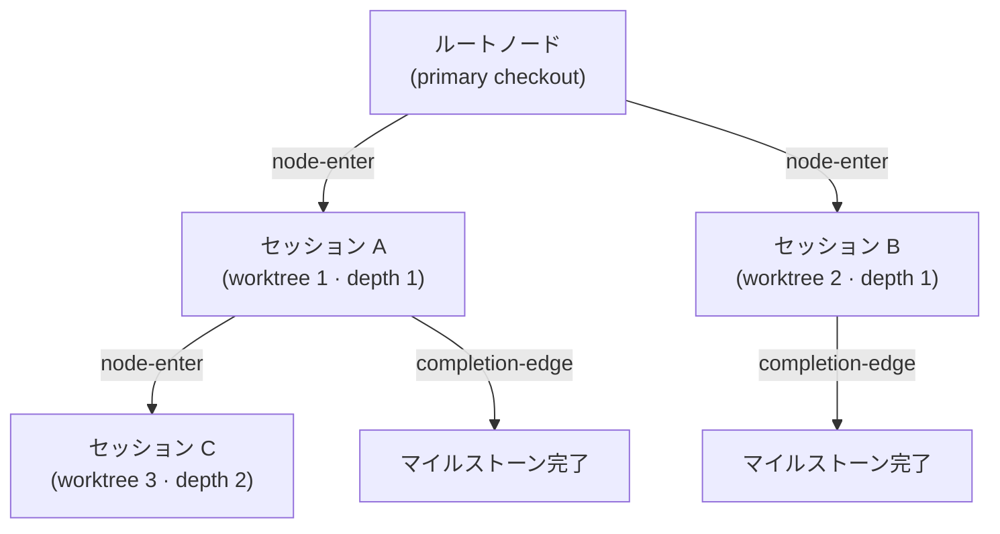
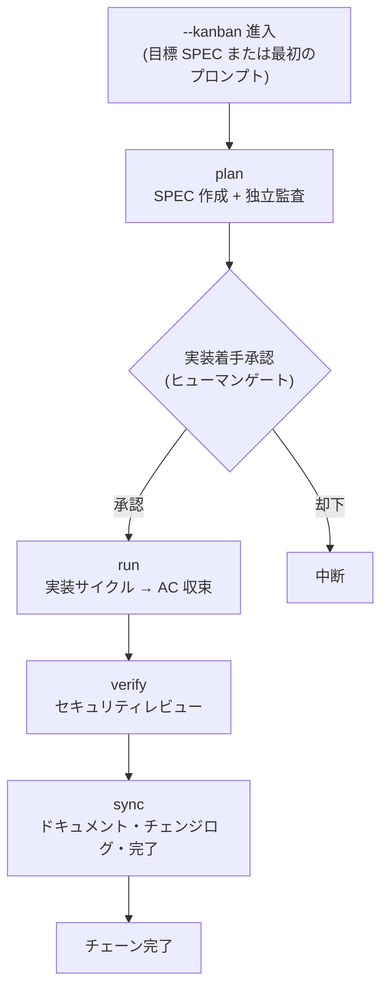



# カンバンモード (Kanban Mode)


 <strong>属する価値</strong>: エージェンティックループエンジニアリング · マルチセッションオーケストレーション

<!-- @value: self-learning, multi-session-orchestration -->

カンバンモードは、一度にひとつの SPEC を単一セッションで進めていた旧モデルを**マルチセッションボード**に置き換えます。リードセッションがひとつ指揮を執り、同伴セッションがそれぞれの worktree で同時に作業し、完了したカードがボードを流れていきます。そのボードの骨格が Origin-Trail Chain です。

セッションランチャーに `--kanban`(短縮形 `-k`)スイッチを付けて開始します。新しいサブコマンドでも新しいランタイムでもありません — カンバンチェーン(`kanban_chain`)というゴールプリセット(完了条件をあらかじめ定めた束)が乗るための進入契約にすぎません。チェーンの4段階(plan → run → verify → sync)とヒューマンゲートは、既存の `/moai goal` エンジンと `full-pipeline` チェーニング規則をそのまま継承します。

このページでは、カンバンモードの進入条件、Origin-Trail Chain の設計、チェーンの段階、そして「何が自動化されていないか」までを扱います。ワークフローコマンド視点の短い紹介は、[`/moai` 統合コマンド](/ja/workflow-commands/)を先に参照してください。

## なぜ「カンバン」なのか


**比喩**: カンバンボードの各カードはひとつの worktree セッションです。カードがボード上を流れるように、セッションがチェーンを流れます。


旧モデルでは、ひとつの SPEC をひとつのセッションが最初から最後まで担当していました — plan を書き、run で実装し、verify でレビューし、sync でドキュメントを整えます。SPEC が大きくなると単一セッションでは支えきれず、コンテキストウィンドウの限界に当たるとセッションを分割する必要がありました。

カンバンモードはこの構造を**ボード視点**に変えます:

- **リードセッション**がひとつ plan を書き、進行を調整します。
- **run セッション**が複数、それぞれの worktree で並列に実装します。
- 各セッションはボードの**カード**であり、カードは段階を経て流れていきます。

このマルチセッションボードが動くには、「このセッションはどこから来たのか」「親セッションは生きているか」「どこまで終えたか」を失わないことが必要です。この役割を **Origin-Trail Chain** が担います。

## Origin-Trail Chain — 設計方針

Origin-Trail Chain は、マルチセッション worktree の系譜(lineage)を追跡する append-only ツリーです。各 worktree セッションがノードになり、親子エッジが「このセッションはあのセッションから分岐した」を記録します。

### append-only JSONL イベントストリーム

チェーンは `.moai/state/chain/events.jsonl` に保存されます。すべての書き込みは `O_APPEND` で一行ずつ追記されます — 上書きも切り詰めもありません。カーネルが同時 append を直列化するため、複数セッションが同時に書いても一行が別の行を壊すことはありません。



3種類のイベントタイプがストリームに記録されます:

| イベント | 記録タイミング | 内容 |
|--------|-----------|------|
| `node-enter` | worktree スポーン時 | ノード ID、親ノード、深さ、系譜チェーン、worktree パス、SPEC ID、進入時刻 |
| `node-update` | 子 SessionStart またはマイルストーン完了 | セッション ID の backfill またはマイルストーン状態の更新 |
| `completion-edge` | セッション終了(SubagentStop フック) | 親子ノード、完了したマイルストーン、次の再開目標 |

イベントストリームは**フラットなファイル**ですが、読み込み時に `BuildNodes()` がイベントを再生して現在のノード状態を導出します。可変(mutable)なツリーファイルは存在しません。

### WorktreeNode — 13フィールド

各ノードは読み込み時に13フィールドを持つ状態ビューとして再構成されます:

| フィールド | 意味 |
|------|------|
| `node_id` | 単調ソート可能な一意 ID (ミリ秒タイムスタンプ + 乱数) |
| `parent_node_id` | スポーンした親ノード。ルートなら空 |
| `depth` | ネストの深さ。primary checkout が 0、最初の worktree が 1 |
| `origin_chain` | ルートからこのノードまでの ID 経路 (探索なしで O(1) の系譜照会) |
| `worktree_path` | worktree の絶対パス |
| `session_id` | ランタイムが割り当てる Claude Code セッション ID (two-phase backfill で埋まる) |
| `spec_id` | このノードが作業する SPEC 識別子 |
| `milestone` | 現在のマイルストーンラベル |
| `entered_at` | ノード生成時刻 (RFC 3339) |
| `exited_at` | セッション終了時刻。ハートビートの鮮度から導出 (exit イベントではない) |
| `last_completed_milestone` | 最後に完了マークされたマイルストーン |
| `resume_target` | 再開時にすべきことの一行説明 |
| `resume_command` | 再開時に実行する単一コマンド |

### CWD 衝突の解決

同じ worktree パスを再利用するセッション同士が衝突することがあります — worktree を消して同じパスに再作成すると、2つのセッションが同じ `worktree_path` を持ちます。チェーンは `(worktree_path, session_id)` のペアでこれを区別します:

1. **一次キー**: `(worktree_path, session_id)` ペアに正確に一致するノードを探します。
2. **fallback**: `session_id` が空か一致するノードがなければ、そのパスに最後に進入したノードに解決します。

このメカニズムにより、`/clear` 後にセッションを再開する際「このパスの現在のノードは何か」を正確に復元できます。

### 二つの核心問題と解決

Origin-Trail Chain が解く二つの問題があります:

**深さの健忘 (depth amnesia)** — 深くネストした worktree で `/clear` 後に再進入すると、「このセッションの祖先は誰か」が失われます。grep やスクロールバック考古学で復元する必要がありました。チェーンは `origin_chain` フィールドにルートからリーフまでの完全な ID 経路を非正規化(denormalize)して保持するため、探索なしで O(1) で系譜を復元します。

**dead leader socket** — リードセッションが死んでいるのに子セッションがそれを知らない状態です。子は死んだリーダーを待ったまま止まっています。チェーンは `completion-edge` イベントでセッション終了を記録するため、ハートビートの鮮度(`exited_at` 導出)と合わせて、子が親の状態を検知できます。

### 深さの上限 (depth ceiling)

無限に深くネストするセッションツリーは複雑度を制御不能にします。チェーンは深さに上限を設けて複雑度を管理します — 上限を超えるとそれ以上深いスポーンを拒否し、より浅い階層で作業するよう誘導します。

### セッション ID two-phase backfill

worktree をスポーンする時点ではまだセッション ID が分かりません — Claude Code ランタイムが子プロセスを起動した後にセッション ID を割り当てるためです。そこで2段階に分けます:

1. **スポーン時**: `node-enter` イベントを append しますが `session_id` は空のままにします。このとき `MOAI_CHAIN_NODE_ID` 環境変数で子プロセスにノード ID を渡します。
2. **子 SessionStart**: ランタイムがセッション ID を割り当てたら、`node-update` イベントで `session_id` を backfill します。

このプロトコルのおかげで、スポーン時点とセッション ID 割り当て時点の間の隙間を埋められます。

## 現在の実装状態

v3.1 では、カンバンモードの進入経路は最後までつながっています。ただし表面ごとに完成度が異なるため、今コマンドで触れるものと、まだライブラリ層にしかないものを区別しておきます。

### 今コマンドで触れるもの

- **`-k` / `--kanban` ランチャースイッチ** — `moai cc` と `moai glm` の両方に配線されています。引数なし(または SPEC 識別子と一緒)に渡すとリードとして進入し、`-k --name <ロール>-<run-id>` 形式で渡すと、すでに開いているランに同伴セッションとして合流します。混合バックエンドランチャーの `moai cg` はセンチネルとともに拒否します。
- **ブートストラップ案内** — リードセッションが開くと、SessionStart フックがラン識別子と4つの同伴セッション実行コマンド(`moai cc -k --name plan-<run-id>` など)をユーザーの言語で出力します。同伴セッションに届く案内は、どのランに合流したかだけを伝えます。合流したロールは案内には含まれず、セッションレコードに別途記録されます。
- **セッションレコード** — 進入したセッションのロール・バックエンド・対象 SPEC が記録されます。
- **`moai chain` CLI** — `status`(現在のノード要約)、`lineage`(ルートからリーフまでの系譜)、`back`(親ノードの再開目標とコマンド)、`list`(全ノードと鮮度)、`prune`(終了した古いノードをアーカイブに畳む)の5つのサブコマンドが動作します。下記の `internal/chain/` 保存層がその背後にあります。
- **ディスパッチ** — カードを列の間で動かす主体はリードセッションのオーケストレーターです。規約は `.claude/rules/moai/workflow/kanban-dispatch.md` にあり、同伴セッションは人が各ターミナルで直接実行します。セッションが別のセッションを起動する経路はありません。

### チェーン保存層

- `internal/chain/store.go` — append-only JSONL writer/reader。`O_APPEND` で一行ずつ追記し、壊れた行は skip + warn で読み飛ばします。
- `internal/chain/node.go` — `WorktreeNode`(13フィールド) + `ChainEvent` 型定義。
- `internal/chain/populate.go` — `Populator`: スポーン時ノード生成、セッション ID backfill、マイルストーン更新、completion-edge 記録、現在ノード解釈。
- `GenerateNodeID` — 単調タイムスタンプ + 乱数で、外部依存なしに ID 生成。

### まだ呼び出し元がないもの

`internal/kanban/` の**ボード状態ストア**は、コードとしては完成しています — 6列の閉じた列挙(backlog → plan → run → review → sync → done)、primary checkout の一点に収束する単一起点状態ファイル、ファイルロック、破損復旧、SPEC フロントマター状態との調整(不一致を修正せず表示だけ行う)まであります。しかし、これを読み書きするプロダクションの呼び出し元がまだありません。つまり列位置はファイルではなくリードセッションの記憶と SPEC 状態で維持され、ボードを照会したりカードを動かしたりする CLI 動詞は存在しません。


 **`moai kanban` というコマンドは存在しません。** カンバンモードの CLI 表面は、ランチャースイッチ `-k` と系譜照会コマンド `moai chain` だけです。


## カンバンモードでセッションを開く


**スラッシュコマンドではありません**: カンバンモードは Claude Code チャットの `/` コマンドではなく、セッションそのものを開くスイッチです。ターミナルでセッションを開始するときに付けます。


ターミナルで MoAI ランチャー(`moai cc` または `moai glm`)に `--kanban`(短縮形 `-k`)を付けて開始します。SPEC 識別子を一緒に渡すとその SPEC を目標にし、省略すると最初のプロンプトで plan フェーズを開始します。

```bash
# リードとして進入 — SPEC を目標にカンバンチェーン開始
$ moai cc --kanban SPEC-AUTH-001

# 短縮形
$ moai cc -k SPEC-AUTH-001

# 目標 SPEC なし — 最初のプロンプトで plan 開始
$ moai cc -k

# GLM バックエンドでも同じ進入
$ moai glm -k SPEC-AUTH-001
```

リードセッションが開くと、ラン識別子とともに4つの同伴セッション実行コマンドが出力されます。それぞれを**人が別々のターミナルで**直接実行してボードを埋めます。

```bash
# 同伴セッション — リードが伝えた run-id で合流
$ moai cc -k --name plan-<run-id>
$ moai cc -k --name run-<run-id>
$ moai cc -k --name review-<run-id>
$ moai cc -k --name sync-<run-id>
```

進入が成功すると、ランチャーはセッション内に `kanban_chain` ゴールプリセットを(実装着手承認が出た後に)武装します。ゴールプリセットとは、`stop-goal` Stop フック評価器が毎ターン終了時に評価する完了条件です — 新しいランタイムでも新しいフックでもなく、すでにある機械の上に条件をひとつ載せたものです。

## 5つのターミナルで回すひとつのラン

`moai cc -k` でリードを開くと、ラン識別子とともに同伴セッションごとに実行コマンドをひとつずつ表示します。運営者はそれを**それぞれ自分のターミナルで**開き、5セッションのランを完成させます — リードが指図し、plan · run · review · sync がそれぞれの worktree で作業します。


カードはこう流れます。リードが `plan` セッションに作成を指示し、`run` セッションがその計画から実装を引き継ぎ、`review` セッションが実装を検査し、`sync` セッションがコードを SPEC と突き合わせて整えコミットします。各ディスパッチは、リードがそのフェーズの進行証拠を読んで確認した後にはじめて行われます。


**なぜこの形か — 役割ごとのバックエンド。** 設計と指揮は Opus、実装は GLM で動かします。同伴セッションを開くとき `moai cc -k --name ...` の代わりに `moai glm -k --name ...` を使うと、そのセッションは GLM バックエンドで合流します。高価なモデルは判断が必要な席にだけ置き、実装の分を安いバックエンドに流すこの配分が、マルチセッションランのトークンコストを持続可能にする核心です。セッション同士はメッセージをやり取りし、セッション間メッセージングは注入された `--settings` を通じて自動的に許可されています。


スクリーンショットのステータスラインに見えるモデルラベルは、撮影時のひとりの運営者のセッション構成を反映したもので、配布既定値ではありません。

## チェーンの段階

カンバンチェーンは `full-pipeline` 契約(ひとつの SPEC に対して run → sync の自動チェーンを結ぶ約定)を拡張します。4段階が順に進みます:



各段階の詳細な手順は、既存のチェーニング規則を継承します:

- **plan** — SPEC ドキュメントを作成し、独立監査(plan-auditor)が内容を検証します。[`/moai plan`](/ja/workflow-commands/moai-plan) 参照。
- **run** — 実装サイクル(TDD または DDD)が受入基準(AC)に収束するまでコードを実装します。[`/moai run`](/ja/workflow-commands/moai-run) 参照。
- **verify** — `/moai review --security --deep --repo` でセキュリティレビュー結果を出します。重大度に応じて run に戻るか sync に進みます。
- **sync** — ドキュメントを更新し、チェンジログを書き、フェーズを完了させます。[`/moai sync`](/ja/workflow-commands/moai-sync) 参照。

カンバンモードが新しく載せるのは**マルチセッションボード視点**です — リードセッションが調整し、run セッションが並列に作業し、Origin-Trail Chain がその系譜を追跡します。チェーン段階自体の詳細な規則は、`/moai` 統合コマンドと `/moai goal` を参照してください。

## いつ使うか、使わないか


**リードひとつ、同伴4つ。** 進入とディスパッチは v3.1 で動作します。ただし、列位置をファイルで保持するボード状態ストアにはまだ呼び出し元がなく、カードの現在位置はリードセッションと SPEC 状態が維持します。


**使うとき** — 複数の worktree セッションでひとつの SPEC(または複数の SPEC)を同時に進めるとき。Origin-Trail Chain でセッション系譜を追跡する必要があるとき。ひとつの SPEC を完了まで一気に進めるとき。

**使わないとき** — フェーズの間ごとに人が直接判断しながら中間成果物をレビューしたいとき(この場合は通常の `plan → run → sync` をターン単位で進めてください)。1〜2ターンで終わる短い作業。混合バックエンド(`moai cg`)を使わなければならないとき。

## スコープの境界

このページがしないことを明示します:

- **新しいサブコマンドではありません** — `--kanban` はランチャースイッチであり、`/moai kanban` のような対話コマンドではありません。
- **ヒューマンゲートをスキップしません** — 実装着手承認、事前品質ゲート、ドキュメント範囲ゲートはそのまま発火します。チェーンが自動的に流れても、各ゲートで人の承認が必要です。
- **サポートしないバックエンド** — 混合バックエンドランチャーの `moai cg` ではカンバンモードが拒否されます。`moai cg` はひとつのバックエンドでリーダーを、別のバックエンドでチームメンバーを動かしますが、これはチェーンが前提とする「ひとつのセッション / ひとつのバックエンド / ひとつのチェーン」に矛盾するためです。拒否センチネルとともに、セッションは開きません。

## 関連ドキュメント

- [`/moai` 統合コマンド](/ja/workflow-commands/) — ワークフローコマンド視点の短い紹介
- [`/moai todo`](/ja/utility-commands/moai-todo) — ボードにカードを入れるバックログキュー
- [`/moai goal`](/ja/workflow-commands/moai-goal) — カンバンチェーンを駆動するゴールエンジン
- [自律連続ループ](/ja/advanced/autonomous-loops) — `/moai goal`、`/moai loop`、ネイティブ `/goal` の所有権とガードレールの比較
- [`/moai run`](/ja/workflow-commands/moai-run) — run フェーズ自律性の配線。カンバンチェーンの run 段階が継承する規則
- [ハーネスエンジニアリング](/ja/core-concepts/harness-engineering) — フェーズチェーニングと観測がハーネス設計の上でどう位置づくか
- [ステータスライン](/ja/advanced/statusline) — セッション系譜と worktree 状態がステータスラインにどう表示されるか
