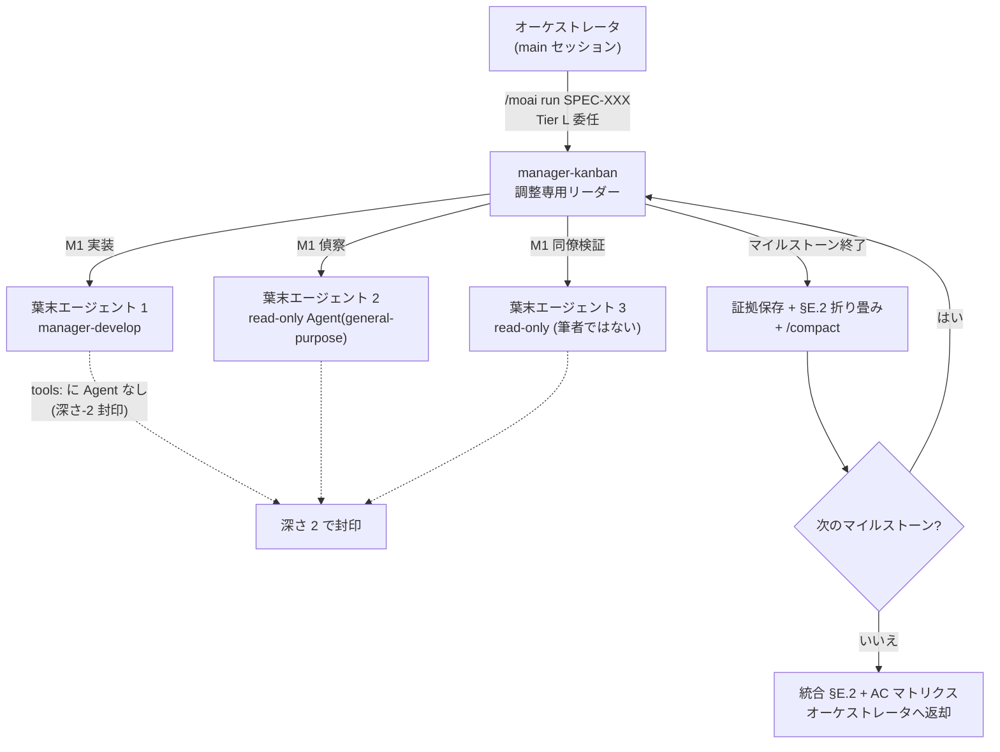




 <strong>所属価値</strong>: エージェンティックループエンジニアリング · エージェンティックハーネス

<!-- @value: self-learning, agentic-harness -->

規模の大きなSPEC(要件仕様書)1つを実装していると、必ず2つの限界にぶつかります。1つはコンテキスト窓です。マイルストーン(SPECの中の順序段階)を5つ超えると、実装の初期に読んだファイルの内容とエージェント(自ら働くAIアシスタント)の出力が積もり、ある瞬間に`/clear`なしでは進めない地点に至ります。もう1つは信頼です。実装を任されたエージェントが「受入基準を通過した」と自ら報告するとき、その報告を検証する独立した目が傍になければ、私たちはその言葉を信じるしかありません。

`manager-kanban`はこの2つの限界を同時に扱うためにv3.1で新しく入った、12番目の管理者エージェント(エージェントたちを調整するエージェント)です。オーケストレータがTier L規模のSPECを`manager-kanban`に預けると、このエージェントはマイルストーンごとにコンテキストを折り畳み(Context-Folding)窓を軽く保ち、通過した受入基準(AC — 完了判定の基準)ごとに同僚の交差検証(peer cross-validation)を回し、1つの窓の中で最後まで行けるようにします。コードを直接には書かず、調整だけを行います。

このページは高度なページです。階層構造、進入条件、マイルストーンごとのコンテキスト折り畳み、同僚検証、そして「何が変わらないのか」までを、もう1枚深く扱います。

## このページが扱うこと

`manager-kanban`は単一のエージェントではなく、1つの作業**形状**です。この形状は5つの軸から成ります。

1. **調整専用リーダー** — `manager-kanban`はコードを書かず、SPEC本文も直さず、ユーザーに直接質問を投げもしません。
2. **深さ-2の封印** — 管理者エージェントたちの中で`Agent`ツールを持つのは`manager-kanban`だけで、その下に呼ばれる葉末エージェントたちは再び`Agent`を持てません。
3. **マイルストーンごとのコンテキスト折り畳み** — マイルストーンが終わるごとに証拠をファイルに残し`progress.md`に1行要約を書いたあと、`/compact`で窓を空けます。
4. **同僚の交差検証** — 筆者ではない2番目のエージェントが同じコマンドを再び回し、AC通過判定を確認します。
5. **スキーマ駆動ファンアウト** — 偵察エージェントが決められた見出し形式で戻れば、リーダーは機械的に繋ぎ合わせます。

5つの軸が揃ってはじめて「階層型チーム」と呼べる作業の流れが立ちます。

## なぜ必要か

Tier L規模のSPECを順次モード(Mode 5)で実装すると、オーケストレータは`manager-develop`エージェントをマイルストーンごとに順に呼びます。この流れはほとんどの場合にうまく合いますが、SPECが大きくなると2つの現象が現れます。

まずコンテキストが詰まります。実装の初期に読んだファイル、第1マイルストーンで書いたテスト、AC検証コマンドの出力が1つの窓の中に常に残ります。第5マイルストーンあたりに行くと窓がほぼ埋まり、結局`/clear`して続けるにはそれまでの進捗を要約版で受け取らなければなりません。この要約版の隙間から文脈がぼやけるコストが累積します。

次に自己報告の限界が露わになります。エージェントが「AC-003 通過」と報告したとき、その判定の根拠となるコマンド出力をオーケストレータがいちいち再確認しなければ、誤った報告はsync段階になってようやく見つかります。途中で捕まえれば安い欠陥が最後まで行ってしまいます。

`manager-kanban`はこの2つの現象にそれぞれ応じます。コンテキストはマイルストーン境界で折り畳んで窓を軽く保ち、AC判定はその場で筆者ではない同僚エージェントが再確認します。だからTier L実行が1つのセッションの中で最後まで生き残り、「通過した」という言葉が構造的に検証された状態で次のマイルストーンへ進みます。

## 階層構造を一目で見る



図で注意深く見るべきは矢印の方向です。オーケストレータは`manager-kanban`までしか呼ばず、その下の葉末エージェントを呼ぶのは`manager-kanban`だけです。葉末エージェントは再びエージェントを呼べません(点線が指す封印)。これが「深さ-2の封印」であり、階層が無限に深くなるのを防ぐ構造的な安全網です。

## Step 1 — 進入条件が合うか確認する

`manager-kanban`はすべての実行に既定で敷かれる経路ではありません。オーケストレータはSPECが次の3条件を**すべて**満たすときだけ`manager-kanban`に作業を預けます。3条件のうち1つでも欠ければ、標準の順次モード(Mode 5)のまま進みます。

| 条件 | 基準 | なぜ必要か |
|------|------|------------|
| マイルストーン数 | ≥ 3個 | 折り畳み効果が累積するには最低3つの境界が要る |
| ファイル数 | ≥ 10個 | 規模が小さければ順次モードがより安い |
| ドメインの広がり | 交差ドメインのファンアウト | 偵察が複数領域に分かれるときスキーマ統合が光る |

この3条件は「1つでも真ならば」ではなく「すべて真でなければ」です。1つのドメインに触れる10ファイルの単一マイルストーンリファクタは条件が1つ欠けて見えますが、実際には3つとも合わないので`manager-kanban`経路に入りません。意図された設計です — 順次モードのほうが安く速いからです。

オーケストレータは`manager-kanban`を呼ぶ前に、この選択を`progress.md`の`§F Phase 4 Mode Selection`欄に記録します。ユーザーはこの記録をgrepして、現在の実行がどちらの経路に行ったかを確認できます。

```bash
# 現在のSPECが manager-kanban 経路に行ったか progress.md で確認
grep -A 2 "Mode Selection" .moai/specs/SPEC-EXAMPLE-001/progress.md | grep -i "manager-kanban"
```

## Step 2 — manager-kanban に Tier L 実行を任せる

オーケストレータが`manager-kanban`を呼ぶと、`manager-kanban`はSPEC識別子とマイルストーン地図、ACマトリクスを受け取ります。ここから役割分担が明確になります。

- **オーケストレータ** — ユーザーゲートを守り、`manager-kanban`が返す統合結果を受け取ってsync段階へ進めます。
- **manager-kanban** — マイルストーンごとに葉末エージェントを呼び、コンテキストを折り畳み、同僚検証を回します。コードを直接には書かず、SPEC本文も直しません。`AskUserQuestion`を直接呼びもしません — 詰まるものがあればブロッカー報告(blocker report)をオーケストレータに返します。
- **葉末エージェント** — `manager-develop`で実装するか、読み取り専用`Agent(general-purpose)`で偵察するか、筆者ではない同僚エージェントとしてAC検証を再び回します。

この分担で最も目を引くのは、`manager-kanban`だけが`Agent`ツールを持つことです。12の管理者エージェントのうち`Agent`ツールを持つのは`manager-kanban`だけで、他の管理者エージェントはすべて`Agent`を外したツール一覧で平坦階層を保ちます。平坦階層をただ1箇所で開く代わりに、その下の葉末エージェントは再び`Agent`を持てないように封じて、階層が2段を超えないようにします。これが「深さ-2の封印」です。

```text
# manager-kanban が葉末エージェントを呼ぶときのツール一覧 (概念例)
manager-kanban:         [Read, Write, Edit, Grep, Glob, Bash, TaskCreate, TaskUpdate, TaskList, TaskGet, Agent, Skill]
葉末 manager-develop: [Read, Write, Edit, Grep, Glob, Bash, TaskCreate, TaskUpdate, TaskList, TaskGet, Skill]  ← Agent なし
葉末 read-only 検証:  [Read, Grep, Glob, Bash]  ← Write/Edit/Agent なし
```

ここで`manager-kanban`の`Write`と`Edit`は調整用途にだけ使われます。つまり`progress.md`の§E.2欄に折り畳み行を追加するか、`.moai/state/verify/`以下に証拠ファイルを書くのに使われるだけで、ソースコードに触れることはありません。コードは常に葉末エージェントの役割です。

1つ強調しておきたいのは、`manager-kanban`が新しい実行モードではないということです。Phase 4の6つのモード(1 trivial, 2 background, 3 agent-team — 廃止, 4 parallel, 5 sub-agent, 6 workflow)はそのままで、`manager-kanban`はMode 5(順次呼び)形状の委任対象です。「Mode 7」が新しくできたわけではなく、廃止されたMode 3が復活したわけでもありません。

## Step 3 — マイルストーンが終わるごとにコンテキストを折り畳む

`manager-kanban`の最も独特な習慣は、マイルストーン境界で窓を軽く折り畳むことです。この手順を**コンテキスト折り畳み(Context-Folding)**と呼びます。1つのマイルストーンのすべてのACが通過判定を受けると、`manager-kanban`は3つの段階を順に踏みます。

1. **証拠保存** — そのマイルストーンで回したAC検証コマンドの出力をファイルに残します。パスは`.moai/state/verify/<セッション>/M<マイルストーン>.<AC-id>.{log,out}`形式に従います。`/tmp`以下ではなく`.moai/state/`以下に置く理由は、OSが`/tmp`を空にすれば引用パスが切れるからです。
2. **折り畳み行を書く** — `progress.md`の§E.2欄に1行要約を追加します。この行は "M2: AC-004=PASS, AC-005=PASS | evidence: .moai/state/verify/.../M2.* | fold-at: 2026-08-12T..." 形式に従います。後で監査段階でこの行の証拠パスが実際のファイルを指していなければなりません。
3. **窓を折り畳む** — `/compact`を明示的な保持指示とともに呼び、現在のマイルストーン計画とこれまでの折り畳み行だけを残し、残りは整理します。

```text
# progress.md §E.2 に追加される折り畳み行の例
M1: AC-001=PASS, AC-002=PASS | evidence: .moai/state/verify/abc123/M1.* | fold-at: 2026-08-12T10:14:00Z
M2: AC-003=PASS, AC-004=PASS | evidence: .moai/state/verify/abc123/M2.* | fold-at: 2026-08-12T11:42:00Z
```

この手順が終わると、`manager-kanban`の活動コンテキストは「現在のマイルストーン規模 + これまでの折り畳み行 + 常に敷かれているルールの前部」に比例します。第5マイルストーンを前にしていても、第1マイルストーンの生の記録が窓を占めることはありません。だから6マイルストーンのTier L実行が1つの窓の中で最後まで生き延びます。

```bash
# マイルストーン 2 が終わったあとに残る証拠ファイルを確認 (.moai/state/verify 以下に永続)
ls .moai/state/verify/"$(moai session current)"/M2.*
```

注意すべきは、手順がゲートを迂回しないことです。折り畳みをしてもモデル別のコンテキスト限度(例: 1M窓モデルは50%)に達すれば、`manager-kanban`は貼り付け用の再開メッセージを作り`/clear`を勧めます。折り畳みは窓を軽く保つ技術であって、手を離す技術ではありません。

証拠を残す道も閉じていてはなりません。あるACの証拠ファイルが空かパスが切れていれば、そのACは`PASS`ではなく`GAP`と表示され、`manager-kanban`は次のマイルストーンに進みません。空欄をそのまま放置することは許されません。

## Step 4 — 同僚の交差検証で受入基準に信頼を加える

実装エージェントが「AC-003 通過」と報告すると、`manager-kanban`は筆者ではない2番目のエージェントを読み取り専用で呼び、同じAC検証コマンドを再び回します。この段階を**同僚の交差検証**と呼びます。

なぜわざわざもう1度回すのか?筆者はすでに自分が通過とした判定に投資しています。失敗するgrepを誤って数えて通過に化けることもあり、以前の実行の出力を引き出して今の実行の出出力のように引用することもあります。同僚エージェントは筆者の通過主張に何の投資もしていません。その仕事は同じツリーで同じコマンドを再び回し、結果が再現するか(通過)、コマンドは回るが出力が違うか(部分)、コマンドが全く回らないか主張と矛盾するか(失敗)だけを切り分けます。

この段階の結果として3つの場合が出ます。

- **PASS** — 検証コマンドが筆者の主張と同じ結果で再現します。次のマイルストーンに進みます。
- **PARTIAL** — コマンドは回るが出力が筆者の主張と違います。差を記録しオーケストレータにブロッカー報告を送ります。
- **FAIL** — コマンドが回らないか筆者の通過主張と矛盾します。これもブロッカー報告を送ります。

```bash
# 同僚検証エージェントが AC-003 を同じツリーで再び回す検証コマンドの例
go test -run AC-003 ./internal/hierarchical/...
# 終了コード 0 なら PASS、0 以外なら FAIL — 筆者の主張と比べて PARTIAL か FAIL かを切り分ける
```

PARTIALやFAILが戻ると、`manager-kanban`は次のマイルストーンに進みません。代わりにAC識別子、筆者が提示した通過証拠、同僚が掴んだ差分を1つにまとめてブロッカー報告とし、オーケストレータに返します。ユーザーに選択肢を出すのはオーケストレータの役割です — 筆者を再び呼ぶか、差を文書化された負債として受け取るか、マイルストーンを中断するかを`AskUserQuestion`で尋ねます。`manager-kanban`がユーザーに直接尋ねることはありません。

Tier Sはこの段階を飛ばします。規模が小さければ同僚検証のコストが価値を超えるからです。Tier MとTier Lは義務です。同僚の交差検証はsync段階のsync-auditorを置き換えるものではありません — sync-auditorは実装が終わった後に4次元で点数を付ける最後の会議の読みであり、同僚の交差検証は実行の途中でACごとに回る二値判定です。両者は補完関係にあります。

## スキーマ駆動ファンアウトで偵察をまとめる

Tier L実装はしばしば複数ドメインにまたがる偵察から始まります。例えば新しい認証システムを実装するとき、エージェントは既存のセッション層、データベース移行の規約、フロントエンドのルーティングの3箇所を同時に調べなければならないことがあります。このとき`manager-kanban`は読み取り専用の偵察エージェントを複数同時に呼びます。

ここで偵察エージェントが勝手な形式の散文を返すと、`manager-kanban`は戻り値ごとに構造を引き出さなければなりません。偵察が増えるほどこのコストが線形に大きくなります。そこで`manager-kanban`は偵察エージェントが`plan-research-fanout`スキルが定めた固定見出し形式に従って戻るようにします。すると統合(reduce)は引き出しではなく、固定された形式の結果N個を機械的に繋ぎ合わせる作業になります。

2つの偵察エージェントが同じ信号について矛盾する発見を返せば、`manager-kanban`はどちらかをこっそり選ぶのではなく、矛盾を明示された1つの欄に書き込みます。矛盾が露わになればユーザーが判断でき、隠せば最後まで行って弾けます。

同時に呼ぶエージェント数は、MoAI Mode 4の3〜5同時上限を超えません。5を超える偵察が必要なら、`manager-kanban`はそれらを順に束ねて呼びます。

## ワークツリー隔離の再接続

`manager-kanban`が葉末エージェントを複数同時に呼ぶとき、書き込み可能なエージェント同士が同じ作業ツリーに触れてはなりません。あるエージェントが直すファイルを別のエージェントが上書きする事故を防ぐため、並列に呼ぶ書き込みエージェントは`isolation: "worktree"`で隔離します。この隔離は各エージェントに独立した作業ディレクトリ(worktree)を与え、互いの変更が混ざらないようにします。

v3.1より前は、この隔離規則が「チームモード」というすでに廃止された概念に結びついていました。チームモードが廃止されると隔離規則まで不要になったかのように見えましたが、`manager-kanban`が入ることで規則の条件が「階層型チームの中で並列に回る書き込みエージェント」に再び結ばれました。隔離を可能にする原理はそのままで、条件が廃止された層に依存しなくなりました。

読み取り専用エージェントは隔離なしに呼んでも安全です — 読むだけなので作業ツリーを汚すことがないからです。

## Mode 7 ではない (非回帰保証)

`manager-kanban`が入ったからといって、Phase 4の実行モードが増えるわけではありません。この点は明示的な非回帰約束として定着しています。

- **実行モード一覧** — 1 trivial, 2 background, 3 agent-team(廃止), 4 parallel, 5 sub-agent, 6 workflow。そのままです。
- **新しいモード** — 「Mode 7」はありません。`manager-kanban`はMode 5形状の順次委任対象です。
- **`--mode` の値** — `autopilot`, `loop`, `team`, `pipeline`の値はそのままです。新しい値は追加されず、廃止されたMode 3が復活したわけでもありません。

この約束は「エージェントを1つ追加しただけでオーケストレーション層が複雑になるのか?」という自然な懸念への答えです。`manager-kanban`はすでにあるMode 5の器の中に入るエージェント1つにすぎず、新しい器を作りません。

## まとめ

`manager-kanban`は、Tier L規模の実行を1つのセッションの中で最後まで押し切るための調整専用エージェントです。3条件(≥3マイルストーン、≥10ファイル、交差ドメインファンアウト)がすべて真のときだけ割り込み、入ればマイルストーンごとにコンテキストを折り畳んで窓を軽く保ち、通過したACごとに同僚の交差検証で信頼を加えます。コードを直接には書かずユーザーに直接は尋ねず、作業が詰まればブロッカー報告をオーケストレータに返します。

深さ-2の封印のおかげで階層は2段を超えず、スキーマ駆動ファンアウトのおかげで複数の偵察結果が機械的に統合されます。そしてこれらがすべて、実行モード一覧に新しい行を追加することなく成り立ちます。幅の広いSPECを一度に最後まで行かなければならないとき、`manager-kanban`がその実行を支える構造的な骨格です。
