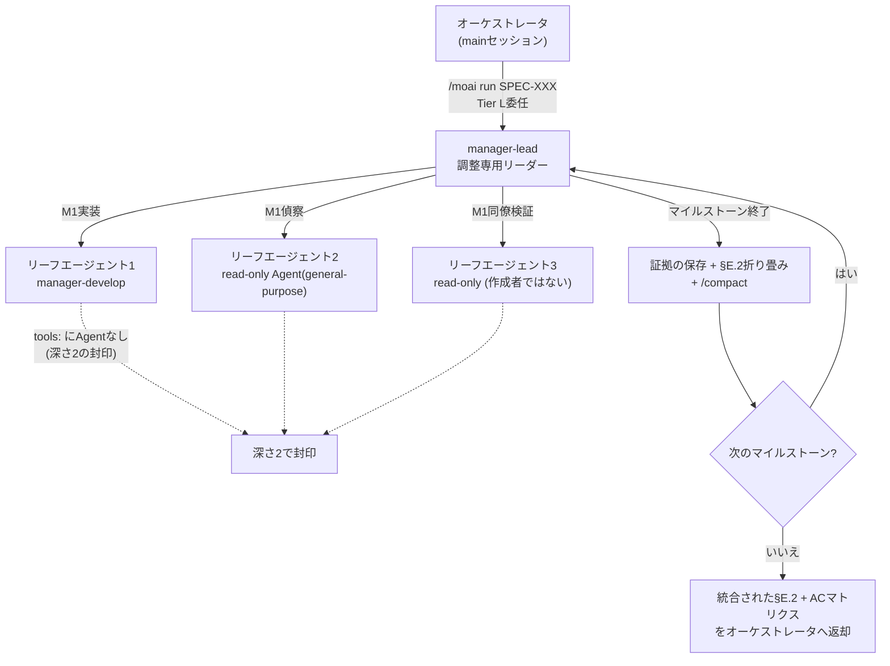



# manager-lead リードコーディネーター (Lead Coordinator)


 <strong>所属価値</strong>: エージェンティックループエンジニアリング · エージェンティックハーネス

<!-- @value: self-learning, agentic-harness -->

エージェント1つでは抱えきれない規模の作業は、たいてい2つの限界に突き当たります。1つはコンテキスト窓です。マイルストーン(SPECの中の順序段階)を5つ超えると、実装の初期に読んだファイルの内容とエージェント(自ら働くAIアシスタント)の出力が積み重なり、ある時点で`/clear`なしには先へ進めなくなります。もう1つは信頼です。実装を担当したエージェントが「受入基準を通過した」と自ら報告するとき、その報告を検証する独立した視点が傍になければ、私たちはその言葉を信じるほかありません。

`manager-lead`は、この2つの限界に加えて「複数セッション・複数カードの調整」までを1つのスキルセットとして扱う、12番目の管理者エージェント(エージェントたちを調整するエージェント)です。v3.1.1で`manager-kanban`から改名し、それに伴って役割をカンバン・ファクトリーのリードセッションの調整にまで広げました。コードは自分では書かず、調整だけを行います。

このページは応用ページです。2つの役割の境界、階層構造、進入条件、マイルストーンごとのコンテキスト折り畳み、同僚検証、リードセッションの姿勢、そして「何が変わらないのか」までを、もう一段深く扱います。

## このページが扱うもの — 2つの役割、1つのスキルセット

`manager-lead`は単一のエージェントではなく作業の**かたち**であり、そのかたちは互いに混ざり合わない2つの役割からできています。

| | 役割A — セッション内ファンアウト | 役割B — セッション間ディスパッチ |
|---|---|---|
| 作業単位 | 1つのSPECの中のマイルストーン | カンバンボードのカード(-k)、またはファクトリーレーンに割り当てられたカード(-f) |
| 実際に働く主体 | 自ら生成するリーフ`Agent()`スポーン | 運用者が手動で立ち上げた同伴セッション(-k: plan · run · sync)とレーン(-f: lane-1…lane-N) |
| 進入 | Tier Lのしきい値でのオーケストレータ委任 | SessionStart文脈がリード役割を宣言する-k/-fセッション |

役割Aは、Tier L規模のSPECの実行をマイルストーンごとにコンテキストを折り畳み(Context-Folding)窓を軽く保ち、通過した受入基準(AC — 完了判定の基準)ごとに同僚交差検証(peer cross-validation)を回すことで、1つの窓の中で最後まで到達させます。

役割Bは、カンバンモード(`moai cc -k`)とファクトリーモード(`moai cc -f N`)で**リードセッションがディスパッチ周期を担う**作業です。カンバンリードは`lead > plan > run > sync`のチェーン上でカードをボードに流し — `plan`セッションはカードごとのSPEC執筆を並列`Agent()`ワーカーへfan-outします — ファクトリーリードは運用者が選んだカードを空きレーンへ丸ごと割り当てます。どちらもセッションを新たに作ることはありません。同伴セッションとレーンは運用者がターミナルごとに手動で立ち上げ、リードは名前で宛先を指定してメッセージを送ります。

2つの役割を貫く規律は3つです。作業は**競合ではなく順序で**進み、完了は**主張ではなく読んだ証拠だけで**判定され、ユーザーへの質問チャネルはオーケストレータのものです — このエージェントは行き詰まるとブロッカー報告(blocker report)を返します。

## リードセッションの姿勢 — 会話は続き、作業は背後で回る

役割Bにおけるリードセッションの姿勢は、双方向にノンブロッキングです。並列作業が背後で回っている間もユーザーとの会話は流れ続け、レーンや同伴セッションの調整が次のユーザー回答を待って止まることもありません。リードセッションはオーケストレータのチャネルを通じてユーザーと対話し(エージェント自身はブロッカー報告を返すだけです)、並列に回せる作業 — 読み取り専用の検証バッチ、報告の突き合わせ、リードが自ら抱えるカードごとのSPEC執筆 — はバックグラウンドの`Agent()`スポーンへ流します。

ここに**サブエージェント優先のトークン規律**が重なります。リードとレーンのコンテキストには調整だけを残し、本体の作業はすべて下位エージェントへ降ろします。カードごとの執筆・検証・報告作成がリードの窓の中で起きれば4つの窓が同時に重くなりますが、下位エージェントへ降ろせばそれぞれの窓で完結し、リードには要約だけが戻ります。同時スポーンの上限はセッションあたり10個で、GLMバックエンドではスポーンを**名前なし**で立ち上げます — 名前付きのスポーンは`CLAUDE_CODE_EXPERIMENTAL_AGENT_TEAMS`の下で結果を返さないインプロセスのチームメイトに変わることがあるためです。

## なぜ必要か

Tier L規模のSPECを順次モード(serial)で実装すると、オーケストレータは`manager-develop`エージェントをマイルストーンごとに順番に呼びます。この流れは多くの場合うまく噛み合いますが、SPECが大きくなると2つの現象が現れます。

まずコンテキストが埋まります。実装の初期に読んだファイル、最初のマイルストーンで書いたテスト、AC検証コマンドの出力が1つの窓の中に残り続けます。5つ目のマイルストーンあたりで窓はほぼ満杯になり、`/clear`のあとに続けるには、それまでの進捗を要約として受け取り直さなければなりません。この要約の合間で文脈が薄れていくコストが積み重なります。

次に自己報告の限界が露わになります。エージェントが「AC-003通過」と報告したとき、その判定の根拠となるコマンド出力をオーケストレータが一つひとつ確認し直さなければ、誤った報告はsync段階になってようやく露見します。途中で捕まえれば安く済む欠陥が、最後まで運ばれてしまいます。

`manager-lead`はこの2つの現象にそれぞれ対応します。コンテキストはマイルストーン境界で折り畳んで窓を軽く保ち、AC判定はその場で作成者ではない同僚エージェントが確認し直します。そのためTier Lの実行が1セッションの中で最後まで生き残り、「通過した」という言葉が構造的に検証された状態で次のマイルストーンへ渡ります。役割Bは同じ規律をセッションの外へ広げます — リードもカードを動かす前に進捗記録の証拠を自ら読み、読めなければカードをその場に留めます。

## 階層構造をひと目で



この図で注意して見るべきは矢印の向きです。オーケストレータは`manager-lead`までしか呼ばず、その下のリーフエージェントを呼ぶのは`manager-lead`だけです。リーフエージェントは別のエージェントを呼べません(点線が指す封印)。これが「深さ2の封印」であり、階層が際限なく深くなるのを防ぐ構造的な安全網です。役割Bでも同じです — リードのバックグラウンド`Agent()`スポーンは1段だけで、同伴セッションとレーンはそもそもリードが作ったものではなく、運用者が立ち上げた独立したセッションです。

## Step 1 — 進入条件が揃っているか確認する

役割Aは、すべての実行に既定で敷かれる経路ではありません。オーケストレータは、SPECが下の3条件を**すべて**満たすときだけ`manager-lead`に作業を預けます。1つでも欠ければ、標準の順次モード(serial)のまま進みます。

| 条件 | 基準 | なぜ必要か |
|------|------|-------------|
| マイルストーン数 | 3個以上 | 折り畳みの効果が積み上がるには境界が最低3つ必要 |
| ファイル数 | 10個以上 | 規模が小さければ順次モードのほうが安い |
| ドメインの広がり | 交差ドメインのファンアウト | 偵察が複数の領域に分かれるときスキーマの統合が効く |

この3条件は「どれか1つでも真なら」ではなく「すべて真でなければ」です。1つのドメインだけに触れる10ファイルの単一マイルストーンのリファクタリングは、条件が1つ欠けているように見えて実際には3つとも満たさないため、`manager-lead`の経路には入りません。これは意図した設計です — 順次モードのほうが安く速いからです。

役割Bの進入はもっと単純です。セッションのSessionStart文脈がカンバンモード(`moai cc -k`)またはファクトリーモード(`moai cc -f N`)の`lead`役割を宣言していればそれで足り、しきい値は適用されません — ボード(またはレーンの束)そのものが作業だからです。サブエージェントのスポーンにはSessionStart文脈がないため、役割Bにスポーン経由で進入することはできません。

オーケストレータは`manager-lead`を呼ぶ前に、この選択を`progress.md`の`§F Phase 4 Mode Selection`欄へ記録します。ユーザーはこの記録をgrepすれば、現在の実行がどの経路を通ったかを確認できます。

```bash
# 現在のSPECがmanager-lead経路を通ったかをprogress.mdで確認
grep -A 2 "Mode Selection" .moai/specs/SPEC-EXAMPLE-001/progress.md | grep -i "manager-lead"
```

## Step 2 — 実行を預ける

役割Aでオーケストレータが`manager-lead`を呼ぶと、`manager-lead`はSPEC識別子、マイルストーン地図、ACマトリクスを受け取ります。ここから役割分担が明確になります。

- **オーケストレータ** — ユーザーゲートを守り、`manager-lead`が返す統合結果を受け取ってsync段階へ渡します。
- **manager-lead** — マイルストーンごとにリーフエージェントを呼び、コンテキストを折り畳み、同僚検証を回します。コードは自分では書かず、SPEC本文も直しません。`AskUserQuestion`を自ら呼ぶこともありません — 行き詰まればブロッカー報告をオーケストレータへ返します。
- **リーフエージェント** — `manager-develop`で実装するか、読み取り専用の`Agent(general-purpose)`で偵察するか、作成者ではない同僚エージェントとしてAC検証を回し直します。

この分担で最も目を引くのは、`Agent`ツールを持つのが`manager-lead`だけだという点です。12の管理者エージェントのうち`Agent`を持つのは`manager-lead`のみで、ほかの管理者エージェントはすべて`Agent`を外したツール一覧でフラットな階層を保ちます。フラットな階層をただ1か所で開く代わりに、その下のリーフエージェントは再び`Agent`を持てないよう塞ぎ、階層が2段を超えないように封印します。これが「深さ2の封印」であり、CIガード(`manager_lead_depth_test.go`)が守ります。

```text
# manager-leadがリーフエージェントを呼ぶときのツール一覧 (概念例)
manager-lead:            [Read, Write, Edit, Grep, Glob, Bash, TaskCreate, TaskUpdate, TaskList, TaskGet, Agent, Skill]
リーフ manager-develop: [Read, Write, Edit, Grep, Glob, Bash, TaskCreate, TaskUpdate, TaskList, TaskGet, Skill]  ← Agentなし
リーフ read-only 検証:  [Read, Grep, Glob, Bash]  ← Write/Edit/Agentなし
```

ここでの`manager-lead`の`Write`と`Edit`は調整の用途にのみ使われます。すなわち`progress.md`の§E.2欄に折り畳み行を追加したり、`.moai/state/verify/`の下に証拠ファイルを書いたりするためのもので、ソースコードに触れることはありません。コードは常にリーフエージェントの仕事です。

委任のルーティングは順次と並列を分けて付けます。1つの窓の中で順番に回さなければならない作業(マイルストーンごとの実装)は順次スポーンへ、互いに独立した作業(偵察、読み取り専用の検証バッチ、カードごとのSPEC執筆)は並列スポーンへ流します。スキルへのアクセスは全面的に開かれています — `Skill`ツールで必要なドメインスキルをその場で読み込んで使います。

1つ強調しておきたいのは、`manager-lead`が新しい実行モードではないという点です。Phase 4の4つのモード(direct, serial, fanout, sweep)はそのままで、`manager-lead`はserial(順番に呼ぶ)のかたちをした委任先です。新しいモードが生まれたわけではなく、実験的なagent-team表面(明示的な`--team`要求でのみ選択)がカタログのモードになったわけでもありません。

## Step 3 — マイルストーンが終わるたびにコンテキストを折り畳む

`manager-lead`の最も特徴的な習慣は、マイルストーン境界で窓を軽く折り畳むことです。この手順を**コンテキスト折り畳み(Context-Folding)**と呼びます。あるマイルストーンのすべてのACが通過判定を受けると、`manager-lead`は3つの段階を順に踏みます。

1. **証拠の保存** — そのマイルストーンで回したAC検証コマンドの出力をファイルに残します。パスは`.moai/state/verify/<セッション>/M<マイルストーン>.<AC-id>.{log,out}`の形式に従います。`/tmp`の下ではなく`.moai/state/`の下に置く理由は、OSが`/tmp`を消すと引用したパスが切れてしまうからです。
2. **折り畳み行を書く** — `progress.md`の§E.2欄に1行の要約を追加します。この行は「M2: AC-004=PASS, AC-005=PASS | evidence: .moai/state/verify/.../M2.* | fold-at: 2026-08-12T...」の形式に従います。のちの監査段階で、この行の証拠パスは実在するファイルを指していなければなりません。
3. **窓を折り畳む** — `/compact`を明示的な保存指示とともに呼び、現在のマイルストーン計画とこれまでの折り畳み行だけを残して、残りを片付けます。

```text
# progress.md §E.2 に追加される折り畳み行の例
M1: AC-001=PASS, AC-002=PASS | evidence: .moai/state/verify/abc123/M1.* | fold-at: 2026-08-12T10:14:00Z
M2: AC-003=PASS, AC-004=PASS | evidence: .moai/state/verify/abc123/M2.* | fold-at: 2026-08-12T11:42:00Z
```

この手順が終わると、`manager-lead`のアクティブなコンテキストは「現在のマイルストーンの規模 + これまでの折り畳み行 + 常時読み込まれるルールの冒頭」に比例します。5つ目のマイルストーンを控えていても、最初のマイルストーンの生の記録が窓を占めることはありません。だからこそ6マイルストーンのTier L実行が1つの窓の中で最後まで生き残ります。

```bash
# マイルストーン2 が終わったあとに残る証拠ファイルの確認 (.moai/state/verify の下に永続化)
ls .moai/state/verify/"$(moai session current)"/M2.*
```

注意すべきは、この手順がどのゲートも迂回しないという点です。折り畳みをしてもモデルごとのコンテキスト限界(たとえば1M窓のモデルなら50%)に達すれば、`manager-lead`は貼り付け用の再開メッセージを組み立てて`/clear`を勧めます。折り畳みは窓を軽く保つ技術であって、手を離すための技術ではありません。

証拠を残す道も塞がっていてはいけません。あるACの証拠ファイルが空だったりパスが切れていたりすれば、そのACは`PASS`ではなく`GAP`と記され、`manager-lead`は次のマイルストーンへ進みません。空欄をそのままにすることは許されません。

## Step 4 — 同僚交差検証で受入基準に信頼を足す

実装エージェントが「AC-003通過」と報告すると、`manager-lead`は作成者ではない2番目のエージェントを読み取り専用で呼び、同じAC検証コマンドを回し直します。この段階を**同僚交差検証**と呼びます。

なぜわざわざもう一度回すのか。作成者は自分が通過と下した判定にすでに投資しています。失敗しているgrepを数え違えて通過に化けさせることもあれば、以前の実行の出力を引いてきて今回の実行の出力であるかのように引用することもあります。同僚エージェントは作成者の通過主張に何の投資もありません。その仕事は、同じツリーで同じコマンドを回し直し、結果が再現するか(通過)、コマンドは回るが出力が違うか(部分)、コマンドがそもそも回らないか主張と矛盾するか(失敗)だけを見分けることです。

この段階からは3つの結果が出ます。

- **PASS** — 検証コマンドが作成者の主張と同じ結果で再現します。次のマイルストーンへ進みます。
- **PARTIAL** — コマンドは回りますが、出力が作成者の主張と異なります。差分を記録し、オーケストレータへブロッカー報告を送ります。
- **FAIL** — コマンドが回らないか、作成者の通過主張と矛盾します。この場合もブロッカー報告を送ります。

```bash
# 同僚検証エージェントがAC-003 を同じツリーで回し直す検証コマンドの例
go test -run AC-003 ./internal/hierarchical/...
# 終了コード0 ならPASS、0 以外ならFAIL — 作成者の主張と比べてPARTIAL かFAIL かを見分ける
```

PARTIALやFAILが返ると、`manager-lead`は次のマイルストーンへ進みません。代わりにAC識別子、作成者が提示した通過の証拠、同僚が捕まえた差分を1つにまとめてブロッカー報告とし、オーケストレータへ返します。ユーザーへ選択肢を示すのはオーケストレータの仕事です — 作成者をもう一度呼ぶか、差分を文書化された負債として受け入れるか、マイルストーンを中断するかを`AskUserQuestion`で尋ねます。`manager-lead`がユーザーへ直接尋ねることはありません。

Tier Sはこの段階を飛ばします。規模が小さいと同僚検証のコストが価値を上回るからです。Tier MとTier Lでは必須です。同僚交差検証はsync段階のsync-auditorを置き換えるものではありません — sync-auditorは実装が終わったあとに4つの次元で採点する最終回の読みであり、同僚交差検証は実行の途中でACごとに回る二値の判定です。両者は補完関係にあります。

## スキーマベースのファンアウトで偵察をまとめる

Tier Lの実行は、しばしば複数のドメインにまたがる偵察から始まります。たとえば新しい認証システムを実装するとき、エージェントは既存のセッション層、データベースマイグレーションの規約、フロントエンドのルーティングの3か所を同時に見る必要があるかもしれません。こうした場合、`manager-lead`は読み取り専用の偵察エージェントを複数同時に呼びます。

ここで偵察エージェントがそれぞれ好き勝手な形式の散文を返すと、`manager-lead`は戻り値ごとに構造を導き直さなければなりません。偵察が増えるほどこのコストは線形に膨らみます。そこで`manager-lead`は、偵察エージェントが`plan-research-fanout`スキルの定めた固定見出し形式に従って戻るようにします。すると統合(reduce)は導き直しではなく、固定形式の結果N個を機械的につなぎ合わせる作業になります。

2つの偵察エージェントが同じ signal について矛盾する発見を返した場合、`manager-lead`はどちらかを黙って選ばず、矛盾を明示された欄へ書き込みます。矛盾が表に出ればユーザーが判断でき、隠せば最後になって初めて破裂します。

同時に呼ぶエージェントの数はMoAI fanoutの3〜5の同時実行上限を超えません。5つを超える偵察が必要なら、`manager-lead`はそれらをまとめて順番に呼びます。

## ワークツリー隔離 — 書き込みは隔離、読み取りはそのまま

`manager-lead`がリーフエージェントを複数同時に呼ぶとき、書き込みができるエージェントが同じ作業ツリーに触れ合ってはいけません。あるエージェントが直しているファイルを別のエージェントが上書きする事故を防ぐため、**並列に呼ぶ書き込みサブエージェントは`isolation: "worktree"`で隔離**します。この隔離は各エージェントに独立した作業ディレクトリ(worktree)を与え、互いの変更が混ざらないようにします。

**読み取り専用のfan-outは隔離なしで**呼んでも安全です — 読むだけなので作業ツリーを汚す余地がないからです。偵察と検証バッチはそのまま回し、書き込みスポーンにだけ隔離を付けるのが規則です。

v3.1より前は、この隔離規則が「チームモード」というすでに廃止された概念に結び付いていました。チームモードの廃止とともに隔離規則まで役に立たなくなったように見えましたが、`manager-lead`が入ってきたことで、規則の条件は「並列に回る書き込みサブエージェント」へ結び直されました。隔離を可能にする原理はそのままで、条件が廃止された層に依存しなくなっただけです。

## 新しいモードではない (非退行の保証)

`manager-lead`が入ったからといって、Phase 4の実行モードが増えることはありません。この点は明示的な非退行の約束として据えられています。

- **実行モードの一覧** — direct, serial, fanout, sweep。そのままです(agent-teamは明示的な要求でのみ使える実験的な脚注として残り、自動で選ばれることはありません)。
- **新しいモード** — ありません。`manager-lead`はserialのかたちをした順次委任先です。
- **`--mode`の値** — `autopilot`, `loop`, `team`, `pipeline`はそのままです。新しい値は追加されておらず、agent-teamは明示的な要求でのみ使える実験的な表面として残ります(`MODE_TEAM_UNAVAILABLE`センチネルは文書化された歴史として維持)。

この約束は「エージェントを1つ増やしたらオーケストレーション層は複雑になるのではないか」という自然な懸念への答えです。`manager-lead`はすでにあるserialという器の中に収まるエージェント1つであって、新しい器を作りはしません。カンバン・ファクトリーのリードセッションでも同じです — ディスパッチ周期はすでにあるクロスセッションメッセージングとバックログキューの上で回り、新しいランタイムを敷くことはありません。

## まとめ

`manager-lead`は2つの表面で調整だけを行うエージェントです。役割AではTier L規模の実行を1セッションの中で最後まで押し進めます — 3条件(マイルストーン3個以上、ファイル10個以上、交差ドメインのファンアウト)がすべて真のときだけ入り、入ればマイルストーンごとにコンテキストを折り畳んで窓を軽く保ち、通過したACごとに同僚交差検証で信頼を足します。役割Bではカンバン・ファクトリーのリードセッションのディスパッチを担います — カードは読んだ証拠だけで動かし、並列作業はバックグラウンドスポーンへ流してユーザーとの会話が止まらないようにし、段階の間には`/clear`を求めます。

コードは自分では書かず、ユーザーへ直接尋ねることもなく、作業が行き詰まればブロッカー報告をオーケストレータへ返します。深さ2の封印のおかげで階層は2段を超えず、スキーマベースのファンアウトのおかげで複数の偵察結果は機械的にまとまり、書き込みスポーンのworktree隔離のおかげで並列が安全になります。そしてこのすべてが、実行モードの一覧に1行も足さないまま実現します。
