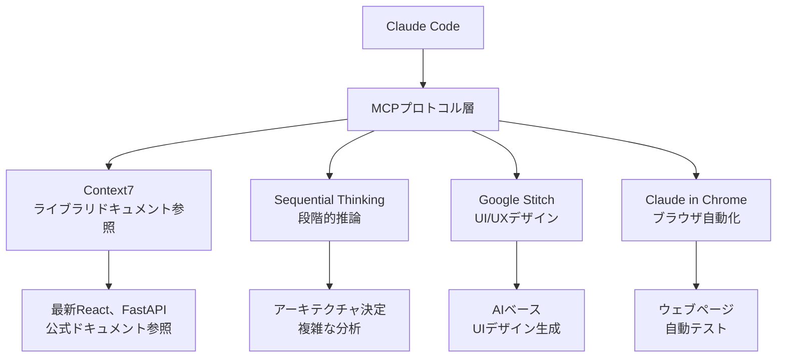
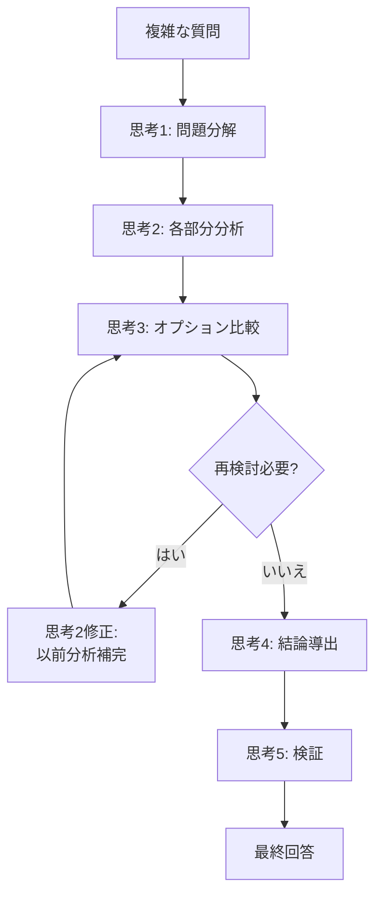

# MCPサーバー活用ガイド

Claude CodeのMCP (Model Context Protocol) サーバーの活用方法を詳しく解説します。


**要約**: MCPはClaude Codeに**外部ツールを接続するUSBポート**です。Context7で最新ドキュメントを参照し、Sequential Thinkingで複雑な問題を分析します。


## MCPとは？

MCP (Model Context Protocol) はClaude Codeに**外部ツールとサービスを接続**する標準プロトコルです。

Claude Codeはデフォルトでファイル読み書き、ターミナルコマンドなどのツールを持っています。MCPを通じてこのツールセットを拡張し、ライブラリドキュメント参照、ナレッジグラフ保存、段階的推論などの機能を追加できます。



## MoAIで使用するMCPサーバー

### MCPサーバーリスト

| MCPサーバー | 用途 | ツール | 有効化 |
|----------|------|------|--------|
| **Context7** | ライブラリドキュメントリアルタイム参照 | `resolve-library-id`, `get-library-docs` | `.mcp.json` |
| **Sequential Thinking** | 段階的推論、UltraThink | `sequentialthinking` | `.mcp.json` |
| **Google Stitch** | AIベースUI/UXデザイン生成 ([詳細ガイド](/advanced/stitch-guide)) | `generate_screen`, `extract_context` 等 | `.mcp.json` |
| **Claude in Chrome** | ブラウザ自動化 | `navigate`, `screenshot` 等 | `.mcp.json` |

## Context7活用法

Context7は**ライブラリ公式ドキュメントをリアルタイムで参照**するMCPサーバーです。

### 必要性

Claude Codeの学習データは特定時点までの情報のみを含みます。Context7を使用すると**最新バージョンの公式ドキュメント**をリアルタイムで参照して正確なコードを生成できます。

| 状況 | Context7なし | Context7使用時 |
|------|---------------|--------------|
| React 19新機能 | 学習データにない可能性あり | 最新公式ドキュメント参照 |
| Next.js 16設定 | 以前バージョンパターン使用可能性あり | 現行バージョンパターン適用 |
| FastAPI最新API | 古いバージョン構文使用可能性あり | 最新構文適用 |

### 使用方法

Context7は2段階で動作します。

**段階1: ライブラリID照会**

```bash
# Claude Codeが内部的に呼び出し
> Reactの最新ドキュメントを参照してコードを書いて

# Context7が実行する作業
# mcp__context7__resolve-library-id("react")
# → ライブラリID: /facebook/react
```

**段階2: ドキュメント検索**

```bash
# 特定トピックのドキュメント検索
# mcp__context7__get-library-docs("/facebook/react", "useEffect cleanup")
# → React公式ドキュメントでuseEffectクリーンアップ関数関連内容を返却
```

### 実戦活用シナリオ

```bash
# シナリオ: Next.js 16 App Router設定
> Next.js 16でプロジェクト設定をして

# Claude Code内部動作:
# 1. Context7でNext.js最新ドキュメント照会
# 2. App Router設定パターン確認
# 3. 最新設定ファイル作成
# 4. 公式推奨事項反映
```

### 対応ライブラリ例

| カテゴリ | ライブラリ |
|----------|-----------|
| フロントエンド | React, Next.js, Vue, Svelte, Angular |
| バックエンド | FastAPI, Django, Express, NestJS, Spring |
| データベース | PostgreSQL, MongoDB, Redis, Prisma |
| テスト | pytest, Jest, Vitest, Playwright |
| インフラ | Docker, Kubernetes, Terraform |
| その他 | TypeScript, Tailwind CSS, shadcn/ui |

## Sequential Thinking (UltraThink)

Sequential Thinkingは**複雑な問題を段階的に分析**するMCPサーバーです。

### 一般思考 vs Sequential Thinking

| 項目 | 一般思考 | Sequential Thinking |
|------|-----------|---------------------|
| 分析深度 | 表面的 | 深い段階的分析 |
| 問題分解 | 単純 | 構造化された分解 |
| 再考/修正 | 制限的 | 以前の思考修正可能 |
| 分岐探索 | 単一パス | 複数パス探索 |

### UltraThinkモード

`--ultrathink`フラグを使用すると強化された分析モードが有効になります。

```bash
# UltraThinkモードでアーキテクチャ分析
> 認証システムアーキテクチャを設計して --ultrathink

# Claude CodeがSequential Thinking MCPを使用して:
# 1. 問題を下位問題に分解
# 2. 各下位問題を段階的に分析
# 3. 以前の結論を再検討・修正
# 4. 最適ソリューション導出
```

### 有効化される状況

以下の状況でSequential Thinkingが自動的に有効化されます。

| 状況 | 例 |
|------|------|
| 複雑な問題分解 | "マイクロサービスアーキテクチャを設計して" |
| 3ファイル以上に影響 | "認証システム全体をリファクタリングして" |
| 技術選択比較 | "JWT vs セッション認証、どちらが良い？" |
| トレードオフ分析 | "パフォーマンスを上げつつ保守性も維持するには？" |
| 互換性破壊検討 | "このAPI変更が既存クライアントに与える影響は？" |

### Sequential Thinkingの段階



## MCP設定方法

### .mcp.json設定

MCPサーバーはプロジェクトルートの`.mcp.json`ファイルで設定します。

```json
{
  "context7": {
    "command": "npx",
    "args": ["-y", "@anthropic/context7-mcp-server"]
  },
  "sequential-thinking": {
    "command": "npx",
    "args": ["-y", "@anthropic/sequential-thinking-mcp-server"]
  }
}
```

### settings.local.jsonで有効化

特定MCPサーバーを個人的に有効化するには`settings.local.json`に追加します。

```json
{
  "enabledMcpjsonServers": [
    "context7"
  ]
}
```

### settings.jsonで権限許可

MCPツールを使用するには`permissions.allow`に登録する必要があります。

```json
{
  "permissions": {
    "allow": [
      "mcp__context7__resolve-library-id",
      "mcp__context7__get-library-docs",
      "mcp__sequential-thinking__*"
    ]
  }
}
```

## 実戦例

### ReactプロジェクトでContext7で最新ドキュメント参照

```bash
# 1. ユーザーがReact 19の新機能を使用したいとリクエスト
> React 19のuse()フックを使ってデータフェッチングを実装して

# 2. Claude Code内部動作
# a) Context7でReactライブラリID照会
#    → resolve-library-id("react") → "/facebook/react"
#
# b) React 19 use()関連ドキュメント検索
#    → get-library-docs("/facebook/react", "use hook data fetching")
#
# c) 最新公式ドキュメント基づきでコード生成
#    → use()フックの正しい使用法適用
#    → Suspenseバウンダリーと共に使用
#    → エラーバウンデリー処理包含

# 3. 結果: 最新パターンが反映された正確なコード生成
```

### 複雑なアーキテクチャ決定にUltraThink使用

```bash
# アーキテクチャ決定が必要な状況
> 自サービスの認証をJWTにするかセッションにするか分析して --ultrathink

# Sequential Thinkingが実行する段階:
# 思考1: 両方式の基本概念整理
# 思考2: 自サービスの特性分析 (SPA、モバイルアプリ対応必要)
# 思考3: JWT長所短所分析
# 思考4: セッション長所短所分析
# 思考5: セキュリティ観点比較
# 思考6: スケーラビリティ観点比較
# 思考7: 以前思考修正 - ハイブリッド方式検討
# 思考8: 最終結論および実装戦略
```

## 関連ドキュメント

- [settings.jsonガイド](/advanced/settings-json) - MCPサーバー権限設定
- [スキルガイド](/advanced/skill-guide) - スキルとMCPツールの関係
- [エージェントガイド](/advanced/agent-guide) - エージェントのMCPツール活用
- [CLAUDE.mdガイド](/advanced/claude-md-guide) - MCP関連設定参照
- [Google Stitchガイド](/advanced/stitch-guide) - AIベースUI/UXデザインツール詳細活用法


**ヒント**: Context7は最新ライブラリドキュメントを参照する時に最も有用です。新フレームワーク導入時や最新バージョンへのアップグレード時にContext7を有効化すると正確なコードを得られます。

