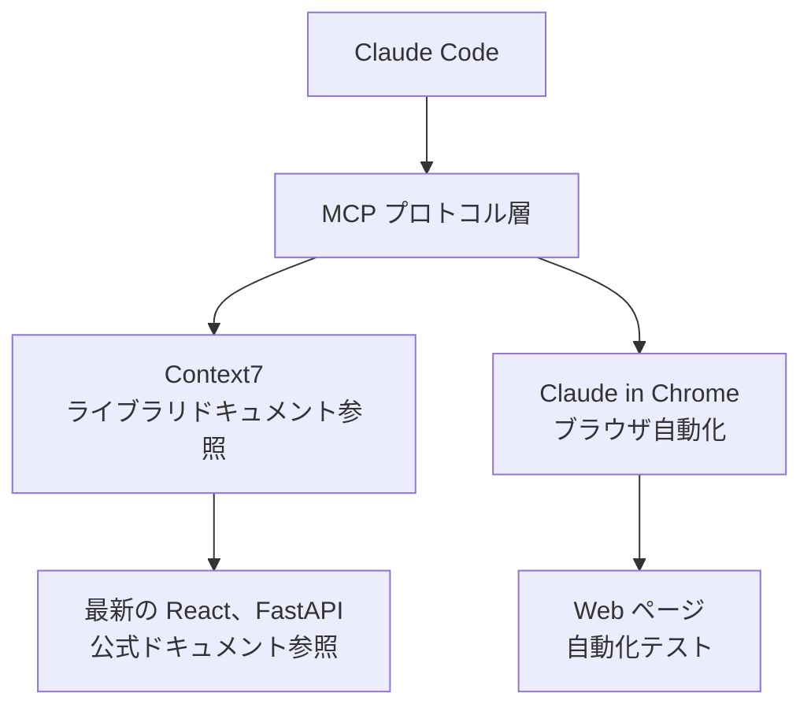

Claude Code の MCP (Model Context Protocol) サーバーの活用方法を詳しく解説します。MCP はハーネスのツール拡張レイヤーです — ただしサーバーを 1 つ接続するたびにツールスキーマがコンテキストを占有するため、「必要なサーバーだけ接続する」という原則がここでもトークノミクスとして働きます。


**ひと言要約**: MCP は Claude Code に **外部ツールを接続する USB ポート** です。Context7 で最新ドキュメントを参照し、Adaptive Thinking (`--ultrathink` キーワード経由) で複雑な問題を分析します。


## MCP とは?

MCP (Model Context Protocol) は Claude Code に **外部ツールとサービスを接続** する標準プロトコルです。

Claude Code は標準でファイルの読み書き、ターミナルコマンドなどのツールを持っています。MCP を通じてこのツールセットを拡張し、ライブラリドキュメントの参照、ブラウザ自動化などの機能を追加できます。


```mermaid
flowchart TD
    CC["Claude Code"] --> MCP_LAYER["MCP プロトコル層"]

    MCP_LAYER --> C7["Context7<br>ライブラリドキュメント参照"]
    MCP_LAYER --> CHROME["Claude in Chrome<br>ブラウザ自動化"]

    C7 --> C7_OUT["最新の React、FastAPI<br>公式ドキュメント参照"]
    CHROME --> CHROME_OUT["Web ページ<br>自動化テスト"]
```

## MoAI で使用する MCP サーバー

### MCP サーバー一覧

| MCP サーバー | 用途 | ツール | 有効化 |
|----------|------|------|--------|
| **Context7** | ライブラリドキュメントのリアルタイム参照 | `resolve-library-id`, `get-library-docs` | `.mcp.json` |
| **Claude in Chrome** | ブラウザ自動化 | `navigate`, `screenshot` など | `.mcp.json` |

## Context7 活用法

Context7 は **ライブラリ公式ドキュメントをリアルタイムで参照** する MCP サーバーです。

### なぜ必要か?

Claude Code の学習データは特定の時点までの情報しか含みません。Context7 を使えば **最新バージョンの公式ドキュメント** をリアルタイムで参照し、正確なコードを生成できます。誤った旧バージョンのパターンでコードを生成してから直し直す往復こそ、最も高価なトークンの浪費です。

| 状況 | Context7 なし | Context7 使用 |
|------|---------------|---------------|
| React 19 の新機能 | 学習データにない可能性 | 最新公式ドキュメントを参照 |
| Next.js 16 の設定 | 旧バージョンのパターンを使う可能性 | 現行バージョンのパターンを適用 |
| FastAPI の最新 API | 旧文法を使う可能性 | 最新文法を適用 |

### 使用方法

Context7 は 2 段階で動作します。

**ステップ 1: ライブラリ ID の照会**

```bash
# Claude Code が内部的に呼び出す
> React の最新ドキュメントを参照してコードを書いて

# Context7 が行う作業
# mcp__context7__resolve-library-id("react")
# → ライブラリ ID: /facebook/react
```

**ステップ 2: ドキュメント検索**

```bash
# 特定トピックのドキュメント検索
# mcp__context7__get-library-docs("/facebook/react", "useEffect cleanup")
# → React 公式ドキュメントから useEffect クリーンアップ関数関連の内容を返す
```

### 実践活用シナリオ

```bash
# シナリオ: Next.js 16 App Router の設定
> Next.js 16 でプロジェクトをセットアップして

# Claude Code の内部動作:
# 1. Context7 で Next.js の最新ドキュメントを参照
# 2. App Router の設定パターンを確認
# 3. 最新の設定ファイルを生成
# 4. 公式推奨事項を反映
```

### サポートされるライブラリの例

| 分類 | ライブラリ |
|------|-----------|
| フロントエンド | React, Next.js, Vue, Svelte, Angular |
| バックエンド | FastAPI, Django, Express, NestJS, Spring |
| データベース | PostgreSQL, MongoDB, Redis, Prisma |
| テスト | pytest, Jest, Vitest, Playwright |
| インフラ | Docker, Kubernetes, Terraform |
| その他 | TypeScript, Tailwind CSS, shadcn/ui |

## Adaptive Thinking via UltraThink

`--ultrathink` キーワードは Opus 4.7+/4.8 および Sonnet 4.6 の **組み込み推論モードである Adaptive Thinking** を有効化します。

初期モデルの固定的な `budget_tokens` パラメータと異なり、新しいモデルの Adaptive Thinking は **作業の複雑度に応じて動的に推論トークンを割り当て** ます。推論深度は固定予算ではなく **effort** パラメータ (`xhigh`, `high`, `medium`, `low`) で制御されます。「計画は深く、実装は安く」というトークノミクス配分において、この effort 軸が推論深度側のレバーです。

### `--ultrathink` を使うタイミング

`--ultrathink` キーワードを使うと、複雑な問題向けの強化された分析モードが有効になります。

```bash
# UltraThink でアーキテクチャ分析
> 認証システムのアーキテクチャを設計して --ultrathink

# Opus 4.7+/4.8 または Sonnet 4.6 では:
# 1. 作業の複雑度に応じて動的に推論トークンを割り当て
# 2. 複数の角度から問題分解を探索
# 3. トレードオフを体系的に評価
# 4. 検証された推論で最適解を導出
```

### 有効化される状況

Adaptive Thinking は次の状況で活用されます。

| 状況 | 例 |
|------|------|
| 複雑な問題分解 | 「マイクロサービスアーキテクチャを設計して」 |
| 3 ファイル以上に影響 | 「認証システム全体をリファクタリングして」 |
| 技術選択の比較 | 「JWT vs セッション認証、どちらが良い?」 |
| トレードオフ分析 | 「性能を上げつつ保守性も維持するには?」 |
| 互換性破壊の検討 | 「この API 変更が既存クライアントに与える影響は?」 |

### モデル互換性

- **Opus 4.8, Opus 4.7, Sonnet 4.6**: Adaptive Thinking (動的割り当て推論)
- **Haiku 4.5**: 拡張推論非対応 (`--ultrathink` キーワードの有効化は no-op)
- **旧モデル**: 現行の Claude モデルにアップグレードすれば深い推論をサポート可能

## MCP の設定方法

### .mcp.json 設定

MCP サーバーはプロジェクトルートの `.mcp.json` ファイルで設定します。

```json
{
  "context7": {
    "command": "npx",
    "args": ["-y", "@anthropic/context7-mcp-server"]
  }
}
```

### settings.local.json で有効化

特定の MCP サーバーを個人的に有効化するには `settings.local.json` に追加します。

```json
{
  "enabledMcpjsonServers": [
    "context7"
  ]
}
```

### settings.json で権限を許可

MCP ツールを使用するには `permissions.allow` に登録が必要です。

```json
{
  "permissions": {
    "allow": [
      "mcp__context7__resolve-library-id",
      "mcp__context7__get-library-docs"
    ]
  }
}
```

## 実践例

### React プロジェクトで Context7 による最新ドキュメント参照

```bash
# 1. ユーザーが React 19 の新機能を使いたいとリクエスト
> React 19 の use() フックを使ってデータフェッチを実装して

# 2. Claude Code の内部動作
# a) Context7 で React ライブラリ ID を照会
#    → resolve-library-id("react") → "/facebook/react"
#
# b) React 19 use() 関連のドキュメントを検索
#    → get-library-docs("/facebook/react", "use hook data fetching")
#
# c) 最新公式ドキュメントに基づいてコード生成
#    → use() フックの正しい使い方を適用
#    → Suspense バウンダリと共に使用
#    → エラーバウンダリ処理を含む

# 3. 結果: 最新パターンが反映された正確なコード生成
```

### 複雑なアーキテクチャ決定に UltraThink を使用

```bash
# アーキテクチャ決定が必要な状況
> うちのサービスの認証を JWT にするかセッションにするか分析して --ultrathink

# Adaptive Thinking が動的に割り当てられた推論で:
# 1. 問題をサブ問題に分解
# 2. 各サブ問題を段階的に分析
# 3. 以前の結論を再検討して修正
# 4. 最適な解を導出
```

## 関連ドキュメント

- [settings.json ガイド](/ja/advanced/settings-json) - MCP サーバー権限設定
- [スキルガイド](/ja/advanced/skill-guide) - スキルと MCP ツールの関係
- [エージェントガイド](/ja/advanced/agent-guide) - エージェントの MCP ツール活用
- [CLAUDE.md ガイド](/ja/advanced/claude-md-guide) - MCP 関連設定の参照


**ヒント**: Context7 は最新のライブラリドキュメントを参照するときに最も有用です。新しいフレームワークを導入したり最新バージョンにアップグレードするとき、Context7 を有効化すれば正確なコードが得られます。

