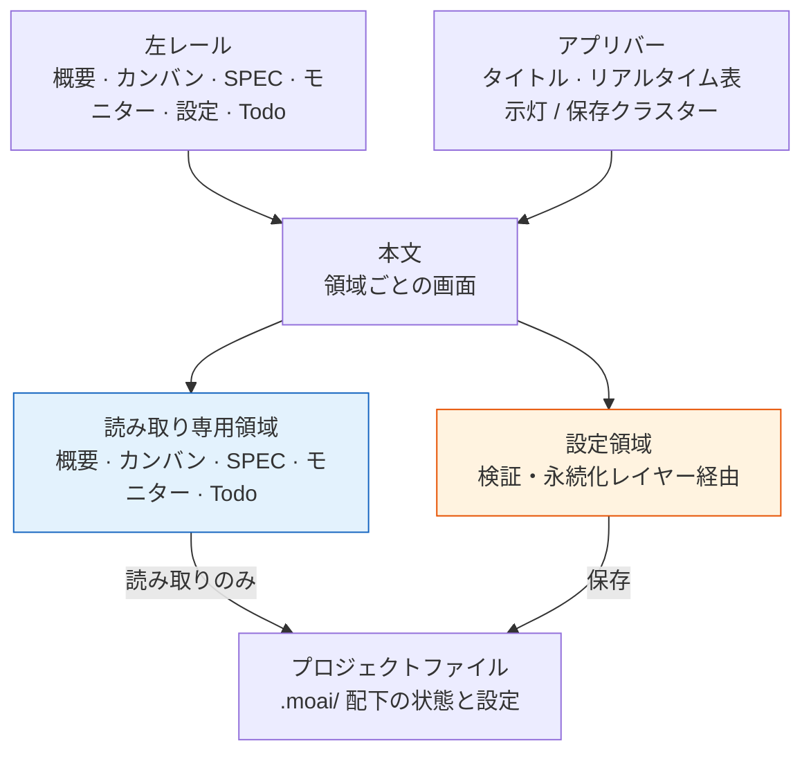

# MoAI Web Console

**MoAI Web Console** は `moai web` で起動するローカル運用画面です。プロジェクトの SPEC カタログ、カンバンチェーン、セッションとゴール、検証履歴を一か所で確認でき、同じ画面から設定も編集できます。ブラウザは `127.0.0.1` にのみ接続し、データベースもログインもありません。


**一言でいうと:** コンソールは 5 つの観測領域と 1 つの設定領域を左レールにまとめた運用シェルです。観測領域は読み取りのみを行い、設定領域はターミナルウィザードと同じ検証・永続化レイヤーを使います。


## 運用シェル — 左レールとアプリバー

画面は 3 つに分かれます。左の**レール**に 6 つの領域が縦に並び、上の**アプリバー**に現在の画面タイトルと状態が乗り、残りが**本文**です。どの領域にいてもレールとアプリバーは同じ位置に残ります。

| 領域 | ルート | 役割 |
|------|--------|------|
| 概要（Overview） | `/` | プロジェクト全体の要約 — 統計タイル、カンバンチェーン、進行中 SPEC、注意リスト、セッション |
| カンバン（Kanban） | `/kanban` | チェーンセッションボード + SPEC パイプライン 4 カラム |
| SPEC（Specs） | `/specs` | SPEC カタログの検索・フィルタ・詳細、クローズ負債と MUST-FIX drift |
| モニター（Monitor） | `/monitor` | セッション・ゴール・検証・エピックの 4 パネル |
| 設定（Settings） | `/settings` | プロファイル設定とプロジェクトセクションの編集（11 タブ） |
| Todo | `/todo` | バックログキューの読み取り専用ビュー — 3 状態のカードをすべて一覧 |

アプリバー右側に何が出るかは領域によって変わります。観測領域 5 つでは**リアルタイム表示灯**が、設定領域では**保存クラスター**（変更件数と保存ボタン）が置かれます。コンテキストチップ（`lang` · `model` · `effort` · `dev`）は設定領域だけにレンダーされます — 編集中のプロファイルの主要な値を保存前に目で確認するためのものだからです。

レールの下部にはプロファイルボタン、プロジェクト名、インターフェース言語セレクター、終了ボタンが集まっています。プロファイルボタンを押すとポップオーバーが開き、切り替え・作成・名前変更・削除が一か所で完結します。どの画面から開いても同じポップオーバーなので、プロファイルを扱う面はコンソール全体で 1 つだけです。

## 概要 — 今プロジェクトはどんな状態か

概要は 4 つの統計タイルから始まります。**SPEC**（全体件数と進行中の件数）、**drift**（MUST-FIX 件数）、**session**（PID 確認済みの数 / レジストリ登録数）、**verify**（最後の検証結果とキー数）です。

その下の**カンバンチェーンバー**は、現在のカードが `lead → plan → run → sync` の 4 役割をどこまで通過したかを 1 行で示します。セッションのない役割があれば、その地点をチェーンが止まった場所として表示します。続いて**進行中 SPEC** の一覧、**要注意**パネル（MUST-FIX drift・失敗した検証・停滞したゴール・空の役割だけを集めます）、右側に**セッション**パネルが置かれます。

## カンバン — 2 つのボード

カンバン領域には性格の異なるボードが 2 つ、上下に置かれます。

**チェーンセッションボード**は 5 つの役割をカードとして並べ、各役割のセッション id、バックエンド、モデル、推論強度、コンテキスト使用量、最後のハートビートを記録します。ステージ状態はハートビートから**推定した**値なので推定マークが付き、モデル・推論強度・コンテキストはそのセッション自身のテレメトリ記録から取得します。空のセルは、その値を持つ記録がまだないことを意味します — 埋めないことが規律です。

チェーンボードの隣には**ファクトリレーン**の一覧が並びます。登録済みのレーンごとに 1 行を置き、セッション・カード・SPEC 識別子・バックエンドを記録します。レーンのプロセス id がどのセッションにも届かない場合、またはどちらかのレジストリでセッション 1 つを特定できない場合、その行は**確定不可**としてマークされ、値を一つも持ちません。違うセッションで完了した照会が、他のレーンの記録をこのレーンのものとして描く方が、空の行より悪い結果だからです。登録されたレーンがなければ、ないと書きます。

**SPEC パイプライン**は SPEC を status 基準の 4 カラム（`draft` · `in-progress` · `implemented` · `completed`）に並べます。`superseded` · `archived` · `rejected` はこのボードには来ず、SPEC 領域のフィルタからのみ確認します。

## SPEC — カタログと 2 つの警告パネル

SPEC 領域の先頭には検索ボックスと status フィルタチップがあります。その直後、一覧より**先に**警告パネルが 2 つ来ます。

- **クローズ負債（Close debt）** — 実装は終わっているのに（`implemented`）lifecycle が `completed` に閉じられていない SPEC です。件数が多いときは更新の新しい数件だけを表示し、切り詰めた事実と全体件数を併記します。
- **MUST-FIX drift** — 対処コマンドを伴う drift です。コマンドは**コピーのみ**されます。コンソールはサーバー上でいかなるコマンドも実行しません — コピーして自分のターミナルで実行する構造です。

2 つのパネルが一覧の上に来る理由は単純です。カタログが数百行になると、下に置いたものは画面のはるか下方に押しやられ、事実上存在しないのと同じになるからです。

一覧は ID・タイトル・status・Tier・era・更新日・drift の列で構成されます。行を選ぶと右側に詳細パネルが開き、ドキュメント一覧、ファイルパス、drift の詳細を表示します。

## モニター — 4 つの観測パネル

| パネル | 読むもの |
|--------|----------|
| セッション（Sessions） | セッション id、SPEC、バックエンド、ハートビート、作業ディレクトリ |
| ゴール（Goals） | 設定されたゴールの条件、経過ターン数、停滞の有無、判定 |
| 検証（Verification） | キーごとの直近履歴スパークラインと合否 |
| エピック（Epics） | `moai epic status` が計算したエピックごとの進捗率 |

## Todo — バックログキュー、読み取り専用

`moai todo` が書き込むバックログキューに専用のアドレスを与えました。この画面は **3 つの状態のカードをすべて**並べます — `queued`・`picked`・`dropped` — それぞれの id、本文、状態バッジ、そして紐づく SPEC id があればそれも。何も絞り込みません。この画面が答えるべき問いは「あのカードはどこへ行ったのか」であり、待機中だけを映す作業ビューではその問いに答えられないからです。

読むだけです。追加・選択・破棄は `moai todo` の担当で、コンソールはキューに書き込まず、キューのロックも取りません。リンクされたワークツリーで開いても空にはならず、**プライマリチェックアウト**のキューが見えます — キューはリポジトリごとに 1 本の経路であり、どのファイルを見ているかが分かるよう、解決されたディレクトリをヘッダーに記します。

キューファイルが存在しない、空、あるいは読めない場合は、エラーページではなく 200 と「空です」の 1 行が返ります。

## リアルタイム更新 — 信号だけ送り、取り直す

観測領域はファイルが変わると自ら更新されます。サーバーは `GET /events` に SSE（Server-Sent Events — サーバーからブラウザへ一方向にイベントを流す標準）ストリームを開いたまま `.moai/` 配下を監視し、変更を 250 ミリ秒単位でまとめて送出します。

要点は**イベントがデータを運ばない**ことです。サーバーは「この領域が変わった」という名前だけを送り、ブラウザはその信号を受けて現在の画面を取り直し、本文だけを差し替えます。レンダリングの真実がサーバー 1 か所にのみ残るので、画面とファイルが食い違う状態は生まれません。

| イベント | 監視対象 |
|----------|----------|
| `spec` | `.moai/specs` |
| `session` | `.moai/state` |
| `goal` | `.moai/state/goal` |
| `verify` | `.moai/state/verify` |
| `kanban` | `.moai/state/kanban` |
| `config` | `.moai/config/sections` |

`config` イベントだけは扱いが異なります。設定を編集している最中に画面が下から変わると入力中の値が消えてしまうため、更新はせず「設定ファイルが変わった」というバナーだけを出します。

接続が切れても黙って止まりません。アプリバーの表示灯が切断状態に変わり、ブラウザの再接続が 3 回失敗すると 30 秒間隔のポーリングに落ちます。ポーリング中であることは表示灯にそのまま残ります。

## 知らないことを知っているように書かない

コンソールが守る規律が画面のあちこちに現れます。

- **セッションの活性**はプロセスの生存を確認したものだけを活性に上げます。レジストリに記録が残っていてもプロセスが既に終了している場合があるため、確認できない項目は古いものとして表示します。
- **ステージ状態**はハートビートからの推定値であり、推定であるという事実をマークで併記します。
- **記録のない値**（役割ごとのモデル・推論強度・コンテキスト使用量）はもっともらしい値で埋めず、空のままにします。セッション 1 つに紐づけられないファクトリレーンも、他のレーンの記録を借りて描かず確定不可として示します。
- **空のリスト**は空のままにせず「ない」と書きます。空のパネルは「まだ読めていない」と読まれるからです。

## 設定 — 同じ検査、同じファイル

設定領域はコンソールで唯一ファイルを書く場所です。コンソールは独自の検証ルールを持たず、ターミナルウィザード（`moai profile`、`moai update -c`）と**同じ検証・永続化レイヤー**を呼びます。どちらから直しても結果が同じになる理由です。

レールで設定を選ぶと、その下に 11 のタブが縦のリストとして開きます。

1. **ユーザー情報（Identity）** — 表示名とプロジェクト単位の identity フィールド
2. **言語（Language）** — 会話・コミットメッセージ・コードコメント・ドキュメントの言語
3. **LLM** — 権限モード・モデル・推論強度
4. **サードパーティ LLM（3rd Party LLM）** — ティアごとの GLM モデル、ティアごとの推論強度、GLM API キー
5. **ワークフロー（Workflow）** — 実行モード・既定モード・agentic-loop・loop-prevention
6. **Git・ワークツリー（Git & Worktree）** — `git_strategy.mode`、プロファイルごとの `merge_method`、ワークツリーと branch-guard のトグル
7. **監査（Audit）** — 監査モデルとバックエンドごとのゲート
8. **エージェント（Agents）** — エージェントごとのプロファイル・モデル割り当て
9. **レポート（Report）** — レポート形式と出力の設定
10. **MCP** — `moai mcp-server` のツールごとの有効トグル。書き込み可能なツールには区分マークが付きます
11. **交差セッション（Cross-Session）** — セッション間メッセージングの受信姿勢(posture): インバウンド処理方式(`accept` · `hold` · `refuse`)、マシン間送信の隔離、保留対話の期限。`crosssession.yaml` を編集し、ランチャーが次回の `moai cc`/`glm`/`cg` 実行からこの値をセッションに注入します — すでに動いているセッションは起動時の姿勢を保ちます

各タブの横の数字は、そのタブがレンダーするフィールド数です。エラーのあるタブには数字の代わりに警告マークが付くので、どのタブを開くべきかが一覧からすぐ分かります。

### ウィジェットの正直さ

フィールドは値の実際のドメインに合ったウィジェットでレンダーされます。bool フィールドはチェックボックスではなく 2 択のラジオグループで描きます — チェックボックスは現在の選択を隠しますが、ラジオの対は明示します。`execution_mode` や `audit.model` のような閉じた集合は select かラジオにし、集合外の値は保存時に拒否します。リポジトリパスや API キーのようにドメインが本当に開いている値だけが自由テキストとして残ります。

### GLM 正直バッジ

推論強度のランタイム伝達チャネルはセッション単位の環境変数 1 つだけなので、ティアごとに書いた推論強度は**保存専用**です。設定には残りますが、ランタイムはセッション単位の値だけを読みます。サードパーティ LLM タブには適用元を明示するバッジがあり、この事実が示唆ではなく明示として現れます。

### 編集範囲

編集できる範囲は単一の真実の情報源で決まっており、コンソールはその中にだけ書き込みます。`user` · `language` · `quality` · `git-convention` · `git-strategy` · `llm` は typed 検証パスで保存され、`workflow` と `report` はファイル内のコメントと行順を保つ seam で保存されます。マシン・状態セクションと大型ポリシーファイルは除外群であり、新しいセクションも明示的に登録されるまでは既定で拒否されます。各セクションのキーは [config セクションリファレンス](/ja/advanced/config-sections/) で扱います。

## セキュリティモデル

**ループバック専用。** コンソールは `127.0.0.1` にのみバインドされます。同じマシンの別アカウントやリモートホストからは届きません。

**データベースなし。** 別途 DB を立てません。読み書きする値は現在のプロジェクトの `.moai/` 配下のファイルがすべてです。

**認証なし。** ループバック専用が前提なので、ログインやトークンのレイヤーはありません。

**コマンド実行なし。** 観測領域は GET 以外のメソッドを拒否し、どの画面もサーバー上でコマンドを実行しません。SPEC の status 遷移もコンソールは行いません — 遷移の所有者は各フェーズのマネージャーエージェントです。


ループバック専用が認証なしの前提です。リバースプロキシや `0.0.0.0` バインドで外部に公開する構成はサポートしません。リモートから見る必要があれば SSH トンネルでローカルポートを転送してください。


## 4 ロケールインターフェース

インターフェース言語はレール下部のセレクターから **English · 한국어 · 日本語 · 中文** のいずれかを選びます。選んだ言語はブラウザに残り、次に開くときは最初のレンダーから適用されます。docs-site の [4 ロケールドキュメント](/ja/resources/i18n-docs/) と同じ言語セットなので、画面とドキュメントを同じ言語で並べて読めます。

## 起動と終了

プロジェクトディレクトリで `moai web` を実行すると `127.0.0.1:3041` にバインドされ、ブラウザが自動的に開きます。

| フラグ | 既定値 | 動作 |
|--------|--------|------|
| `--port <int>` | `3041` | バインドするループバックポート |
| `--no-open` | `false` | ブラウザの自動起動を無効にします |
| `--no-reuse` | `false` | ポートを使う古い moai インスタンスを回収せず、衝突として終了します |

終了はターミナルで `Ctrl+C`、またはレール下部の終了ボタンです。詳細は [CLI リファレンス — moai web](/ja/cli-reference/web/) を参照してください。

## 関連ドキュメント

- [CLI リファレンス — moai web](/ja/cli-reference/web/) — フラグとルートの詳細
- [カンバンモード](/ja/advanced/kanban-mode/) — コンソールが描くチェーンの元となる規約
- [config セクションリファレンス](/ja/advanced/config-sections/) — 設定領域が扱うキー
- [moai epic status](/ja/cli-reference/epic/) — モニターのエピックパネルが読む成果物
