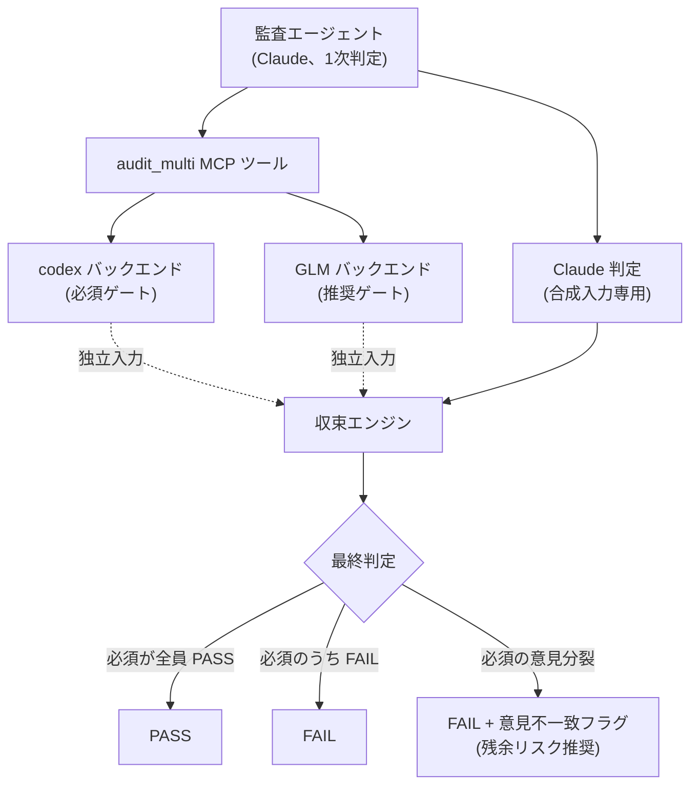
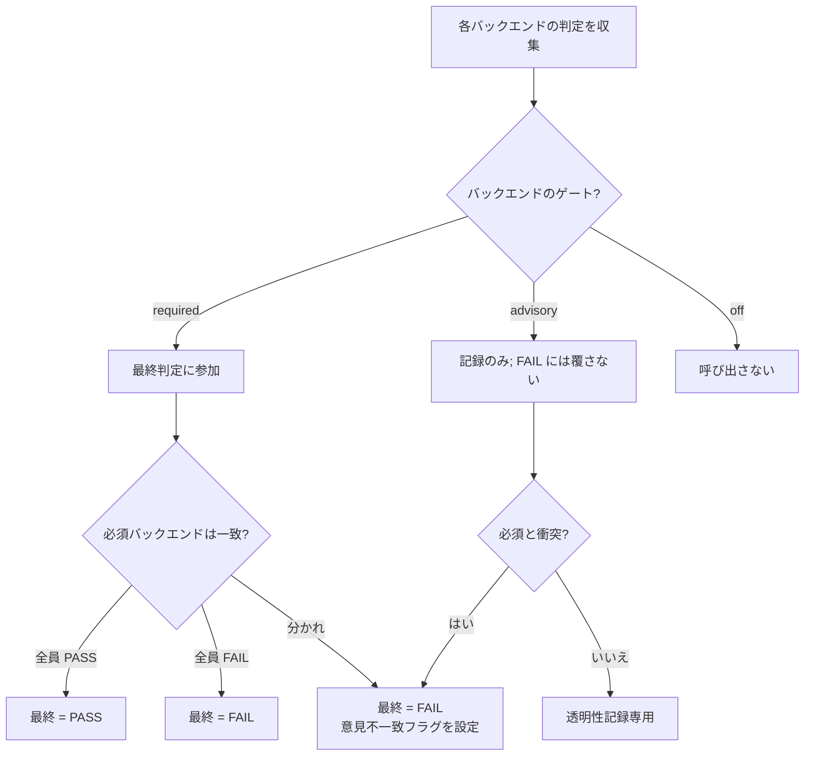




 <strong>所属価値</strong>: エージェンティックハーネス · エージェンティックループエンジニアリング


マルチモデル監査収束(multi-model audit convergence、複数のAIモデルが同じ成果物を交差検証し1つの最終判定にまとめる作業)は、MoAI-ADKが単一モデルの死角を減らす監査方式です。監査を担う管理者エージェント(manager agent、計画・実装・文書化・監査の各段階を担うエージェント)が下した判定を、別系統のモデルが独立に再び検証します。2つの判定が一致すれば信頼が加わり、2つの判定が分かれればどこが危険かが残余リスク(residual risk、検証を経ても残る不確実性)として明示されます。このページは、なぜこの二重検証が必要なのか、収束がどんな規則で回るのか、そして自律ループとどう出会うのかを扱います。

## なぜ単一モデル監査では足りないのか

監査(audit、成果物が基準を満たすかを独立して確認する段階)を1つのモデルにだけ任せると、そのモデルが持つ死角がそのまま監査結果に滲みます。あるモデルは特定パターンの誤りをよく捕まえるが別のパターンは見逃し、あるモデルはセキュリティ文脈に強いが並行性バグには弱い、といった具合です。設計報告書がこれを「Codexが賢いというより、別の風に賢い(differently smart)」と表現したのは同じ文脈です。異なる訓練データと推論の癖を持つモデルたちは、異なる盲点を持ちます。

問題は、盲点が無作為ではない点です。1つのモデルが見逃す誤りのかなりの部分は、そのモデルが繰り返し見逃すパターンです。だから同じモデルでもう1度検証しても大きな助けになりません。一方で系統の違うモデルを挟めば、2つのモデルともが見逃す交差死角(correlated blind spot、2以上のモデルが同じ理由で一緒に見逃す誤り領域)はぐっと縮みます。最初の検証者が見なかったものを2番目の検証者が捕まえる確率が上がるのです。

マルチモデル監査は、この交差死角を監査の設計から扱おうという選択です。監査をもう1度繰り返すのではなく、構造の異なる視線を一度に並行で回し、その結果を合わせます。

## super-review パターン — 独立した第2意見

マルチモデル監査の設計の骨格は、super-reviewパターン(super-review pattern、あるモデルが下した1次判定を別のモデルが独立に再検証する二重検証構造)です。3つの段階で進みます。第1に、セッション内のClaudeが1次分析を下します。第2に、codex(OpenAI系統のCLIツール)やGLM(z.aiのモデル)のような第2のバックエンドが同じ成果物を最初からもう1度見ます。第3に、オーケストレータが2つの判定を合わせて1つの最終判定を出します。

ここで独立性(independence、2次検証者が1次検証者の判定に影響されない状態)が鍵です。1次判定を2次検証者にあらかじめ見せると、2次検証者はその判定に引かれて同じ結論を繰り返すようになります。こうなると2度検証したという事実だけが無意味になります。だからMoAI-ADKはClaudeの1次分析をcodexやGLMに決して文脈として渡しません。Claudeの判定は合成段階でのみ入力として使われ、第2のバックエンドには渡されません。2番目の意見が本当に2番目であることを保証するのです。

図の点線は「各バックエンドがClaudeの1次分析を見ずに自分だけの入力で判定を下す」という独立性を表します。Claudeの判定は合成段階にだけ入り、codexとGLMの検証経路には混ざりません。

## 3つのバックエンドの役割分担

収束は基本的に3種類のバックエンド(backend、実際の監査を行うAIモデル)を扱います。Claudeはセッションの中で監査エージェントが直接分析した1次判定をそのまま持ってきます。別のモデル呼び出しはなく、エージェントがすでに作った結果を合成入力として書きます。codexはシステムがcodexバイナリを呼び出して成果物を検証します。GLMはz.ai APIを直接呼び出して同じ成果物を再び検証します。

各バックエンドは監査ゲート(audit_gate、そのバックエンドの判定を最終結果にどう反映するかを定める設定)という設定を持ちます。ゲートは3つです。`required`はそのバックエンドの判定が最終判定を左右する必須参加者です。`advisory`は判定が記録され残余リスクとして報告されるものの、最終判定を覆さない推奨参加者です。`off`はそのバックエントをそもそも呼ばないという意味です。既定のプロファイルはClaudeとcodexを必須に、GLMを推奨に置きます。このように2つの必須バックエンドを別系統に構成すること自体が、交差死角を減らす装置です。

## 収束アルゴリズム — 意見が分かれたとき

収束(convergence、複数バックエンドの判定を1つの最終判定にまとめる手順)は決まった順序に従います。第1に、必須ゲートのバックエンドが全員PASSなら最終判定はPASSです。第2に、必須ゲートのバックエンドのうち1つでもFAILなら最終判定はFAILです。第3に、必須ゲート同士で意見が分かれ、一方がPASS、一方がFAILなら、最終判定はFAILに落ち、同時に意見不一致フラグ(disagreement_flag、必須バックエンド間で判定が分かれたことを示す標識)が点きます。このフラグは残余リスク説明とともにオーケストレータの完了報告書(Verification Matrix、完了報告書の検証表)に推奨信号として現れます。第4に、推奨やoffに設定されたバックエンドは、決して最終判定をFAILへ覆しません。推奨バックエンドの判定は透明性のために記録され、必須バックエンドと衝突するときだけ意見不一致フラグを足します。

ここで重要な設計決定は、意見の不一致がそれ自体がブロック理由ではない点です。「必須の意見が分かれた」という新しいブロック範疇を作りません。代わりに、分かれは保守的な既定規則である「必須の1つでもFAILならFAIL」に従ってFAILとして処理され、分かれの事実は別の推奨信号として上がります。規則を単純に保てば、収束結果を読む側が「なぜFAILなのか」を一目で分かれます。

2つ目の図は、バックエンドのゲート設定が最終判定に至る経路を示します。推奨バックエンドは衝突があるときだけ意見不一致フラグを足すだけで、判定自体を変えることはありません。

## inconclusive — 読めなかったコードに判定を下さない

codex と GLM のバックエンドは、レビューすべき diff を収集できないと **呼び出し自体をせず**、判定を `inconclusive`(決定不能)とします。これはかつての欠陥の是正です — 以前はレビューするコードを確保できなかったバックエンドが、空の入力にも自信満々に判定を下し、実際の観測ではこのリポジトリに存在しないリポジトリホワイトリストを引用する `fail` まで出たことがあります。読んでいないコードについての判定はどちら向きであれ情報ではないため、収集失敗はバックエンド呼び出しなしで `inconclusive` に終わらせます。

バックエンド自身が `inconclusive` を宣言した場合も、収束はその値を **決定不能のまま** 読みます — 決して PASS へ合成しません。「必須バックエンドの PASS がなければ PASS を出せない」という保守規則と同じ筋です。判定なしを通過として数えると、必須ゲートの信頼が静かに漏れるからです。

収束判定の **記録場所** も監査されたツリーに従います。MCP サーバーは寿命の長いサブプロセスなのでワークツリーの切り替えに追従できず、以前は判定記録簿がプロセス開始時点の主チェックアウトに一度固定されて解決され、ワークツリー内で回した監査の判定がそのワークツリーのゲートが決して見ないディレクトリに積もっていました。現在は呼び出し時に指名された `project_root` ツリーの下に記録されます — ワークツリーから監査を回すとき、判定はそのワークツリーのゲートが読む場所に残ります(`project_root` 引数の使い方は [MCP サーバー](/ja/guides/mcp-server/) の文書を参照)。

## fail-open — 欠けたバックエンドが流れを止めない

マルチモデル監査はfail-open(fail-open、必須でない要素が欠けても全体の流れが止まらないように設計する原則)に従います。例えばGLMバックエンドを推奨ゲートとしてオンにしておいたのにAPI認証が未設定か呼び出しに失敗すると、そのバックエンドの判定は結果なしとして処理され、収束は残る活動バックエンドで続行します。推奨バックエンドが1つ欠けたからといって監査全体が止まったりエラーで終わったりしません。

ただし、必須ゲートに設定したバックエンドについては話が違います。必須バックエンドが欠けたり誤りを返したりするとその判定は結果なしとして扱われ、収束規則上、必須バックエンドのPASSがなければPASSは出せません。つまり必須バックエンドの不在は保守的に処理されてFAIL側に傾き、これは「必須に指定したならそれだけの信頼をかけている」という設定の意図と合致します。

このfail-openの正体は、自律ループでより重要になります。あるバックエンドの一時的な誤りで全体の自律ループを止めてはならないからです。だから欠けたバックエンドは「情報がない」という標識で記録され、残るバックエンドへと判定が引き継がれます。

## 自律ループとの出会い — multi-review-gate

マルチモデル監査は2つの経路で使われます。第1はplan-auditやsync-auditのような既存の監査段階です。監査エージェントが`moai-ref-cross-model-audit`スキルを呼び、セッション内のClaude判定をcodexとGLMで補強し、合わせた結果を自分の監査判定に反映します。この経路は既存のスキルルーティング規則にそのまま従うため、新しいルーティング機構が生まれません。

第2は完全自律のゴール収束ループです。`/moai goal`で完了条件を宣言し、セッションが人の介入なしに条件が満たされるまで作業させるとき、毎ターンの終わりに実行されるStop hook(Stop hook、ターンが終わるごとに実行される検査地点)がマルチモデル監査結果を読んでALLOWやBLOCKを出します。このゲートはmulti-review-gateと呼ばれ、既存のcodex-review-gateと同じ形式の自己ゲート(self-gate、このターンが本当の検証を必要とするコード修正かを自ら切り分ける装置)を持ちます。コード修正がないか状態報告のターンであれば即座にALLOWを出し、誤ったブロックを防ぎます。

鍵は、意見の不一致が自律ループを切らない点です。必須バックエンドが分かれればゲートは保守的にBLOCKを出しますが、推奨バックエンドだけの分かれは決してBLOCKに繋がりません。推奨水準の意見差は残余リスク推奨としてだけ上がり、ループは回り続けます。こうして自律ループの途切れない流れと、交差検証の安全網がともに生きています。

## まとめ

マルチモデル監査収束は、3つのことを同時に成立させます。系統の異なるモデルを並行で回して交差死角を減らし、明確な優先順位規則で判定を合わせ、意見の不一致をブロックではなく推奨として扱ってfail-openの正体を保ちます。1次判定を2次検証者に晒さないことで独立性が保たれ、欠けたバックエンドは結果なしとして処理されて全体の流れを止めません。そしてこれらがすべて、plan-audit・sync-auditのような既存の監査段階と完全自律ゴールループの同じMCP表面で動きます。監査をもう1度繰り返す代わりに視線をもう1本挟み込むこと、これがマルチモデル監査収束の核心です。
