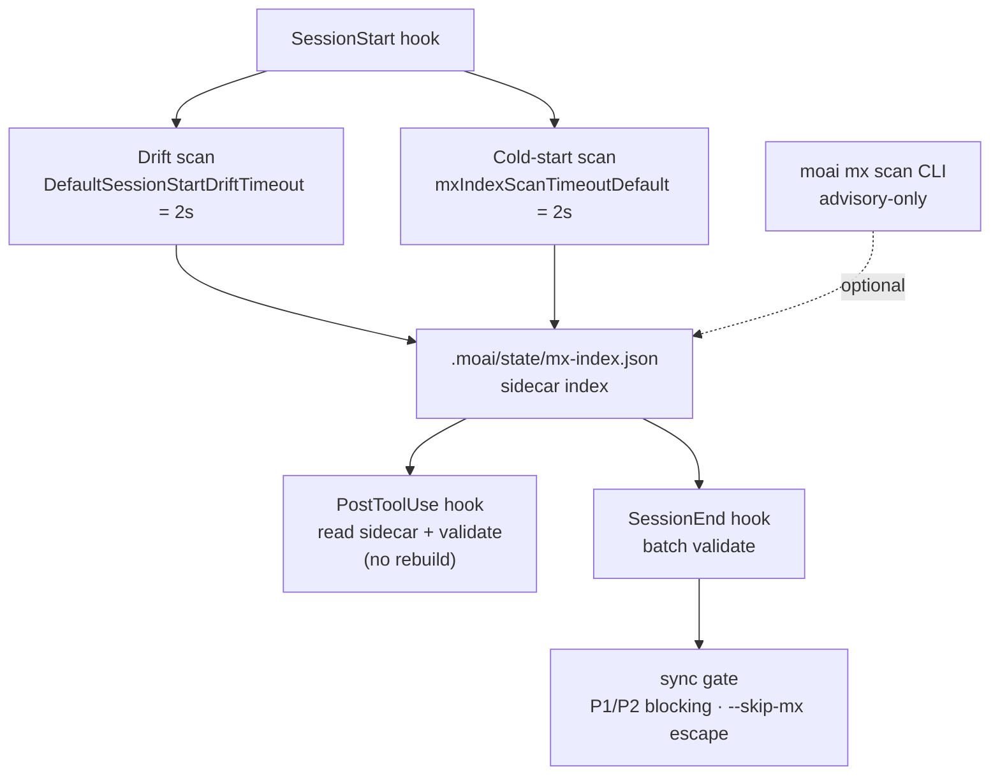

`moai mx` スキャナはコードベースを読み取って `@MX:` タグと結合したインデックスを作成し、複数のタイミングで検証を行います。本ドキュメントは、タグ文法の背後にある 4 つの動作 — rotRisk スコア、LSP fan-in エンジン選択、CGO でゲートされた複雑度計測、そしてスキャン自動化タイミング — をコードベースを基準に説明します。タグの書き方は [MX タグ](/ja/advanced/mx-tags)を、コマンド形式は [`moai mx`](/ja/utility-commands/moai-mx)を併せて参照してください。

## rotRisk スコア

`rotRisk`は `@MX:DEBT` タグにのみ存在するフィールドです。スキャナは DEBT タグをパースする際、常にこのフィールドを埋めます。他のタグ種別にはこのフィールドはありません。

値は `@MX:UPGRADE` サブラインの有無によって決まります。

- `@MX:UPGRADE`がない場合、`rotRisk`は文字列 `"no-trigger"`に設定されます。腐敗シグナルは「今すぐ危険」ではなく「アップグレード計画のない負債」である点がポイントです。
- `@MX:UPGRADE`が続く場合、`rotRisk`は空文字列で初期化され、サイドカーでは省略されます。アップグレードが計画された負債はもはや rot 候補ではありません。

 `@MX:CEILING`の有無は rot 判定基準ではありません。CEILING は「この限界値を把握している」という品質メモに過ぎず、腐敗ゲートとは別物です。rot ゲートは `@MX:UPGRADE`の有無のみで決まります。

`moai mx query --kind DEBT --json`結果で `"rotRisk": "no-trigger"`と表示される項目が、まさにアップグレード計画のない負債です。タグセマンティクスは [MX タグ - DEBT](/ja/advanced/mx-tags#debt)で改めて確認できます。

## LSP fan-in エンジン

`@MX:ANCHOR`が "fan_in ≥ 3" 閾値を満たすか検証する際、スキャナは 2 つの方式で呼び出し回数を数えます。

- **LSP 優先**: 有効な言語サーバがあれば `textDocument/references`を呼び出して正確な参照位置を収集します。この結果はサイドカーの `fan_in_method`フィールドに `"lsp"`として記録されます。
- **textual フォールバック**: LSP が利用できない場合は正規表現ベースの grep にフォールバックします。サイドカーには `fan_in_method: "textual"`と表示されます。

デフォルトの non-strict モードでは、LSP が欠落するとスキャナは静かに textual フォールバックに移行します。クエリ結果の `fan_in_method`フィールドがこの事実を公開するため、結果を解釈する際は常にこのフィールドを併せて確認する必要があります。

 LSP を強制するには環境変数 `MOAI_MX_QUERY_STRICT=1`を設定してください。このモードでは LSP が利用できない場合、スキャナは `LSPRequiredError`を返しフォールバックしません。CI のように正確性がフォールバックより重要な環境で使用します。

## CGO 複雑度計測

循環的複雑度と if 分岐数は tree-sitter で計測し、tree-sitter は CGO を必要とします。そのためビルドタグによって動作が大きく変わります。

- **non-CGO ビルド**: `//go:build !cgo`スタブファイルが、すべての言語入力に対して `Result{Supported: false}`を返します。これはフォールバック heuristic ではなくハードスタブです — non-CGO ビルドではいかなる言語も複雑度計測をサポートしません。
- **CGO ビルド**: tree-sitter が有効になりますが、次の場合にも結果は `Supported: false`になります — まだ scaffold のみの言語、1 MiB(1,048,576 バイト)を超えるファイル、パースエラー、クエリコンパイルエラー、関数本体が見つからない場合。

 `Supported: false`は静かなスキップです。スキャナは該当ファイルの複雑度を「計測できない」と分類し、次のファイルへ進みます。エラーを発生させず、ログは `slog.Debug`レベルでのみ残し、上位に伝播しません。

## スキャン自動化タイミング

スキャナは 5 つのタイミングで実行され、それぞれ異なる目的と制約を持ちます。

1. **明示的 CLI**: `moai mx scan`を実行すると、コードベース全体をスキャンしてインデックスを再構築します。advisory-only であり、いかなるフローもブロックしません。
2. **SessionStart 遅延コールドスタートスキャン**: セッション開始時にバックグラウンドで実行されます。大きなリポジトリでは時間がかかる場合があるため、**互いに異なる 2 つの 2 秒上限**で保護されます — `mxIndexScanTimeoutDefault`(コールドスタートスキャン自体の上限)と `DefaultSessionStartDriftTimeout`(ドリフト検査の上限)。2 つの上限は偶然同じ 2s 値を持つだけで、同じゲートではありません。失敗すると fail-open で処理されます。
3. **PostToolUse 検証**: ファイル編集後にサイドカー(`.moai/state/mx-index.json`)を読み込み、影響を受けたタグを検証します。このタイミングではインデックスを再ビルドしません。
4. **SessionEnd 一括検証**: セッション終了タイミングで一括検証を行います。
5. **sync ゲート**: `/moai sync`実行時に P1(exported 関数が fan_in ≥ 3 なのに ANCHOR 欠落)と P2(goroutine なのに WARN 欠落)はブロック動作、P3・P4 は advisory です。`--skip-mx`で脱出できます。

次のダイアグラムは、5 つのタイミングがサイドカーインデックスを中心にどう繋がるかを示します。ダイアグラムソースは 4 ロケールでバイト単位で同一に保たれます — 翻訳はダイアグラム周辺の prose のみに適用されます。

## 次のステップ

- [MX タグ](/ja/advanced/mx-tags) — 各タグ種別の文法とサブライン
- [`moai mx`](/ja/utility-commands/moai-mx) — scan/query/validate サブコマンド形式
