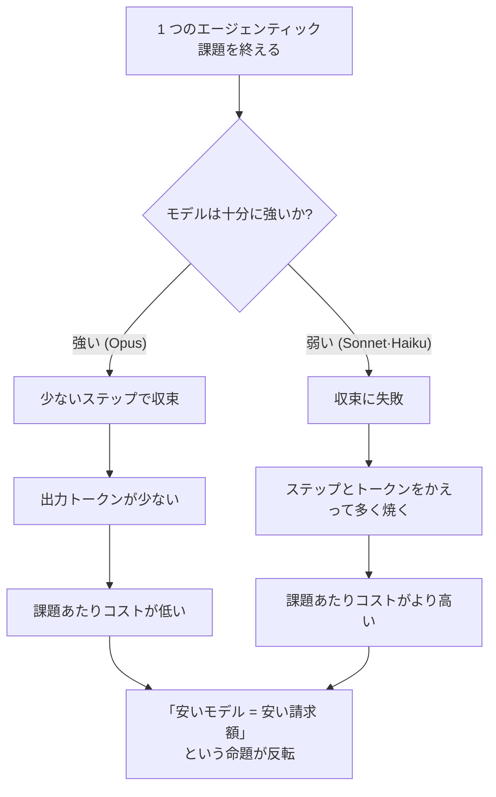
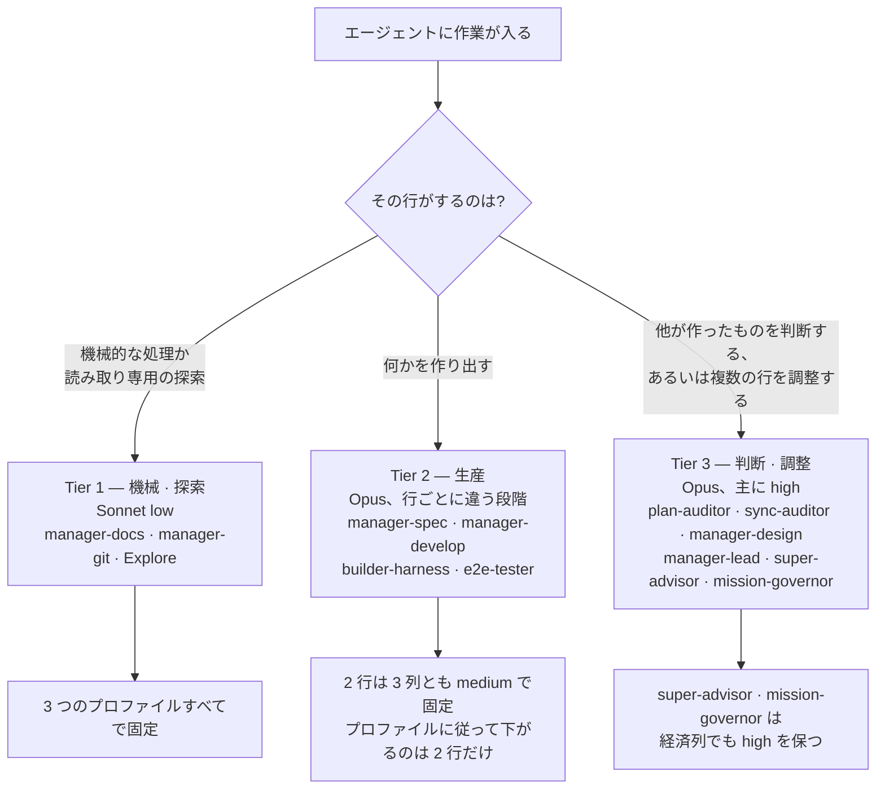

MoAI-ADK はルーティングモデルのセットから Haiku を外し、残ったモデルを作業の性格に合わせて 3 段階に分けて使います。このページは、友人にこう説明できるように書いたページです — *「安いモデルを忙しい場所に組み込めばコストが節約できそうに見えるが、長い息の課題では正反対になる。だから MoAI は、高いモデルをより頻繁に使う方がむしろ請求額を減らすということをデータで確認し、その上で作業種別ごとに 3 段階の割り当て規則を定めた」*。

ここで**エージェント** (agent、自ら判断して働く AI の助手) が課題を終えるのに使うモデルと、**effort** (推論の深さ、1 回の回答のためにモデルがどれだけ深く考えるかを決める 5 段階の `low` → `medium` → `high` → `xhigh` → `max`) が、コストを分ける 2 つの軸です。このページは、なぜこの 2 つの軸をこう割り当てたのか、なぜ Haiku を完全に外したのか、そしてこの「ティア」が自律性等級とは別の概念であるところまで扱います。

## 直感と現実が分かれる地点

よくある想定はこうです。「トークン単価の安いモデル (たとえば Sonnet · Haiku) を忙しい場所で回し、高いモデル (Opus) は重要な場所だけ大事に使えば、全体コストは下がるだろう。」トークン (token、モデルが読み書きする課金単位) の単価表だけを見れば、この想定は正しそうに見えます。

しかしこの想定が成り立つには、1 つの前提が要ります — *弱いモデルも結局、同じ課題を同じ回数で終えられる*という前提です。長い息のエージェンティック課題 (ツールを何度も呼び、自ら計画を直し、最後まで行って初めて終わる課題) では、この前提が崩れます。弱いモデルは収束に失敗し、失敗したぶんステップを余計に回し、出力トークンをより噴き出しながら課題を終えられません。トークン単価は安くても、*焼くトークン量*がはるかに多いため、課題あたりの請求額はむしろ大きくなります。

これがこのページ全体の出発点です。**請求額を決めるのは単価ではなく、完走効率です。**

## データが語るもの — DeepSWE リーダーボード

上の直感を確認した出所は、DeepSWE リーダーボードの **"All effort levels"** ビューです (113 tasks / 91 repos / 5 languages、mini-swe-agent ハーネス)。effort を段階別に報告するため、運用点 1 つではなく、各モデルのコスト · スコア曲線の形からティアを導出できます。

| モデル | effort | スコア | $/課題 | 出力トークン | ステップ |
|---|---|---|---|---|---|
| Opus 5 | low | 58% | $1.66 | 20k | 36 |
| Opus 5 | medium | 69% | $3.29 | 37k | 52 |
| Opus 5 | high | 73% | $6.08 | 64k | 73 |
| Opus 5 | xhigh | 73% | $9.07 | 92k | 89 |
| Opus 5 | max | 74% | $11.84 | 118k | 99 |
| Sonnet 5 | low | 31% | $2.19 | 36k | 77 |
| Sonnet 5 | medium | 40% | $4.08 | 57k | 108 |
| Sonnet 5 | high | 48% | $7.43 | 87k | 147 |
| Sonnet 5 | xhigh | 50% | $11.89 | 121k | 186 |
| Sonnet 5 | max | 54% | $26.40 | 214k | 268 |
| Fable 5 | high | 69% | $9.18 | 57k | 59 |
| Fable 5 | max | 70% | $21.63 | 119k | 88 |

MTok あたりの表示価格 (入力/出力): Opus 5 $5/$25 · Sonnet 5 $2/$10 (導入価格、2026-08-31 まで、以降 $3/$15) · Fable 5 $10/$50。

 **単価の逆転**: Sonnet のトークン単価は Opus より*低い*のに、比較可能なすべての地点で課題あたりコストはむしろ高くつきます — Opus 5 の `low` は $1.66 で 58% を取り、Sonnet 5 の `max` は $26.40 で 54% を取ります。「安いモデルで回せばクォータが節約される」という通念は、長い息のエージェンティック作業では成立しません。請求額を決めるのが単価ではなく完走効率だからです。

データから読み取れる結論は 4 つです。

1. **Opus 5 はすべての effort で Sonnet 5 をパレート支配します。** Opus の `low` (58%、$1.66) が Sonnet の 5 地点をスコアとコストの両軸で上回り、Sonnet `max` (54%、$26.40) も例外ではありません。「忙しいエージェントは安いモデルへ回す」というルーティング命題は、長い息のエージェンティック作業では反証されます。
2. **原因は単価ではなく完走効率です。** Sonnet は同じ課題セットを終えるのにステップを約 2.7 倍使います。課題を高くするのはトークン単価ではなく、そのように余計にかかったステップと出力トークンです。
3. **`xhigh` は Opus で純損失です。** `high` と `xhigh` はどちらも 73% なのに、`xhigh` はコストが 49% 余分にかかり、ステップも 22% 多く使います。Fable でも同じ場所で天井が平坦になります。膝を越えた effort が買うのはスコアではなく、トークンです。
4. **`medium` が膝です。** スコア 1 点あたりの限界コストは `low` → `medium` が $0.15、`medium` → `high` が $0.70 (4.7 倍)、`xhigh` → `max` が $2.77 (18.6 倍) です。デフォルトプロファイルが中核の実装エージェントを `medium` に固定する理由がここにあります。

## なぜ Haiku を完全に外すのか

Sonnet ですら、長い息の課題では Opus より課題あたりコストが高くつきます。Haiku は Sonnet よりさらに弱い。だとすれば Haiku をルーティングに入れても、能力は増えずステップの無駄だけが増えます — Sonnet ですでに観測された完走失敗パターンが、Haiku ではより急勾配で現れます。

そこで MoAI は Haiku をルーティングモデルのセットから完全に除外します (No-Haiku ポリシー、SPEC-AGENT-ARCH-V2-001 §D)。Haiku はモデル enum では今も有効な値なので、ドキュメントやサンプル YAML には登場しますが、実際のエージェント割り当てマトリクスのどの升にも入りません。Haiku を外しても、コストを下げる軸は残ります — モデルクラスを変える代わりに、effort (推論の深さ) を段階的に調節する側です。これが 3 ティア構造の出発点です。

## 3 ティア割り当て規則

残ったモデル (Opus、Sonnet) と effort を、作業の性格に応じて 3 段階に割り当てます。ここでの「ティア」は*作業種別に応じたモデル · effort の割り当て段階*を指します。

### Tier 1 — 機械 · 探索

 決まった手順をそのまま踏むか、読むだけで終わる仕事です。反復より入力がコストを左右し、弱いモデルを高くする原因であるマルチステップの完走失敗がここでは現れません。そのため Sonnet の低い入力単価が実質的な変数になり、`low` effort でステップ数を最小に抑えます。担当エージェントは `manager-docs` (ドキュメント整理)、`manager-git` (コミット · PR の機械作業)、`Explore` (読み取り専用の探索) の 3 つで、いずれも 3 つのプロファイル (経済 · 標準 · 品質) で `sonnet / low` に固定です — プロファイルを上げてもモデルクラスは上がりません。

### Tier 2 — 生産

 仕様を書き、コードを実装し、ハーネスを生成し、E2E シナリオを回す — 何かを**作り出す**行です。マルチターンなので完走効率がコストを分け、Opus の `low` がすでにどの effort の Sonnet よりもスコアが高く課題あたりコストは低いため、基本的に Opus が担います。

プロファイルはこの 4 行を**同じようには動かしません**。行ごとに違います。

| 行 | 品質列 | 標準列 | 経済列 |
|---|---|---|---|
| `manager-spec` | `opus / medium` | `opus / medium` | `opus / medium` |
| `manager-develop` | `opus / medium` | `opus / medium` | `opus / medium` |
| `builder-harness` | `opus / high` | `opus / medium` | `opus / low` |
| `e2e-tester` | `opus / medium` | `opus / low` | `sonnet / low` |

作成 · 実装の行である `manager-spec` と `manager-develop` は **3 列とも `medium` にとどまります** — 支出を生産側へさらに寄せない、というのがこのマトリクスの決定だからです。3 段階を丸ごと上下する行は `builder-harness` だけで、`e2e-tester` は経済列でモデルまで Sonnet に下がります。

### Tier 3 — 判断 · 調整

 他が作ったものを**判断する**、あるいは複数の行を**調整する**場所です。このマトリクスの原理が一行でここにあります — **支出は生産する行ではなく判断する行へ寄せる**。1 回の判断がその後のコストを大きく左右するからです。

| 行 | 品質列 | 標準列 | 経済列 |
|---|---|---|---|
| `plan-auditor` · `sync-auditor` | `opus / high` | `opus / high` | `opus / medium` |
| `manager-design` · `manager-lead` | `opus / high` | `opus / high` | `opus / medium` |
| `super-advisor` · `mission-governor` | `opus / high` | `opus / high` | `opus / high` |

`super-advisor` (エスカレーション経路) と `mission-governor` (封印されたミッションの判定) だけが、**経済列でも `high` を保ちます**。安い列でこそ健全に保つ価値がある場所が、まさにその 2 つだからです。

`mission-governor` は、この軸が「マルチターンかどうか」より優れている理由を示します。1 回読んで決定を 1 つ返す**単発**の行なので、マルチターン基準なら Sonnet 側にあるはずですが、実際には 3 列とも `opus / high` です。**判断する行だから**です。

`max` は**どの行も受け取りません**。`high` の上にある唯一の段階として語彙には残っていますが、現在それを持つセルは 0 です。`xhigh` もどこにも使いません — Opus で `high` とスコアが同じながら、コストだけ 49% 余分にかかります。

## モデルティアと自律性ティアは別物です

このページの「ティア」は、*どのモデルをどの推論の深さでどの作業に割り当てるか*についての割り当て段階です。名前が似て混同しやすいのですが、MoAI にはこれと**異なる**「ティア」がもう 1 つあります。


**名前だけ同じで対象が異なる 2 つのティア**
- **モデルティア** (このページ) — エージェントが*どのモデル · effort*で働くかを作業種別ごとに定めます。対象は**コスト · 品質**です。
- **自律性ティア** (`MOAI_AUTONOMY_TIER`) — エージェントが*人の承認なしにどこまで自律的に*行動できるかの等級です。対象は**権限 · 統制**です。


両者は直交します。あるエージェントが高いモデル · 高い effort で働いていても (モデルティアが高くても)、人の承認なしに自律的に行動できるわけではなく、逆も同じです。自律性ティアは別個の環境変数と 3 段階モード選択で扱われ、詳しくは[自律性ティア](/ja/advanced/autonomy-tier/)ページで解説します。

## 設計意図と実装された動作を読み分ける

 **正直性の区別**: このページは、設計段階の意図と実際に実装された動作を明確に分けて扱います。

**設計段階** (`.moai/reports/agent-architecture-redesign-v2-20260709.html`) — v2 アーキテクチャの設計意図です。3 ティアモデルポリシーの原則と DeepSWE の根拠を示します。

**実装された動作** — 実際のルーティングは単一のプロファイルマトリクスが担います。アクティブなプロファイル (`high` / `medium` / `low`) がマトリクスの 1 列を選ぶと、リゾルバが各エージェントの `{model, effort}` を決め、spawn 時点で model をランタイム引数として渡します。詳しいマトリクスは[プロファイルマトリクス](/ja/advanced/profile-matrix/)ページを参照してください。

読む側でも、設計意図 (このページの DeepSWE 根拠) と実装された動作 (単一プロファイルマトリクス) を区別して見る必要があります。

## このベンチマークが測れないもの

 **限界の明記**: このベンチマークが測定の対象とするのは**コーディング**エージェントです。ドキュメントの作成、監査の判断、SPEC (要件仕様書) の作成品質は直接測っていないため、該当する行の配置は観測ではなく、マルチターンのエージェンティック作業と似ているだろうという推論に依っています。信頼区間も併せて見る必要があります — `medium` (69%±1) と `high` (73%±2) は重なりませんが、`max` (74%±4) は `high` と重なります。これが `max` をどのセルにも割り当てていない理由です — 重なる区間のために余分に払うことになるからです。すべてのデフォルト値は `llm.agent_overrides` でエージェントごとに元に戻せます。

 **Fable 5 について**: Fable はコーディング作業ですべての effort で劣ります。Fable `high` (69%、$9.18) は、Opus `medium` (69%、$3.29) と同じスコアをほぼ 3 倍のコストで出します。だからどのマトリクスの升にも入れていません。モデル enum では今も有効な値で、GLM バックエンドの Fable スロットの配線もそのまま生きています — 変わったのはデフォルトだけです。

## ハーネス自己進化との接続

3 ティア割り当ては、ハーネスが自ら良くなるループの土台です。観察 → 反芻 → 昇格と続く進化ループが本来の力を発揮するには、観察段階のルーティング決定から、適切なモデルに適切な effort で行われる必要があります。誤った割り当てのルーティングは観察そのものを汚し、汚れた観察は昇格段階で誤ったルールを生みます。詳しくは[ハーネス自己進化](/ja/advanced/self-evolving/)ページを参照してください。

## 次のステップ

- [プロファイルマトリクス](/ja/advanced/profile-matrix/) — 単一の 3 列 per-agent プロファイルマトリクス (13 エージェント × 3 プロファイル = 39 セル)
- [自律性ティア](/ja/advanced/autonomy-tier/) — モデルティアと直交する、権限 · 統制が対象の自律性等級
- [トークノミクス概要](/ja/advanced/tokenomics-overview/) — 4 層トークノミクス構造のルーティング層
