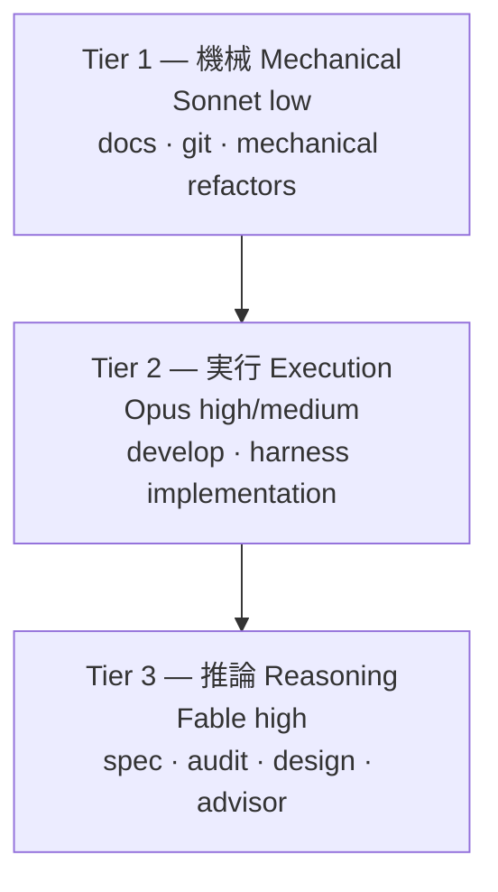

MoAI-ADK v3.0はHaikuをルーティングモデルセットから除外し、3層構造(Sonnet / Opus / Fable)で作業を分散します。この設計はDeepSWEリーダーボードの実測データに基づきます。このページはなぜHaikuを除外したか、3層がどう構成されるか、設計意図と実装された動作を区別して説明します。

## なぜHaikuを除外したか

DeepSWEリーダーボード(deepswe.datacurve.ai, 113 tasks, 2026-07-09)の核心の発見は「**弱いモデル + 高いeffort = 可用性の敵**」という点です。max effortでSonnet 5は268ステップ、214k出力トークンを消費し、過度な再試行ループを作ります。

| モデル [effort] | Pass@1 | 課題あたりコスト | $/解決課題 | トークン/解決課題 | ステップ |
|---|---|---|---|---|---|
| Fable 5 [max] | 70% | $21.63 | $30.9 | 170k | 88 |
| Opus 4.8 [max] | 59% | $13.22 | $22.4 | 229k | 120 |
| Sonnet 5 [max] | 54% | $26.40 | $48.9 | 396k | 268 |

 **単価逆転**: Sonnetの名目単価($3/$15)はOpus($5/$25)の半分ですが、課題あたりコストはOpus $13.22 < Sonnet $26.40に逆転します。Sonnetがトークンを1.6倍、ステップを2.2倍多く消費するためです。「安いモデルで回せばクォータが節約される」という通念は成立しません。

このデータの下でHaikuをルーティングに含めると機械的作業に不要なステップ浪費が発生します。代わりに機械作業にはSonnet low effortを割り当てステップ数を最小化します。

## 3層定義

作業性格に応じて3つのティアにモデルとeffortを割り当てます。

### Tier 1 — 機械 (Mechanical)

 ドキュメント作業、git操作、機械的リファクタリングは推論不要です。Sonnet low effortでステップ数を最小化します。担当エージェント: manager-docs, manager-git。

### Tier 2 — 実行 (Execution)

 実装、ハーネス生成は良い計画が与えられれば実行難度が下がります。Opus high(API)またはSonnet high(サブスクリプション)を割り当て、max-effortループ浪費をブロックします。担当エージェント: manager-develop, builder-harness。

### Tier 3 — 推論 (Reasoning)

 計画、監査、設計、助言は下流の手直し(= トークン浪費)を決定する段階です。Fable high(API)またはOpus high(サブスクリプション)に最高推論モデルを割り当てます。担当エージェント: manager-spec, plan-auditor, sync-auditor, manager-design, super-advisor。

## DeepSWEリーダーボード根拠

リーダーボード実測から導出された4つの結論:

1. **Sonnet 5 maxはClaude系で最悪の費用対効果** — Opus 4.8 maxより高く($26.40 vs $13.22)、スコアは低い(54% vs 59%)。原因は268ステップの過度な再試行ループ。高いeffortが高い価値を意味しません。
2. **API費用対効果1位はOpus 4.8** ($22.4/解決課題)。品質1位はFable 5 (70%)。Fableのプレミアムは解決課題あたり+$8.5。
3. **可用性の観点でもFable(170k) < Opus(229k) < Sonnet(396k)** — サブスクリプション週次限度はトークンベースなので、弱いモデルがむしろクォータを多く消費します。
4. **ステップ数 = 速度** — Fable 88 < Opus 120 < Sonnet 268。壁時計時間でも上位モデルが有利。

 **限界注記**: リーダーボードにはClaudeモデルのeffortバリアント(low/medium/high/xhigh)データがありません(全部max)。したがって「Sonnet xhigh vs high品質差」は直接実証不可能で、effort下げは(a) Sonnet 5 maxループ浪費実測、(b) Opus 4.8デフォルトeffortがhighというAnthropic公式ポジショニング、(c) effortが出力トークンに準線形という一般特性から推定したものです。

## 設計報告書 vs 実装

 **REQ-DA-061正直性区別**: このページの内容のうち設計段階と実装された動作を明確に区別する必要があります。

**設計段階** (`.moai/reports/agent-architecture-redesign-v2-20260709.html`) — v2アーキテクチャ設計意図。3層モデルポリシーの原則とDeepSWE根拠を提示します。

**実装された動作** — 単一のプロファイルマトリクスが実際のルーティングを実行します。アクティブプロファイル(`max`/`medium`/`low`)がマトリクスの 1 列を選択し、リゾルバが各エージェントの `{model, effort}` を決定して spawn 時点で model をランタイム引数として注入します。詳細なマトリクスは[プロファイルマトリクス](/ja/advanced/profile-matrix/)ページを参照してください。

読者は設計意図(このページのDeepSWE根拠)と実装された動作(単一のプロファイルマトリクス)を区別できなければなりません。

## ハーネス自己進化との接続

3層アーキテクチャはハーネス自己進化の基盤です。進化ループ(観察 → 反省 → 昇格)が効果を発揮するには、観察段のルーティング決定が正しいモデルに正しいeffortで行われる必要があります。自己進化の詳細は[ハーネス自己進化](/ja/advanced/self-evolving/)ページを参照してください。

## 次のステップ

- [プロファイルマトリクス](/ja/advanced/profile-matrix/) — 単一の 3 列 per-agent プロファイルマトリクス (10 エージェント × 3 プロファイル)
- [トークノミクス概論](/ja/advanced/tokenomics-overview/) — 4層トークノミクス構造のLayer Bルーティング
