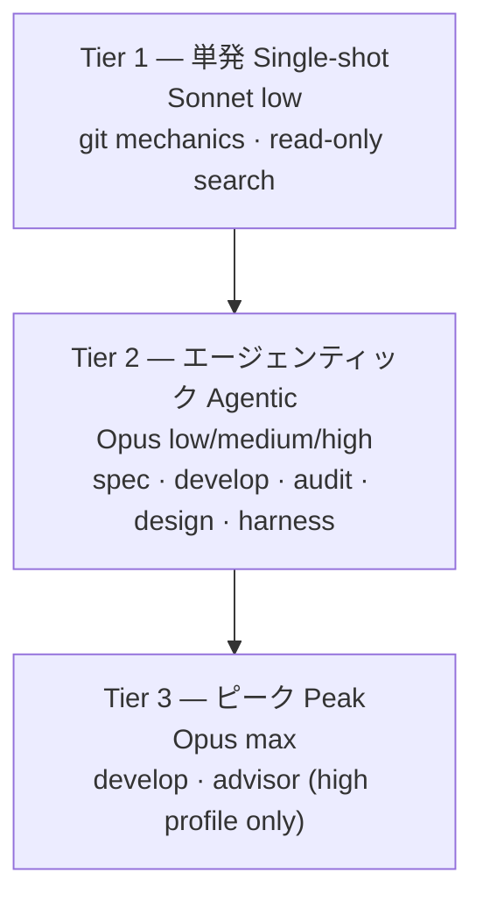

MoAI-ADK v3.0はHaikuをルーティングモデルセットから除外し、作業の性格に合わせた3層構造で作業を分散します。この設計はDeepSWEリーダーボードの実測データに基づきます。このページはなぜHaikuを除外したか、3層がどう構成されるか、設計意図と実装された動作を区別して説明します。

## なぜHaikuを除外したか

DeepSWEリーダーボードの核心の発見は「**弱いモデル + 高いeffort = 可用性の敵**」という点です。弱いモデルは長期ホライズンの課題をより安く終わらせるわけではありません — 収束しきれずに、より多くのステップとより多くの出力トークンを費やします。`max` effortでSonnet 5は268ステップ、214k出力トークンを消費しますが、同じ課題セットをOpus 5は99ステップで終えます。

以下の実測はリーダーボードの **「All effort levels」** ビュー(113 tasks / 91 repos / 5 languages、mini-swe-agent ハーネス)によります。effortが段階ごとに報告されるため、単一の運用点ではなく各モデルのコスト/スコア曲線の形からティアを導出できます。

| モデル | effort | スコア | $/課題 | 出力トークン | ステップ |
|---|---|---|---|---|---|
| Opus 5 | low | 58% | $1.66 | 20k | 36 |
| Opus 5 | medium | 69% | $3.29 | 37k | 52 |
| Opus 5 | high | 73% | $6.08 | 64k | 73 |
| Opus 5 | xhigh | 73% | $9.07 | 92k | 89 |
| Opus 5 | max | 74% | $11.84 | 118k | 99 |
| Sonnet 5 | low | 31% | $2.19 | 36k | 77 |
| Sonnet 5 | medium | 40% | $4.08 | 57k | 108 |
| Sonnet 5 | high | 48% | $7.43 | 87k | 147 |
| Sonnet 5 | xhigh | 50% | $11.89 | 121k | 186 |
| Sonnet 5 | max | 54% | $26.40 | 214k | 268 |
| Fable 5 | high | 69% | $9.18 | 57k | 59 |
| Fable 5 | max | 70% | $21.63 | 119k | 88 |

MTok あたりの表示価格(入力/出力): Opus 5 $5/$25 · Sonnet 5 $2/$10(導入価格、2026-08-31 まで。以降 $3/$15) · Fable 5 $10/$50。

 **単価逆転**: Sonnetのトークン単価はOpusを *下回る* のに、課題あたりコストは比較可能などの点でもOpusより高くなります — Opus 5の`low`は$1.66で58%、Sonnet 5の`max`は$26.40で54%です。「安いモデルで回せばクォータが節約される」という通念は、長期ホライズンのエージェンティック作業では成立しません。請求額を決めるのは単価ではなく完了効率だからです。

このデータの下でHaikuをルーティングに含めても、能力は増えずステップ浪費だけが増えます。代わりにSonnetは、マルチステップの完了失敗が当てはまらない単発・入力支配の作業に限定します。

## 3層定義

作業性格に応じて3つのティアにモデルとeffortを割り当てます。

### Tier 1 — 単発 (Single-shot)

 1パスで完了し、反復ではなく入力が支配的な作業です。弱いモデルを高価にする効果 — マルチステップの完了失敗 — がここでは当てはまらないため、Sonnetの低い入力単価が支配的要因になります。Sonnetの`low` effortでステップ数を最小化します。担当エージェント: `manager-git`, `Explore`。この2行は3つのプロファイル全体で固定されます。

### Tier 2 — エージェンティック (Agentic)

 マルチターンの行すべて — 計画、実装、監査、設計、ハーネス生成、ドキュメント、E2E。Opusの`low`がすでにどのeffortのSonnetよりも高スコアかつ課題あたり低コストであるため、Opusがそのすべてを担当します。プロファイルは各行がOpusのeffortラダー上のどこに位置するかを選びます: 経済列では`low`、デフォルト列では`medium`、品質列では`high`。担当エージェント: `manager-spec`, `manager-develop`, `plan-auditor`, `sync-auditor`, `manager-design`, `builder-harness`, `manager-docs`, `e2e-tester`。

### Tier 3 — ピーク (Peak)

 `max` effortは`high`プロファイルに限り、呼び出し頻度が最も低い2行 — `manager-develop`と`super-advisor` — にのみ限定されます。`medium`を超えると1ポイントあたりの限界コストが急に上がる(`low`→`medium`が$0.15/ポイントに対し`medium`→`high`は$0.70/ポイント)ため、ピークeffortは1つの判断が不均衡に大きな下流コストを持つ場所にだけ費やします。`xhigh`はどこにも使いません — Opus上では49%高いコストで`high`と同スコアです。

## DeepSWEリーダーボード根拠

effort段階別の実測から導出された4つの結論:

1. **Opus 5はすべてのeffortでSonnet 5をパレート支配します。** Opusの`low`(58%、$1.66)は、`max`のSonnet(54%、$26.40)を含むSonnetの5点すべてを両軸で上回ります。「忙しいエージェントは安いモデルに回す」というルーティング仮説は、長期ホライズンのエージェンティック作業では反証されます。
2. **原因は単価ではなく完了効率です。** Sonnetは同じ課題セットを終えるのに約2.7倍のステップを費やします。課題を高価にするのはトークン単価ではなく、追加のステップと出力トークンです。
3. **`xhigh`はOpus上で純損失です。** `high`と`xhigh`はどちらも73%ですが、`xhigh`はコストが49%高くステップが22%多くなります。同じ平坦な頂はFableにも現れます。変曲点より先のeffortが買うのはトークンであり、ポイントではありません。
4. **`medium`が変曲点です。** 1ポイントあたりの限界コスト: `low`→`medium` $0.15、`medium`→`high` $0.70(4.7倍)、`xhigh`→`max` $2.77(18.6倍)。デフォルトプロファイルが`manager-develop`を`medium`にアンカーするのはこの理由です。

 **限界注記**: このベンチマークが測定しているのは **コーディング** エージェントです。ドキュメント作成、監査判断、SPEC作成の品質は直接測定されていないため、それらの行の配置は観測ではなくマルチターンのエージェンティック作業との類似性推論に基づきます。信頼区間も重要です: `medium`(69%±1)と`high`(73%±2)は重なりませんが、`max`(74%±4)は`high`と重なります — これが`max`を呼び出し頻度の低い2セルに限定する理由です。すべてのデフォルトは`llm.agent_overrides`でエージェント単位に元へ戻せます。

 **Fable 5について**: Fableはコーディング軸ではすべてのeffortで劣位です — Fableの`high`(69%、$9.18)はOpusの`medium`(69%、$3.29)とほぼ3倍のコストで並ぶだけ — したがってどのマトリクスセルにも現れません。モデルenumの有効な値としては残り、GLMバックエンドのFableスロットとして配線も維持されます。変わったのはデフォルトだけです。

## 設計報告書 vs 実装

 **REQ-DA-061正直性区別**: このページの内容のうち設計段階と実装された動作を明確に区別する必要があります。

**設計段階** (`.moai/reports/agent-architecture-redesign-v2-20260709.html`) — v2アーキテクチャ設計意図。3層モデルポリシーの原則とDeepSWE根拠を提示します。

**実装された動作** — 単一のプロファイルマトリクスが実際のルーティングを実行します。アクティブプロファイル(`high`/`medium`/`low`)がマトリクスの 1 列を選択し、リゾルバが各エージェントの `{model, effort}` を決定して spawn 時点で model をランタイム引数として注入します。詳細なマトリクスは[プロファイルマトリクス](/ja/advanced/profile-matrix/)ページを参照してください。

読者は設計意図(このページのDeepSWE根拠)と実装された動作(単一のプロファイルマトリクス)を区別できなければなりません。

## ハーネス自己進化との接続

3層アーキテクチャはハーネス自己進化の基盤です。進化ループ(観察 → 反省 → 昇格)が効果を発揮するには、観察段のルーティング決定が正しいモデルに正しいeffortで行われる必要があります。自己進化の詳細は[ハーネス自己進化](/ja/advanced/self-evolving/)ページを参照してください。

## 次のステップ

- [プロファイルマトリクス](/ja/advanced/profile-matrix/) — 単一の 3 列 per-agent プロファイルマトリクス (11 エージェント × 3 プロファイル = 33 セル)
- [トークノミクス概論](/ja/advanced/tokenomics-overview/) — 4層トークノミクス構造のLayer Bルーティング
