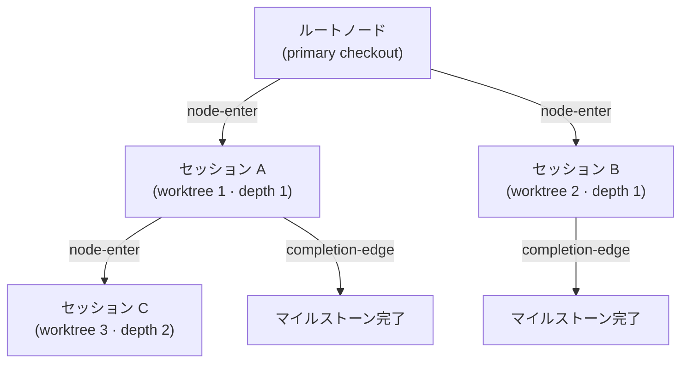

# セッション系譜チェーン (Origin-Trail Chain)


 <strong>属する価値</strong>: エージェンティックループエンジニアリング · セッションの連続性


Origin-Trail Chain は、worktree セッションがどこから分岐したかを記録する append-only の系譜台帳です。worktree の中でセッションを始めるとノードがひとつ作られ、親子のエッジが「このセッションはあのセッションから分かれた」と書き残します。`/clear` のあとで深くネストした worktree に入り直しても、どのマイルストーンまで終わり、次に何をすればよいかを、grep やスクロールバックを掘り返さずに取り戻せます。

チェーンはファクトリーモードとは独立しています。ファクトリーリーダーもレーンも要りません。`moai cc -w <名前>` のように worktree を指定して起動したセッションは、すべてチェーンに載ります。このページでは、チェーンが何をいつ記録するのか、どう保存されるのか、そして照会用の `moai chain` コマンドを説明します。

## このチェーンが解く問題

**深さの健忘** (depth amnesia): worktree の中からさらに worktree セッションを起動する場面が重なると、`/clear` 後に入り直したセッションは「自分の祖先は誰だったか」を忘れてしまいます。以前は grep とスクロールバックの発掘で復元するしかありませんでした。チェーンは `origin_chain` フィールドにルートからそのノードまでの ID 経路をまるごと持たせているので、探索せずに一度の参照で系譜が戻ります。

**途切れた引き継ぎ**: 子セッションが終わっても親がそれを知らなければ、親は終わった仕事を待ち続けます。チェーンはセッションの終了時に `completion-edge` イベントを残し、最後に完了したマイルストーンと次に再開する作業(`resume_target`)を一緒に書きます。親セッションが落ちていても、クリアされていても、台帳は最新のまま残ります。

## いつ記録されるか

台帳に書き込むのは3か所で、どれが失敗してもセッションは止まりません(fail-open)。チェーンは補助的なテレメトリであり、ゲートではないからです。

| タイミング | 書き込む側 | 内容 |
|------------|------------|------|
| worktree を指定してセッションを開始 | ランチャー (`moai cc -w <名前>`) | `node-enter` を追記し、新しいノード ID を環境変数 `MOAI_CHAIN_NODE_ID` で子に渡す |
| 子セッションの SessionStart | SessionStart フック | `node-update` でセッション ID を埋める。`/clear` で環境変数が消えていたら、台帳からノードを探して復元し、系譜の案内を出力する |
| サブエージェントやセッションの終了 | `chain-event` フック (SubagentStop) | 親子の `completion-edge` を追記する |

ランチャーがノードを作るのは、`-w` に名前が付いているときだけです。名前のない `-w` は Claude Code が名前を自動で決めるためランチャーがパスを知れず、`-c`(続行)は新しいセッションを生むのではなく既存のセッションを開き直すだけなので、どちらも記録しません。

## append-only のイベントストリーム

チェーンは `.moai/state/chain/events.jsonl` に保存されます。書き込みはすべて `O_APPEND` で1行ずつ追記します。上書きも切り詰めもなく、同時の append はカーネルが直列化するため、複数のセッションが同時に書いても1行が別の行を壊すことはありません。



ストリームに積まれるイベントは3種類です。

| イベント | 記録される時点 | 内容 |
|----------|----------------|------|
| `node-enter` | worktree セッションの開始時 | ノード ID、親ノード、深さ、系譜の経路、worktree パス、SPEC ID、進入時刻 |
| `node-update` | 子の SessionStart、またはマイルストーンの更新時 | セッション ID の埋め戻し、マイルストーンと再開目標の更新 |
| `completion-edge` | サブエージェントやセッションの終了時 | 親子のノード、完了したマイルストーン、次の再開目標 |

ファイルは平らなイベントの一覧にすぎません。各ノードの現在の状態は、読み出すときにイベントを頭から再生して導きます。書き換える木構造のファイルはどこにもありません。壊れた行は警告を出して読み飛ばします。

## ノードの13フィールド

ノードは読み出し時に、13のフィールドを持つ状態ビューとして組み立てられます。

| フィールド | 意味 |
|------------|------|
| `node_id` | 時系列で並べられる一意の ID。ミリ秒タイムスタンプ(16進)に乱数4バイトを続けた形 |
| `parent_node_id` | このノードを生んだ親ノード。ルートなら空 |
| `depth` | ネストの深さ。primary checkout が 0、最初の worktree が 1 |
| `origin_chain` | ルートからこのノードまでの ID 経路 |
| `worktree_path` | worktree の絶対パス |
| `session_id` | ランタイムが割り当てる Claude Code のセッション ID。2段階で埋まる |
| `spec_id` | このノードが取り組んでいる SPEC |
| `milestone` | 現在のマイルストーンのラベル |
| `entered_at` | ノードが作られた時刻 (RFC 3339) |
| `exited_at` | セッションが終わった時刻。終了イベントではなく、ハートビートがどれだけ古いかから導く |
| `last_completed_milestone` | 最後に完了と記録されたマイルストーン |
| `resume_target` | 再開時にやることの1行説明 |
| `resume_command` | 再開時に実行するコマンドひとつ |

## 同じパスを使い回したとき

worktree を削除して同じパスに作り直すと、別々のセッションが同じ `worktree_path` を持つことになります。チェーンは `(worktree_path, session_id)` の組で見分けます。

1. **主キー**: 両方の値が一致するノードを探します。同じパスで複数が該当すれば、いちばん新しいものを採ります。
2. **代替キー**: セッション ID が空、または一致するノードがない場合は、そのパスで最後に入ったノードを採ります。セッション ID を渡したのに一致がなかったときは、警告を残します。

`/clear` のあとに「このパスの現在のノードはどれか」を取り戻すとき、この規則が使われます。

## セッション ID は2段階で埋める

worktree セッションを起動する時点では、セッション ID はまだ分かりません。Claude Code のランタイムが ID を割り当てるのは、子プロセスが動き出したあとだからです。そのため作業を2段に分けています。

1. **セッション開始時**: ランチャーが `session_id` を空のまま `node-enter` を追記し、新しいノード ID を `MOAI_CHAIN_NODE_ID` で子に渡します。
2. **子の SessionStart**: ランタイムがセッション ID を割り当てたあと、`node-update` で `session_id` を埋めます。

## moai chain コマンド

台帳を読む照会コマンドが5つあります。どれもファクトリー機能には依存せず、ユーザーに問い返すこともありません。

| コマンド | 出力 |
|----------|------|
| `moai chain status` | 現在のノードの要約。深さ、ノード ID、親、SPEC、マイルストーン、完了したマイルストーン、再開目標、セッション、worktree |
| `moai chain lineage` | ルートから現在のノードまでの系譜。ノードごとにパス、SPEC、マイルストーン、進入時刻 |
| `moai chain back` | 親ノードの再開目標 (`resume target`)、再開コマンド (`resume cmd`)、worktree パス |
| `moai chain list` | すべてのノードの深さ、セッション、状態 (`active` / `stale` / `exited`)、worktree |
| `moai chain prune` | 古い終了ノードをアーカイブにまとめる。既定はプレビューで、実際に実行するには `--no-dry-run` を付ける |

```bash
$ moai chain status
depth:     2
node:      0199a3f1c2b7e-9f3a21c4
parent:    0199a3f0d81a2-51be07aa
spec:      SPEC-AUTH-001
milestone: M2
resume:    M3 から実装を続ける
worktree:  /path/to/.claude/worktrees/auth-m2
```

`list` の状態は、セッションレジストリを重ねて判定します。セッション ID がない、またはレジストリから消えたノードは `exited`、最後のハートビートが15分より古いノードは `stale`、それより新しければ `active` です。`prune` は、台帳が30日を超えたか10MB を超えたときに、終了済みの古いノードをまとめます。


 台帳がない場合や、現在のパスに合うノードがない場合、コマンドはエラーにせず `no chain context` 系の1行を出力して正常終了します。


## 限界と境界

- **単一ホストの v1 です。** リモートのパス (`ssh://` など) では、系譜は未対応という案内だけを出力します。マシンをまたぐ系譜は扱いません。
- **補助的なテレメトリです。** 台帳に書けなくてもセッションは通常どおり始まります。チェーンの記録は、どの承認ゲートの代わりにもなりません。
- **照会専用の CLI です。** セッションを起動したり移動したりするコマンドはありません。チェーンが教えるのは戻る先までで、戻る操作は `moai cc -w <パス>` か、セッション内での worktree 進入が担います。

## 関連ドキュメント

- [ファクトリーモード](/ja/advanced/factory-mode)(リーダー1つとレーン複数がカードを運ぶマルチセッション実行)
- [moai web コンソール](/ja/advanced/moai-web-console)(セッションとカードの状態をブラウザで見る画面)
- [`moai worktree`](/ja/cli-reference/worktree)(worktree の作成と後片付け)
