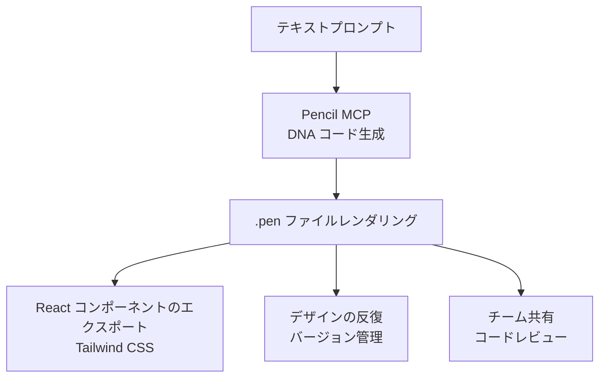
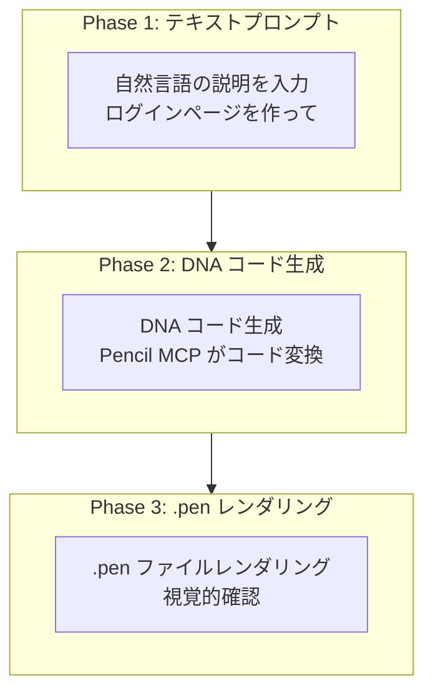
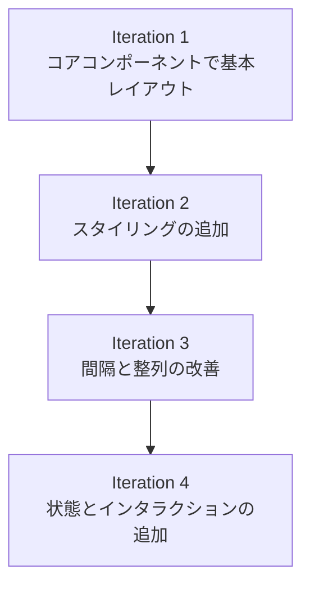
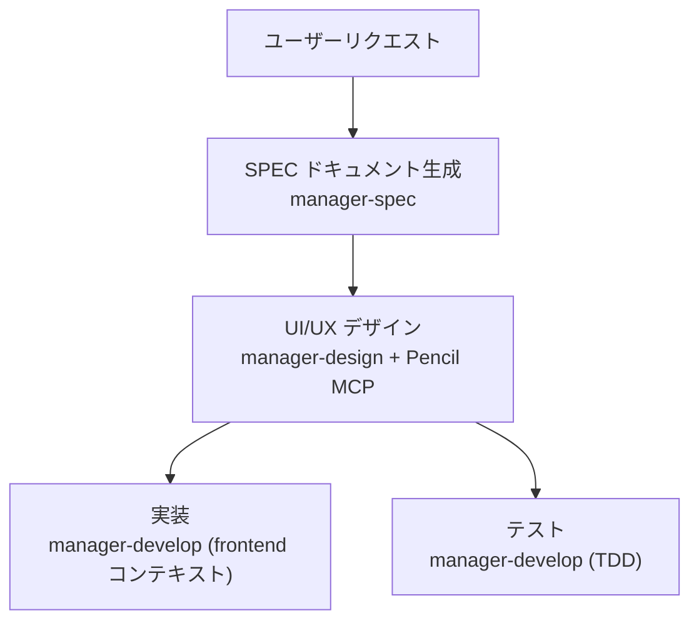

Pencil MCP サーバーを活用して AI ベースの UI/UX デザインを生成する方法を詳しく解説します。デザインをコードで管理するという Pencil の哲学は、MoAI-ADK のハーネス哲学と同じ流れです — バージョン管理され、レビュー可能で、エージェントが直接扱える形にすること。


**ひと言要約**: Pencil は **コードベースのデザインツール** です。MCP サーバーを通じて Claude Code から直接 UI を生成し、.pen ファイルで管理し、プロダクションコードとしてエクスポートできます。


## Pencil とは?

Pencil は開発環境で直接作業できる **AI ベースのデザインツール** です。デザインとコードの間のギャップを解消し、開発者が Figma のような別のデザインツールなしでも一貫した UI を生成できます。



### 主な機能

| 機能 | 説明 |
|------|------|
| **DNA コード** | UI を宣言的コードで表現 (バージョン管理可能) |
| **テキスト・トゥ・デザイン** | 自然言語の説明で UI 画面を生成 |
| **.pen ファイル** | 暗号化されたデザインファイル形式 |
| **React エクスポート** | Tailwind CSS が適用されたプロダクションコードを生成 |
| **無限キャンバス** | 大規模デザインプロジェクトをサポート |
| **チームコラボレーション** | コードベースのデザインレビュー |


Pencil は **オープンソースのデザインフォーマット** を使用し、.pen ファイルはコードベースで直接管理できます。詳細は https://pencil.dev をご覧ください。


## 事前準備

Pencil MCP を使うには次の設定が必要です。

### サポートされる AI アシスタント

Pencil は MCP (Model Context Protocol) を通じてさまざまな AI ツールと統合されます。

| AI ツール | サポート形態 | 備考 |
|---------|----------|------|
| **Claude Code** | CLI と IDE | 最も推奨される方式 |
| **Claude Desktop** | デスクトップアプリ | 個人利用に適する |
| **Cursor** | AI-powered IDE | コードベース認識機能 |
| **Windsurf IDE** | Codeium | 最新の IDE オプション |
| **Codex CLI** | OpenAI | ターミナルベースのワークフロー |
| **Antigravity IDE** | 専用 IDE | Pencil 専用拡張 |
| **OpenCode CLI** | CLI 環境 | スクリプト可能 |

### Step 1: Pencil のインストール

Pencil アプリまたは IDE 拡張をインストールしてください。

- **macOS/Windows/Linux**: Pencil デスクトップアプリをダウンロード
- **VS Code/VSCode-insiders**: Pencil 拡張をインストール
- **Cursor**: Pencil 拡張をインストール

### Step 2: Pencil の起動

Pencil を起動すると MCP サーバーが自動的に開始されます。別途インストールや設定は不要です。

```bash
# Pencil アプリが実行中か確認
# Pencil が実行中なら MCP サーバーが自動的に開始されます
```

### セキュリティとプライバシー


**ローカル専用のセキュリティ**: Pencil MCP サーバーは **完全にローカルで実行** されます。デザインファイルはリモートサーバーへ送信されず、すべてのデザインデータがローカルマシンに保管されます。


| セキュリティ特性 | 説明 |
|----------|------|
| **ローカル専用** | MCP サーバーはユーザーのマシンでのみ実行 |
| **リモートアクセスなし** | デザインファイルはローカルに維持 |
| **プライベートリポジトリ** | ソースコードは公開されない |
| **ツール検査** | IDE 設定で使用可能なツールを確認可能 |

## MCP 設定

### Claude Code 設定

Pencil が実行中なら Claude Code が自動的に MCP サーバーを検出します。

```json
{
  "permissions": {
    "allow": [
      "mcp__pencil__*"
    ]
  }
}
```

### 接続確認

設定が完了すると Claude Code で Pencil ツールを使えます。

```bash
# Claude Code で実行
> Pencil でログインボタンを生成して
```

## MCP ツール一覧

Pencil MCP はさまざまなツールを提供します。

### 主要ツール

| ツール | 用途 |
|------|------|
| `open_document` | 新規 .pen ファイルの作成または既存ファイルを開く |
| `get_editor_state` | 現在のエディタ状態、選択情報、アクティブファイルの確認 |
| `batch_design` | 複数のデザイン要素を一括で生成/修正 |
| `batch_get` | 複数のノード情報を一括で照会 |
| `get_screenshot` | .pen ファイルのスクリーンショットをキャプチャ |
| `snapshot_layout` | レイアウト構造の分析 |
| `get_guidelines` | デザインガイドラインの照会 |
| `get_style_guide` | スタイルガイドの照会 |
| `get_style_guide_tags` | スタイルガイドタグの検索 |
| `get_variables` | デザイン変数/テーマの読み取り |
| `set_variables` | デザイン変数/テーマの設定 |
| `find_empty_space_on_canvas` | キャンバスで空きスペースを探す |
| `search_all_unique_properties` | すべてのユニークな属性を検索 |
| `replace_all_matching_properties` | マッチするすべての属性を変更 |
| `generate_image` | AI で画像を生成 |

### ツール選択ガイド

| 目的 | 使うツール |
|------|-------------|
| 新しいデザインを開始 | `open_document` |
| コンポーネントの生成 | `batch_design` |
| デザインのプレビュー | `get_screenshot` |
| デザインのエクスポート | Pencil Editor で Export |
| スタイルの参照 | `get_style_guide` |
| レイアウトの分析 | `snapshot_layout` |
| 変数の管理 | `get_variables`, `set_variables` |
| 空きスペース探し | `find_empty_space_on_canvas` |
| 属性検索 | `search_all_unique_properties` |
| 一括変更 | `replace_all_matching_properties` |

## DNA コードフォーマット

Pencil は DNA コードという宣言的フォーマットで UI を表現します。

### 基本構造

```dna
// ボタンコンポーネントの DNA コード
component Button {
  variant: primary
  size: medium
  content: "クリックしてください"
  onClick: handleSubmit
}
```

### レイアウト構造

```dna
// ログインフォームのレイアウト
layout LoginForm {
  direction: column
  spacing: 16
  children: [
    Input {
      placeholder: "メールアドレス"
      type: email
    }
    Input {
      placeholder: "パスワード"
      type: password
    }
    Button {
      variant: primary
      content: "ログイン"
    }
  ]
}
```

### デザイントークン

```dna
// トークン参照
color: primary.500
spacing: md
radius: lg

// トークン定義
tokens {
  primary.500 = #3B82F6
  md = 16px
  lg = 8px
}
```

## デザイン生成ワークフロー

Pencil でデザインを生成する 3 段階パターンです。



### 実践例: E-Commerce カード

```bash
# Phase 1: テキストプロンプトでデザインをリクエスト
> 商品カードを作って。上部に商品画像、中央にタイトルと価格、
# 下部にカートボタン。すっきりしたミニマルスタイルで

# Phase 2: Pencil が DNA コードを生成
# → component ProductCard { ... }

# Phase 3: .pen ファイルとしてレンダリング
# → open_document 後 batch_design で生成
```


**核心**: Pencil は **デザインをコードで管理** します。.pen ファイルは Git でバージョン管理でき、コードレビュープロセスに統合できます。


## React コンポーネントのエクスポート

Pencil Editor で .pen ファイルを React コンポーネントとしてエクスポートできます。

### エクスポート設定

```typescript
// pencil.config.js
module.exports = {
  framework: 'react',
  styling: 'tailwind',
  output: './src/components/generated',
  options: {
    typescript: true,
    responsive: true,
    accessibility: true
  }
};
```

### 生成されたコンポーネントの例

```typescript
export interface ButtonProps {
  variant?: 'primary' | 'secondary' | 'tertiary';
  size?: 'small' | 'medium' | 'large';
  isLoading?: boolean;
}

export const Button = ({ variant = 'primary', size = 'medium', isLoading, children, ...props }: ButtonProps) => {
  const baseStyles = 'inline-flex items-center justify-center font-medium rounded-md transition-colors';

  const variantStyles = {
    primary: 'bg-blue-600 text-white hover:bg-blue-700',
    secondary: 'bg-gray-200 text-gray-900 hover:bg-gray-300',
    tertiary: 'bg-transparent text-gray-700 hover:bg-gray-100'
  };

  const sizeStyles = {
    small: 'px-3 py-1.5 text-sm',
    medium: 'px-4 py-2 text-base',
    large: 'px-6 py-3 text-lg'
  };

  return (
    <button className={`${baseStyles} ${variantStyles[variant]} ${sizeStyles[size]}`} {...props}>
      {isLoading ? '読み込み中...' : children}
    </button>
  );
};
```

## プロンプト作成ガイド

Pencil で良い結果を得るには構造化されたプロンプトが重要です。

### 良いプロンプト vs 悪いプロンプト

| 悪いプロンプト | 良いプロンプト |
|--------------|--------------|
| 「かっこいいボタンを作って」 | 「青い背景の中サイズの基本ボタン。『確認』テキスト、16px パディング」 |
| 「ダッシュボード」 | 「サイドバーナビゲーション付きの分析ダッシュボード。上部 3 つの指標カード (売上、ユーザー、転換率)、ラインチャート、テーブル」 |
| 「レスポンシブ」 | 「モバイル: 縦スタック、デスクトップ: 3 列グリッド」 |

### 効果的なプロンプトテンプレート

```
[コンポーネントタイプ]を生成して。
[コンポーネントリスト]を含む。
[レイアウト]で配置。
[スタイル]を適用。
[レスポンシブ]を考慮。
```

### 実践プロンプト例

**デザイン生成:**

```bash
# ダッシュボード生成
「サイドバーとメインコンテンツ領域のあるダッシュボードを作って」

# 料金表の生成
「3 段階の料金表を作って。基本、プロ、エンタープライズ」

# ヒーローセクション
「タイトルと CTA ボタンのあるヒーローセクションを追加して」
```

**デザイン修正:**

```bash
# 色の変更
「すべての基本ボタンを青に変更して」

# サイズ調整
「サイドバーをもっと狭くして」

# 間隔の追加
「これらの要素の間に間隔を追加して」
```

**デザインシステム:**

```bash
# ボタンコンポーネント
「バリアント付きのボタンコンポーネントを作って」

# カラーパレット
「#3b82f6 をベースにカラーパレットを生成して」

# タイポグラフィ
「タイポグラフィスケールを作って」
```

**コード統合:**

```bash
# React コード
「このコンポーネントの React コードを生成して」

# インポート
「うちのコードベースから Header を取り込んで」

# Tailwind 設定
「これらの変数から Tailwind 設定を作って」
```


**Golden Rule**: プロンプトは **具体的であるほど** 良いです。色、間隔、整列、インタラクションを明確に指定してください。


## Cursor で使う

Cursor は AI ベースの IDE で、Pencil と強力な統合を提供します。

### 設定

1. Cursor で Pencil 拡張をインストール
2. アクティベーション完了
3. Claude Code 認証
4. MCP 接続の確認: Settings → Tools & MCP

### Cursor 専用機能

**インライン編集:**

- Pencil で要素を選択
- Cursor の AI チャットで修正
- 変更が `.pen` ファイルに即座に適用

**コードベース認識:**

- Cursor がコードとデザインの両方を確認
- コンポーネント間の同期をリクエスト
- 自動で一貫性を維持

### 一般的な問題

**"Need Cursor Pro":**

- 一部の機能は Cursor Pro サブスクリプションが必要な場合あり
- 現在の制限事項は Cursor の料金表を確認

**プロンプトパネルの欠落:**

- アクティベーション/ログイン状態の確認
- Cursor の再起動
- 設定で MCP 接続の確認

## Codex CLI で使う

### 設定

1. **まず Pencil を起動** - デスクトップアプリまたは IDE 拡張を開始
2. ターミナルで Codex を開く
3. MCP 接続の確認: `/mcp`
4. **Pencil が MCP サーバー一覧に表示される必要あり**

### Codex での作業

**ターミナルからのデザインプロンプト:**

```bash
# Codex CLI で
> design.pen にボタンコンポーネントを作って
> ランディングページにヒーローセクションを追加して
> 青をベースにカラースキームを生成して
```

**利点:**

- コマンドラインワークフロー
- スクリプト可能なデザイン生成
- ビルドツールとの統合

### 既知の問題

**Codex config.toml の変更:**

- Pencil が設定を修正または複製する可能性
- 問題は確認済みで調査中
- 初回使用前に設定をバックアップ

## 高度なワークフロー

### 自動化されたデザイン生成

**スタイルガイド:**

```bash
# 特定のデザインシステムに従う
「Material Design の原則を使ってダッシュボードを作って」

「モダンなミニマル美学でランディングページをデザインして」

「design-system.pen のデザインシステムに従うコンポーネントを作って」
```

**一括作業:**

```bash
# ボタンバリアント
「このボタンコンポーネントの 5 つのバリアントを作って」

# 完全なフォーム
「すべての入力タイプがある完全なフォームを生成して」

# ランディングページ全体
「ヒーロー、機能、料金、フッターのあるランディングページ全体をデザインして」
```

### デザインシステム管理

**一貫性の強制:**

```bash
# カラー変数
「すべてのボタンが基本カラー変数を使うようにして」

# タイポグラフィ
「すべての見出しがタイポグラフィスケールを使うよう更新して」

# 間隔
「すべての要素に 8px 間隔のグリッドを適用して」
```

**コンポーネントライブラリ:**

```bash
# ボタンコンポーネント
「すべてのバリアントがある完全なボタンコンポーネントを作って」

# フォーム入力
「フォーム入力コンポーネント (テキスト、選択、チェックボックス、ラジオ) を生成して」

# カードコンポーネント
「画像、タイトル、説明、アクションのあるカードコンポーネントを作って」
```

### コード・デザインワークフロー

**既存アプリの取り込み:**

```bash
# コンポーネントの再現
「src/components のすべてのコンポーネントを Pencil で再現して」

# デザインシステムの取り込み
「Tailwind 設定からデザインシステムを取り込んで」

# コードベース分析
「コードベースを分析して一致するデザインを作って」
```

**変更の同期:**

```bash
# React コンポーネント
「すべての React コンポーネントを Pencil のデザインと一致するよう更新して」

# カラースキーム
「新しいカラースキームをデザインとコードの両方に適用して」

# 変数の同期
「CSS と Pencil の間でタイポグラフィ変数を同期して」
```

## ベストプラクティス

| 原則 | 説明 |
|------|------|
| **コード優先** | デザインをコードで管理し、バージョン管理とコラボレーションを容易に |
| **段階的改善** | 基本レイアウトから生成し、詳細を段階的に追加 |
| **アクセシビリティを含む** | ARIA ラベル、キーボードナビゲーションを常に明示 |
| **レスポンシブの明示** | モバイルとデスクトップの動作を常に含める |
| **デザインシステム** | 一貫したトークンとコンポーネントを使用 |

### 段階的改善戦略

複雑な画面は数回に分けて生成すると品質が向上します。



### 効果的なプロンプティング

**具体的に:**

- ✗ 「もっと良くして」
- ✓ 「ボタンのパディングを 16px に増やし、色を青に変更してください」

**コンテキストの提供:**

- ✗ 「フォームを追加」
- ✓ 「メール、パスワード、ログイン維持チェックボックス、送信ボタンのあるログインフォームを追加」

**デザインシステムの参照:**

- 「既存のボタンコンポーネントを使用」
- 「変数の間隔スケールに従う」
- 「ヘッダーコンポーネントのスタイルに合わせる」

### 検証

AI が変更した後は目で確認する習慣が必要です。

1. キャンバスで視覚的にレビュー
2. レイヤーパネルで構造を確認
3. 該当する場合はインタラクションをテスト
4. 複雑なレイアウトを確認するためスクリーンショットをリクエスト

## トラブルシューティング

### 接続問題

**"Claude Code 未接続":**

1. Claude Code ログインの確認: `claude`
2. Pencil の再起動
3. プロジェクトディレクトリでターミナルを開いて `claude` を実行

**MCP サーバーが表示されない:**

1. Pencil が実行中か確認
2. IDE の MCP 設定を確認
3. Pencil と AI アシスタントの両方を再起動

### 権限問題

**"フォルダにアクセスできない":**

- 権限プロンプトを承認
- システムフォルダの権限を確認
- 適切な権限で IDE/Pencil を実行

**"権限プロンプトが表示されない":**

- 別の Claude Code セッションで作業を試行
- 通知設定を確認
- IDE の権限を確認

### AI 出力の問題

**"無効な API キー":**

- Claude Code を再認証: `claude`
- 競合する認証設定を確認
- 環境変数をクリア

**AI が予期しない変更を実行:**

- プロンプトをより具体的に書く
- 適用前に AI へ説明をリクエスト
- 必要ならバージョン管理で戻す

## セッション例

```bash
# 1. Pencil と Claude Code を起動
claude
# 2. IDE で design.pen を開く
# 3. Cmd + K を押してデザインを開始

ユーザー: 「モダンなランディングページのヒーローセクションを作って」
AI: [タイトル、サブタイトル、CTA ボタンでヒーローを生成]

ユーザー: 「3 列の機能セクションを追加して」
AI: [ヒーローの下に機能セクションを追加]

ユーザー: 「CTA ボタンが基本カラー変数を使うようにして」
AI: [ボタンをカラー変数使用に更新]

ユーザー: 「このページ全体の React コードを生成して」
AI: [Tailwind CSS 付きの React コンポーネントとしてエクスポート]

# 4. レビューと修正
# 5. Git にコミット
git add design.pen src/pages/landing.tsx
git commit -m "ランディングページのデザインと実装を追加"
```

## MoAI との併用

MoAI は Pencil MCP と統合して UI デザインを自動化できます。v3.0 では `manager-design` エージェントがデザインコラボレーション (D1-D5 パイプライン) を専任します — デザインツールを扱う作業が UI に露出する SPEC と結びつくとき、このエージェントが投入されます。



## 関連ドキュメント

- [MCP サーバーガイド](/ja/advanced/mcp-servers) - MCP プロトコル概要
- [settings.json ガイド](/ja/advanced/settings-json) - MCP サーバー権限設定
- [エージェントガイド](/ja/advanced/agent-guide) - MoAI エージェントシステム
- [スキルガイド](/ja/advanced/skill-guide) - moai-design-tools スキル


**ヒント**: Pencil を最大限に活用する鍵は **デザインをコードで管理** することです。.pen ファイルを Git で管理すれば、デザインのバージョン追跡とコラボレーションがはるかに楽になります。

