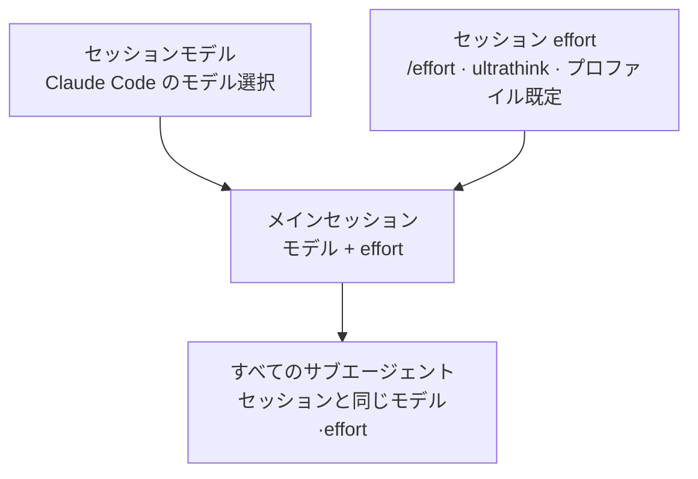

MoAI-ADK はかつて**プロファイルマトリクス**でエージェント 1 個 1 個に `{model, effort}` を割り当てていました。維持される 13 エージェントを行に、3 つの品質列 (`high` / `medium` / `low`) を列に置いた 39 セルの表 (エージェント 13 個 × プロファイル 3 個) がモデル・推論深度割り当ての単一の源泉で、アクティブなプロファイルが 1 列を選ぶとその列の値がすべてのサブエージェント spawn に適用されていました。

この表は **v3.2 で退きました。** このページは、マトリクスが去った場所に何が来たのか、そして現在のモデル・推論深度がどう決まるのかを説明します。


**ひとことで:** エージェント別の割り当て表は姿を消し、その席を**セッション継承**が埋めました。メインセッションのモデルと推論深度が、すべてのサブエージェントのモデルと推論深度です。エージェント定義はどちらも宣言せず、呼ぶときも渡しません。


## マトリクスが解いていた問題と、それより良い答え

マトリクスには解くべき実問題がありました。エージェントが増えると「どのエージェントをどのモデルで回すか」がたちまち手に負えなくなり、これをエージェントファイルにいちいち書いておくと翌日にはもうずれます。そこで 13 のエージェントを行、3 つのプロファイルを列に集めた 1 枚の表に割り当てをまとめ、全体を「プロファイルを 1 つ選ぶ」ことまで減らしました。

ところが運用の中で別の問題が露呈しました。オーケストレーターがエージェントを呼ぶとき model 引数を付ける呼び出しは 1% にも満たない、という実測が出たのです。マトリクスは値を計算しておきながら、実際の呼び出しには何も適用されない状態 — 「適用されなかった」と告げる仕組みもない状態 — が続き続けました。1 枚に集めること自体はできても、適用地点が空なら集める意味がないのです。

そこで割り当てをさらに精密にする代わりに、**割り当てという行為そのものをなくす**ことにしました。サブエージェントがメインセッションのモデルと推論深度をそのまま従うなら、適用地点が空になることはあり得ません。セッションが何で動いているかが、そのまま割り当てだからです。

## 現在の規則 — セッション継承

> サブエージェントはメインセッションのモデルと推論深度をそのまま引き継ぎます — サブエージェントを spawn するとき `model` も `effort` も渡さず、MoAI のエージェント定義はどちらも宣言しません。

- **エージェント定義ファイル** (`.claude/agents/moai/*.md`) は frontmatter に model も effort も書きません。かつて配布されていた `model: inherit` フィールドと effort の既定値は退きました。
- **spawn** には model・effort 引数を渡さないのが普通の形です。セッションと異なる model を明示した呼び出しはドリフトで、直すのは「呼び出し」ではなく「セッション」です。
- **セッションのモデル**は Claude Code のモデル選択が決め、**セッションの effort** は `/effort` スラッシュコマンド、`ultrathink` キーワード、プロファイルウィザードの既定値が決めます。

## セッション effort はどこから来るか

セッションの推論深度を決める道は 3 つあり、先に来たものが勝ちます。

1. **セッション内での調整** — `/effort low|medium|high|xhigh|max` スラッシュコマンドや `ultrathink` キーワード。セッション effort を変えれば、以降のサブエージェント呼び出しはすべて従います。
2. **プロファイルウィザードのセッションモデルポリシー** — `moai profile setup` の「セッションモデルポリシー」の質問は、このプロファイルで起動する Claude セッションの**既定の推論強度フォールバック**を決めます。`high` / `medium` / `low` の 3 値がそのまま effort に写り、推論強度を別に選ばなかったときだけ適用されます。値がなければオーバーライドなしで Claude Code の既定動作に従います。
3. **モデル自身の既定値** — どちらも介入しなければモデルの既定 effort に従います。Opus 5.5 の既定は `medium` で、effort に対応する他のモデルの大半は `high` が既定です。

## spawn 時点の観測

継承が既定になった後でも、呼び出しが model を明示することはまれに残り得ます。それを見張る観測レイヤーがあります。PreToolUse フックが呼び出しごとに宣言された model を読み、`.moai/logs/agent-model-audit.jsonl` に 1 行ずつ残し、宣言がセッション値と異なれば助言します。ブロックはオプトイン (`workflow.agent_model_guard.enabled`、既定 `false`) で、普段は気にしなくてよい観測レイヤーです。

## マトリクスの判断基準はどこに残っているか

39 セルの表もリゾルバも `moai model profile` アクセサも退きましたが、マトリクスが実測で確立した**モデルの選び方の基準**は消えていません。むしろセッション単位のモデル選択でそのまま使われている基準です。

- **支出は判断する席に**: 監査・助言・調整のような判断の重い段階に深い推論を集める方が、コスト対品質で有利です。
- **エージェンティックな作業は Opus**: 長丁場のマルチターン作業では、Opus の `low` がどの effort の Sonnet よりもスコアが高いのにタスクあたりコストは低い。
- **No-Haiku**: 長丁場のエージェンティック作業に Haiku を組み込むと完了失敗でステップ浪費が膨らみ、タスクあたりコストがかえって増える。

根拠となった DeepSWE 実測データと 3 層の設計意図は[3 層エージェントアーキテクチャ](/ja/advanced/no-haiku-3tier/)ページに、コスト・スコア曲線の原数値は同ページのリーダーボード節にまとまっています。

## ハーネススペシャリスト

`/moai:harness` が作るスペシャリストも同じ規則に従います。ハーネスエージェントの定義は model と effort を宣言せず、セッションのモデルと推論深度をそのまま使います。目的クラス (読み取り専用抽出、機械変換、実装、監査判定など) ごとの effort 出源表は旧マトリクスの遺物で、今は判断基準の記録としてだけ残っています。

## 次のステップ

- [モデルポリシー](/ja/multi-llm/model-policy/) — セッションモデルポリシーと effort フォールバック、GLM reasoning 上限
- [3 層エージェントアーキテクチャ](/ja/advanced/no-haiku-3tier/) — DeepSWE リーダーボードの根拠とモデル選択の基準
- [トークノミクス概論](/ja/advanced/tokenomics-overview/) — 4 層トークノミクス構造の B 層ルーティング
