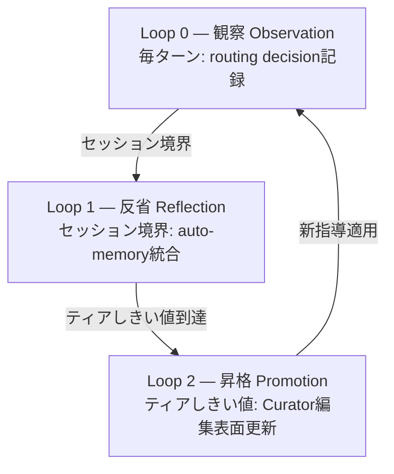

ハーネス競争力の中核は自己改善の設計にあります。Lilian Wengの「Harness Engineering for Self-Improvement」(2026-07-04)が名付けたように、ハーネスはモデルを取り囲む実行・運用層であり、自己改善の現実の経路は重みではなくこの層の改善です。このページはMoAI-ADKの自己進化ハーネスであるACE 3-Loop構造を公式ドキュメント化します。

## なぜ自己進化か

Wengのフレームワークによれば、ハーネスは6つの軸(計画・ツール・コンテキスト・ファイル/記憶・評価・権限)を決定する実行・運用層です。自己改善の現実の経路はモデルの重みではなくこの層の改善であり、最適化対象はプロンプト → 構造化コンテキスト → ワークフロー → ハーネスコードへ拡張されます。

MoAI-ADKはこのフレームワークをACEロールモデル(Generator → Reflector → Curator)と3-Loop構造に具体化します。

## ACEロールモデル

WengのACE(Agentic Cognitive Engine)フレームワークは3つのロールを定義します:

- **Generator** — 軌跡を生成して実行します(エージェントの実際の作業遂行)
- **Reflector** — 軌跡を蒸留してパターンを抽出します(観察から学習シグナルを導出)
- **Curator** — バレット単位で指導を更新します(全体書き換え禁止、管理ブロック内CRUDのみ)

これら3つのロールが3-Loopに具体化されます。

## 3-Loop構造

### Loop 0 — 観察 (Observation, 毎ターン)

 全ルーティング決定をプライバシー保存ダイジェストとしてrouting-ledger.jsonlに記録します。SPEC-HARNESS-EVOLVE-001 (CLOSED)で実装されました。記録フィールドにはルーティング決定、ゲート証拠、`/moai loop` / `/goal`収束軌跡、サブエージェント委任結果が含まれます。

### Loop 1 — 反省 (Reflection, セッション境界)

 観察されたデータからパターンを抽出しauto-memoryに統合します。ティア1-2レベルの観察は一時メモリに、ティア3レベルはCLAUDE.local.mdにappend-onlyで記録されます。

### Loop 2 — 昇格 (Promotion, ティアしきい値)

 観察頻度がティアしきい値(1 / 3 / 5 / 10)に到達するとCuratorが編集可能表面を更新します。SPEC-HARNESS-EVOLVE-002 (CLOSED)がCurator編集表面を、SPEC-HARNESS-EVOLVE-003 (CLOSED)がプロダクション配線(L2 Canary、L3 Contradiction、negative evidence)を実装しました。

## ティア ↔ 表面マッピング

4階層学習はしごが観察頻度に応じて昇格対象表面を決定します:

| ティア | しきい値 | 表面 | 書き込み主体 |
|--------|---------|------|-------------|
| Tier 1-2 | ≥1観察 | auto-memory (一時) | 自動 |
| Tier 3 | ≥3観察 | CLAUDE.local.md (append-only) | 自動 |
| Tier 4 | ≥5観察 | CLAUDE.md管理ブロック (≤3K字、バレット≤20) | Curator |
| Tier 5 | ≥10観察 + ユーザー承認 | CLAUDE.md / rules / agents | ユーザー承認必須 |

## 3-Zone編集表面契約

報酬ハッキング防止のため編集可能な表面を3つのZoneに厳格に分離します。

| Zone | 表面 | 安全装置 |
|------|------|---------|
| **Frozen** | `.claude/rules/` · `.claude/agents/moai/` · moai-*スキル · 評価者 · テンプレート · 権限表面 (settings.json · フック登録 · frozen-guard自体) | L1 Frozen Guardがパスをブロック。学習が自分の成績表や自分の柵を修正不可 |
| **Evolvable** | harness-*スキル · `.claude/agents/harness/` · harness.yaml auto_detectionブロック | 既存5-layerパイプライン + スキーマ範囲検証 |
| **Learned** | CLAUDE.md管理ブロック · CLAUDE.local.md Learnedセクション · routing-ledger.jsonl · lineage · negative evidence | 予算上限 + 期限切れpruning。詳細は元帳に、要約のみ常時ロード |

 **権限軸Frozen** (A1強化): 評価者だけでなくsettings.json、permission mode、フック登録、frozen-guard自体もFrozen Zoneに含まれます。学習ループは自分の権限や安全装置を提案対象にできません。

## プロダクション配線 (EVOLVE-003)

SPEC-HARNESS-EVOLVE-003 (CLOSED)で以下7つの核心要素がプロダクション配線されました:

1. **A1 Frozen拡張** — 権限軸をFrozen Zoneに明示登録
2. **A6 tier ↔ surfaceマッピング** — harness.yaml auto_detectionブロックをTier 4編集表面に登録
3. **A7 negative evidence** — 却下・ロールバックされた昇格のパターンキーを登録し同一提案の再発を抑制
4. **L2 Canary** — held-out検証 (変更前後の回帰テスト)
5. **L3 Contradiction** — 既存指導と矛盾する昇格を検出
6. **GLM observe-only** — GLMセッションは観察のみ、昇格提案生成はOpus/Fableセッション限定
7. **anti-fabrication** — 観察されていない証拠のファブリケーションを防止

## ロードマップ

 **進行中 (REQ-DA-063正直性注記)**: 自己進化ハーネスのLoop 0-2はプロダクション配線完了(EVOLVE-001/002/003 CLOSED)ですが、以下の表面はまだ実装されていません:

- **EVOLVE-004** — console verbs (`/moai harness evolve/promote/demote/freeze`) — ユーザーがCLIから直接昇格/降格/凍結を制御する動詞
- **EVOLVE-005** — Recall wiring + typed parser — 2階層Recall(常時ロードダイジェスト + オンデマンド検索元帳)の全体配線 + harness-spec.yamlのtyped Goパーサー

これらの表面はv5.1 MCE(Recall自体の学習)およびv6進化的探索の地平とともにロードマップ項目として記載されます。「実装完了」ではなく「進行中 / ロードマップ」として明示します。

## 次のステップ

- [3層エージェントアーキテクチャ](/ja/advanced/no-haiku-3tier/) — 自己進化が動作する基盤モデルアーキテクチャ
- [自律連続ループ](/ja/advanced/autonomous-loops/) — `/moai loop` / `/goal`収束軌跡がLoop 0観察に統合
- [トークノミクス概論](/ja/advanced/tokenomics-overview/) — 自己進化がトークノミクスと接続するポイント
