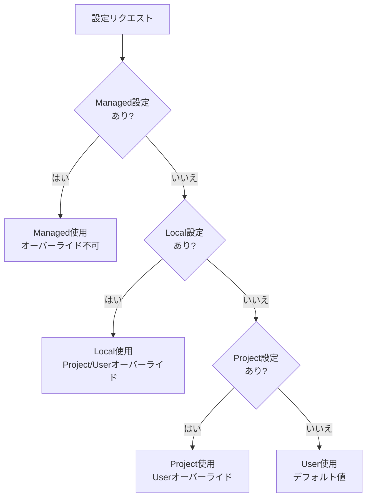
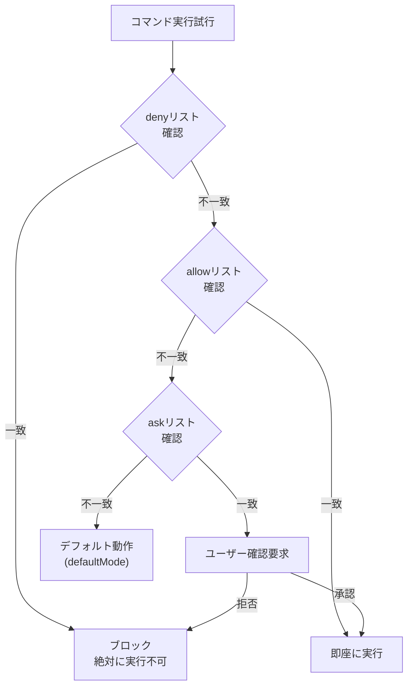

Claude Code の設定ファイル体系を詳細に解説します。


**一言でいうと**: `settings.json` は Claude Code の**管制塔**です。権限、環境変数、Hook、セキュリティポリシーを一箇所で管理します。


## 設定範囲 (Configuration Scopes)

Claude Code は**スコープシステム**を使用して、設定が適用される場所と共有対象を決定します。

### 4 つのスコープタイプ

| スコープ | 位置 | 影響対象 | チーム共有 | 優先順位 |
|---------|------|-----------|----------|----------|
| **Managed** | システムレベル `managed-settings.json` | マシンの全ユーザー | ✅ (IT 配布) | 最高 |
| **User** | `~/.claude/` | ユーザー個人 (全プロジェクト) | ❌ | 低 |
| **Project** | `.claude/` | リポジトリの全協力者 | ✅ (Git 追跡) | 中 |
| **Local** | `.claude/*.local.*` | ユーザー (このリポジトリのみ) | ❌ | 高 |

### スコープ別の優先順位

同一の設定が複数のスコープにある場合、より具体的なスコープが優先されます:



**優先順位:** Managed > コマンドライン引数 > Local > Project > User

### 各スコープの用途

**Managed スコープ** - 次の場合に使用:
- 組織全体に適用するセキュリティポリシー
- 上書き不可能なコンプライアンス要件
- IT/DevOps が配布する標準化された構成

**User スコープ** - 次の場合に使用:
- 全プロジェクトで適用したい個人設定 (テーマ、エディタ設定)
- 全プロジェクトで使用するツールおよびプラグイン
- API キーおよび認証 (安全に保存)

**Project スコープ** - 次の場合に使用:
- チーム共有設定 (権限、Hook、MCP サーバー)
- チームが持つべきプラグイン
- 協力者間のツール標準化

**Local スコープ** - 次の場合に使用:
- 特定プロジェクトの個人オーバーライド
- チームと共有する前の設定テスト
- 他のユーザーには動作しないマシン別設定

## ファイル位置

MoAI-ADK は 4 つの設定ファイル位置を使用します。

| ファイル | 位置 | 用途 | Git 追跡 |
|---------|------|------|----------|
| `managed-settings.json` | システムレベル* | 管理された設定 (IT 配布) | いいえ |
| `settings.json` (User) | `~/.claude/settings.json` | 個人グローバル設定 | いいえ |
| `settings.json` (Project) | `.claude/settings.json` | チーム共有設定 | はい |
| `settings.local.json` | `.claude/settings.local.json` | 個人プロジェクト設定 | いいえ |

**システムレベルの位置:**
- macOS: `/Library/Application Support/ClaudeCode/`
- Linux/WSL: `/etc/claude-code/`
- Windows: `C:\Program Files\ClaudeCode\`


**注意**: `.claude/settings.json` は MoAI-ADK 更新時に上書きされます。個人設定は必ず `settings.local.json` または `~/.claude/settings.json` に記述してください。


## settings.json とは？

`settings.json` は Claude Code の**グローバル設定ファイル**です。どのコマンドを自動的に許可し、どのコマンドをブロックするか、どの Hook を実行するか、環境変数を何に設定するかを定義します。

## 全体構造

```json
{
  "model": "",
  "language": "",
  "attribution": {},
  "companyAnnouncements": [],
  "autoUpdatesChannel": "",
  "spinnerTipsEnabled": true,
  "terminalProgressBarEnabled": true,
  "sandbox": {},
  "hooks": {},
  "permissions": {},
  "enabledPlugins": {},
  "extraKnownMarketplaces": {},
  "enableAllProjectMcpServers": false,
  "enabledMcpjsonServers": [],
  "disabledMcpjsonServers": [],
  "fileSuggestion": {},
  "alwaysThinkingEnabled": false,
  "maxThinkingTokens": 0,
  "statusLine": {},
  "outputStyle": "",
  "cleanupPeriodDays": 30,
  "env": {}
}
```

## 主要設定リファレンス

### model

使用するデフォルトモデルを上書きします。

```json
{
  "model": "claude-sonnet-4-5-20250929"
}
```

### language

Claude のデフォルト応答言語を設定します。

```json
{
  "language": "japanese"
}
```

サポート言語: `"korean"`、`"japanese"`、`"spanish"`、`"french"` など

### cleanupPeriodDays

この期間より古い非アクティブセッションを開始時に削除します。`0` に設定すると全セッションを即座に削除します。(デフォルト: 30 日)

```json
{
  "cleanupPeriodDays": 20
}
```

### autoUpdatesChannel

更新に従うリリースチャンネルです。

```json
{
  "autoUpdatesChannel": "stable"
}
```

- `"stable"`: 1 週間ほど前のバージョン、主要な回帰をスキップ
- `"latest"` (デフォルト): 最新のリリース

### spinnerTipsEnabled

Claude が作業中にスピナーにヒントを表示するかどうかです。`false` に設定するとヒントを無効化します。(デフォルト: `true`)

```json
{
  "spinnerTipsEnabled": false
}
```

### terminalProgressBarEnabled

Windows Terminal や iTerm2 などのサポート対象ターミナルで進捗を表示するターミナルプログレスバーを有効化します。(デフォルト: `true`)

```json
{
  "terminalProgressBarEnabled": false
}
```

### showTurnDuration

応答後にターン持続時間メッセージを表示します (例: "Cooked for 1m 6s")。`false` に設定するとこのメッセージを非表示にします。

```json
{
  "showTurnDuration": true
}
```

### respectGitignore

`@` ファイルセレクタが `.gitignore` パターンを尊重するかどうかを制御します。`true`(デフォルト)の場合、`.gitignore` パターンに一致するファイルが提案から除外されます。

```json
{
  "respectGitignore": false
}
```

### plansDirectory

プランファイルを保存する場所をカスタマイズします。パスはプロジェクトルートからの相対パスです。デフォルト: `~/.claude/plans`

```json
{
  "plansDirectory": "./plans"
}
```

## 権限設定

Claude Code が実行できるコマンドの権限を管理します。

### 権限構造

```json
{
  "permissions": {
    "defaultMode": "default",
    "allow": [],
    "ask": [],
    "deny": [],
    "additionalDirectories": [],
    "disableBypassPermissionsMode": "disable"
  }
}
```

### defaultMode

Claude Code を開いた時のデフォルト権限モードです。

| 値 | 説明 |
|-----|------|
| `"acceptEdits"` | ファイル編集を自動許可 |
| `"allowEdits"` | ファイル編集を許可 |
| `"rejectEdits"` | ファイル編集を拒否 |
| `"default"` | デフォルト動作 |


**参考**: 現在 MoAI-ADK 設定ファイルは `"defaultMode": "default"` を使用しています。これはレガシー値である可能性があります。


### allow (自動許可)

ユーザー確認なしに**即座に実行が許可される**コマンドリストです。

**デフォルト許可コマンドカテゴリ:**

| カテゴリ | コマンド例 | 個数 |
|----------|-------------|------|
| ファイルツール | `Read`、`Write`、`Edit`、`Glob`、`Grep` | 7 個 |
| Git コマンド | `git add`、`git commit`、`git diff`、`git log` など | 15 個+ |
| パッケージ管理 | `npm`、`pip`、`uv`、`npx` | 4 個 |
| ビルド/テスト | `pytest`、`make`、`node`、`python` | 10 個+ |
| コード品質 | `ruff`、`black`、`prettier`、`eslint` | 6 個+ |
| 探索ツール | `ls`、`find`、`tree`、`cat`、`head` | 10 個+ |
| GitHub CLI | `gh issue`、`gh pr`、`gh repo view` | 3 個 |
| MCP ツール | `mcp__context7__*`、`mcp__sequential-thinking__*` | 3 個 |
| その他 | `AskUserQuestion`、`Task`、`Skill`、`TodoWrite` | 4 個 |

**allow 形式例:**

```json
{
  "allow": [
    "Read",                          // ツール名のみ
    "Bash(git add:*)",               // Bash + コマンドパターン
    "Bash(pytest:*)",                // ワイルドカード
    "mcp__context7__resolve-library-id",  // MCP ツール
    "Bash(npm run *)",               // 空白区切り (新しい形式)
    "WebFetch(domain:example.com)"   // ドメインパターン
  ]
}
```

### ask (確認後実行)

ユーザーに**確認を求めた後に実行**されるコマンドリストです。

```json
{
  "ask": [
    "Bash(chmod:*)",       // ファイル権限変更
    "Bash(chown:*)",       // 所有権変更
    "Bash(rm:*)",          // ファイル削除
    "Bash(sudo:*)",        // 管理者権限
    "Read(./.env)",        // 環境変数ファイル読み取り
    "Read(./.env.*)"       // 環境変数ファイル読み取り
  ]
}
```

**ask 動作:**
1. Claude Code が該当コマンド実行を試行
2. ユーザーに「このコマンドを実行しますか？」確認を要求
3. ユーザーが承認すると実行、拒否すると中断

### deny (無条件ブロック)

いかなる状況でも**絶対に実行されない**コマンドリストです。

**ブロックカテゴリ:**

| カテゴリ | ブロックパターン | 理由 |
|----------|-----------------|------|
| 機密ファイルアクセス | `Read(./secrets/**)`、`Write(~/.ssh/**)` | セキュリティ資格情報保護 |
| クラウド資格情報 | `Read(~/.aws/**)`、`Read(~/.config/gcloud/**)` | クラウドアカウント保護 |
| システム破壊 | `Bash(rm -rf /:*)`、`Bash(rm -rf ~:*)` | システム保護 |
| 危険な Git | `Bash(git push --force:*)`、`Bash(git reset --hard:*)` | コード保護 |
| ディスクフォーマット | `Bash(dd:*)`、`Bash(mkfs:*)`、`Bash(fdisk:*)` | ディスク保護 |
| システムコマンド | `Bash(reboot:*)`、`Bash(shutdown:*)` | システム安定性 |
| DB 削除 | `Bash(DROP DATABASE:*)`、`Bash(TRUNCATE:*)` | データ保護 |

**deny 形式例:**

```json
{
  "deny": [
    "Read(./secrets/**)",           // シークレットディレクトリ読み取りブロック
    "Write(~/.ssh/**)",             // SSH キー修正ブロック
    "Bash(git push --force:*)",     // 強制プッシュブロック
    "Bash(rm -rf /:*)",            // ルート削除ブロック
    "Bash(DROP DATABASE:*)"        // DB 削除ブロック
  ]
}
```

### additionalDirectories

Claude がアクセスできる追加作業ディレクトリです。

```json
{
  "permissions": {
    "additionalDirectories": [
      "../docs/"
    ]
  }
}
```

### disableBypassPermissionsMode

`bypassPermissions` モードが有効化されるのを防ぎます。`--dangerously-skip-permissions` コマンドラインフラグを無効化します。

```json
{
  "permissions": {
    "disableBypassPermissionsMode": "disable"
  }
}
```

## 権限ルール構文 (Permission Rule Syntax)

権限ルールは `Tool` または `Tool(specifier)` 形式に従います。

### ルール評価順序

複数のルールが同一のツール使用に一致する場合、ルールは以下の順序で評価されます:

1. **Deny** ルールが最初に確認される
2. **Ask** ルールが 2 番目に確認される
3. **Allow** ルールが最後に確認される

最初に一致したルールが動作を決定します。つまり、deny ルールが常に allow ルールより優先されます。

### ツールの全使用を一致させる

ツールの全使用を一致させるには、括弧なしでツール名のみを使用してください:

| ルール | 効果 |
|------|------|
| `Bash` | **全ての** Bash コマンドに一致 |
| `WebFetch` | **全ての** Web 取得リクエストに一致 |
| `Read` | **全ての** ファイル読み取りに一致 |

`Bash(*)` は `Bash` と同一であり全ての Bash コマンドに一致します。両構文を相互に交換できます。

### 詳細制御のための指定子使用

括弧内に指定子を追加して特定のツール使用を一致させます:

| ルール | 効果 |
|------|------|
| `Bash(npm run build)` | 正確なコマンド `npm run build` に一致 |
| `Read(./.env)` | カレントディレクトリの `.env` ファイル読み取りに一致 |
| `WebFetch(domain:example.com)` | example.com に対する取得リクエストに一致 |

### ワイルドカードパターン

Bash ルールは `*` と共に glob パターンをサポートします。ワイルドカードはコマンドの開始、中間、終了など任意の位置に出現できます。

```json
{
  "permissions": {
    "allow": [
      "Bash(npm run *)",
      "Bash(git commit *)",
      "Bash(git * main)",
      "Bash(* --version)",
      "Bash(* --help *)"
    ],
    "deny": [
      "Bash(git push *)"
    ]
  }
}
```

**重要:** `*` の前の空白が重要です:
- `Bash(ls *)` は `ls -la` に一致するが `lsof` には一致しない
- `Bash(ls*)` は両方に一致

**レガシー構文:** `:*` 接尾辞構文 (例: `Bash(npm run:*)`) は `*` と同一ですが非推奨です。

### ドメイン別パターン

WebFetch などのツールに対してドメイン別パターンを使用できます:

```json
{
  "permissions": {
    "allow": [
      "WebFetch(domain:docs.anthropic.com)",
      "WebFetch(domain:github.com)"
    ],
    "deny": [
      "WebFetch(domain:malicious-site.com)"
    ]
  }
}
```

### 権限優先順位ダイアグラム



**優先順位:** `deny` > `ask` > `allow` > `defaultMode`

## サンドボックス設定 (Sandbox Settings)

高度なサンドボックス動作を設定します。サンドボックスはファイルシステムとネットワークで bash コマンドを分離します。


**重要:** ファイルシステムおよびネットワーク制限は Read、Edit、WebFetch 権限ルールを通じて設定され、サンドボックス設定を通してではありません。


```json
{
  "sandbox": {
    "enabled": true,
    "autoAllowBashIfSandboxed": true,
    "excludedCommands": ["docker"],
    "allowUnsandboxedCommands": false,
    "network": {
      "allowUnixSockets": [
        "/var/run/docker.sock"
      ],
      "allowLocalBinding": true,
      "httpProxyPort": 8080,
      "socksProxyPort": 8081
    },
    "enableWeakerNestedSandbox": false
  }
}
```

### サンドボックス設定リファレンス

| キー | 説明 | 例 |
|-----|------|------|
| `enabled` | bash サンドボックス有効化 (macOS、Linux、WSL2)。デフォルト: false | `true` |
| `autoAllowBashIfSandboxed` | サンドボックス化された bash コマンド自動承認。デフォルト: true | `true` |
| `excludedCommands` | サンドボックス外で実行すべきコマンド | `["docker", "git"]` |
| `allowUnsandboxedCommands` | `dangerouslyDisableSandbox` パラメータを通じてコマンドがサンドボックス外で実行されることを許可。デフォルト: true | `false` |
| `network.allowUnixSockets` | サンドボックスがアクセスできる Unix ソケットパス (SSH エージェントなど) | `["~/.ssh/agent-socket"]` |
| `network.allowLocalBinding` | localhost ポートへのバインドを許可 (macOS のみ)。デフォルト: false | `true` |
| `network.httpProxyPort` | 独自プロキシーを持つ場合の HTTP プロキシーポート | `8080` |
| `network.socksProxyPort` | 独自プロキシーを持つ場合の SOCKS5 プロキシーポート | `8081` |
| `enableWeakerNestedSandbox` | 権限なし Docker 環境向けの弱いサンドボックス有効化 (Linux、WSL2 のみ)。**セキュリティ低下**。デフォルト: false | `true` |

## 帰属設定 (Attribution Settings)

Claude Code は git コミットとプルリクエストに帰属を追加します。これらは別個に設定されます。

```json
{
  "attribution": {
    "commit": "Custom attribution text\n\nCo-Authored-By: AI <email@example.com>",
    "pr": ""
  }
}
```

### 帰属設定リファレンス

| キー | 説明 |
|-----|------|
| `commit` | git コミット用の帰属 (トレイラー含む)。空文字列はコミット帰属を非表示 |
| `pr` | プルリクエスト説明用の帰属。空文字列は PR 帰属を非表示 |

### デフォルトコミット帰属

```
🤖 Generated with [Claude Code](https://code.claude.com)

Co-Authored-By: Claude Sonnet 4.5 <noreply@anthropic.com>
```

### デフォルト PR 帰属

```
🤖 Generated with [Claude Code](https://claude.com/claude-code)
```

## Hook 設定

Claude Code イベントに反応するスクリプトを登録します。

```json
{
  "hooks": {
    "SessionStart": [
      {
        "matcher": "",
        "hooks": [
          {
            "type": "command",
            "command": "スクリプトパス"
          }
        ]
      }
    ],
    "PreToolUse": [
      {
        "matcher": "Write|Edit",
        "hooks": [
          {
            "type": "command",
            "command": "セキュリティガードスクリプトパス",
            "timeout": 5000
          }
        ]
      }
    ],
    "PostToolUse": [
      {
        "matcher": "Write|Edit",
        "hooks": [
          {
            "type": "command",
            "command": "フォーマッタースクリプトパス",
            "timeout": 30000
          },
          {
            "type": "command",
            "command": "リンタースクリプトパス",
            "timeout": 60000
          }
        ]
      }
    ]
  }
}
```

### Hook イベントタイプ

| イベント | 説明 |
|--------|------|
| `SessionStart` | セッション開始時に実行 |
| `SessionEnd` | セッション終了時に実行 |
| `PreToolUse` | ツール使用前に実行 |
| `PostToolUse` | ツール使用後に実行 |
| `PreCompact` | コンテキスト圧縮前に実行 |


Hook 設定の詳細は [Hooks ガイド](/advanced/hooks-guide) を参照してください。


## プラグイン設定 (Plugin Settings)

プラグイン関連設定です。

```json
{
  "enabledPlugins": {
    "formatter@acme-tools": true,
    "deployer@acme-tools": true,
    "analyzer@security-plugins": false
  },
  "extraKnownMarketplaces": {
    "acme-tools": {
      "source": {
        "source": "github",
        "repo": "acme-corp/claude-plugins"
      }
    }
  }
}
```

### enabledPlugins

有効化するプラグインを制御します。形式: `"plugin-name@marketplace-name": true/false`

**スコープ:**
- **User settings** (`~/.claude/settings.json`): 個人プラグイン設定
- **Project settings** (`.claude/settings.json`): チームと共有するプロジェクト別プラグイン
- **Local settings** (`.claude/settings.local.json`): マシン別オーバーライド (コミットされない)

### extraKnownMarketplaces

リポジトリで利用可能にする追加マーケットプレイスを定義します。通常リポジトリレベル設定で使用して、チームメンバーが必要なプラグインソースにアクセスできるようにします。

## MCP 設定 (MCP Settings)

MCP (Model Context Protocol) サーバー関連設定です。

```json
{
  "enableAllProjectMcpServers": true,
  "enabledMcpjsonServers": ["memory", "github"],
  "disabledMcpjsonServers": ["filesystem"]
}
```

### MCP 設定リファレンス

| キー | 説明 | 例 |
|-----|------|------|
| `enableAllProjectMcpServers` | プロジェクト `.mcp.json` ファイルで定義された全 MCP サーバー自動承認 | `true` |
| `enabledMcpjsonServers` | 承認する特定 MCP サーバーリスト | `["memory", "github"]` |
| `disabledMcpjsonServers` | 拒否する特定 MCP サーバーリスト | `["filesystem"]` |
| `allowedMcpServers` | managed-settings.json のみ使用。MCP サーバー許可リスト | `[{ "serverName": "github" }]` |
| `deniedMcpServers` | managed-settings.json のみ使用。MCP サーバー拒否リスト (優先適用) | `[{ "serverName": "filesystem" }]` |

## ファイル提案設定 (File Suggestion Settings)

`@` ファイルパス自動補完のためのカスタムコマンドを設定します。

```json
{
  "fileSuggestion": {
    "type": "command",
    "command": "~/.claude/file-suggestion.sh"
  }
}
```

内蔵ファイル提案は高速ファイルシステム走査を使用しますが、大きなモノレポではプロジェクト別インデックス (例: 事前ビルド済みファイルインデックスやカスタムツール) の利点があります。

## 拡張思考設定 (Extended Thinking Settings)

拡張思考 (Extended Thinking) 関連設定です。

```json
{
  "alwaysThinkingEnabled": true,
  "maxThinkingTokens": 10000
}
```

### 拡張思考設定リファレンス

| キー | 説明 | 例 |
|-----|------|------|
| `alwaysThinkingEnabled` | 全セッションでデフォルトで拡張思考を有効化 | `true` |
| `maxThinkingTokens` | 思考トークン予算を上書き (デフォルト: 31999、0 = 無効化) | `10000` |

環境変数を通しても設定可能です:
- `MAX_THINKING_TOKENS=10000`: 思考トークン制限
- `MAX_THINKING_TOKENS=0`: 思考無効化

## 会社お知らせ (Company Announcements)

開始時にユーザーに表示するお知らせです。複数のお知らせを提供するとランダムにローテーションされます。

```json
{
  "companyAnnouncements": [
    "Welcome to Acme Corp! Review our code guidelines at docs.acme.com",
    "Reminder: Code reviews required for all PRs",
    "New security policy in effect"
  ]
}
```

## ステータスバー設定

Claude Code 下部に表示されるステータスバーを設定します。

```json
{
  "statusLine": {
    "type": "command",
    "command": "${SHELL:-/bin/bash} -l -c 'uv run --no-sync moai-adk statusline'",
    "padding": 0,
    "refreshInterval": 300
  }
}
```

| フィールド | 説明 |
|----------|------|
| `type` | `"command"` (コマンド実行) |
| `command` | 実行するコマンド (ステータス情報を返す) |
| `padding` | パディングサイズ |
| `refreshInterval` | 更新周期 (ミリ秒) |

## 出力スタイル設定

```json
{
  "outputStyle": "R2-D2"
}
```

出力スタイルは Claude Code の応答形式を決定します。`settings.local.json` で個人好みスタイルに変更できます。

## 環境変数設定

`env` セクションで Claude Code の動作を制御する環境変数を設定します。

### MoAI-ADK 環境変数


**MoAI-ADK 拡張**: この設定は MoAI-ADK に特有であり、公式 Claude Code の一部ではありません。


```json
{
  "env": {
    "MOAI_CONFIG_SOURCE": "sections"
  }
}
```

| 変数 | 値 | 説明 |
|------|-----|------|
| `MOAI_CONFIG_SOURCE` | `"sections"` | MoAI 設定ソース方式 |

### 公式 Claude Code 環境変数

```json
{
  "env": {
    "ENABLE_TOOL_SEARCH": "auto:5",
    "MAX_THINKING_TOKENS": "31999",
    "CLAUDE_CODE_FILE_READ_MAX_OUTPUT_TOKENS": "64000",
    "CLAUDE_CODE_MAX_OUTPUT_TOKENS": "32000",
    "CLAUDE_AUTOCOMPACT_PCT_OVERRIDE": "50"
  }
}
```

### 主要環境変数リファレンス

| 変数 | 値 | 説明 |
|------|-----|------|
| `ENABLE_TOOL_SEARCH` | `"auto"`、`"auto:N"`、`"true"`、`"false"` | MCP ツール検索制御 |
| `MAX_THINKING_TOKENS` | `0`-`31999` | 思考トークン制限 (0=無効化) |
| `CLAUDE_CODE_MAX_OUTPUT_TOKENS` | `1`-`64000` | 最大出力トークン (デフォルト: 32000) |
| `CLAUDE_CODE_FILE_READ_MAX_OUTPUT_TOKENS` | 数値 | ファイル読み取り最大出力トークン |
| `CLAUDE_AUTOCOMPACT_PCT_OVERRIDE` | `1`-`100` | 自動圧縮トリガーパーセンテージ (デフォルト: ~95%) |
| `CLAUDE_CODE_ENABLE_TELEMETRY` | `"1"` | OpenTelemetry データ収集有効化 |
| `CLAUDE_CODE_DISABLE_BACKGROUND_TASKS` | `"1"` | バックグラウンドタスク無効化 |
| `DISABLE_AUTOUPDATER` | `"1"` | 自動更新無効化 |
| `HTTP_PROXY` | URL | HTTP プロキシーサーバー |
| `HTTPS_PROXY` | URL | HTTPS プロキシーサーバー |


**ヒント**: `ENABLE_TOOL_SEARCH` 値 `"auto:5"` はコンテキスト使用量が 5% の時にツール検索を有効化します。`"auto"` はデフォルト 10%、`"true"` は常にオン、`"false"` は常にオフです。


### ツール検索詳細

`ENABLE_TOOL_SEARCH` は MCP ツール検索を制御します:

| 値 | 説明 |
|-----|------|
| `"auto"` (デフォルト) | 10% コンテキストで有効化 |
| `"auto:N"` | カスタム閾値 (例: `"auto:5"` は 5%) |
| `"true"` | 常に有効化 |
| `"false"` | 無効化 |

## settings.json vs settings.local.json

| 項目 | settings.json | settings.local.json |
|------|---------------|---------------------|
| 管理主体 | MoAI-ADK | ユーザー |
| Git 追跡 | 追踪される | .gitignore |
| 更新時 | 上書き | 保存 |
| 用途 | チーム共有設定 | 個人設定 |
| 優先順位 | デフォルト値 | オーバーライド (優先) |

### settings.local.json 活用例

```json
{
  "permissions": {
    "allow": [
      "Bash(bun:*)",     // 個人的に使用するツール
      "Bash(bun add:*)"
    ]
  },
  "enabledMcpjsonServers": [
    "context7"          // 個人的に有効化する MCP サーバー
  ],
  "outputStyle": "Mr.Alfred"  // 個人好みの出力スタイル
}
```


`settings.local.json` の設定は `settings.json` の設定に**マージ**されます。同一キーがある場合、`settings.local.json` が優先されます。


## MoAI 専用設定


**MoAI-ADK 拡張**: このセクションの設定は MoAI-ADK に特有であり、公式 Claude Code ドキュメントには含まれません。


### MoAI カスタム statusLine

MoAI-ADK はカスタムステータスバーを提供します:

```json
{
  "statusLine": {
    "type": "command",
    "command": "${SHELL:-/bin/bash} -l -c 'uv run --no-sync moai-adk statusline'",
    "padding": 0,
    "refreshInterval": 300
  }
}
```

### MoAI Statusline v3 機能

MoAI-ADK statusline v3には以下が含まれます：

- **RGBグラデーション色**: システム状態に応じた動的カラーグラデーション
- **5H/7D使用量モニタリング**: 5時間および7日API使用量バー表示
- **マルチラインレイアウト**: Compact (3行)、default、fullディスプレイモード
- **テーマ**:
  - **MoAI Dark** (デフォルト): RGBグラデーション付きダークテーマ
  - **MoAI Light**: 明るい環境向けライトテーマ


**注意**: 以前のテーマ(Default、Catppuccin Mocha、Catppuccin Latte)はMoAI Dark/MoAI Lightに名前が変更されました。


statuslineテーマとセグメントは `.moai/config/sections/statusline.yaml` で設定します。
### MoAI カスタム Hooks

MoAI-ADK は以下のカスタム Hook を提供します:

```json
{
  "hooks": {
    "SessionStart": [
      {
        "matcher": "",
        "hooks": [
          {
            "type": "command",
            "command": "/bin/zsh -l -c 'uv run \"$CLAUDE_PROJECT_DIR/.claude/hooks/moai/session_start__show_project_info.py\"'"
          }
        ]
      }
    ],
    "PreCompact": [
      {
        "matcher": "",
        "hooks": [
          {
            "type": "command",
            "command": "/bin/zsh -l -c 'uv run \"$CLAUDE_PROJECT_DIR/.claude/hooks/moai/pre_compact__save_context.py\"'",
            "timeout": 5000
          }
        ]
      }
    ],
    "SessionEnd": [
      {
        "matcher": "",
        "hooks": [
          {
            "type": "command",
            "command": "/bin/zsh -l -c 'uv run \"$CLAUDE_PROJECT_DIR/.claude/hooks/moai/session_end__auto_cleanup.py\" &'"
          }
        ]
      }
    ],
    "PreToolUse": [
      {
        "matcher": "Write|Edit",
        "hooks": [
          {
            "type": "command",
            "command": "/bin/zsh -l -c 'uv run \"$CLAUDE_PROJECT_DIR/.claude/hooks/moai/pre_tool__security_guard.py\"'",
            "timeout": 5000
          }
        ]
      }
    ],
    "PostToolUse": [
      {
        "matcher": "Write|Edit",
        "hooks": [
          {
            "type": "command",
            "command": "/bin/zsh -l -c 'uv run \"$CLAUDE_PROJECT_DIR/.claude/hooks/moai/post_tool__code_formatter.py\"'",
            "timeout": 30000
          },
          {
            "type": "command",
            "command": "/bin/zsh -l -c 'uv run \"$CLAUDE_PROJECT_DIR/.claude/hooks/moai/post_tool__linter.py\"'",
            "timeout": 60000
          },
          {
            "type": "command",
            "command": "/bin/zsh -l -c 'uv run \"$CLAUDE_PROJECT_DIR/.claude/hooks/moai/post_tool__ast_grep_scan.py\"'",
            "timeout": 30000
          }
        ]
      }
    ]
  }
}
```

### MoAI 出力スタイル

```json
{
  "outputStyle": "Mr.Alfred"
}
```

このスタイルは Alfred AI オーケストレーターの独自応答形式を提供します。

## 実戦例: 設定カスタマイズ

### 新しいツール許可追加

プロジェクトで `bun` を使用する場合、`settings.local.json` に追加します。

```json
{
  "permissions": {
    "allow": [
      "Bash(bun:*)",
      "Bash(bun add:*)",
      "Bash(bun remove:*)",
      "Bash(bun run:*)"
    ]
  }
}
```

### MCP サーバー有効化

Context7 MCP サーバーを有効化します。

```json
{
  "enabledMcpjsonServers": [
    "context7"
  ]
}
```

### サンドボックス有効化

セキュリティのためにサンドボックスを有効化し Docker を除外します。

```json
{
  "sandbox": {
    "enabled": true,
    "autoAllowBashIfSandboxed": true,
    "excludedCommands": ["docker"],
    "network": {
      "allowUnixSockets": [
        "/var/run/docker.sock"
      ]
    }
  },
  "permissions": {
    "deny": [
      "Read(.envrc)",
      "Read(~/.aws/**)"
    ]
  }
}
```

### カスタム Hook 追加

個人 Hook を登録します。

```json
{
  "hooks": {
    "PostToolUse": [
      {
        "matcher": "Write|Edit",
        "hooks": [
          {
            "type": "command",
            "command": "python3 .claude/hooks/my-hooks/custom_check.py",
            "timeout": 10000
          }
        ]
      }
    ]
  }
}
```

### 帰属設定カスタマイズ

```json
{
  "attribution": {
    "commit": "Generated with AI\n\nCo-Authored-By: AI <email@example.com>",
    "pr": ""
  }
}
```

## 関連ドキュメント

- [Claude Code 公式設定ドキュメント](https://code.claude.com/docs/en/settings) - 公式 Claude Code 設定
- [Hooks ガイド](/advanced/hooks-guide) - Hook 設定詳細
- [CLAUDE.md ガイド](/advanced/claude-md-guide) - プロジェクトガイドライン設定
- [MCP サーバー活用](/advanced/mcp-servers) - MCP サーバー設定方法
- [IAM ドキュメント](https://code.claude.com/docs/en/iam) - 権限システム概要


**ヒント**: 設定変更後は Claude Code を再起動する必要があります。`settings.local.json` は Git で追跡されないため、個人環境に合わせて自由に修正できます。

