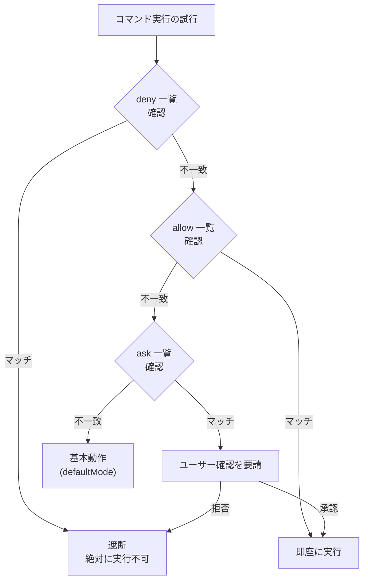

Claude Code の設定ファイル体系を詳しく案内します。エージェントに実行権限を委任するハーネスで settings.json はその委任の境界線を引くファイルです — 何を自動許可し、何を尋ね、何を絶対に止めるかがすべてここで決まります。


**一行要約**: `settings.json` は Claude Code の **管制塔** です。権限、環境変数、Hook、セキュリティポリシーを 1 か所で管理します。


## 設定範囲 (Configuration Scopes)

Claude Code は **範囲システム** を使って設定が適用される場所と共有対象を決定します。

### 4 つの範囲タイプ

| 範囲 | 場所 | 影響対象 | チーム共有 | 優先順位 |
|------|------|-----------|---------|----------|
| **Managed** | システムレベルの `managed-settings.json` | マシンのすべてのユーザー | ✓ (IT 配布) | 最高 |
| **User** | `~/.claude/` | ユーザー個人 (すべてのプロジェクト) | ✗ | 低い |
| **Project** | `.claude/` | リポジトリのすべての協業者 | ✓ (Git 追跡) | 中間 |
| **Local** | `.claude/*.local.*` | ユーザー (このリポジトリのみ) | ✗ | 高い |

### 範囲別の優先順位

同じ設定が複数の範囲にある場合、より具体的な範囲が優先します。


```mermaid
flowchart TD
    A[設定リクエスト] --> B{Managed 設定<br>あり?}
    B -->|はい| C[Managed を使用<br>オーバーライド不可]
    B -->|いいえ| D{Local 設定<br>あり?}
    D -->|はい| E[Local を使用<br>Project/User をオーバーライド]
    D -->|いいえ| F{Project 設定<br>あり?}
    F -->|はい| G[Project を使用<br>User をオーバーライド]
    F -->|いいえ| H[User を使用<br>デフォルト値]
```

**優先順位:** Managed > コマンドライン引数 > Local > Project > User

### 各範囲の使いどころ

**Managed 範囲** - 次に使用:
- 組織全体に適用するセキュリティポリシー
- 再定義不可能なコンプライアンス要件
- IT/DevOps から配布する標準化された構成

**User 範囲** - 次に使用:
- すべてのプロジェクトで望む個人設定 (テーマ、エディタ設定)
- すべてのプロジェクトで使うツールおよびプラグイン
- API キーおよび認証 (安全に保存)

**Project 範囲** - 次に使用:
- チーム共有設定 (権限、Hook)
- チームが持つべきプラグイン
- 協業者間のツール標準化

**Local 範囲** - 次に使用:
- 特定のプロジェクトの個人オーバーライド
- チームと共有する前の設定テスト
- 他のユーザーには動作しないマシン別の設定

## ファイルの場所

MoAI-ADK は 4 つの設定ファイルの場所を使います。

| ファイル | 場所 | 用途 | Git 追跡 |
|------|------|------|----------|
| `managed-settings.json` | システムレベル* | 管理型設定 (IT 配布) | いいえ |
| `settings.json` (User) | `~/.claude/settings.json` | 個人のグローバル設定 | いいえ |
| `settings.json` (Project) | `.claude/settings.json` | チーム共有設定 | はい |
| `settings.local.json` | `.claude/settings.local.json` | 個人のプロジェクト設定 | いいえ |

**システムレベルの場所:**
- macOS: `/Library/Application Support/ClaudeCode/`
- Linux/WSL: `/etc/claude-code/`
- Windows: `C:\Program Files\ClaudeCode\`


**注意**: `.claude/settings.json` は MoAI-ADK アップデート時に上書きされます。個人設定は必ず `settings.local.json` または `~/.claude/settings.json` に書いてください。


## settings.json とは?

`settings.json` は Claude Code の **グローバル設定ファイル** です。どのコマンドを自動許可し、どのコマンドを遮断するか、どの Hook を実行するか、環境変数を何に設定するかを定義します。

## 全体構造

```json
{
  "model": "",
  "language": "",
  "attribution": {},
  "companyAnnouncements": [],
  "autoUpdatesChannel": "",
  "spinnerTipsEnabled": true,
  "terminalProgressBarEnabled": true,
  "sandbox": {},
  "hooks": {},
  "permissions": {},
  "enabledPlugins": {},
  "extraKnownMarketplaces": {},
  "fileSuggestion": {},
  "alwaysThinkingEnabled": false,
  "maxThinkingTokens": 0,
  "statusLine": { "type": "command", "command": "moai statusline" },
  "outputStyle": "MoAI-Easy",
  "cleanupPeriodDays": 30,
  "env": {}
}
```

## 核心設定リファレンス

### model

使用する基本モデルを再定義します。

```json
{
  "model": "claude-sonnet-4-5-20250929"
}
```

### language

Claude の基本応答言語を設定します。

```json
{
  "language": "korean"
}
```

対応言語: `"korean"`, `"japanese"`, `"spanish"`, `"french"` など

### cleanupPeriodDays

この期間より古い非アクティブなセッションを起動時に削除します。`0` に設定するとすべてのセッションを即座に削除します。(デフォルト値: 30 日)

```json
{
  "cleanupPeriodDays": 20
}
```

### autoUpdatesChannel

アップデートを追うリリースチャネルです。

```json
{
  "autoUpdatesChannel": "stable"
}
```

- `"stable"`: 1 週間ほど経ったバージョン、主要な回帰をスキップ
- `"latest"` (デフォルト値): 最も新しいリリース

### spinnerTipsEnabled

Claude が作業する間スピナーにヒントを表示するかどうかです。`false` に設定するとヒントを無効化します。(デフォルト値: `true`)

```json
{
  "spinnerTipsEnabled": false
}
```

### terminalProgressBarEnabled

Windows Terminal や iTerm2 のような対応ターミナルで進行率を表示するターミナル進行率バーを有効化します。(デフォルト値: `true`)

```json
{
  "terminalProgressBarEnabled": false
}
```

### showTurnDuration

応答後にターンの所要時間メッセージを表示します (例: "Cooked for 1m 6s")。`false` に設定するとこのメッセージを隠します。

```json
{
  "showTurnDuration": true
}
```

### respectGitignore

`@` ファイルセレクターが `.gitignore` パターンを遵守するかどうかを制御します。`true` (デフォルト値) なら `.gitignore` パターンに一致するファイルが提案から除外されます。

```json
{
  "respectGitignore": false
}
```

### plansDirectory

プランファイルを保存する場所をカスタマイズします。パスはプロジェクトルートに相対的です。デフォルト値: `~/.claude/plans`

```json
{
  "plansDirectory": "./plans"
}
```

## 権限設定

Claude Code が実行できるコマンドの権限を管理します。権限設計の目標は 2 つです — 安全なコマンドは確認なしで流れるようにしてエージェンティックループを切らないこと、危険なコマンドはどんな場合も通過させないこと。

### 権限構造

```json
{
  "permissions": {
    "defaultMode": "acceptEdits",
    "allow": [],
    "ask": [],
    "deny": [],
    "additionalDirectories": [],
    "disableBypassPermissionsMode": "disable"
  }
}
```

### defaultMode

Claude Code を開くときの基本権限モードです。有効な値は次の 4 つです。

| 値 | 説明 |
|-----|------|
| `"default"` | 基本動作 — 各作業ごとにユーザー確認 |
| `"acceptEdits"` | ファイル編集を自動許可 (デフォルト値) |
| `"plan"` | 計画モード — 読み取り専用、ファイル修正不可 |
| `"bypassPermissions"` | すべての権限を自動許可 (危険、`disableBypassPermissionsMode` で遮断可能) |


**デフォルト値**: MoAI-ADK テンプレートは `"defaultMode": "acceptEdits"` を使います。これは開発フローでファイル編集プロンプトを減らしつつ危険なコマンドは依然として確認するようにバランスを取ります。


### allow (自動許可)

ユーザー確認なしで **即座に実行が許可される** コマンドの一覧です。

**基本許可コマンドのカテゴリ:**

| カテゴリ | コマンドの例 | 個数 |
|----------|-------------|------|
| ファイルツール | `Read`, `Write`, `Edit`, `Glob`, `Grep` | 7 個 |
| Git コマンド | `git add`, `git commit`, `git diff`, `git log` など | 15 個+ |
| パッケージ管理 | `npm`, `pip`, `uv`, `npx` | 4 個 |
| ビルド/テスト | `pytest`, `make`, `node`, `python` | 10 個+ |
| コード品質 | `ruff`, `black`, `prettier`, `eslint` | 6 個+ |
| 探索ツール | `ls`, `find`, `tree`, `cat`, `head` | 10 個+ |
| GitHub CLI | `gh issue`, `gh pr`, `gh repo view` | 2 個 |
| その他 | `AskUserQuestion`, `Task`, `Skill`, `TodoWrite` | 4 個 |

**allow 形式の例:**

```json
{
  "allow": [
    "Read",                          // ツール名のみ
    "Bash(git add:*)",               // Bash + コマンドパターン
    "Bash(pytest:*)",                // ワイルドカード
    "Bash(npm run *)",               // 空白区切り (新しい形式)
    "WebFetch(domain:example.com)"   // ドメインパターン
  ]
}
```

### ask (確認後に実行)

ユーザーに **確認を要請してから実行** されるコマンドの一覧です。

```json
{
  "ask": [
    "Bash(chmod:*)",       // ファイル権限の変更
    "Bash(chown:*)",       // 所有権の変更
    "Bash(rm:*)",          // ファイル削除
    "Bash(sudo:*)",        // 管理者権限
    "Read(./.env)",        // 環境変数ファイルの読み取り
    "Read(./.env.*)"       // 環境変数ファイルの読み取り
  ]
}
```

**ask の動作方式:**
1. Claude Code が該当コマンドの実行を試行
2. ユーザーに「このコマンドを実行しますか?」確認を要請
3. ユーザーが承認すれば実行、拒否すれば中断

### deny (無条件遮断)

どんな状況でも **絶対に実行されない** コマンドの一覧です。

**遮断カテゴリ:**

| カテゴリ | 遮断パターン | 理由 |
|----------|-----------|------|
| 機密ファイルアクセス | `Read(./secrets/**)`, `Write(~/.ssh/**)` | セキュリティ資格情報の保護 |
| クラウド資格情報 | `Read(~/.aws/**)`, `Read(~/.config/gcloud/**)` | クラウドアカウントの保護 |
| システム破壊 | `Bash(rm -rf /:*)`, `Bash(rm -rf ~:*)` | システムの保護 |
| 危険な Git | `Bash(git push --force:*)`, `Bash(git reset --hard:*)` | コードの保護 |
| ディスクフォーマット | `Bash(dd:*)`, `Bash(mkfs:*)`, `Bash(fdisk:*)` | ディスクの保護 |
| システムコマンド | `Bash(reboot:*)`, `Bash(shutdown:*)` | システムの安定性 |
| DB 削除 | `Bash(DROP DATABASE:*)`, `Bash(TRUNCATE:*)` | データの保護 |

**deny 形式の例:**

```json
{
  "deny": [
    "Read(./secrets/**)",           // 秘密ディレクトリの読み取りを遮断
    "Write(~/.ssh/**)",             // SSH キーの修正を遮断
    "Bash(git push --force:*)",     // 強制プッシュを遮断
    "Bash(rm -rf /:*)",            // ルート削除を遮断
    "Bash(DROP DATABASE:*)"        // DB 削除を遮断
  ]
}
```

### additionalDirectories

Claude がアクセスできる追加の作業ディレクトリです。

```json
{
  "permissions": {
    "additionalDirectories": [
      "../docs/"
    ]
  }
}
```

### disableBypassPermissionsMode

`bypassPermissions` モードが有効化されるのを防ぎます。`--dangerously-skip-permissions` コマンドラインフラグを無効化します。

```json
{
  "permissions": {
    "disableBypassPermissionsMode": "disable"
  }
}
```

### disableBundledSkills

`disableBundledSkills` (ブール値、または環境変数の形) は Claude Code のバンドル skills およびワークフロー — 例: `/deep-research`、内蔵スラッシュコマンド skills — を discovery から隠し、enterprise + personal + project + plugin skills のみを見せます。`true` に設定して選別されたバンドルなしの skill 表面を提供します。

```json
{
  "disableBundledSkills": true
}
```

`--safe-mode` CLI フラグは settings ではなく起動時点で同じランタイム効果を適用します — ロックされた環境や、ある動作がバンドル skill から起源したかをデバッグするときに有用です。MoAI-ADK は `disableBundledSkills` を生成したり `--safe-mode` を自動的に渡したりしません。両方とも利用可能なオプションとしてここに文書化されます。

## 権限ルール構文 (Permission Rule Syntax)

権限ルールは `Tool` または `Tool(specifier)` 形式に従います。パラメータ範囲ワイルドカード形式である `Tool(param:value)` も対応します — 例: `WebFetch(domain:example.com)` は該当ドメインへの WebFetch のみを許可、`Bash(cmd:git status)` は `git status` コマンドにマッチ、値の内部の `*` ワイルドカードでマッチ範囲を広げられます (`WebFetch(domain:*.example.com)`, `Bash(cmd:git *)`)。このパラメータ範囲形式は一般的な `Tool(specifier)` 形式よりきめ細かい制御を提供します。MoAI-ADK は現在自身の設定生成器でパラメータ範囲ルールを生成しません。この構文はパラメータレベルの権限制御が必要なプロジェクトのための利用可能なオプションとして文書化されます。

### ルール評価順序

複数のルールが同じツール使用に一致するとき、ルールは次の順序で評価されます。

1. **Deny** ルールが最初に確認される
2. **Ask** ルールが 2 番目に確認される
3. **Allow** ルールが最後に確認される

最初に一致するルールが動作を決定します。つまり、deny ルールが常に allow ルールより優先します。

### ツールのすべての使用に一致させる

ツールのすべての使用に一致させるには、括弧なしでツール名だけを使ってください。

| ルール | 効果 |
|------|------|
| `Bash` | **すべての** Bash コマンドに一致 |
| `WebFetch` | **すべての** ウェブ取得リクエストに一致 |
| `Read` | **すべての** ファイル読み取りに一致 |

`Bash(*)` は `Bash` と同じで、すべての Bash コマンドに一致します。2 つの構文を相互に交換して使えます。

### 詳細な制御のための指定子の使用

括弧の中に指定子を追加して特定のツール使用に一致させます。

| ルール | 効果 |
|------|------|
| `Bash(npm run build)` | 正確なコマンド `npm run build` に一致 |
| `Read(./.env)` | 現在のディレクトリの `.env` ファイル読み取りに一致 |
| `WebFetch(domain:example.com)` | example.com への取得リクエストに一致 |

### ワイルドカードパターン

Bash ルールは `*` とともに glob パターンに対応します。ワイルドカードはコマンドの先頭、中間、末尾などすべての位置に現れることができます。

```json
{
  "permissions": {
    "allow": [
      "Bash(npm run *)",
      "Bash(git commit *)",
      "Bash(git * main)",
      "Bash(* --version)",
      "Bash(* --help *)"
    ],
    "deny": [
      "Bash(git push *)"
    ]
  }
}
```

**重要:** `*` の前の空白が重要です。
- `Bash(ls *)` は `ls -la` に一致しますが `lsof` には一致しません
- `Bash(ls*)` は両方に一致します

**レガシー構文:** `:*` 接尾辞構文 (例: `Bash(npm run:*)`) は `*` と同じですが使われません。

### ドメイン別パターン

WebFetch のようなツールに対してドメイン別パターンを使えます。

```json
{
  "permissions": {
    "allow": [
      "WebFetch(domain:docs.anthropic.com)",
      "WebFetch(domain:github.com)"
    ],
    "deny": [
      "WebFetch(domain:malicious-site.com)"
    ]
  }
}
```

### 権限優先順位ダイアグラム


```mermaid
flowchart TD
    CMD["コマンド実行の試行"] --> CHECK_DENY{deny 一覧<br>確認}

    CHECK_DENY -->|マッチ| BLOCK["遮断<br>絶対に実行不可"]
    CHECK_DENY -->|不一致| CHECK_ALLOW{allow 一覧<br>確認}

    CHECK_ALLOW -->|マッチ| EXEC["即座に実行"]
    CHECK_ALLOW -->|不一致| CHECK_ASK{ask 一覧<br>確認}

    CHECK_ASK -->|マッチ| ASK["ユーザー確認を要請"]
    CHECK_ASK -->|不一致| DEFAULT["基本動作<br>(defaultMode)"]

    ASK -->|承認| EXEC
    ASK -->|拒否| BLOCK
```

**優先順位:** `deny` > `ask` > `allow` > `defaultMode`

## サンドボックス設定 (Sandbox Settings)

高度なサンドボックス化の動作を構成します。サンドボックス化はファイルシステムとネットワークから bash コマンドを隔離します — 権限ルールが論理的な防衛線なら、OS サンドボックスは物理的な防衛線です。


**重要:** ファイルシステムおよびネットワークの制限は Read, Edit, WebFetch の権限ルールを通じて構成され、サンドボックス設定を通じてではありません。


```json
{
  "sandbox": {
    "enabled": true,
    "autoAllowBashIfSandboxed": true,
    "excludedCommands": ["docker"],
    "allowUnsandboxedCommands": false,
    "network": {
      "allowUnixSockets": [
        "/var/run/docker.sock"
      ],
      "allowLocalBinding": true,
      "httpProxyPort": 8080,
      "socksProxyPort": 8081
    },
    "enableWeakerNestedSandbox": false
  }
}
```

### サンドボックス設定リファレンス

| キー | 説明 | 例 |
|-----|------|------|
| `enabled` | bash サンドボックス化を有効化 (macOS, Linux, WSL2)。デフォルト値: false | `true` |
| `autoAllowBashIfSandboxed` | サンドボックス化された bash コマンドを自動承認。デフォルト値: true | `true` |
| `excludedCommands` | サンドボックス外部で実行すべきコマンド | `["docker", "git"]` |
| `allowUnsandboxedCommands` | `dangerouslyDisableSandbox` パラメータを通じてコマンドがサンドボックス外部で実行されるのを許可。デフォルト値: true | `false` |
| `network.allowUnixSockets` | サンドボックスからアクセスできる Unix ソケットパス (SSH エージェントなど) | `["~/.ssh/agent-socket"]` |
| `network.allowLocalBinding` | localhost ポートへのバインドを許可 (macOS のみ)。デフォルト値: false | `true` |
| `network.httpProxyPort` | 自前のプロキシを持ち込みたい場合の HTTP プロキシポート | `8080` |
| `network.socksProxyPort` | 自前のプロキシを持ち込みたい場合の SOCKS5 プロキシポート | `8081` |
| `enableWeakerNestedSandbox` | 権限のない Docker 環境のための弱いサンドボックスを有効化 (Linux, WSL2 のみ)。**セキュリティ低下**。デフォルト値: false | `true` |

## 帰属設定 (Attribution Settings)

Claude Code は git コミットとプルリクエストに帰属を追加します。これらは別々に構成されます。

```json
{
  "attribution": {
    "commit": "Custom attribution text\n\nCo-Authored-By: AI <email@example.com>",
    "pr": ""
  }
}
```

### 帰属設定リファレンス

| キー | 説明 |
|-----|------|
| `commit` | git コミットのための帰属 (トレーラーを含む)。空文字列はコミット帰属を隠す |
| `pr` | プルリクエスト説明のための帰属。空文字列は PR 帰属を隠す |

### 基本コミット帰属

```
🤖 Generated with [Claude Code](https://claude.com/claude-code)

Co-Authored-By: Claude Sonnet 4.5 <noreply@anthropic.com>
```

### 基本 PR 帰属

```
🤖 Generated with [Claude Code](https://claude.com/claude-code)
```

## Hook 設定

Claude Code イベントに反応するスクリプトを登録します。

```json
{
  "hooks": {
    "SessionStart": [
      {
        "matcher": "",
        "hooks": [
          {
            "type": "command",
            "command": "スクリプトのパス"
          }
        ]
      }
    ],
    "PreToolUse": [
      {
        "matcher": "Write|Edit",
        "hooks": [
          {
            "type": "command",
            "command": "セキュリティガードスクリプトのパス",
            "timeout": 5000
          }
        ]
      }
    ],
    "PostToolUse": [
      {
        "matcher": "Write|Edit",
        "hooks": [
          {
            "type": "command",
            "command": "フォーマッタースクリプトのパス",
            "timeout": 30000
          },
          {
            "type": "command",
            "command": "リンタースクリプトのパス",
            "timeout": 60000
          }
        ]
      }
    ]
  }
}
```

### Hook イベントタイプ

| イベント | 説明 |
|--------|------|
| `SessionStart` | セッション開始時に実行 |
| `SessionEnd` | セッション終了時に実行 |
| `PreToolUse` | ツール使用前に実行 |
| `PostToolUse` | ツール使用後に実行 |
| `PreCompact` | コンテキスト圧縮前に実行 |


Hook 設定の詳しい内容は [Hooks ガイド](/ja/advanced/hooks-guide) を参考にしてください。


## プラグイン設定 (Plugin Settings)

プラグイン関連の設定です。

```json
{
  "enabledPlugins": {
    "formatter@acme-tools": true,
    "deployer@acme-tools": true,
    "analyzer@security-plugins": false
  },
  "extraKnownMarketplaces": {
    "acme-tools": {
      "source": {
        "source": "github",
        "repo": "acme-corp/claude-plugins"
      }
    }
  }
}
```

### enabledPlugins

有効化するプラグインを制御します。形式: `"plugin-name@marketplace-name": true/false`

**範囲:**
- **User settings** (`~/.claude/settings.json`): 個人のプラグイン選好
- **Project settings** (`.claude/settings.json`): チームと共有するプロジェクト別プラグイン
- **Local settings** (`.claude/settings.local.json`): マシン別のオーバーライド (コミットされない)

### extraKnownMarketplaces

リポジトリで利用可能にする追加のマーケットプレイスを定義します。一般的にはリポジトリレベルの設定で使い、チームメンバーが必要なプラグインソースにアクセスできるようにします。

## ファイル提案設定 (File Suggestion Settings)

`@` ファイルパスの自動補完のためのカスタムコマンドを構成します。

```json
{
  "fileSuggestion": {
    "type": "command",
    "command": "~/.claude/file-suggestion.sh"
  }
}
```

内蔵のファイル提案は速いファイルシステム走査を使いますが、大きなモノレポはプロジェクト別のインデックス化 (例: 事前ビルドされたファイルインデックスやカスタムツール) の恩恵を受けられます。

## 拡張思考設定 (Extended Thinking Settings)

拡張思考 (Extended Thinking) 関連の設定です。推論トークンもトークンです — 常にオンにしておくと便利ですが、予算とともに調整するのがトークノミクスの観点での定石です。

```json
{
  "alwaysThinkingEnabled": true,
  "maxThinkingTokens": 10000
}
```

### 拡張思考設定リファレンス

| キー | 説明 | 例 |
|-----|------|------|
| `alwaysThinkingEnabled` | すべてのセッションでデフォルト的に拡張思考を有効化 | `true` |
| `maxThinkingTokens` | 思考トークン予算の再定義 (デフォルト値: 31999、0 = 無効化) | `10000` |

## 会社のお知らせ (Company Announcements)

起動時にユーザーに表示するお知らせです。複数のお知らせを提供するとランダムに循環します。

```json
{
  "companyAnnouncements": [
    "Welcome to Acme Corp! Review our code guidelines at docs.acme.com",
    "Reminder: Code reviews required for all PRs",
    "New security policy in effect"
  ]
}
```

## ステータスバー設定

Claude Code 下部に表示されるステータスバーを設定します。

```json
{
  "statusLine": {
    "type": "command",
    "command": "moai statusline",
    "padding": 0,
    "refreshInterval": 10
  }
}
```

| フィールド | 説明 |
|------|------|
| `type` | `"command"` (コマンド実行) |
| `command` | 実行するコマンド (状態情報を返す) |
| `padding` | パディングサイズ |
| `refreshInterval` | 更新間隔 (ミリ秒) |

## 出力スタイル設定

```json
{
  "outputStyle": "MoAI-Easy"
}
```

出力スタイルは Claude Code の応答形式を決定します。MoAI-ADK テンプレートはデフォルト値として `"MoAI-Easy"` を使い、`settings.local.json` で個人の好みのスタイルに変更できます。

## 環境変数設定

`env` セクションで Claude Code の動作を制御する環境変数を設定します。

### MoAI-ADK 環境変数


**MoAI-ADK 拡張**: この設定は MoAI-ADK に特有で、公式の Claude Code の一部ではありません。


```json
{
  "env": {
    "MOAI_CONFIG_SOURCE": "sections"
  }
}
```

| 変数 | 値 | 説明 |
|------|-----|------|
| `MOAI_CONFIG_SOURCE` | `"sections"` | MoAI 設定ソース方式 |

### 公式 Claude Code 環境変数

```json
{
  "env": {
    "ENABLE_TOOL_SEARCH": "1",
    "CLAUDE_AUTOCOMPACT_PCT_OVERRIDE": "50"
  }
}
```

### 主要な環境変数リファレンス

| 変数 | 値 | 説明 |
|------|-----|------|
| `ENABLE_TOOL_SEARCH` | `"1"`, `"auto"`, `"auto:N"`, `"true"`, `"false"` | ツール検索の制御 (MoAI デフォルト値: `"1"`) |
| `CLAUDE_AUTOCOMPACT_PCT_OVERRIDE` | `1`-`100` | 自動圧縮トリガーの百分率 (デフォルト値: ~95%) |
| `CLAUDE_CODE_ENABLE_TELEMETRY` | `"1"` | OpenTelemetry データ収集の有効化 |
| `CLAUDE_CODE_DISABLE_BACKGROUND_TASKS` | `"1"` | バックグラウンド作業の無効化 |
| `DISABLE_AUTOUPDATER` | `"1"` | 自動アップデートの無効化 |
| `HTTP_PROXY` | URL | HTTP プロキシサーバー |
| `HTTPS_PROXY` | URL | HTTPS プロキシサーバー |


**ヒント**: MoAI-ADK テンプレートは `ENABLE_TOOL_SEARCH` を `"1"` に設定します — 遅延ツールロード (deferred tool preload) を有効化してセッション開始時にツールスキーマ全体をロードせず、必要なときに検索してロードします。`"auto"` はコンテキスト使用量 10% で有効化、`"auto:N"` は N% で有効化、`"false"` は常にオフです。


### ツール検索の詳細

`ENABLE_TOOL_SEARCH` はツール検索を制御します。ツールスキーマを全部常時ロードする代わりに必要なときに検索してロードするので、複数サーバー環境でコンテキストを大きく節約します。

| 値 | 説明 |
|-----|------|
| `"auto"` (デフォルト値) | 10% コンテキストで有効化 |
| `"auto:N"` | ユーザー指定の閾値 (例: `"auto:5"` は 5%) |
| `"true"` | 常に有効化 |
| `"false"` | 無効化 |

## settings.json vs settings.local.json

| 項目 | settings.json | settings.local.json |
|------|---------------|---------------------|
| 管理主体 | MoAI-ADK | ユーザー |
| Git 追跡 | 追跡される | .gitignore |
| アップデート時 | 上書き | 保存 |
| 用途 | チーム共有設定 | 個人設定 |
| 優先順位 | デフォルト値 | オーバーライド (優先) |

### settings.local.json 活用例

```json
{
  "permissions": {
    "allow": [
      "Bash(bun:*)",     // 個人的に使うツール
      "Bash(bun add:*)"
    ]
  },
  "outputStyle": "MoAI-Easy"  // 個人の好みの出力スタイル
}
```


`settings.local.json` の設定は `settings.json` の設定に **マージ** されます。同じキーがあれば `settings.local.json` が優先します。


### settings.local.json 権限強化 (0o600) {#settings-local-json-permission}

v2.20.0-rc1 から `settings.local.json` は生成・更新時に **`0o600`** (所有者専用 read/write) 権限が強制されます。以前の `0o644` はマルチユーザーワークステーションで `ANTHROPIC_AUTH_TOKEN` などの機密資格情報が他のローカルユーザーに露出するリスクがありました (CWE-732 / CWE-552)。

**自己点検**:

```bash
# Linux
stat -c '%a' .claude/settings.local.json
# 期待値: 600

# macOS
stat -f '%A' .claude/settings.local.json
# 期待値: 600
```

権限が `600` でなければ MoAI-ADK が次のセッション開始時に自動的に是正します。即座に是正するには `chmod 0600 .claude/settings.local.json` を実行してください。

詳しいセキュリティモデル、脅威分析、追加の点検手順は [セキュリティノート — CWE-732](/ja/advanced/security-notes/#cwe-732) を参照してください。

## MoAI 専用設定


**MoAI-ADK 拡張**: このセクションの設定は MoAI-ADK に特有で、公式の Claude Code ドキュメントに含まれません。


### MoAI カスタム statusLine

MoAI-ADK はカスタムステータスバーを提供します。

```json
{
  "statusLine": {
    "type": "command",
    "command": "moai statusline",
    "padding": 0,
    "refreshInterval": 10
  }
}
```

### MoAI Statusline v3 機能

MoAI-ADK statusline v3 には次が含まれます。

- **RGB グラデーション色**: システム状態に応じた動的な色グラデーション
- **5H/7D 使用量モニタリング**: 5 時間および 7 日の API 使用量バーの表示
- **マルチラインレイアウト**: Compact (3 行)、default、full のディスプレイモード
- **テーマ**:
  - **MoAI Dark** (デフォルト値): RGB グラデーションのあるダークテーマ
  - **MoAI Light**: 明るい環境のためのライトテーマ


**参考**: 以前のテーマ (Default, Catppuccin Mocha, Catppuccin Latte) は MoAI Dark/MoAI Light に名前が変更されました。


statusline のテーマとセグメントは `.moai/config/sections/statusline.yaml` で設定します。

### MoAI カスタム Hooks

MoAI-ADK は次のカスタム Hook を提供します。

```json
{
  "hooks": {
    "SessionStart": [
      {
        "matcher": "",
        "hooks": [
          {
            "type": "command",
            "command": "/bin/zsh -l -c 'uv run \"$CLAUDE_PROJECT_DIR/.claude/hooks/moai/session_start__show_project_info.py\"'"
          }
        ]
      }
    ],
    "PreCompact": [
      {
        "matcher": "",
        "hooks": [
          {
            "type": "command",
            "command": "/bin/zsh -l -c 'uv run \"$CLAUDE_PROJECT_DIR/.claude/hooks/moai/pre_compact__save_context.py\"'",
            "timeout": 5000
          }
        ]
      }
    ],
    "SessionEnd": [
      {
        "matcher": "",
        "hooks": [
          {
            "type": "command",
            "command": "/bin/zsh -l -c 'uv run \"$CLAUDE_PROJECT_DIR/.claude/hooks/moai/session_end__auto_cleanup.py\" &'"
          }
        ]
      }
    ],
    "PreToolUse": [
      {
        "matcher": "Write|Edit",
        "hooks": [
          {
            "type": "command",
            "command": "/bin/zsh -l -c 'uv run \"$CLAUDE_PROJECT_DIR/.claude/hooks/moai/pre_tool__security_guard.py\"'",
            "timeout": 5000
          }
        ]
      }
    ],
    "PostToolUse": [
      {
        "matcher": "Write|Edit",
        "hooks": [
          {
            "type": "command",
            "command": "/bin/zsh -l -c 'uv run \"$CLAUDE_PROJECT_DIR/.claude/hooks/moai/post_tool__code_formatter.py\"'",
            "timeout": 30000
          },
          {
            "type": "command",
            "command": "/bin/zsh -l -c 'uv run \"$CLAUDE_PROJECT_DIR/.claude/hooks/moai/post_tool__linter.py\"'",
            "timeout": 60000
          },
          {
            "type": "command",
            "command": "/bin/zsh -l -c 'uv run \"$CLAUDE_PROJECT_DIR/.claude/hooks/moai/post_tool__ast_grep_scan.py\"'",
            "timeout": 30000
          }
        ]
      }
    ]
  }
}
```

### MoAI 出力スタイル

```json
{
  "outputStyle": "MoAI-Easy"
}
```

`MoAI-Easy` は MoAI-ADK の基本出力スタイルで、親しみやすく簡潔な応答形式を提供します。

## 実践例: 設定のカスタマイズ

### 新しいツールの許可を追加

プロジェクトで `bun` を使うなら、`settings.local.json` に追加します。

```json
{
  "permissions": {
    "allow": [
      "Bash(bun:*)",
      "Bash(bun add:*)",
      "Bash(bun remove:*)",
      "Bash(bun run:*)"
    ]
  }
}
```

### サンドボックスの有効化

セキュリティのためにサンドボックスを有効化して Docker を除外します。

```json
{
  "sandbox": {
    "enabled": true,
    "autoAllowBashIfSandboxed": true,
    "excludedCommands": ["docker"],
    "network": {
      "allowUnixSockets": [
        "/var/run/docker.sock"
      ]
    }
  },
  "permissions": {
    "deny": [
      "Read(.envrc)",
      "Read(~/.aws/**)"
    ]
  }
}
```

### カスタム Hook の追加

個人の Hook を登録します。

```json
{
  "hooks": {
    "PostToolUse": [
      {
        "matcher": "Write|Edit",
        "hooks": [
          {
            "type": "command",
            "command": "python3 .claude/hooks/my-hooks/custom_check.py",
            "timeout": 10000
          }
        ]
      }
    ]
  }
}
```

### 帰属設定のカスタマイズ

```json
{
  "attribution": {
    "commit": "Generated with AI\n\nCo-Authored-By: AI <email@example.com>",
    "pr": ""
  }
}
```

## v2.9.0 の新規設定ファイル

### Harness 設定 (harness.yaml)

品質パイプラインの深度レベルと自動検出の閾値を定義します。変更の大きさに合わせて検証コストを調節する適応型品質の設定表面です。

**3 段階の深度レベル:**

| レベル | 説明 | evaluator | スキップする Phase |
|------|------|-----------|---------------|
| minimal | 速い反復 (簡単な変更) | 非有効 | 0, 0.5, 2.0, 2.5, 2.75, 2.8a, 2.9, 2.10 |
| standard | バランスの取れた品質 (ほとんどの開発) | final-pass | なし |
| thorough | 最大品質 (重要な機能) | per-sprint | なし |

```yaml
# .moai/config/sections/harness.yaml
harness:
  default_level: standard
  auto_detection:
    minimal:
      - "file_count <= 3 AND single_domain"
      - "spec_type in [bugfix, docs, config]"
    thorough:
      - "security_keywords OR payment_keywords present"
      - "spec_priority == critical"
  levels:
    thorough:
      evaluator_profile: "strict"
```

### Constitution 設定 (constitution.yaml)

プロジェクトの技術制約を機械可読に定義します。

```yaml
# .moai/config/sections/constitution.yaml
constitution:
  approved_languages: [go, typescript, python]
  approved_frameworks: [cobra, viper, gin, react, next]
  forbidden_patterns:
    - "global mutable state"
    - "panic() in library code"
  security:
    required_checks: [input-validation, sql-injection-prevention]
    forbidden_practices: ["hardcoded credentials", "HTTP without TLS"]
```

### Evaluator Profiles (evaluator-profiles/)

4 種の評価者プロファイルが提供されます。

| プロファイル | 説明 | Coverage | Security |
|--------|------|----------|----------|
| default | 標準的な懐疑的評価 | >= 85% | No Critical/High |
| strict | 強化されたセキュリティ/信頼性 (認証/決済) | >= 90% | ANY finding = FAIL |
| lenient | 緩和された評価 (プロトタイプ) | >= 60% | Critical only = FAIL |
| frontend | UI/UX 集中 | N/A | WCAG AA required |

プロファイルファイルの場所: `.moai/config/evaluator-profiles/{name}.md`

## 関連ドキュメント

- [Claude Code 公式設定ドキュメント](https://code.claude.com/docs/en/settings) - 公式の Claude Code 設定
- [Hooks ガイド](/ja/advanced/hooks-guide) - Hook 設定の詳細
- [CLAUDE.md ガイド](/ja/advanced/claude-md-guide) - プロジェクト指針の設定
- [IAM ドキュメント](https://code.claude.com/docs/en/iam) - 権限システムの概要


**ヒント**: 設定を変更した後は Claude Code を再起動しないと適用されません。`settings.local.json` は Git に追跡されないので、個人環境に合わせて自由に修正してください。

