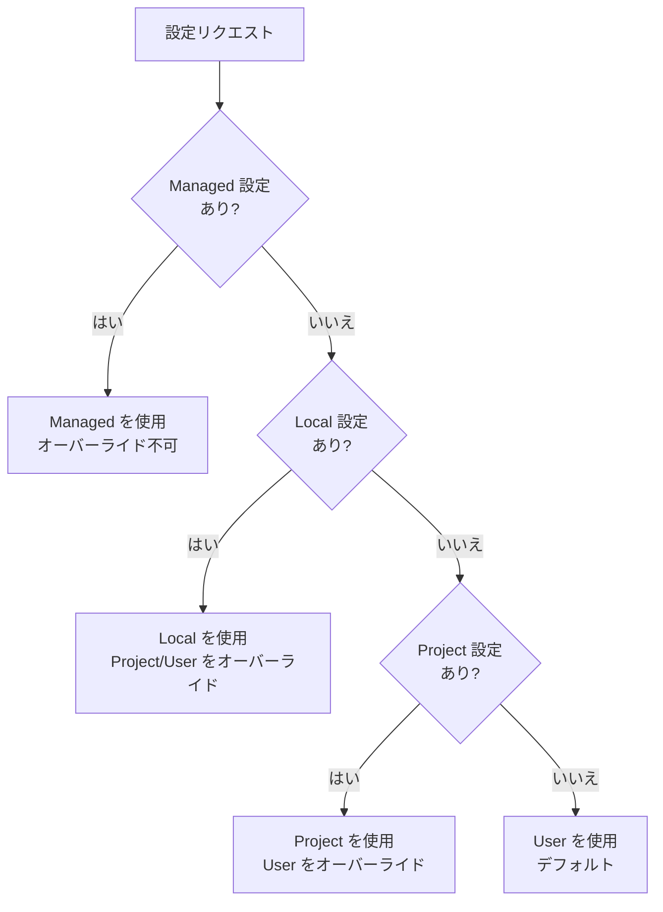
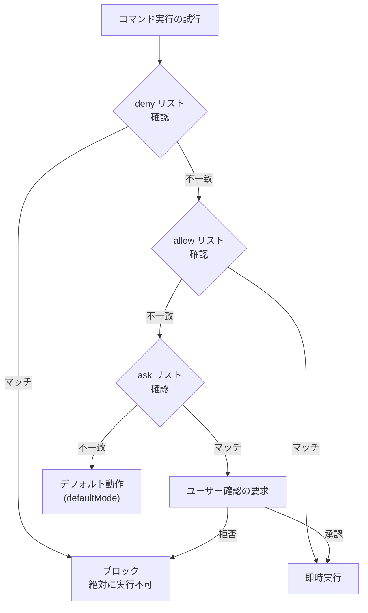

Claude Code の設定ファイル体系を詳しく解説します。エージェントに実行権限を委任するハーネスにおいて、settings.json はその委任の境界線を引くファイルです — 何を自動許可し、何を確認し、何を絶対にブロックするかがすべてここで決まります。


**ひと言要約**: `settings.json` は Claude Code の **管制塔** です。権限、環境変数、Hook、セキュリティポリシーを一か所で管理します。


## 設定スコープ (Configuration Scopes)

Claude Code は **スコープシステム** を使って、設定が適用される場所と共有対象を決定します。

### 4 つのスコープタイプ

| スコープ | 場所 | 影響対象 | チーム共有 | 優先順位 |
|------|------|-----------|---------|----------|
| **Managed** | システムレベル `managed-settings.json` | マシンのすべてのユーザー | ✓ (IT 配布) | 最高 |
| **User** | `~/.claude/` | ユーザー個人 (すべてのプロジェクト) | ✗ | 低 |
| **Project** | `.claude/` | リポジトリのすべての協業者 | ✓ (Git 追跡) | 中 |
| **Local** | `.claude/*.local.*` | ユーザー (このリポジトリのみ) | ✗ | 高 |

### スコープ別優先順位

同じ設定が複数のスコープにある場合、より具体的なスコープが優先されます。


```mermaid
flowchart TD
    A[設定リクエスト] --> B{Managed 設定<br>あり?}
    B -->|はい| C[Managed を使用<br>オーバーライド不可]
    B -->|いいえ| D{Local 設定<br>あり?}
    D -->|はい| E[Local を使用<br>Project/User をオーバーライド]
    D -->|いいえ| F{Project 設定<br>あり?}
    F -->|はい| G[Project を使用<br>User をオーバーライド]
    F -->|いいえ| H[User を使用<br>デフォルト]
```

**優先順位:** Managed > コマンドライン引数 > Local > Project > User

### 各スコープの用途

**Managed スコープ** - 次に使用:
- 組織全体に適用するセキュリティポリシー
- 上書き不可能なコンプライアンス要件
- IT/DevOps が配布する標準化された構成

**User スコープ** - 次に使用:
- すべてのプロジェクトで使いたい個人設定 (テーマ、エディタ設定)
- すべてのプロジェクトで使うツールとプラグイン
- API キーと認証 (安全に保管)

**Project スコープ** - 次に使用:
- チーム共有設定 (権限、Hook、MCP サーバー)
- チームが持つべきプラグイン
- 協業者間のツール標準化

**Local スコープ** - 次に使用:
- 特定プロジェクトでの個人オーバーライド
- チームと共有する前の設定テスト
- 他のユーザーには動作しないマシン固有の設定

## ファイルの場所

MoAI-ADK は 4 つの設定ファイル位置を使用します。

| ファイル | 場所 | 用途 | Git 追跡 |
|------|------|------|----------|
| `managed-settings.json` | システムレベル* | 管理型設定 (IT 配布) | いいえ |
| `settings.json` (User) | `~/.claude/settings.json` | 個人グローバル設定 | いいえ |
| `settings.json` (Project) | `.claude/settings.json` | チーム共有設定 | はい |
| `settings.local.json` | `.claude/settings.local.json` | 個人プロジェクト設定 | いいえ |

**システムレベルの場所:**
- macOS: `/Library/Application Support/ClaudeCode/`
- Linux/WSL: `/etc/claude-code/`
- Windows: `C:\Program Files\ClaudeCode\`


**注意**: `.claude/settings.json` は MoAI-ADK の更新時に上書きされます。個人設定は必ず `settings.local.json` または `~/.claude/settings.json` に書いてください。


## settings.json とは?

`settings.json` は Claude Code の **グローバル設定ファイル** です。どのコマンドを自動許可し、どのコマンドをブロックし、どの Hook を実行し、環境変数を何に設定するかを定義します。

## 全体構造

```json
{
  "model": "",
  "language": "",
  "attribution": {},
  "companyAnnouncements": [],
  "autoUpdatesChannel": "",
  "spinnerTipsEnabled": true,
  "terminalProgressBarEnabled": true,
  "sandbox": {},
  "hooks": {},
  "permissions": {},
  "enabledPlugins": {},
  "extraKnownMarketplaces": {},
  "fileSuggestion": {},
  "alwaysThinkingEnabled": false,
  "maxThinkingTokens": 0,
  "statusLine": {},
  "outputStyle": "",
  "cleanupPeriodDays": 30,
  "env": {}
}
```

## コア設定リファレンス

### model

使用するデフォルトモデルを上書きします。

```json
{
  "model": "claude-sonnet-4-5-20250929"
}
```

### language

Claude のデフォルト応答言語を設定します。

```json
{
  "language": "korean"
}
```

サポート言語: `"korean"`, `"japanese"`, `"spanish"`, `"french"` など

### cleanupPeriodDays

この期間より古い非アクティブセッションを起動時に削除します。`0` に設定するとすべてのセッションを即座に削除します。(デフォルト: 30 日)

```json
{
  "cleanupPeriodDays": 20
}
```

### autoUpdatesChannel

更新を追跡するリリースチャネルです。

```json
{
  "autoUpdatesChannel": "stable"
}
```

- `"stable"`: 1 週間程度経過したバージョン、主要なリグレッションをスキップ
- `"latest"` (デフォルト): 最新リリース

### spinnerTipsEnabled

Claude が作業している間、スピナーにヒントを表示するかどうかです。`false` に設定するとヒントを無効化します。(デフォルト: `true`)

```json
{
  "spinnerTipsEnabled": false
}
```

### terminalProgressBarEnabled

Windows Terminal や iTerm2 などのサポートされるターミナルで進捗を表示するターミナルプログレスバーを有効化します。(デフォルト: `true`)

```json
{
  "terminalProgressBarEnabled": false
}
```

### showTurnDuration

応答後にターン所要時間メッセージを表示します (例: "Cooked for 1m 6s")。`false` に設定するとこのメッセージを隠します。

```json
{
  "showTurnDuration": true
}
```

### respectGitignore

`@` ファイルピッカーが `.gitignore` パターンを尊重するかどうかを制御します。`true` (デフォルト) の場合、`.gitignore` パターンにマッチするファイルは提案から除外されます。

```json
{
  "respectGitignore": false
}
```

### plansDirectory

プランファイルを保存する場所をカスタマイズします。パスはプロジェクトルートに相対的です。デフォルト: `~/.claude/plans`

```json
{
  "plansDirectory": "./plans"
}
```

## 権限設定

Claude Code が実行できるコマンドの権限を管理します。権限設計の目標は 2 つです — 安全なコマンドは確認なしで流してエージェンティック・ループを断ち切らないこと、危険なコマンドはいかなる場合も通過させないこと。

### 権限構造

```json
{
  "permissions": {
    "defaultMode": "default",
    "allow": [],
    "ask": [],
    "deny": [],
    "additionalDirectories": [],
    "disableBypassPermissionsMode": "disable"
  }
}
```

### defaultMode

Claude Code を開くときのデフォルト権限モードです。

| 値 | 説明 |
|-----|------|
| `"acceptEdits"` | ファイル編集を自動許可 |
| `"allowEdits"` | ファイル編集を許可 |
| `"rejectEdits"` | ファイル編集を拒否 |
| `"default"` | デフォルト動作 |


**参考**: 現在の MoAI-ADK 設定ファイルは `"defaultMode": "default"` を使用します。これはレガシー値の可能性があります。


### allow (自動許可)

ユーザー確認なしで **即座に実行が許可される** コマンドのリストです。

**デフォルト許可コマンドのカテゴリ:**

| カテゴリ | コマンド例 | 数 |
|----------|-------------|------|
| ファイルツール | `Read`, `Write`, `Edit`, `Glob`, `Grep` | 7 個 |
| Git コマンド | `git add`, `git commit`, `git diff`, `git log` など | 15 個+ |
| パッケージ管理 | `npm`, `pip`, `uv`, `npx` | 4 個 |
| ビルド/テスト | `pytest`, `make`, `node`, `python` | 10 個+ |
| コード品質 | `ruff`, `black`, `prettier`, `eslint` | 6 個+ |
| 探索ツール | `ls`, `find`, `tree`, `cat`, `head` | 10 個+ |
| GitHub CLI | `gh issue`, `gh pr`, `gh repo view` | 2 個 |
| その他 | `AskUserQuestion`, `Task`, `Skill`, `TodoWrite` | 4 個 |

**allow の形式例:**

```json
{
  "allow": [
    "Read",                          // ツール名のみ
    "Bash(git add:*)",               // Bash + コマンドパターン
    "Bash(pytest:*)",                // ワイルドカード
    "Bash(npm run *)",               // スペース区切り (新しい形式)
    "WebFetch(domain:example.com)"   // ドメインパターン
  ]
}
```

### ask (確認後に実行)

ユーザーに **確認を要求してから実行される** コマンドのリストです。

```json
{
  "ask": [
    "Bash(chmod:*)",       // ファイル権限変更
    "Bash(chown:*)",       // 所有権変更
    "Bash(rm:*)",          // ファイル削除
    "Bash(sudo:*)",        // 管理者権限
    "Read(./.env)",        // 環境変数ファイルの読み取り
    "Read(./.env.*)"       // 環境変数ファイルの読み取り
  ]
}
```

**ask の動作方式:**
1. Claude Code が該当コマンドの実行を試行
2. ユーザーに「このコマンドを実行しますか?」と確認を要求
3. ユーザーが承認すれば実行、拒否すれば中断

### deny (無条件ブロック)

いかなる状況でも **絶対に実行されない** コマンドのリストです。

**ブロックカテゴリ:**

| カテゴリ | ブロックパターン | 理由 |
|----------|-----------|------|
| 機密ファイルアクセス | `Read(./secrets/**)`, `Write(~/.ssh/**)` | セキュリティクレデンシャルの保護 |
| クラウド認証情報 | `Read(~/.aws/**)`, `Read(~/.config/gcloud/**)` | クラウドアカウントの保護 |
| システム破壊 | `Bash(rm -rf /:*)`, `Bash(rm -rf ~:*)` | システム保護 |
| 危険な Git | `Bash(git push --force:*)`, `Bash(git reset --hard:*)` | コード保護 |
| ディスクフォーマット | `Bash(dd:*)`, `Bash(mkfs:*)`, `Bash(fdisk:*)` | ディスク保護 |
| システムコマンド | `Bash(reboot:*)`, `Bash(shutdown:*)` | システム安定性 |
| DB 削除 | `Bash(DROP DATABASE:*)`, `Bash(TRUNCATE:*)` | データ保護 |

**deny の形式例:**

```json
{
  "deny": [
    "Read(./secrets/**)",           // シークレットディレクトリの読み取りブロック
    "Write(~/.ssh/**)",             // SSH キー修正のブロック
    "Bash(git push --force:*)",     // 強制プッシュのブロック
    "Bash(rm -rf /:*)",            // ルート削除のブロック
    "Bash(DROP DATABASE:*)"        // DB 削除のブロック
  ]
}
```

### additionalDirectories

Claude がアクセスできる追加の作業ディレクトリです。

```json
{
  "permissions": {
    "additionalDirectories": [
      "../docs/"
    ]
  }
}
```

### disableBypassPermissionsMode

`bypassPermissions` モードが有効化されるのを防ぎます。`--dangerously-skip-permissions` コマンドラインフラグを無効化します。

```json
{
  "permissions": {
    "disableBypassPermissionsMode": "disable"
  }
}
```

### disableBundledSkills

`disableBundledSkills` (ブール値、または環境変数形式) は Claude Code のバンドル skills およびワークフロー — 例: `/deep-research`、組み込みスラッシュコマンド skills — を discovery から隠し、enterprise + personal + project + plugin skills だけを見えるようにします。`true` に設定して、厳選されたバンドルなしの skill 表面を提供します。

```json
{
  "disableBundledSkills": true
}
```

`--safe-mode` CLI フラグは settings ではなく起動時点で同じランタイム効果を適用します — ロックされた環境や、ある動作がバンドル skill 起源かをデバッグするときに便利です。MoAI-ADK は `disableBundledSkills` を生成したり `--safe-mode` を自動で渡したりしません。どちらも利用可能なオプションとしてここに文書化されます。

## 権限ルール構文 (Permission Rule Syntax)

権限ルールは `Tool` または `Tool(specifier)` 形式に従います。パラメータスコープのワイルドカード形式 `Tool(param:value)` もサポートされます — 例: `WebFetch(domain:example.com)` は該当ドメインへの WebFetch のみ許可、`Bash(cmd:git status)` は `git status` コマンドにマッチ、値内部の `*` ワイルドカードでマッチ範囲を広げられます (`WebFetch(domain:*.example.com)`, `Bash(cmd:git *)`)。このパラメータスコープ形式は一般の `Tool(specifier)` 形式より細かい制御を提供します。MoAI-ADK は現在、自前の設定ジェネレーターでパラメータスコープルールを生成しません。この構文はパラメータレベルの権限制御が必要なプロジェクト向けの利用可能なオプションとして文書化されます。

### ルール評価順序

複数のルールが同じツール使用にマッチするとき、ルールは次の順序で評価されます。

1. **Deny** ルールが最初に確認される
2. **Ask** ルールが 2 番目に確認される
3. **Allow** ルールが最後に確認される

最初にマッチしたルールが動作を決定します。つまり、deny ルールは常に allow ルールより優先されます。

### ツールのすべての使用にマッチさせる

ツールのすべての使用にマッチさせるには、括弧なしのツール名だけを使ってください。

| ルール | 効果 |
|------|------|
| `Bash` | **すべての** Bash コマンドにマッチ |
| `WebFetch` | **すべての** Web フェッチリクエストにマッチ |
| `Read` | **すべての** ファイル読み取りにマッチ |

`Bash(*)` は `Bash` と同じで、すべての Bash コマンドにマッチします。2 つの構文は相互に交換可能です。

### 細かい制御のための指定子の使用

括弧内に指定子を追加して特定のツール使用にマッチさせます。

| ルール | 効果 |
|------|------|
| `Bash(npm run build)` | 正確なコマンド `npm run build` にマッチ |
| `Read(./.env)` | 現在のディレクトリの `.env` ファイル読み取りにマッチ |
| `WebFetch(domain:example.com)` | example.com へのフェッチリクエストにマッチ |

### ワイルドカードパターン

Bash ルールは `*` と共に glob パターンをサポートします。ワイルドカードはコマンドの先頭、中間、末尾などあらゆる位置に置けます。

```json
{
  "permissions": {
    "allow": [
      "Bash(npm run *)",
      "Bash(git commit *)",
      "Bash(git * main)",
      "Bash(* --version)",
      "Bash(* --help *)"
    ],
    "deny": [
      "Bash(git push *)"
    ]
  }
}
```

**重要:** `*` の前のスペースが重要です。
- `Bash(ls *)` は `ls -la` にマッチしますが `lsof` にはマッチしません
- `Bash(ls*)` は両方にマッチします

**レガシー構文:** `:*` サフィックス構文 (例: `Bash(npm run:*)`) は `*` と同一ですが、非推奨です。

### ドメイン別パターン

WebFetch のようなツールにはドメイン別パターンを使えます。

```json
{
  "permissions": {
    "allow": [
      "WebFetch(domain:docs.anthropic.com)",
      "WebFetch(domain:github.com)"
    ],
    "deny": [
      "WebFetch(domain:malicious-site.com)"
    ]
  }
}
```

### 権限優先順位のダイアグラム


```mermaid
flowchart TD
    CMD["コマンド実行の試行"] --> CHECK_DENY{deny リスト<br>確認}

    CHECK_DENY -->|マッチ| BLOCK["ブロック<br>絶対に実行不可"]
    CHECK_DENY -->|不一致| CHECK_ALLOW{allow リスト<br>確認}

    CHECK_ALLOW -->|マッチ| EXEC["即時実行"]
    CHECK_ALLOW -->|不一致| CHECK_ASK{ask リスト<br>確認}

    CHECK_ASK -->|マッチ| ASK["ユーザー確認の要求"]
    CHECK_ASK -->|不一致| DEFAULT["デフォルト動作<br>(defaultMode)"]

    ASK -->|承認| EXEC
    ASK -->|拒否| BLOCK
```

**優先順位:** `deny` > `ask` > `allow` > `defaultMode`

## サンドボックス設定 (Sandbox Settings)

高度なサンドボックス動作を構成します。サンドボックスはファイルシステムとネットワークから bash コマンドを隔離します — 権限ルールが論理的防衛線だとすれば、OS サンドボックスは物理的防衛線です。


**重要:** ファイルシステムおよびネットワークの制限は Read、Edit、WebFetch 権限ルールを通じて構成され、サンドボックス設定を通じてではありません。


```json
{
  "sandbox": {
    "enabled": true,
    "autoAllowBashIfSandboxed": true,
    "excludedCommands": ["docker"],
    "allowUnsandboxedCommands": false,
    "network": {
      "allowUnixSockets": [
        "/var/run/docker.sock"
      ],
      "allowLocalBinding": true,
      "httpProxyPort": 8080,
      "socksProxyPort": 8081
    },
    "enableWeakerNestedSandbox": false
  }
}
```

### サンドボックス設定リファレンス

| キー | 説明 | 例 |
|-----|------|------|
| `enabled` | bash サンドボックスの有効化 (macOS, Linux, WSL2)。デフォルト: false | `true` |
| `autoAllowBashIfSandboxed` | サンドボックスされた bash コマンドの自動承認。デフォルト: true | `true` |
| `excludedCommands` | サンドボックス外で実行すべきコマンド | `["docker", "git"]` |
| `allowUnsandboxedCommands` | `dangerouslyDisableSandbox` パラメータでコマンドがサンドボックス外で実行されるのを許可。デフォルト: true | `false` |
| `network.allowUnixSockets` | サンドボックスからアクセスできる Unix ソケットパス (SSH エージェントなど) | `["~/.ssh/agent-socket"]` |
| `network.allowLocalBinding` | localhost ポートへのバインドを許可 (macOS のみ)。デフォルト: false | `true` |
| `network.httpProxyPort` | 自前のプロキシを持ち込む場合の HTTP プロキシポート | `8080` |
| `network.socksProxyPort` | 自前のプロキシを持ち込む場合の SOCKS5 プロキシポート | `8081` |
| `enableWeakerNestedSandbox` | 権限のない Docker 環境向けの弱いサンドボックスを有効化 (Linux, WSL2 のみ)。**セキュリティ低下**。デフォルト: false | `true` |

## 帰属設定 (Attribution Settings)

Claude Code は git コミットとプルリクエストに帰属を追加します。これらは別々に構成されます。

```json
{
  "attribution": {
    "commit": "Custom attribution text\n\nCo-Authored-By: AI <email@example.com>",
    "pr": ""
  }
}
```

### 帰属設定リファレンス

| キー | 説明 |
|-----|------|
| `commit` | git コミット用の帰属 (トレーラー含む)。空文字列はコミット帰属を非表示 |
| `pr` | プルリクエスト説明用の帰属。空文字列は PR 帰属を非表示 |

### デフォルトのコミット帰属

```
🤖 Generated with [Claude Code](https://claude.com/claude-code)

Co-Authored-By: Claude Sonnet 4.5 <noreply@anthropic.com>
```

### デフォルトの PR 帰属

```
🤖 Generated with [Claude Code](https://claude.com/claude-code)
```

## Hook 設定

Claude Code のイベントに反応するスクリプトを登録します。

```json
{
  "hooks": {
    "SessionStart": [
      {
        "matcher": "",
        "hooks": [
          {
            "type": "command",
            "command": "スクリプトパス"
          }
        ]
      }
    ],
    "PreToolUse": [
      {
        "matcher": "Write|Edit",
        "hooks": [
          {
            "type": "command",
            "command": "セキュリティガードスクリプトのパス",
            "timeout": 5000
          }
        ]
      }
    ],
    "PostToolUse": [
      {
        "matcher": "Write|Edit",
        "hooks": [
          {
            "type": "command",
            "command": "フォーマッタースクリプトのパス",
            "timeout": 30000
          },
          {
            "type": "command",
            "command": "リンタースクリプトのパス",
            "timeout": 60000
          }
        ]
      }
    ]
  }
}
```

### Hook イベントの種類

| イベント | 説明 |
|--------|------|
| `SessionStart` | セッション開始時に実行 |
| `SessionEnd` | セッション終了時に実行 |
| `PreToolUse` | ツール使用前に実行 |
| `PostToolUse` | ツール使用後に実行 |
| `PreCompact` | コンテキスト圧縮前に実行 |


Hook 設定の詳細は [Hooks ガイド](/ja/advanced/hooks-guide)を参照してください。


## プラグイン設定 (Plugin Settings)

プラグイン関連の設定です。

```json
{
  "enabledPlugins": {
    "formatter@acme-tools": true,
    "deployer@acme-tools": true,
    "analyzer@security-plugins": false
  },
  "extraKnownMarketplaces": {
    "acme-tools": {
      "source": {
        "source": "github",
        "repo": "acme-corp/claude-plugins"
      }
    }
  }
}
```

### enabledPlugins

有効化するプラグインを制御します。形式: `"plugin-name@marketplace-name": true/false`

**スコープ:**
- **User settings** (`~/.claude/settings.json`): 個人のプラグイン好み
- **Project settings** (`.claude/settings.json`): チームと共有するプロジェクト別プラグイン
- **Local settings** (`.claude/settings.local.json`): マシン固有のオーバーライド (コミットされない)

### extraKnownMarketplaces

リポジトリで利用可能にする追加のマーケットプレイスを定義します。通常、リポジトリレベル設定で使い、チームメンバーが必要なプラグインソースにアクセスできるようにします。

## ファイル提案設定 (File Suggestion Settings)

`@` ファイルパス自動補完のためのカスタムコマンドを構成します。

{
    "type": "command",
    "command": "~/.claude/file-suggestion.sh"
  }
}

組み込みのファイル提案は高速なファイルシステム走査を使いますが、大きなモノレポはプロジェクト別インデックス (例: 事前ビルドされたファイルインデックスやカスタムツール) の恩恵を受けられます。

## 拡張思考設定 (Extended Thinking Settings)

拡張思考 (Extended Thinking) 関連の設定です。推論トークンもトークンです — 常時オンにすると楽ですが、予算と共に調律するのがトークノミクス観点の定石です。

```json
{
  "alwaysThinkingEnabled": true,
  "maxThinkingTokens": 10000
}
```

### 拡張思考設定リファレンス

| キー | 説明 | 例 |
|-----|------|------|
| `alwaysThinkingEnabled` | すべてのセッションでデフォルトで拡張思考を有効化 | `true` |
| `maxThinkingTokens` | 思考トークン予算の上書き (デフォルト: 31999、0 = 無効化) | `10000` |

## 会社アナウンス (Company Announcements)

起動時にユーザーへ表示するアナウンスです。複数のアナウンスを提供するとランダムに循環します。

```json
{
  "companyAnnouncements": [
    "Welcome to Acme Corp! Review our code guidelines at docs.acme.com",
    "Reminder: Code reviews required for all PRs",
    "New security policy in effect"
  ]
}
```

## ステータスバー設定

Claude Code 下部に表示されるステータスバーを設定します。

```json
{
  "statusLine": {
    "type": "command",
    "command": "${SHELL:-/bin/bash} -l -c 'uv run --no-sync moai-adk statusline'",
    "padding": 0,
    "refreshInterval": 300
  }
}
```

| フィールド | 説明 |
|------|------|
| `type` | `"command"` (コマンド実行) |
| `command` | 実行するコマンド (状態情報を返す) |
| `padding` | パディングサイズ |
| `refreshInterval` | 更新周期 (ミリ秒) |

## 出力スタイル設定

```json
{
  "outputStyle": "R2-D2"
}
```

出力スタイルは Claude Code の応答形式を決定します。`settings.local.json` で個人の好みのスタイルに変更できます。

## 環境変数設定

`env` セクションで Claude Code の動作を制御する環境変数を設定します。

### MoAI-ADK 環境変数


**MoAI-ADK 拡張**: この設定は MoAI-ADK 固有であり、公式 Claude Code の一部ではありません。


```json
{
  "env": {
    "MOAI_CONFIG_SOURCE": "sections"
  }
}
```

| 変数 | 値 | 説明 |
|------|-----|------|
| `MOAI_CONFIG_SOURCE` | `"sections"` | MoAI 設定ソース方式 |

### 公式 Claude Code 環境変数

```json
{
  "env": {
    "ENABLE_TOOL_SEARCH": "auto:5",
    "CLAUDE_AUTOCOMPACT_PCT_OVERRIDE": "50"
  }
}
```

### 主要環境変数リファレンス

| 変数 | 値 | 説明 |
|------|-----|------|
| `ENABLE_TOOL_SEARCH` | `"auto"`, `"auto:N"`, `"true"`, `"false"` | ツール検索の制御 |
| `CLAUDE_AUTOCOMPACT_PCT_OVERRIDE` | `1`-`100` | 自動圧縮トリガーのパーセンテージ (デフォルト: ~95%) |
| `CLAUDE_CODE_ENABLE_TELEMETRY` | `"1"` | OpenTelemetry データ収集の有効化 |
| `CLAUDE_CODE_DISABLE_BACKGROUND_TASKS` | `"1"` | バックグラウンドタスクの無効化 |
| `DISABLE_AUTOUPDATER` | `"1"` | 自動更新の無効化 |
| `HTTP_PROXY` | URL | HTTP プロキシサーバー |
| `HTTPS_PROXY` | URL | HTTPS プロキシサーバー |


**ヒント**: `ENABLE_TOOL_SEARCH` の値 `"auto:5"` は、コンテキスト使用量が 5% のときツール検索を有効化します。`"auto"` はデフォルト 10%、`"true"` は常にオン、`"false"` は常にオフです。


### ツール検索の詳細

`ENABLE_TOOL_SEARCH` は ツール検索を制御します。ツールスキーマをすべて常時ロードする代わりに、必要なときに検索してロードするため、サーバーが多い環境でコンテキストを大きく節約します。

| 値 | 説明 |
|-----|------|
| `"auto"` (デフォルト) | コンテキスト 10% で有効化 |
| `"auto:N"` | カスタム閾値 (例: `"auto:5"` は 5%) |
| `"true"` | 常に有効化 |
| `"false"` | 無効化 |

## settings.json vs settings.local.json

| 項目 | settings.json | settings.local.json |
|------|---------------|---------------------|
| 管理主体 | MoAI-ADK | ユーザー |
| Git 追跡 | 追跡される | .gitignore |
| 更新時 | 上書き | 保存 |
| 用途 | チーム共有設定 | 個人設定 |
| 優先順位 | デフォルト | オーバーライド (優先) |

### settings.local.json の活用例

```json
{
  "permissions": {
    "allow": [
      "Bash(bun:*)",     // 個人的に使うツール
      "Bash(bun add:*)"
    ]
  },
  ],
  "outputStyle": "Mr.Alfred"  // 個人の好みの出力スタイル
}
```


`settings.local.json` の設定は `settings.json` の設定に **マージ** されます。同じキーがあれば `settings.local.json` が優先されます。


### settings.local.json 権限強化 (0o600) {#settings-local-json-permission}

v2.20.0-rc1 から `settings.local.json` は生成・更新時に **`0o600`** (所有者専用 read/write) 権限が強制されます。以前の `0o644` は、マルチユーザーワークステーションで `ANTHROPIC_AUTH_TOKEN` などの機密クレデンシャルが他のローカルユーザーに露出するリスクがありました (CWE-732 / CWE-552)。

**セルフ点検**:

```bash
# Linux
stat -c '%a' .claude/settings.local.json
# 期待値: 600

# macOS
stat -f '%A' .claude/settings.local.json
# 期待値: 600
```

権限が `600` でなければ、MoAI-ADK が次のセッション開始時に自動で是正します。すぐに是正するには `chmod 0600 .claude/settings.local.json` を実行してください。

詳細なセキュリティモデル、脅威分析、追加点検手順は [セキュリティノート — CWE-732](/ja/advanced/security-notes/#cwe-732) を参照してください。

## MoAI 専用設定


**MoAI-ADK 拡張**: このセクションの設定は MoAI-ADK 固有であり、公式 Claude Code ドキュメントには含まれません。


### MoAI カスタム statusLine

MoAI-ADK はカスタムステータスバーを提供します。

```json
{
  "statusLine": {
    "type": "command",
    "command": "${SHELL:-/bin/bash} -l -c 'uv run --no-sync moai-adk statusline'",
    "padding": 0,
    "refreshInterval": 300
  }
}
```

### MoAI Statusline v3 機能

MoAI-ADK statusline v3 には次が含まれます。

- **RGB グラデーションカラー**: システム状態に応じた動的なカラーグラデーション
- **5H/7D 使用量モニタリング**: 5 時間および 7 日の API 使用量バー表示
- **マルチラインレイアウト**: Compact (3 行)、default、full の表示モード
- **テーマ**:
  - **MoAI Dark** (デフォルト): RGB グラデーションのあるダークテーマ
  - **MoAI Light**: 明るい環境向けのライトテーマ


**参考**: 以前のテーマ (Default, Catppuccin Mocha, Catppuccin Latte) は MoAI Dark/MoAI Light に名称変更されました。


statusline のテーマとセグメントは `.moai/config/sections/statusline.yaml` で設定します。

### MoAI カスタム Hooks

MoAI-ADK は次のカスタム Hook を提供します。

```json
{
  "hooks": {
    "SessionStart": [
      {
        "matcher": "",
        "hooks": [
          {
            "type": "command",
            "command": "/bin/zsh -l -c 'uv run \"$CLAUDE_PROJECT_DIR/.claude/hooks/moai/session_start__show_project_info.py\"'"
          }
        ]
      }
    ],
    "PreCompact": [
      {
        "matcher": "",
        "hooks": [
          {
            "type": "command",
            "command": "/bin/zsh -l -c 'uv run \"$CLAUDE_PROJECT_DIR/.claude/hooks/moai/pre_compact__save_context.py\"'",
            "timeout": 5000
          }
        ]
      }
    ],
    "SessionEnd": [
      {
        "matcher": "",
        "hooks": [
          {
            "type": "command",
            "command": "/bin/zsh -l -c 'uv run \"$CLAUDE_PROJECT_DIR/.claude/hooks/moai/session_end__auto_cleanup.py\" &'"
          }
        ]
      }
    ],
    "PreToolUse": [
      {
        "matcher": "Write|Edit",
        "hooks": [
          {
            "type": "command",
            "command": "/bin/zsh -l -c 'uv run \"$CLAUDE_PROJECT_DIR/.claude/hooks/moai/pre_tool__security_guard.py\"'",
            "timeout": 5000
          }
        ]
      }
    ],
    "PostToolUse": [
      {
        "matcher": "Write|Edit",
        "hooks": [
          {
            "type": "command",
            "command": "/bin/zsh -l -c 'uv run \"$CLAUDE_PROJECT_DIR/.claude/hooks/moai/post_tool__code_formatter.py\"'",
            "timeout": 30000
          },
          {
            "type": "command",
            "command": "/bin/zsh -l -c 'uv run \"$CLAUDE_PROJECT_DIR/.claude/hooks/moai/post_tool__linter.py\"'",
            "timeout": 60000
          },
          {
            "type": "command",
            "command": "/bin/zsh -l -c 'uv run \"$CLAUDE_PROJECT_DIR/.claude/hooks/moai/post_tool__ast_grep_scan.py\"'",
            "timeout": 30000
          }
        ]
      }
    ]
  }
}
```

### MoAI 出力スタイル

```json
{
  "outputStyle": "Mr.Alfred"
}
```

このスタイルは Alfred AI オーケストレーターの固有の応答形式を提供します。

## 実践例: 設定のカスタマイズ

### 新しいツール許可の追加

プロジェクトで `bun` を使うなら、`settings.local.json` に追加します。

```json
{
  "permissions": {
    "allow": [
      "Bash(bun:*)",
      "Bash(bun add:*)",
      "Bash(bun remove:*)",
      "Bash(bun run:*)"
    ]
  }
}
```


Context7 MCP サーバーを有効化します。

{
}

### サンドボックスの有効化

セキュリティのためサンドボックスを有効化し、Docker を除外します。

```json
{
  "sandbox": {
    "enabled": true,
    "autoAllowBashIfSandboxed": true,
    "excludedCommands": ["docker"],
    "network": {
      "allowUnixSockets": [
        "/var/run/docker.sock"
      ]
    }
  },
  "permissions": {
    "deny": [
      "Read(.envrc)",
      "Read(~/.aws/**)"
    ]
  }
}
```

### カスタム Hook の追加

個人 Hook を登録します。

```json
{
  "hooks": {
    "PostToolUse": [
      {
        "matcher": "Write|Edit",
        "hooks": [
          {
            "type": "command",
            "command": "python3 .claude/hooks/my-hooks/custom_check.py",
            "timeout": 10000
          }
        ]
      }
    ]
  }
}
```

### 帰属設定のカスタマイズ

```json
{
  "attribution": {
    "commit": "Generated with AI\n\nCo-Authored-By: AI <email@example.com>",
    "pr": ""
  }
}
```

## v2.9.0 新規設定ファイル

### Harness 設定 (harness.yaml)

品質パイプラインの深度レベルと自動検出の閾値を定義します。変更の大きさに合わせて検証コストを調整する適応型品質の設定サーフェスです。

**3 段階の深度レベル:**

| レベル | 説明 | evaluator | スキップする Phase |
|------|------|-----------|---------------|
| minimal | 高速イテレーション (簡単な変更) | 無効 | 0, 0.5, 2.0, 2.5, 2.75, 2.8a, 2.9, 2.10 |
| standard | バランスの取れた品質 (ほとんどの開発) | final-pass | なし |
| thorough | 最大品質 (重要な機能) | per-sprint | なし |

```yaml
# .moai/config/sections/harness.yaml
harness:
  default_level: standard
  auto_detection:
    minimal:
      - "file_count <= 3 AND single_domain"
      - "spec_type in [bugfix, docs, config]"
    thorough:
      - "security_keywords OR payment_keywords present"
      - "spec_priority == critical"
  levels:
    thorough:
      evaluator_profile: "strict"
```

### Constitution 設定 (constitution.yaml)

プロジェクトの技術制約を機械可読に定義します。

```yaml
# .moai/config/sections/constitution.yaml
constitution:
  approved_languages: [go, typescript, python]
  approved_frameworks: [cobra, viper, gin, react, next]
  forbidden_patterns:
    - "global mutable state"
    - "panic() in library code"
  security:
    required_checks: [input-validation, sql-injection-prevention]
    forbidden_practices: ["hardcoded credentials", "HTTP without TLS"]
```

### Evaluator Profiles (evaluator-profiles/)

4 種の評価者プロファイルが提供されます。

| プロファイル | 説明 | Coverage | Security |
|--------|------|----------|----------|
| default | 標準の懐疑的評価 | >= 85% | No Critical/High |
| strict | 強化されたセキュリティ/信頼性 (認証/決済) | >= 90% | ANY finding = FAIL |
| lenient | 緩和された評価 (プロトタイプ) | >= 60% | Critical only = FAIL |
| frontend | UI/UX 集中 | N/A | WCAG AA required |

プロファイルファイルの場所: `.moai/config/evaluator-profiles/{name}.md`

## 関連ドキュメント

- [Claude Code 公式設定ドキュメント](https://code.claude.com/docs/en/settings) - 公式 Claude Code 設定
- [Hooks ガイド](/ja/advanced/hooks-guide) - Hook 設定詳細
- [CLAUDE.md ガイド](/ja/advanced/claude-md-guide) - プロジェクト指針設定
- [IAM ドキュメント](https://code.claude.com/docs/en/iam) - 権限システム概要


**ヒント**: 設定を変更した後は Claude Code の再起動で適用されます。`settings.local.json` は Git に追跡されないので、個人環境に合わせて自由に修正してください。

