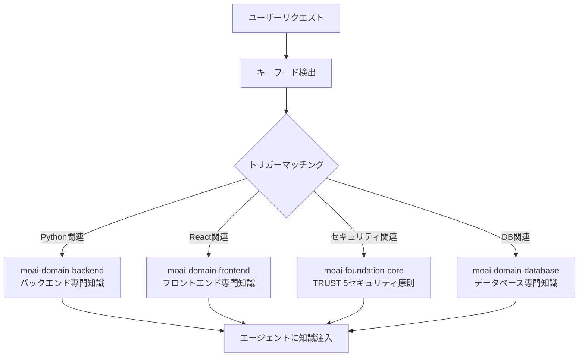
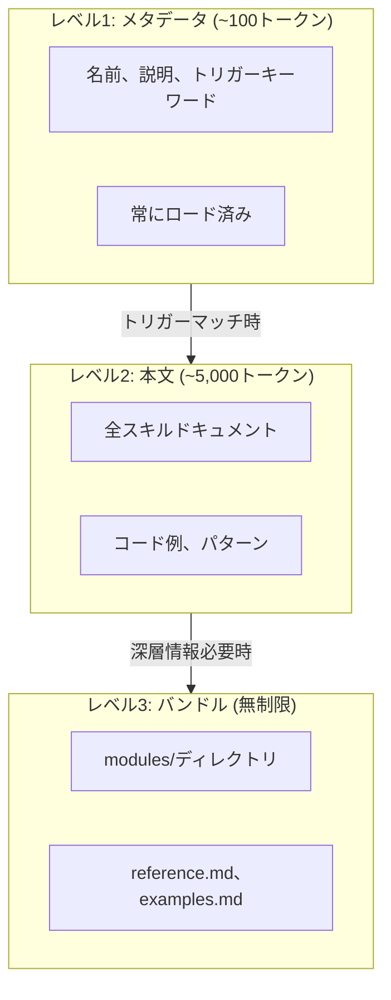
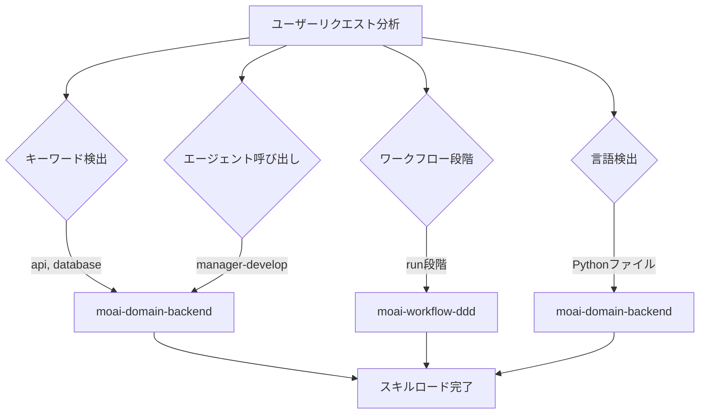
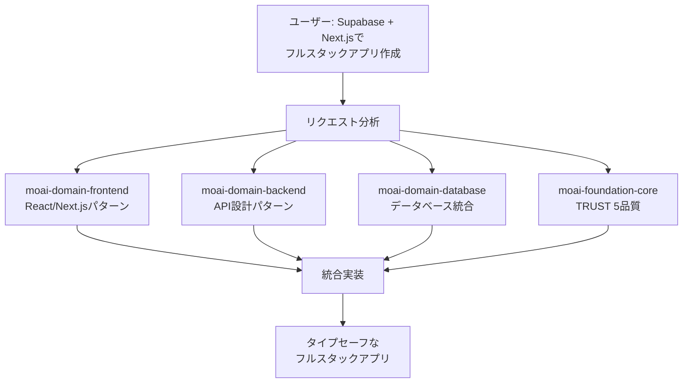

MoAI-ADKのスキルシステムを詳しく解説します。



**スキルとは？**

1999年の映画**マトリックス**のヘリコ操縦シーンを覚えていますか？ネオがトリニティに
ヘリコの操縦ができるか尋ねると、本部に電話してヘリコモデルを知り使い方マニュアルを
送信するように頼むシーンがあります。

<p align="center">
  <iframe
    width="720"
    height="360"
    src="https://www.youtube.com/embed/9Luu4itC-Zs"
    title="マトリックス ヘリコ操縦シーン"
    frameBorder="0"
    allow="accelerometer; autoplay; clipboard-write; encrypted-media; gyroscope; picture-in-picture"
    allowFullScreen
  ></iframe>
</p>

**Claude Codeのスキル** **(こそがその**使い方マニュアル**です。必要な瞬間に
必要な知識だけをロードしてAIが即座に専門家のように振る舞えるようにします。



## スキルとは？

スキルはClaude Codeに特定分野の専門知識を提供する**知識モジュール**です。

学校に例えると、Claude Codeが生徒でスキルが教科書です。数学の授業では数学の教科書を、科学の授業では科学の教科書を開くように、Claude CodeもPythonコードを書く時はPythonスキルを、React UIを作成時はFrontendスキルをロードします。



**スキルなしの場合**: Claude Codeは一般的な知識でのみ応答します。**スキルがある場合**: MoAI-ADKのルール、パターン、ベストプラクティスを適用して応答します。

## スキルカテゴリ

MoAI-ADKには計**31スキル**が6カテゴリに分類されています。`moai` umbrellaルーター1個と30の専門スキルで構成されます (Foundation、Workflow、Domain、Reference、Meta/Harness、Design)。プログラミング言語サポートは`rules/moai/languages/`配下のルールで提供され、個別スキルではありません。

### Foundation (中核哲学) - 4個

| スキル名 | 説明 |
|-------------|------|
| `moai-foundation-core` | SPEC ベース TDD/DDD、TRUST 5フレームワーク、実行ルール |
| `moai-foundation-cc` | Claude Code拡張パターン (Skills、Agents、Hooks) |
| `moai-foundation-thinking` | 構造化思考、アイデア創出、第一原理分析 |
| `moai-foundation-quality` | コード品質自動検証、TRUST 5バリデーション |

### Workflow (自動化ワークフロー) - 10個

| スキル名 | 説明 |
|---------|------|
| `moai-workflow-spec` | SPECドキュメント作成、GEARS形式、要件分析 |
| `moai-workflow-project` | プロジェクト初期化、ドキュメント作成、言語設定 |
| `moai-workflow-ddd` | ANALYZE-PRESERVE-IMPROVEサイクル |
| `moai-workflow-tdd` | RED-GREEN-REFACTOR テスト駆動開発 |
| `moai-workflow-testing` | テスト作成、デバッグ、コードレビュー統合 |
| `moai-workflow-worktree` | Git worktreeベース並列開発 |
| `moai-workflow-loop` | Ralph Engine自律ループ、LSP連携 |
| `moai-workflow-ci-loop` | CI監視・自動修正ループワークフロー |
| `moai-workflow-gan-loop` | Builder-Evaluator GANループ、デザイン品質 |
| `moai-workflow-design` | デザインワークフロー、Claude Design取り込み |

### Domain (ドメイン専門性) - 9個

| スキル名 | 説明 |
|----------|------|
| `moai-domain-backend` | API設計、マイクロサービス、データベース統合 |
| `moai-domain-frontend` | React 19、Next.js 16、Vue 3.5、コンポーネントアーキテクチャ |
| `moai-domain-database` | PostgreSQL、MongoDB、Redis、高度データパターン |
| `moai-domain-ideation` | Lean Canvas、提案生成、ダイバージ-コンバージ |
| `moai-domain-research` | 市場調査、エコシステム分析、WebSearch |
| `moai-domain-brand-design` | ブランド整合ビジュアルデザイン、デザイントークン |
| `moai-domain-design-handoff` | Claude Designハンドオフパッケージ |
| `moai-domain-copywriting` | ブランド整合マーケティングコピー、アンチAI-slop |
| `moai-domain-humanize` | AIテキストヒューマナイゼーション、ポスト編集、韓国語AI-tell分類体系 |

### Reference (ベストプラクティス) - 5個

| スキル名 | 説明 |
|----------|------|
| `moai-ref-api-patterns` | REST/GraphQL API設計パターン、エラー処理 |
| `moai-ref-git-workflow` | Gitワークフロー、ブランチ戦略、Conventional Commits |
| `moai-ref-owasp-checklist` | OWASP Top 10セキュリティパターン、入力バリデーション |
| `moai-ref-react-patterns` | React/Next.jsコンポーネントパターン、状態管理 |
| `moai-ref-testing-pyramid` | テストピラミッド戦略、カバレッジ目標 |

### Meta/Harness (システム拡張) - 2個

| スキル名 | 説明 |
|----------|------|
| `moai-meta-harness` | プロジェクト特化エージェントチーム動的生成 |
| `moai-harness-learner` | Harness学習サブシステム、自動更新提案 |

> `moai` umbrellaスキル (統合`/moai`ルーター) は合計31に含まれますが、分類された機能スキルではなく、このガイドで説明されるサブコマンドをディスパッチします。

## 段階的開示システム

MoAI-ADKのスキルは**3段階段階的開示** (Progressive Disclosure) システムを使用します。すべてのスキルを一度にロードするとトークンが浪費されるため、必要な分だけ段階的にロードします。



### 各レベルの役割

| レベル | トークン | ロード時期 | 内容 |
|-------|--------|-----------|------|
| レベル1 | ~100 | 常時 | スキル名、説明、トリガーキーワード |
| レベル2 | ~5,000 | トリガーマッチ時 | 全ドキュメント、コード例、パターン |
| レベル3 | 無制 | オンデマンド | modules/、reference.md、examples.md |

### トークン節約効果

- **従来方式**: 31スキル全ロード = 約160,000トークン (不可能)
- **段階的開示**: メタデータのみロード = 約5,200トークン (97%節約)
- **必要時ロード**: タスクに必要な2〜3スキルのみ = 約15,000トークン追加

## スキルトリガーメカニズム

スキルは**4つのトリガー条件**で自動ロードされます。



### トリガー設定例

```yaml
# スキルフロントマターでトリガー定義
triggers:
  keywords: ["api", "database", "authentication"] # キーワードマッチング
  agents: ["manager-spec", "manager-develop"] # エージェント呼び出し時
  phases: ["plan", "run"] # ワークフロー段階
  languages: ["python", "typescript"] # プログラミング言語
```

**トリガー優先順位:**

1. **キーワード** (keywords): ユーザーメッセージでキーワードを検出すると即座にロード
2. **エージェント** (agents): 特定エージェントが呼び出されると自動ロード
3. **段階** (phases): Plan/Run/Sync段階に従ってロード
4. **言語** (languages): 作業中ファイルのプログラミング言語に従ってロード

## スキル使用法

### 明示的呼び出し

Claude Code会話で直接スキルを呼び出せます。

```bash
# Claude Codeでスキル呼び出し
> Skill("moai-domain-backend")
> Skill("moai-domain-frontend")
> Skill("moai-ref-api-patterns")
```

### 自動ロード

大部分の場合、スキルはトリガーメカニズムによって**自動的にロード**されます。ユーザーが直接呼び出す必要なく、会話コンテキストを分析して適切なスキルが有効化されます。

## スキルディレクトリ構造

スキルファイルは`.claude/skills/`ディレクトリに配置されます。

```
.claude/skills/
├── moai-foundation-core/       # Foundationカテゴリ
│   ├── skill.md                # メインスキルドキュメント (500行以下)
│   ├── modules/                # 深層ドキュメント (無制限)
│   │   ├── trust-5-framework.md
│   │   ├── spec-first-ddd.md
│   │   └── delegation-patterns.md
│   ├── examples.md             # 実戦例
│   └── reference.md            # 外部参照リンク
│
├── moai-domain-backend/        # Domainカテゴリ
│   ├── skill.md
│   └── modules/
│       ├── api-patterns.md
│       └── microservices.md
│
└── my-skills/                  # ユーザーカスタムスキル (更新除外)
    └── my-custom-skill/
        └── skill.md
```


  **注意**: `moai-*`接頭のスキルはMoAI-ADK更新時に上書きされます。個人スキルは必ず`.claude/skills/my-skills/`ディレクトリに作成してください。


### スキルファイル構造

各スキルの`skill.md`は以下の構造に従います。

```markdown
---
name: moai-domain-backend
description: >
  バックエンド開発専門家。API設計、マイクロサービス、データベース統合パターン提供。
  API、ウェブアプリ、データパイプライン開発時に使用。
version: 3.0.0
category: domain
status: active
triggers:
  keywords: ["api", "database", "microservices", "authentication"]
allowed-tools: ["Read", "Grep", "Glob", "Bash", "Context7 MCP"]
---

# バックエンド開発専門家

## Quick Reference

(簡易リファレンス - 30秒)

## Implementation Guide

(実装ガイド - 5分)

## Advanced Patterns

(高度パターン - 10分+)

## Works Well With

(関連スキル/エージェント)
```

## 実戦例

### Pythonプロジェクトでスキル自動ロード

ユーザーがPython FastAPIプロジェクトで作業するシナリオです。

```bash
# 1. ユーザーがAPI開発をリクエスト
> FastAPIでユーザー認証APIを作成して

# 2. MoAI-ADKが自動検知するキーワード
# "FastAPI" → moai-domain-backendトリガー (Pythonパターンは rules/moai/languages/ 経由で提供)
# "認証"    → moai-domain-backendトリガー
# "API"     → moai-domain-backendトリガー

# 3. 自動ロードされるスキル
# - moai-domain-backend (Level 2): API設計パターン、認証戦略
# - moai-foundation-core (Level 1): TRUST 5品質基準

# 4. エージェントがスキル知識を活用して実装
# - FastAPIルーターパターン適用
# - JWT認証ベストプラクティス適用
# - pytestテスト自動生成
# - TRUST 5品質基準満たす
```

### スキル間連携

1つのタスクで複数のスキルが連携するプロセスです。



## スキルスコープとディスカバリー (Skill Scope and Discovery)

### ネストされた `.claude/skills` のロード

Claude Code はプロジェクトルートだけでなく、ネストされたサブディレクトリ (parent-walk) にも `.claude/skills/` を発見します。そのためモノレポでは、各パッケージ独自の `.claude/skills/` ディレクトリにパッケージローカルのスキルを配置できます。独自の `.claude/skills/` を含むネストされたディレクトリ内で作業する場合、そのネストされたディレクトリのスキルは、そのサブツリーでの作業中、ルートレベルのスキルと併せてロードされます。

### 名前衝突時の closest-wins

ネストチェーンに沿って複数の `.claude/skills/` ディレクトリに同じスキル名が現れる場合、**closest-directory-wins** (最も近いディレクトリ優先) ルールが衝突を解決します: 現在の作業ディレクトリに最も近い `.claude/skills/` が、ツリーの上位にあるものをシャドウします。これは、ネストされた `.claude/` ディレクトリ配下でエージェント、ワークフロー、output-styles に既に適用されている優先順位と同じです — 最も内側の `.claude/` が勝ちます。ルートスキルを意図的にオーバーライドするパッケージローカルスキルは、同じ名前を保持する必要があります。名前を変更すると、オーバーライドではなく 2 番目のスキルが作成されます。

### `disableBundledSkills` トグル

`disableBundledSkills` (settings.json ブール値、または環境変数形式) は Claude Code バンドル skills およびワークフロー — 例: `/deep-research`、組み込みスラッシュコマンド skills — を discovery から隠し、enterprise + personal + project + plugin skills のみを表示します。キュレーションされたバンドルフリーの skill サーフェスを提供する際に使用してください。MoAI-ADK はこのトグルを独自のジェネレータから送出しません。利用可能なオプションとしてここに文書化されます。同伴する `--safe-mode` 起動フラグは [Settings JSON ガイド](/ja/advanced/settings-json#disablebundledskills) に文書化されています。

## 関連ドキュメント

- [エージェントガイド](/advanced/agent-guide) - スキルを活用するエージェント体系
- [ビルダーエージェントガイド](/advanced/builder-agents) - カスタムスキル作成方法
- [CLAUDE.mdガイド](/advanced/claude-md-guide) - スキル設定とルール体系


  **ヒント**: スキルを活用するコツは**適切なキーワード使用**です。「Pythonで
  REST API作成して」とリクエストすると`moai-domain-backend`スキルが自動的に有効化され
  (Pythonパターンは`rules/moai/languages/`経由で提供)、最適のコードを生成します。

