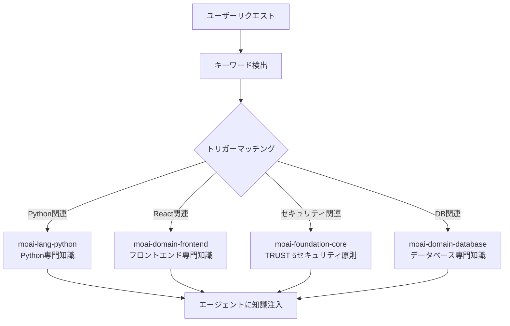
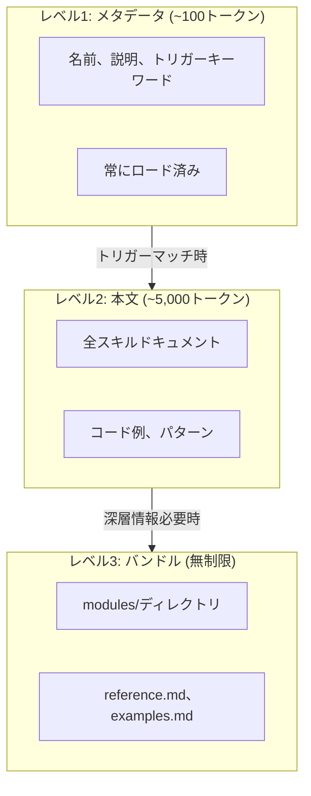
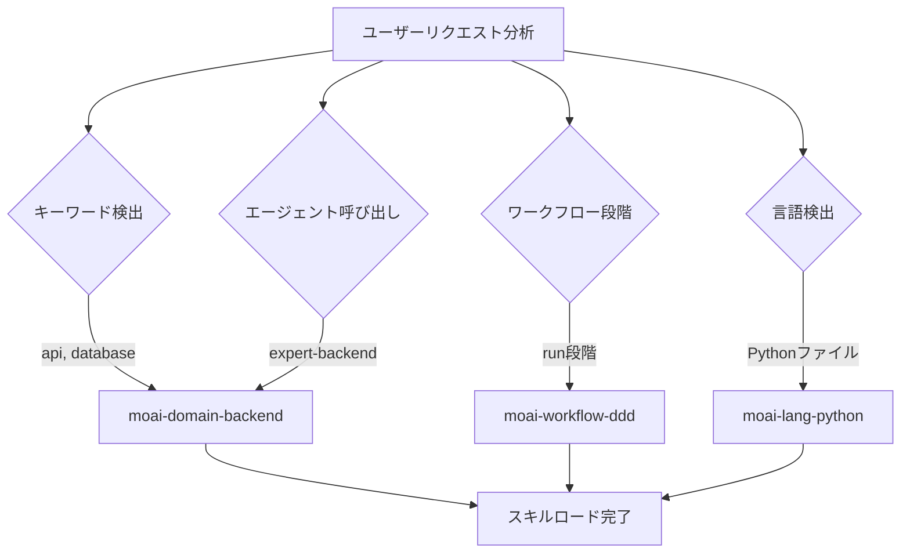
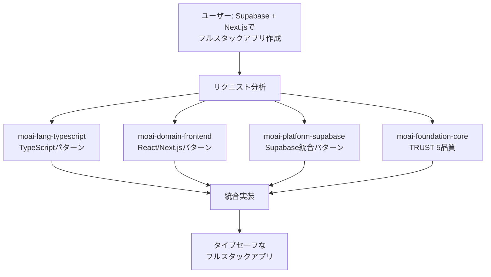

MoAI-ADKのスキルシステムを詳しく解説します。



**スキルとは？**

1999年の映画**マトリックス**のヘリコ操縦シーンを覚えていますか？ネオがトリニティに
ヘリコの操縦ができるか尋ねると、本部に電話してヘリコモデルを知り使い方マニュアルを
送信するように頼むシーンがあります。

<p align="center">
  <iframe
    width="720"
    height="360"
    src="https://www.youtube.com/embed/9Luu4itC-Zs"
    title="マトリックス ヘリコ操縦シーン"
    frameBorder="0"
    allow="accelerometer; autoplay; clipboard-write; encrypted-media; gyroscope; picture-in-picture"
    allowFullScreen
  ></iframe>
</p>

**Claude Codeのスキル** **(こそがその**使い方マニュアル**です。必要な瞬間に
必要な知識だけをロードしてAIが即座に専門家のように振る舞えるようにします。



## スキルとは？

スキルはClaude Codeに特定分野の専門知識を提供する**知識モジュール**です。

学校に例えると、Claude Codeが生徒でスキルが教科書です。数学の授業では数学の教科書を、科学の授業では科学の教科書を開くように、Claude CodeもPythonコードを書く時はPythonスキルを、React UIを作成時はFrontendスキルをロードします。



**スキルなしの場合**: Claude Codeは一般的な知識でのみ応答します。**スキルがある場合**: MoAI-ADKのルール、パターン、ベストプラクティスを適用して応答します。

## スキルカテゴリ

MoAI-ADKには計**52スキル**が9カテゴリに分類されています。

### Foundation (中核哲学) - 5個

| スキル名 | 説明 |
|-------------|------|
| `moai-foundation-core` | SPEC ベース TDD/DDD、TRUST 5フレームワーク、実行ルール |
| `moai-foundation-claude` | Claude Code拡張パターン (Skills、Agents、Hooks等) |
| `moai-foundation-philosopher` | 戦略的思考フレームワーク、意思決定分析 |
| `moai-foundation-quality` | コード品質自動検証、TRUST 5バリデーション |
| `moai-foundation-context` | トークン予算管理、セッション状態維持 |

### Workflow (自動化ワークフロー) - 11個

| スキル名 | 説明 |
|---------|------|
| `moai-workflow-spec` | SPECドキュメント作成、EARS形式、要件分析 |
| `moai-workflow-project` | プロジェクト初期化、ドキュメント作成、言語設定 |
| `moai-workflow-ddd` | ANALYZE-PRESERVE-IMPROVEサイクル |
| `moai-workflow-tdd` | RED-GREEN-REFACTOR テスト駆動開発 |
| `moai-workflow-testing` | テスト作成、デバッグ、コードレビュー統合 |
| `moai-workflow-worktree` | Git worktreeベース並列開発 |
| `moai-workflow-thinking` | Sequential Thinking、UltraThinkモード |
| `moai-workflow-loop` | Ralph Engine自律ループ、LSP連携 |
| `moai-workflow-jit-docs` | 必要時点ドキュメントローディング、インテリジェント検索 |
| `moai-workflow-templates` | コードボイラープレート、プロジェクトテンプレート |
| `moai-docs-generation` | 技術ドキュメント、APIドキュメント、ユーザーガイド |

### Domain (ドメイン専門性) - 4個

| スキル名 | 説明 |
|----------|------|
| `moai-domain-backend` | API設計、マイクロサービス、データベース統合 |
| `moai-domain-frontend` | React 19、Next.js 16、Vue 3.5、コンポーネントアーキテクチャ |
| `moai-domain-database` | PostgreSQL、MongoDB、Redis、高度データパターン |
| `moai-domain-uiux` | デザインシステム、アクセシビリティ、テーマ統合 |

### Language (プログラミング言語) - 16個

| スキル名 | 対象言語 |
|----------|-----------|
| `moai-lang-python` | Python 3.13+、FastAPI、Django |
| `moai-lang-typescript` | TypeScript 5.9+、React 19、Next.js 16 |
| `moai-lang-javascript` | JavaScript ES2024+、Node.js 22、Bun、Deno |
| `moai-lang-go` | Go 1.23+、Fiber、Gin、GORM (統合) |
| `moai-lang-rust` | Rust 1.92+、Axum、Tokio (統合) |
| `moai-lang-flutter` | Flutter 3.24+、Dart 3.5+、Riverpod (統合) |
| `moai-lang-java` | Java 21 LTS、Spring Boot 3.3 |
| `moai-lang-cpp` | C++23/C++20、CMake、RAII |
| `moai-lang-ruby` | Ruby 3.3+、Rails 7.2 |
| `moai-lang-php` | PHP 8.3+、Laravel 11、Symfony 7 |
| `moai-lang-kotlin` | Kotlin 2.0+、Ktor、Compose Multiplatform |
| `moai-lang-csharp` | C# 12、.NET 8、ASP.NET Core |
| `moai-lang-scala` | Scala 3.4+、Akka、ZIO |
| `moai-lang-elixir` | Elixir 1.17+、Phoenix 1.7、LiveView |
| `moai-lang-swift` | Swift 6+、SwiftUI、Combine |
| `moai-lang-r` | R 4.4+、tidyverse、ggplot2、Shiny |

### Platform (クラウド/BaaS) - 4個

| スキル名 | 対象プラットフォーム |
|----------|------------------|
| `moai-platform-auth` | Auth0、Clerk、Firebase-auth統合認証 |
| `moai-platform-database-cloud` | Neon、Supabase、Firestore統合データベース |
| `moai-platform-deployment` | Vercel、Railway、Convex統合デプロイ |

### Library (特殊ライブラリ) - 4個

| スキル名 | 説明 |
|----------|------|
| `moai-library-shadcn` | shadcn/uiコンポーネント実装ガイド |
| `moai-library-mermaid` | Mermaid 11.12ダイアグラム生成 |
| `moai-library-nextra` | Nextraドキュメントサイトフレームワーク |
| `moai-formats-data` | TOONエンコーディング、JSON/YAML最適化 |

### Tool (開発ツール) - 2個

| スキル名 | 説明 |
|----------|------|
| `moai-tool-ast-grep` | ASTベース構造的コード検索、セキュリティスキャン |
| `moai-tool-svg` | SVG生成、最適化、アイコンシステム |

### Framework (アプリフレームワーク) - 1個

| スキル名 | 説明 |
|----------|------|
| `moai-framework-electron` | Electron 33+デスクトップアプリ開発 |

### Design Tools (デザインツール) - 1個

| スキル名 | 説明 |
|----------|------|
| `moai-design-tools` | Figma、Pencil統合デザインツール |

## 段階的開示システム

MoAI-ADKのスキルは**3段階段階的開示** (Progressive Disclosure) システムを使用します。すべてのスキルを一度にロードするとトークンが浪費されるため、必要な分だけ段階的にロードします。



### 各レベルの役割

| レベル | トークン | ロード時期 | 内容 |
|-------|--------|-----------|------|
| レベル1 | ~100 | 常時 | スキル名、説明、トリガーキーワード |
| レベル2 | ~5,000 | トリガーマッチ時 | 全ドキュメント、コード例、パターン |
| レベル3 | 無制 | オンデマンド | modules/、reference.md、examples.md |

### トークン節約効果

- **従来方式**: 52スキル全ロード = 約260,000トークン (不可能)
- **段階的開示**: メタデータのみロード = 約5,200トークン (97%節約)
- **必要時ロード**: タスクに必要な2〜3スキルのみ = 約15,000トークン追加

## スキルトリガーメズム

スキルは**4つのトリガー条件**で自動ロードされます。



### トリガー設定例

```yaml
# スキルフロントマターでトリガー定義
triggers:
  keywords: ["api", "database", "authentication"] # キーワードマッチング
  agents: ["manager-spec", "expert-backend"] # エージェント呼び出し時
  phases: ["plan", "run"] # ワークフロー段階
  languages: ["python", "typescript"] # プログラミング言語
```

**トリガー優先順位:**

1. **キーワード** (keywords): ユーザーメッセージでキーワードを検出すると即座にロード
2. **エージェント** (agents): 特定エージェントが呼び出されると自動ロード
3. **段階** (phases): Plan/Run/Sync段階に従ってロード
4. **言語** (languages): 作業中ファイルのプログラミング言語に従ってロード

## スキル使用法

### 明示的呼び出し

Claude Code会話で直接スキルを呼び出せます。

```bash
# Claude Codeでスキル呼び出し
> Skill("moai-lang-python")
> Skill("moai-domain-backend")
> Skill("moai-library-mermaid")
```

### 自動ロード

大部分の場合、スキルはトリガーメズムによって**自動的にロード**されます。ユーザーが直接呼び出す必要なく、会話コンテキストを分析して適切なスキルが有効化されます。

## スキルディレクトリ構造

スキルファイルは`.claude/skills/`ディレクトリに配置されます。

```
.claude/skills/
├── moai-foundation-core/       # Foundationカテゴリ
│   ├── skill.md                # メインスキルドキュメント (500行以下)
│   ├── modules/                # 深層ドキュメント (無制限)
│   │   ├── trust-5-framework.md
│   │   ├── spec-first-ddd.md
│   │   └── delegation-patterns.md
│   ├── examples.md             # 実戦例
│   └── reference.md            # 外部参照リンク
│
├── moai-lang-python/           # Languageカテゴリ
│   ├── skill.md
│   └── modules/
│       ├── fastapi-patterns.md
│       └── testing-pytest.md
│
└── my-skills/                  # ユーザーカスタムスキル (更新除外)
    └── my-custom-skill/
        └── skill.md
```


  **注意**: `moai-*`接頭のスキルはMoAI-ADK更新時に上書きされます。個人スキルは必ず`.claude/skills/my-skills/`ディレクトリに作成してください。


### スキルファイル構造

各スキルの`skill.md`は以下の構造に従います。

```markdown
---
name: moai-lang-python
description: >
  Python 3.13+開発専門家。FastAPI、Django、pytestパターン提供。Python API、ウェブ
  アプリ、データパイプライン開発時使用。
version: 3.0.0
category: language
status: active
triggers:
  keywords: ["python", "fastapi", "django", "pytest"]
  languages: ["python"]
allowed-tools: ["Read", "Grep", "Glob", "Bash", "Context7 MCP"]
---

# Python開発専門家

## Quick Reference

(簡易リファレンス - 30秒)

## Implementation Guide

(実装ガイド - 5分)

## Advanced Patterns

(高度パターン - 10分+)

## Works Well With

(関連スキル/エージェント)
```

## 実戦例

### Pythonプロジェクトでスキル自動ロード

ユーザーがPython FastAPIプロジェクトで作業するシナリオです。

```bash
# 1. ユーザーがAPI開発をリクエスト
> FastAPIでユーザー認証APIを作成して

# 2. MoAI-ADKが自動検知するキーワード
# "FastAPI" → moai-lang-pythonトリガー
# "認証"    → moai-domain-backendトリガー
# "API"     → moai-domain-backendトリガー

# 3. 自動ロードされるスキル
# - moai-lang-python (Level 2): FastAPIパターン、pytestテスト
# - moai-domain-backend (Level 2): API設計パターン、認証戦略
# - moai-foundation-core (Level 1): TRUST 5品質基準

# 4. エージェントがスキル知識を活用して実装
# - FastAPIルーターパターン適用
# - JWT認証ベストプラクティス適用
# - pytestテスト自動生成
# - TRUST 5品質基準満たす
```

### スキル間連携

1つのタスクで複数のスキルが連携するプロセスです。



## 関連ドキュメント

- [エージェントガイド](/advanced/agent-guide) - スキルを活用するエージェント体系
- [ビルダーエージェントガイド](/advanced/builder-agents) - カスタムスキル作成方法
- [CLAUDE.mdガイド](/advanced/claude-md-guide) - スキル設定とルール体系


  **ヒント**: スキルを活用するコツは**適切なキーワード使用**です。「Pythonで
  REST API作成して」とリクエストすると`moai-lang-python`と`moai-domain-backend`
  スキルが自動的に有効化されて最適のコードを生成します。

