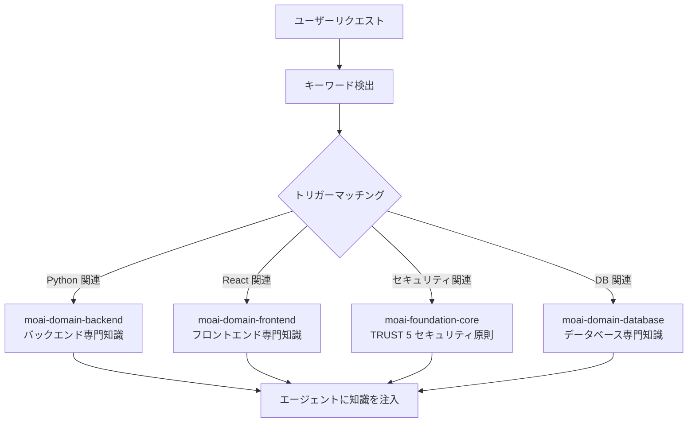
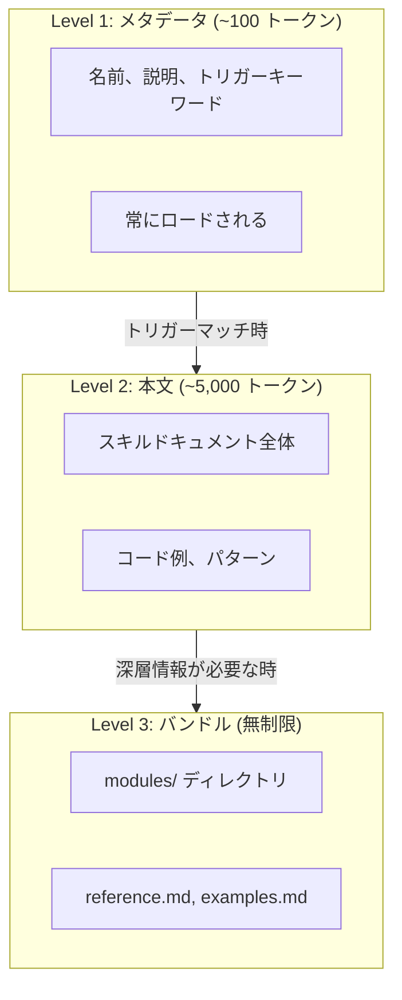
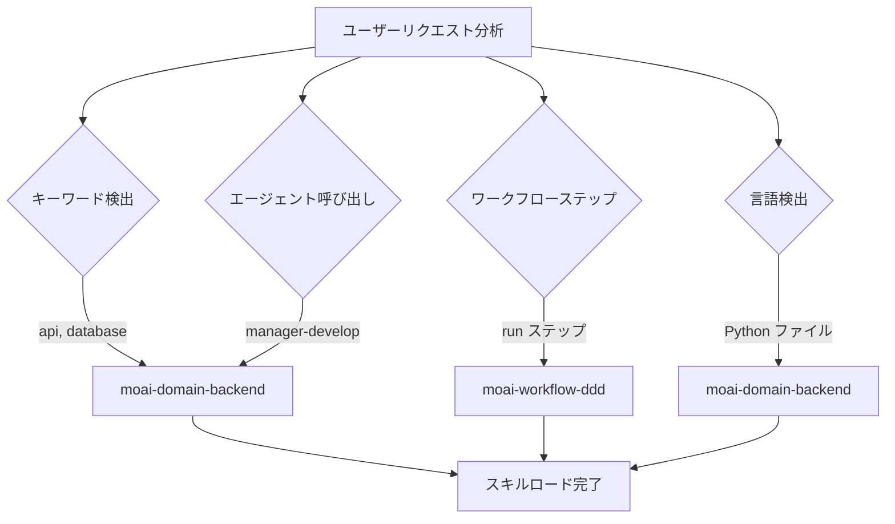
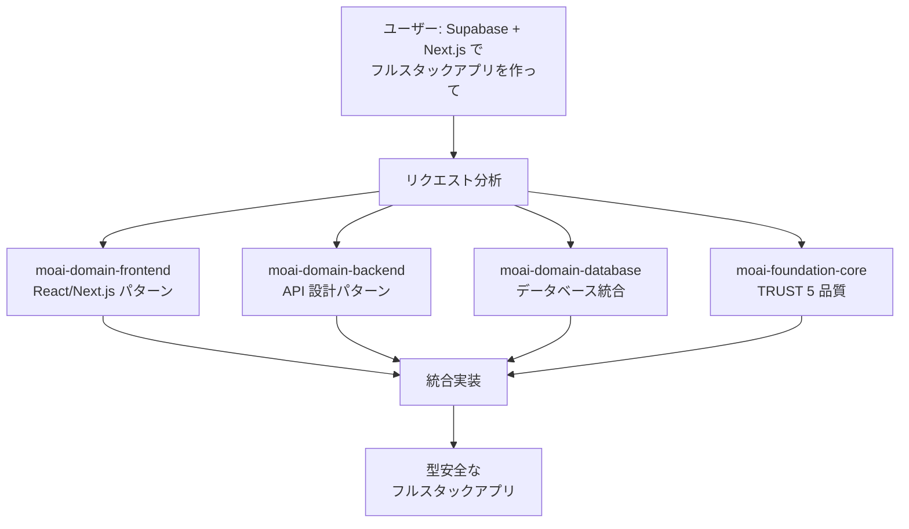

MoAI-ADK のスキルシステムを詳しく案内します。スキルはエージェンティックハーネスの知識層であり、「必要な知識だけを必要な瞬間にロードする」という点でトークノミクスが最も具体的に実装された場所でもあります。



**スキルとは?**

1999 年の映画 **マトリックス** のヘリコプター操縦シーンを覚えていますか? ネオがトリニティにヘリコプターを操縦できるか尋ねると、トリニティは本部に電話してヘリコプターのモデルを伝え、取扱説明書を送ってもらいます。

<p align="center">
  <iframe
    width="720"
    height="360"
    src="https://www.youtube.com/embed/9Luu4itC-Zs"
    title="マトリックスのヘリコプター操縦シーン"
    frameBorder="0"
    allow="accelerometer; autoplay; clipboard-write; encrypted-media; gyroscope; picture-in-picture"
    allowFullScreen
  ></iframe>
</p>

**Claude Code のスキル** がまさにその **取扱説明書** です。必要な瞬間に必要な知識だけをロードして、AI が即座に専門家のように振る舞えるようにします。



## スキルとは?

スキルは Claude Code に特定分野の専門知識を提供する **知識モジュール** です。

学校にたとえると、Claude Code が生徒でスキルは教科書です。数学の時間には数学の教科書を、理科の時間には理科の教科書を開くように、Claude Code も Python コードを書くときは Python スキルを、React UI を作るときは Frontend スキルをロードします。


```mermaid
flowchart TD
    USER[ユーザーリクエスト] --> DETECT[キーワード検出]
    DETECT --> TRIGGER{トリガーマッチング}
    TRIGGER -->|Python 関連| PY["moai-domain-backend<br>バックエンド専門知識"]
    TRIGGER -->|React 関連| FE["moai-domain-frontend<br>フロントエンド専門知識"]
    TRIGGER -->|セキュリティ関連| SEC["moai-foundation-core<br>TRUST 5 セキュリティ原則"]
    TRIGGER -->|DB 関連| DB["moai-domain-database<br>データベース専門知識"]

    PY --> AGENT[エージェントに知識を注入]
    FE --> AGENT
    SEC --> AGENT
    DB --> AGENT
```

**スキルがない場合**: Claude Code は一般的な知識のみで応答します。**スキルがある場合**: MoAI-ADK のルール、パターン、ベストプラクティスを適用して応答します。

## スキルカテゴリ

MoAI-ADK テンプレートには合計 **27 個の `moai-*` スキル** が 5 つの機能カテゴリに分類されています (Foundation 4 + Workflow 8 + Domain 5 + Reference 8 + Meta/Harness 2 = 27)。ここにリクエストを専門スキルにルーティングする `moai` umbrella スキル 1 個が別途存在します。ユーザープロジェクトでは追加で `harness-*` ユーザー定義スキルを作成できます。プログラミング言語対応は `rules/moai/languages/` 配下のルールで提供され、別途スキルではありません。

この数字もダイエットの結果です — スキルカタログは v3 期間中に 48 → 38 → 27 個へと精練されました。

### Foundation (核心哲学) - 4 個

| スキル名                  | 説明                                                |
| -------------------------- | --------------------------------------------------- |
| `moai-foundation-core`     | SPEC ベースの TDD/DDD、TRUST 5 フレームワーク、実行ルール    |
| `moai-foundation-cc`       | Claude Code 拡張パターン (Skills, Agents, Hooks)       |
| `moai-foundation-thinking` | 構造化された思考、アイデエーション、第 1 原理分析             |
| `moai-foundation-quality`  | コード品質の自動検証、TRUST 5 バリデーション             |

### Workflow (自動化ワークフロー) - 8 個

| スキル名                | 説明                                          |
| ------------------------ | --------------------------------------------- |
| `moai-workflow-spec`     | SPEC ドキュメント生成、GEARS 形式、要件分析     |
| `moai-workflow-project`  | プロジェクト初期化、ドキュメント生成、言語設定         |
| `moai-workflow-ddd`      | ANALYZE-PRESERVE-IMPROVE サイクル               |
| `moai-workflow-tdd`      | RED-GREEN-REFACTOR テスト駆動開発           |
| `moai-workflow-testing`  | テスト生成、デバッグ、コードレビュー統合           |
| `moai-workflow-worktree` | Git worktree ベースの並列開発                   |
| `moai-workflow-loop`     | Ralph Engine 自律ループ、LSP 連携              |
| `moai-workflow-ci-loop`  | CI 監視および自動修正ループワークフロー          |

### Domain (ドメイン専門性) - 5 個

| スキル名                   | 説明                                             |
| --------------------------- | ------------------------------------------------ |
| `moai-domain-backend`       | API 設計、マイクロサービス、データベース統合      |
| `moai-domain-frontend`      | React 19, Next.js 16, Vue 3.5, コンポーネントアーキテクチャ |
| `moai-domain-database`      | PostgreSQL, MongoDB, Redis, 高度なデータパターン     |
| `moai-domain-html-report`   | Markdown → 単一 HTML レポートレンダラー (6 個のモード、外部依存性なし) |
| `moai-domain-humanize`      | AI テキストのヒューマナイズ、後編集 (KO/EN/JA/ZH)    |

### Reference (ベストプラクティス) - 8 個

| スキル名                  | 説明                                              |
| -------------------------- | ------------------------------------------------- |
| `moai-ref-api-patterns`    | REST/GraphQL API 設計パターン、エラー処理             |
| `moai-ref-git-workflow`    | Git ワークフロー、ブランチ戦略、Conventional Commits |
| `moai-ref-owasp-checklist` | OWASP Top 10 セキュリティパターン、入力検証                 |
| `moai-ref-react-patterns`  | React/Next.js コンポーネントパターン、状態管理            |
| `moai-ref-testing-pyramid` | テストピラミッド戦略、カバレッジ目標               |
| `moai-ref-llm-security`    | AI/LLM 防御セキュリティ (プロンプトインジェクション、OWASP LLM Top 10) |
| `moai-ref-secops`          | DevSecOps/コンテナ/API 運用防御セキュリティ             |
| `moai-ref-supply-chain`    | ソフトウェアサプライチェーン防御セキュリティ (SBOM, SLSA, Sigstore) |

### Meta/Harness (システム拡張) - 2 個

| スキル名              | 説明                                        |
| ---------------------- | ------------------------------------------- |
| `moai-meta-harness`    | プロジェクト特化のエージェントチームの動的生成         |
| `moai-harness-learner` | Harness 学習サブシステム、自動アップデート提案 |

> 27 個の `moai-*` スキルは MoAI-ADK テンプレートにデフォルトで含まれ、各スキルは独立してロードされてトークンを節約します。ユーザーは追加でプロジェクト別の `harness-*` ユーザー定義スキルを作成できます。

## 段階的公開システム

MoAI-ADK のスキルは **3 段階の段階的公開** (Progressive Disclosure) システムを使います。すべてのスキルを一度にロードするとトークンが浪費されるので、必要な分だけ段階的にロードします。コンテキストダイエットのスキル層の実装だと見ればよいでしょう。


```mermaid
flowchart TD
    subgraph L1["Level 1: メタデータ (~100 トークン)"]
        M1["名前、説明、トリガーキーワード"]
        M2["常にロードされる"]
    end

    subgraph L2["Level 2: 本文 (~5,000 トークン)"]
        B1["スキルドキュメント全体"]
        B2["コード例、パターン"]
    end

    subgraph L3["Level 3: バンドル (無制限)"]
        R1["modules/ ディレクトリ"]
        R2["reference.md, examples.md"]
    end

    L1 -->|"トリガーマッチ時"| L2
    L2 -->|"深層情報が必要な時"| L3

```

### 各レベルの役割

| レベル    | トークン   | ロードタイミング      | 内容                                |
| ------- | ------ | -------------- | ----------------------------------- |
| Level 1 | ~100   | 常に           | スキル名、説明、トリガーキーワード      |
| Level 2 | ~5,000 | トリガーマッチ時 | ドキュメント全体、コード例、パターン          |
| Level 3 | 無制限 | オンデマンド       | modules/, reference.md, examples.md |

### トークン節約効果

- **従来方式**: 27 個のスキルを全ロード = 約 135,000 トークン (不可能)
- **段階的公開**: メタデータのみロード = 約 5,200 トークン (97% 節約)
- **必要時にロード**: 作業に必要な 2~3 個のスキルのみ = 約 15,000 トークン追加

## スキルトリガーメカニズム

スキルは **4 つのトリガー条件** で自動ロードされます。


```mermaid
flowchart TD
    REQ[ユーザーリクエスト分析] --> KW{キーワード検出}
    REQ --> AG{エージェント呼び出し}
    REQ --> PH{ワークフローステップ}
    REQ --> LN{言語検出}

    KW -->|"api, database"| SKILL1[moai-domain-backend]
    AG -->|"manager-develop"| SKILL1
    PH -->|"run ステップ"| SKILL2[moai-workflow-ddd]
    LN -->|"Python ファイル"| SKILL3[moai-domain-backend]

    SKILL1 --> LOAD[スキルロード完了]
    SKILL2 --> LOAD
    SKILL3 --> LOAD
```

### トリガー設定例

```yaml
# スキルフロントマターでトリガーを定義
triggers:
  keywords: ["api", "database", "authentication"] # キーワードマッチング
  agents: ["manager-spec", "manager-develop"] # エージェント呼び出し時
  phases: ["plan", "run"] # ワークフローステップ
  languages: ["python", "typescript"] # プログラミング言語
```

**トリガーの優先順位:**

1. **キーワード** (keywords): ユーザーメッセージからキーワードを検出すると即座にロード
2. **エージェント** (agents): 特定のエージェントが呼び出されたとき自動ロード
3. **ステップ** (phases): Plan/Run/Sync ステップに応じてロード
4. **言語** (languages): 作業中のファイルのプログラミング言語に応じてロード

## スキルの使い方

### 明示的な呼び出し

Claude Code の対話で直接スキルを呼び出せます。

```bash
# Claude Code でスキル呼び出し
> Skill("moai-domain-backend")
> Skill("moai-domain-frontend")
> Skill("moai-ref-api-patterns")
```

### 自動ロード

ほとんどの場合、スキルはトリガーメカニズムによって **自動的にロード** されます。ユーザーが直接呼び出す必要なく、対話コンテキストを分析して適切なスキルが有効化されます。

## スキルディレクトリ構造

スキルファイルは `.claude/skills/` ディレクトリに配置されます。

```
.claude/skills/
├── moai-foundation-core/       # Foundation カテゴリ (template-managed)
│   ├── SKILL.md                # メインスキルドキュメント (500 行以下)
│   ├── modules/                # 深層ドキュメント (無制限)
│   │   ├── trust-5-framework.md
│   │   ├── spec-first-ddd.md
│   │   └── delegation-patterns.md
│   ├── examples.md             # 実践例
│   └── reference.md            # 外部参照リンク
│
├── moai-domain-backend/        # Domain カテゴリ (template-managed)
│   ├── SKILL.md
│   └── modules/
│       ├── api-patterns.md
│       └── microservices.md
│
├── hns-my-harness/             # ユーザーハーネススキル (user-owned, hns-* 接頭辞)
│   └── SKILL.md
│
└── my-custom-skill/            # ユーザーカスタムスキル (user-owned)
    └── SKILL.md
```

### スキルネームスペース

スキル接頭辞は **配布主体** を区別し、`moai update` の動作が異なります。

| 接頭辞 | 所有権 | `moai update` 動作 |
|--------|--------|-------------------|
| `moai-*` / `moai-harness-*` | template-managed | 上書き (sync) |
| `hns-*` | user-owned (ハーネス) | 保存 (修正・削除禁止) |
| (接頭辞なし) / その他 | user-owned (個人) | 保存 |

`hns-*` 接頭辞はユーザーが生成したハーネススキルを意味し、`moai update` が決して上書きしたり削除したりしません。テンプレートに `hns-*` スキルをミラーリングしてはいけません (CI ガードが検出)。


  **注意**: `moai-*` 接頭辞が付いたスキルは MoAI-ADK アップデート時に上書きされます。
  個人スキルとハーネススキルは `hns-*` 接頭辞または接頭辞のないディレクトリに作成してください。


### スキルファイル構造

各スキルの `SKILL.md` は次の構造に従います。

```markdown
---
name: moai-domain-backend
description: >
  バックエンド開発専門家。API 設計、マイクロサービス、データベース統合パターンを提供。
  API、Web アプリ、データパイプライン開発時に使用。
version: 3.0.0
category: domain
status: active
triggers:
  keywords: ["api", "database", "microservices", "authentication"]
allowed-tools: ["Read", "Grep", "Glob", "Bash"]
---

# バックエンド開発専門家

## Quick Reference

(クイックリファレンス - 30 秒)

## Implementation Guide

(実装ガイド - 5 分)

## Advanced Patterns

(高度なパターン - 10 分+)

## Works Well With

(関連スキル/エージェント)
```

## 実践例

### Python プロジェクトでのスキル自動ロード

ユーザーが Python FastAPI プロジェクトで作業するシナリオです。

```bash
# 1. ユーザーが API 開発をリクエスト
> FastAPI でユーザー認証 API を作って

# 2. MoAI-ADK が自動的に検出するキーワード
# "FastAPI" → moai-domain-backend トリガー (Python パターンは rules/moai/languages/ を通じて提供)
# "認証"    → moai-domain-backend トリガー
# "API"     → moai-domain-backend トリガー

# 3. 自動ロードされるスキル
# - moai-domain-backend (Level 2): API 設計パターン、認証戦略
# - moai-foundation-core (Level 1): TRUST 5 品質基準

# 4. エージェントがスキルの知識を活用して実装
# - FastAPI ルーターパターンを適用
# - JWT 認証のベストプラクティスを適用
# - pytest テストを自動生成
# - TRUST 5 品質基準を満たす
```

### スキル間の協業

1 つの作業で複数のスキルが協力するプロセスです。


```mermaid
flowchart TD
    REQ["ユーザー: Supabase + Next.js で<br>フルスタックアプリを作って"] --> ANALYZE[リクエスト分析]

    ANALYZE --> S1["moai-domain-frontend<br>React/Next.js パターン"]
    ANALYZE --> S2["moai-domain-backend<br>API 設計パターン"]
    ANALYZE --> S3["moai-domain-database<br>データベース統合"]
    ANALYZE --> S4["moai-foundation-core<br>TRUST 5 品質"]

    S1 --> IMPL[統合実装]
    S2 --> IMPL
    S3 --> IMPL
    S4 --> IMPL

    IMPL --> RESULT["型安全な<br>フルスタックアプリ"]
```

## スキルのスコープとディスカバリー (Skill Scope and Discovery)

### ネストした `.claude/skills` のロード

Claude Code はプロジェクトルートだけでなくネストした下位ディレクトリ (parent-walk) でも `.claude/skills/` を発見します。したがってモノレポは各パッケージ自身の `.claude/skills/` ディレクトリにパッケージローカルなスキルを配置できます。自身の `.claude/skills/` を含むネストしたディレクトリ内部で作業するとき、そのネストしたディレクトリのスキルはその下位ツリーで作業する間、ルートレベルのスキルとともにロードされます。

### 名前衝突時の closest-wins

ネストチェーンに沿って 2 つ以上の `.claude/skills/` ディレクトリに同じスキル名が現れると、**closest-directory-wins** (最も近いディレクトリ優先) ルールが衝突を解決します: 現在の作業ディレクトリに最も近い `.claude/skills/` がより上のツリーのものを隠します (shadow)。これはネストした `.claude/` ディレクトリ配下でエージェント、ワークフロー、output-styles にすでに適用される先行ルールと同じです — 最も内側の `.claude/` が勝ちます。ルートスキルを意図的に再定義するパッケージローカルなスキルは同じ名前を維持する必要があります。名前を変えると再定義ではなく 2 番目のスキルが生成されます。

### `disableBundledSkills` トグル

`disableBundledSkills` (settings.json のブール値、または環境変数の形) は Claude Code のバンドル skills およびワークフロー — 例: `/deep-research`、内蔵スラッシュコマンド skills — を discovery から隠し、enterprise + personal + project + plugin skills のみを見せます。選別されたバンドルなしの skill 表面を提供するときに使ってください。MoAI-ADK はこのトグルを自身の生成器で生成しません。利用可能なオプションとしてここに文書化されます。付随する `--safe-mode` ランチフラグは [Settings JSON ガイド](/ja/advanced/settings-json#disablebundledskills) に文書化されています。

## 関連ドキュメント

- [エージェントガイド](/ja/advanced/agent-guide) - スキルを活用するエージェント体系
- [ビルダーエージェントガイド](/ja/advanced/builder-agents) - カスタムスキルの生成方法
- [CLAUDE.md ガイド](/ja/advanced/claude-md-guide) - スキル設定とルール体系


  **ヒント**: スキルをうまく活用する核心は **適切なキーワードの使用** です。「Python で
  REST API を作って」とリクエストすると `moai-domain-backend` スキルが自動的に有効化され
  (Python パターンは `rules/moai/languages/` を通じて提供)、最適なコードを生成します。

