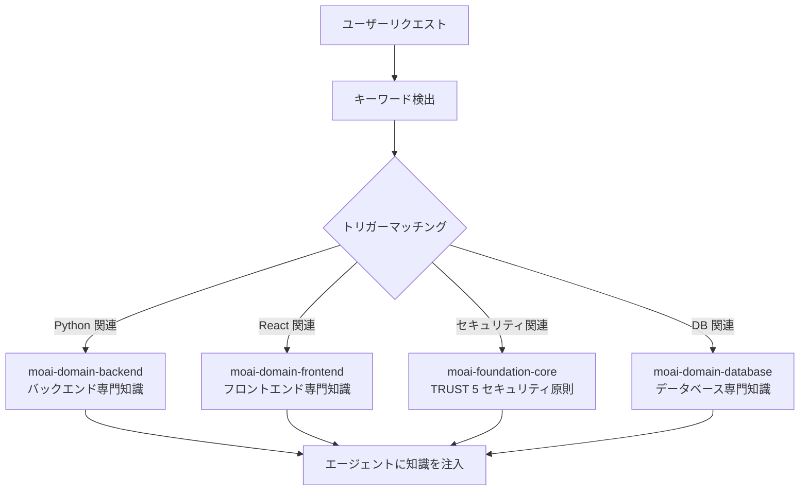
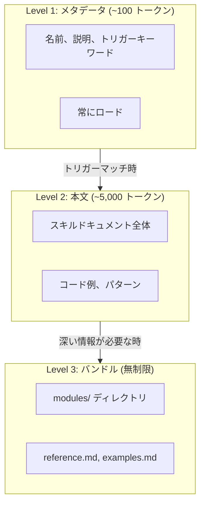
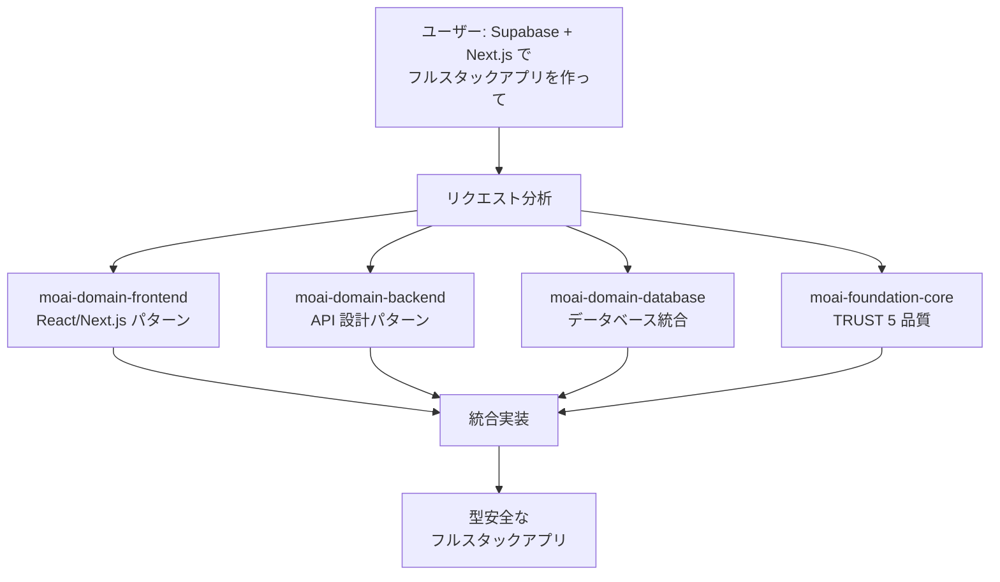

MoAI-ADK のスキルシステムを詳しく解説します。スキルはエージェンティック・ハーネスの知識レイヤーであり、「必要な知識だけを必要な瞬間にロードする」という点で、トークノミクスが最も具体的に実装された場所でもあります。



**スキルとは?**

1999 年の映画 **マトリックス** のヘリコプター操縦シーンを覚えていますか? ネオがトリニティにヘリを操縦できるかと尋ねると、トリニティは本部に電話してヘリのモデルを伝え、操作マニュアルを転送してもらいます。

<p align="center">
  <iframe
    width="720"
    height="360"
    src="https://www.youtube.com/embed/9Luu4itC-Zs"
    title="マトリックスのヘリコプター操縦シーン"
    frameBorder="0"
    allow="accelerometer; autoplay; clipboard-write; encrypted-media; gyroscope; picture-in-picture"
    allowFullScreen
  ></iframe>
</p>

**Claude Code のスキル** がまさにその **操作マニュアル** です。必要な瞬間に必要な知識だけをロードし、AI が即座に専門家のように振る舞えるようにします。



## スキルとは?

スキルは Claude Code に特定分野の専門知識を提供する **知識モジュール** です。

学校にたとえると、Claude Code が生徒でスキルは教科書です。数学の時間には数学の教科書を、理科の時間には理科の教科書を開くように、Claude Code も Python コードを書くときは Python のスキルを、React UI を作るときは Frontend のスキルをロードします。


```mermaid
flowchart TD
    USER[ユーザーリクエスト] --> DETECT[キーワード検出]
    DETECT --> TRIGGER{トリガーマッチング}
    TRIGGER -->|Python 関連| PY["moai-domain-backend<br>バックエンド専門知識"]
    TRIGGER -->|React 関連| FE["moai-domain-frontend<br>フロントエンド専門知識"]
    TRIGGER -->|セキュリティ関連| SEC["moai-foundation-core<br>TRUST 5 セキュリティ原則"]
    TRIGGER -->|DB 関連| DB["moai-domain-database<br>データベース専門知識"]

    PY --> AGENT[エージェントに知識を注入]
    FE --> AGENT
    SEC --> AGENT
    DB --> AGENT
```

**スキルがない場合**: Claude Code は一般的な知識だけで応答します。**スキルがある場合**: MoAI-ADK のルール、パターン、ベストプラクティスを適用して応答します。

## スキルカテゴリ

MoAI-ADK テンプレートには合計 **27 個の `moai-*` スキル** が 5 つの機能カテゴリに分類されています (Foundation 4 + Workflow 8 + Domain 5 + Reference 8 + Meta/Harness 2 = 27)。これに加えて、リクエストを専門スキルへルーティングする `moai` umbrella スキルが 1 つ別に存在します。ユーザープロジェクトではさらに `harness-*` ユーザー定義スキルを作成できます。プログラミング言語サポートは `rules/moai/languages/` 配下のルールとして提供され、別個のスキルではありません。

この数字もダイエットの結果です — スキルカタログは v3 期間中に 48 → 38 → 27 個へと精錬されました。

### Foundation (コア哲学) - 4 個

| スキル名                  | 説明                                                |
| -------------------------- | --------------------------------------------------- |
| `moai-foundation-core`     | SPEC ベース TDD/DDD、TRUST 5 フレームワーク、実行ルール    |
| `moai-foundation-cc`       | Claude Code 拡張パターン (Skills, Agents, Hooks)       |
| `moai-foundation-thinking` | 構造化思考、アイディエーション、第一原理分析             |
| `moai-foundation-quality`  | コード品質の自動検証、TRUST 5 バリデーション             |

### Workflow (自動化ワークフロー) - 8 個

| スキル名                | 説明                                          |
| ------------------------ | --------------------------------------------- |
| `moai-workflow-spec`     | SPEC ドキュメント生成、GEARS 形式、要求事項分析     |
| `moai-workflow-project`  | プロジェクト初期化、ドキュメント生成、言語設定         |
| `moai-workflow-ddd`      | ANALYZE-PRESERVE-IMPROVE サイクル               |
| `moai-workflow-tdd`      | RED-GREEN-REFACTOR テスト駆動開発           |
| `moai-workflow-testing`  | テスト生成、デバッグ、コードレビュー統合           |
| `moai-workflow-worktree` | Git worktree ベースの並列開発                   |
| `moai-workflow-loop`     | Ralph Engine 自律ループ、LSP 連携              |
| `moai-workflow-ci-loop`  | CI 監視と自動修正ループのワークフロー          |

### Domain (ドメイン専門性) - 5 個

| スキル名                   | 説明                                             |
| --------------------------- | ------------------------------------------------ |
| `moai-domain-backend`       | API 設計、マイクロサービス、データベース統合      |
| `moai-domain-frontend`      | React 19, Next.js 16, Vue 3.5、コンポーネントアーキテクチャ |
| `moai-domain-database`      | PostgreSQL, MongoDB, Redis、高度なデータパターン     |
| `moai-domain-html-report`   | Markdown → 単一 HTML レポートレンダラー (6 モード、外部依存なし) |
| `moai-domain-humanize`      | AI テキストのヒューマナイゼーション、推敲 (KO/EN/JA/ZH)    |

### Reference (ベストプラクティス) - 8 個

| スキル名                  | 説明                                              |
| -------------------------- | ------------------------------------------------- |
| `moai-ref-api-patterns`    | REST/GraphQL API 設計パターン、エラー処理             |
| `moai-ref-git-workflow`    | Git ワークフロー、ブランチ戦略、Conventional Commits |
| `moai-ref-owasp-checklist` | OWASP Top 10 セキュリティパターン、入力検証                 |
| `moai-ref-react-patterns`  | React/Next.js コンポーネントパターン、状態管理            |
| `moai-ref-testing-pyramid` | テストピラミッド戦略、カバレッジ目標               |
| `moai-ref-llm-security`    | AI/LLM 防御セキュリティ (プロンプトインジェクション、OWASP LLM Top 10) |
| `moai-ref-secops`          | DevSecOps/コンテナ/API 運用防御セキュリティ             |
| `moai-ref-supply-chain`    | ソフトウェアサプライチェーン防御セキュリティ (SBOM, SLSA, Sigstore) |

### Meta/Harness (システム拡張) - 2 個

| スキル名              | 説明                                        |
| ---------------------- | ------------------------------------------- |
| `moai-meta-harness`    | プロジェクト特化エージェントチームの動的生成         |
| `moai-harness-learner` | Harness 学習サブシステム、自動更新提案 |

> 27 個の `moai-*` スキルは MoAI-ADK テンプレートに標準で含まれ、各スキルは独立してロードされトークンを節約します。ユーザーはさらにプロジェクト別の `harness-*` ユーザー定義スキルを作成できます。

## 段階的開示システム

MoAI-ADK のスキルは **3 段階の段階的開示** (Progressive Disclosure) システムを使います。すべてのスキルを一度にロードするとトークンが浪費されるため、必要な分だけ段階的にロードします。コンテキストダイエットのスキル層実装と考えてください。


```mermaid
flowchart TD
    subgraph L1["Level 1: メタデータ (~100 トークン)"]
        M1["名前、説明、トリガーキーワード"]
        M2["常にロード"]
    end

    subgraph L2["Level 2: 本文 (~5,000 トークン)"]
        B1["スキルドキュメント全体"]
        B2["コード例、パターン"]
    end

    subgraph L3["Level 3: バンドル (無制限)"]
        R1["modules/ ディレクトリ"]
        R2["reference.md, examples.md"]
    end

    L1 -->|"トリガーマッチ時"| L2
    L2 -->|"深い情報が必要な時"| L3

```

### 各レベルの役割

| レベル    | トークン   | ロード時点      | 内容                                |
| ------- | ------ | -------------- | ----------------------------------- |
| Level 1 | ~100   | 常に           | スキル名、説明、トリガーキーワード      |
| Level 2 | ~5,000 | トリガーマッチ時 | ドキュメント全体、コード例、パターン          |
| Level 3 | 無制限 | オンデマンド       | modules/, reference.md, examples.md |

### トークン節約効果

- **従来方式**: 27 スキル全体をロード = 約 135,000 トークン (不可能)
- **段階的開示**: メタデータのみロード = 約 5,200 トークン (97% 節約)
- **必要時ロード**: 作業に必要な 2〜3 スキルのみ = 約 15,000 トークン追加

## スキルトリガーメカニズム

スキルは **4 つのトリガー条件** で自動ロードされます。


```mermaid
flowchart TD
    REQ[ユーザーリクエスト分析] --> KW{キーワード検出}
    REQ --> AG{エージェント呼び出し}
    REQ --> PH{ワークフローフェーズ}
    REQ --> LN{言語検出}

    KW -->|"api, database"| SKILL1[moai-domain-backend]
    AG -->|"manager-develop"| SKILL1
    PH -->|"run フェーズ"| SKILL2[moai-workflow-ddd]
    LN -->|"Python ファイル"| SKILL3[moai-domain-backend]

    SKILL1 --> LOAD[スキルロード完了]
    SKILL2 --> LOAD
    SKILL3 --> LOAD
```

### トリガー設定例

```yaml
# スキルフロントマターでトリガーを定義
triggers:
  keywords: ["api", "database", "authentication"] # キーワードマッチング
  agents: ["manager-spec", "manager-develop"] # エージェント呼び出し時
  phases: ["plan", "run"] # ワークフローフェーズ
  languages: ["python", "typescript"] # プログラミング言語
```

**トリガー優先順位:**

1. **キーワード** (keywords): ユーザーメッセージでキーワードを検出すると即座にロード
2. **エージェント** (agents): 特定エージェントが呼び出されるとき自動ロード
3. **フェーズ** (phases): Plan/Run/Sync フェーズに応じてロード
4. **言語** (languages): 作業中ファイルのプログラミング言語に応じてロード

## スキルの使い方

### 明示的な呼び出し

Claude Code の会話で直接スキルを呼び出せます。

```bash
# Claude Code でスキルを呼び出す
> Skill("moai-domain-backend")
> Skill("moai-domain-frontend")
> Skill("moai-ref-api-patterns")
```

### 自動ロード

ほとんどの場合、スキルはトリガーメカニズムによって **自動的にロード** されます。ユーザーが直接呼び出す必要はなく、会話コンテキストを分析して適切なスキルが有効化されます。

## スキルディレクトリ構造

スキルファイルは `.claude/skills/` ディレクトリに配置されます。

```
.claude/skills/
├── moai-foundation-core/       # Foundation カテゴリ
│   ├── skill.md                # メインスキルドキュメント (500 行以下)
│   ├── modules/                # 深掘りドキュメント (無制限)
│   │   ├── trust-5-framework.md
│   │   ├── spec-first-ddd.md
│   │   └── delegation-patterns.md
│   ├── examples.md             # 実践例
│   └── reference.md            # 外部参照リンク
│
├── moai-domain-backend/        # Domain カテゴリ
│   ├── skill.md
│   └── modules/
│       ├── api-patterns.md
│       └── microservices.md
│
└── my-skills/                  # ユーザーカスタムスキル (更新対象外)
    └── my-custom-skill/
        └── skill.md
```


  **注意**: `moai-*` プレフィックスが付いたスキルは MoAI-ADK 更新時に上書きされます。
  個人スキルは必ず `.claude/skills/my-skills/` ディレクトリに作成してください。


### スキルファイル構造

各スキルの `skill.md` は次の構造に従います。

```markdown
---
name: moai-domain-backend
description: >
  バックエンド開発の専門家。API 設計、マイクロサービス、データベース統合パターンを提供。
  API、Web アプリ、データパイプライン開発時に使用。
version: 3.0.0
category: domain
status: active
triggers:
  keywords: ["api", "database", "microservices", "authentication"]
allowed-tools: ["Read", "Grep", "Glob", "Bash"]
---

# バックエンド開発の専門家

## Quick Reference

(クイックリファレンス - 30 秒)

## Implementation Guide

(実装ガイド - 5 分)

## Advanced Patterns

(高度なパターン - 10 分+)

## Works Well With

(関連スキル/エージェント)
```

## 実践例

### Python プロジェクトでのスキル自動ロード

ユーザーが Python FastAPI プロジェクトで作業するシナリオです。

```bash
# 1. ユーザーが API 開発をリクエスト
> FastAPI でユーザー認証 API を作って

# 2. MoAI-ADK が自動的に検出するキーワード
# "FastAPI" → moai-domain-backend トリガー (Python パターンは rules/moai/languages/ を通じて提供)
# "認証"    → moai-domain-backend トリガー
# "API"     → moai-domain-backend トリガー

# 3. 自動ロードされるスキル
# - moai-domain-backend (Level 2): API 設計パターン、認証戦略
# - moai-foundation-core (Level 1): TRUST 5 品質基準

# 4. エージェントがスキル知識を活用して実装
# - FastAPI ルーターパターンを適用
# - JWT 認証のベストプラクティスを適用
# - pytest テストを自動生成
# - TRUST 5 品質基準を充足
```

### スキル間コラボレーション

1 つの作業で複数のスキルが協力するプロセスです。


```mermaid
flowchart TD
    REQ["ユーザー: Supabase + Next.js で<br>フルスタックアプリを作って"] --> ANALYZE[リクエスト分析]

    ANALYZE --> S1["moai-domain-frontend<br>React/Next.js パターン"]
    ANALYZE --> S2["moai-domain-backend<br>API 設計パターン"]
    ANALYZE --> S3["moai-domain-database<br>データベース統合"]
    ANALYZE --> S4["moai-foundation-core<br>TRUST 5 品質"]

    S1 --> IMPL[統合実装]
    S2 --> IMPL
    S3 --> IMPL
    S4 --> IMPL

    IMPL --> RESULT["型安全な<br>フルスタックアプリ"]
```

## スキルのスコープとディスカバリー (Skill Scope and Discovery)

### ネストされた `.claude/skills` のロード

Claude Code はプロジェクトルートだけでなく、ネストされたサブディレクトリ (parent-walk) でも `.claude/skills/` を発見します。したがってモノレポは各パッケージ自身の `.claude/skills/` ディレクトリにパッケージローカルのスキルを配置できます。自前の `.claude/skills/` を含むネストされたディレクトリ内で作業するとき、そのネストディレクトリのスキルは該当サブツリーで作業する間、ルートレベルのスキルと共にロードされます。

### 名前衝突時は closest-wins

ネストチェーンに沿って 2 つ以上の `.claude/skills/` ディレクトリに同じスキル名が現れた場合、**closest-directory-wins** (最も近いディレクトリ優先) ルールが衝突を解決します: 現在の作業ディレクトリに最も近い `.claude/skills/` がより上位ツリーのものを覆い隠します (shadow)。これはネストされた `.claude/` ディレクトリ配下でエージェント、ワークフロー、output-styles にすでに適用されている先行ルールと同一です — 最も内側の `.claude/` が勝ちます。ルートスキルを意図的にオーバーライドするパッケージローカルスキルは同じ名前を維持する必要があります。名前を変えるとオーバーライドではなく 2 つ目のスキルが生まれます。

### `disableBundledSkills` トグル

`disableBundledSkills` (settings.json のブール値、または環境変数形式) は Claude Code のバンドル skills およびワークフロー — 例: `/deep-research`、組み込みスラッシュコマンド skills — を discovery から隠し、enterprise + personal + project + plugin skills だけを見えるようにします。厳選されたバンドルなしの skill 表面を提供するときに使ってください。MoAI-ADK はこのトグルを自前のジェネレーターでは生成しません。利用可能なオプションとしてここに文書化されます。付随する `--safe-mode` 起動フラグは [Settings JSON ガイド](/ja/advanced/settings-json#disablebundledskills)に文書化されています。

## 関連ドキュメント

- [エージェントガイド](/ja/advanced/agent-guide) - スキルを活用するエージェント体系
- [ビルダーエージェントガイド](/ja/advanced/builder-agents) - カスタムスキルの作成方法
- [CLAUDE.md ガイド](/ja/advanced/claude-md-guide) - スキル設定とルール体系


  **ヒント**: スキルをうまく活用する鍵は **適切なキーワードの使用** です。「Python で
  REST API を作って」とリクエストすれば `moai-domain-backend` スキルが自動的に有効化され
  (Python パターンは `rules/moai/languages/` を通じて提供)、最適なコードを生成します。

