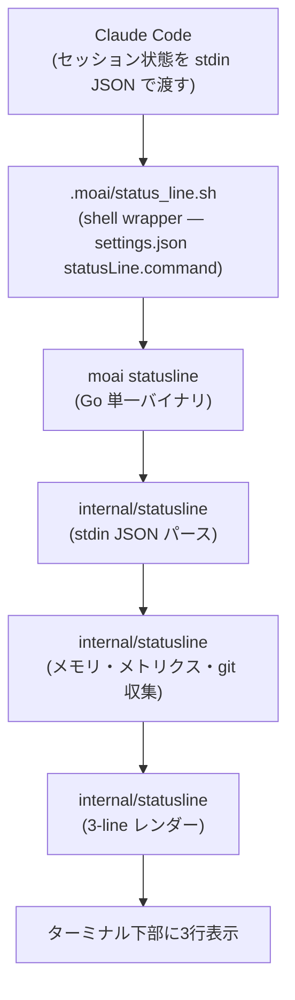
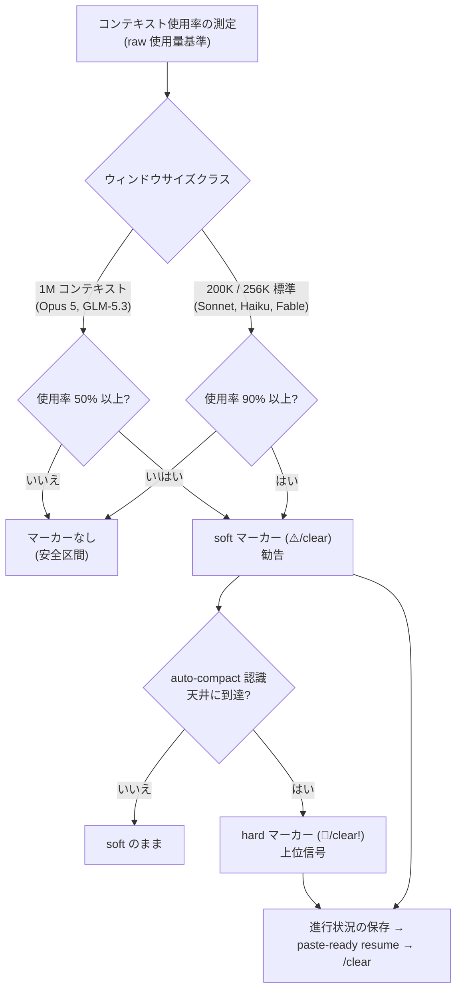

測定できなければ制御できません。エージェンティック開発はひとつのセッションで数十万トークンを使い、コンテキストウィンドウ(context window、モデルが一度に記憶できる対話の総量)を急速に埋め、複数のエージェント(自ら作業する AI の助手)が並列で回り、プロンプトキャッシュ(prompt cache、同じ文脈を再利用して費用を減らす手法)の命中を左右します。このすべてがターミナルの中で目に見えなければ、「なぜ今度のセッションは費用が2倍になったのか」という問いに答えられません。**カスタム statusline システム**はまさにこの地点から出発します。トークノミクス(tokenomics、トークンを経済的に使う考え方)は測定から始まるので、コンテキスト使用率とキャッシュ命中率、rate limit の消費率をターミナル下部に常に表示しておきます。

この文書は、statusline が何を示すか、データがどう流れるか、そしてコンテキストが埋まるときどんな信号が出るかを入門書の水準で整理します。セグメント書式の細部よりも「なぜこの情報が要るのか、どう読むのか」を先に説明します。

## ステータスラインはなぜ必要か

エージェンティックコーディングで費用と品質を決める変数は5つです。どのモデルを使うか、どの推論深度で回っているか、コンテキストウィンドウがどれだけ埋まったか、rate limit がどれだけ残っているか、そしてプロンプトキャッシュがちゃんと効いているか。この5つは互いにつながっています。コンテキストが埋まれば SSE ストール(stream stall、ストリーミングが止まる現象)が起き、キャッシュが効かなければ費用がすぐに上がり、rate limit が底をつけば重い作業を止めざるを得ません。

問題は、これらの変数がデフォルトでは見えないことです。Claude Code 自身のステータスバーは豊富ですが、MoAI ワークフローが扱う情報 — アクティブな SPEC(要件仕様書)、現在の PR のレビュー状態、ハンドオフ(handoff、セッションをつなぐ仕組み)の勧告タイミング — までは含みません。そこで MoAI は独自のステータスラインをターミナル下部に3行で表示し、マルチセッションランでは4行目まで付けて、「今トークンをどう使っているか」と「今どこで何をしているか」を一目で読めるようにします。

## 行の一覧

基本レイアウトは3行で、セッション名・バックログ観測があれば4行目(セッション行)が最後に条件付きで付きます。下の例は実際にレンダーされた出力の一例で、各セグメントが使うグリフ(glyph、小さな図形文字)までそのまま写しています。

```text
🤖 Opus │ 🧠 xhigh·t │ ♻️ 87% │ 🔅 cc v2.1.212 │ 🗿 v3.1.1 │ ⏳ 4h 52m │ 💬 MoAI
🪫 CW: ███████░░░ 72% (⚠️/clear) │ 🔋 5H: █████░░░░░ 56% (46m) │ 🔋 7D: █░░░░░░░░░ 13% (May 28)
📁 moai-adk-go │ 📡 modu-ai/moai-adk, 5/0 🐛12 🔀3 | 🅱️ main +2 │ 📫 +0 M1 ?1 │ 💌 PR #1234 (⌥approved)
🏷️ run │ 👤 manager-develop │ 🔄 TODO: 1/3
```

- **1行目 — セッションが「どう」回っているか**: モデル、推論深度、キャッシュ命中率、Claude Code バージョン、MoAI バージョン、セッション時間、出力スタイルを1行で示します。「このセッションがどの設定で回っているか」を即座に知らせます。
- **2行目 — 予算が「どれだけ」残っているか**: コンテキストウィンドウ使用率(CW)と2つのローリング rate limit(5時間・7日)をゲージバーで示します。「今すぐ重い作業を回してよいか」を判断する根拠です。
- **3行目 — 今「どこで、何を」しているか**: ディレクトリ、リポジトリとブランチ、開いている issue・変更リクエスト数、git 状態、アクティブな SPEC タスク、開いている PR のレビュー状態をまとめます。PR 中心のワークフローで最もよく目にする行です。
- **4行目(条件付き) — 誰として、どれだけ積もっているか**: セッション名(`🏷️`)、エージェント名(`👤`)、バックログ状況(`🔄` `TODO: 進行中/待機`)を示します。カンバンの同伴セッションのような名前付きセッションで自然に付き、観測元がなければそのセグメントは縮み、すべて空なら行自体が省略されます。セッション名を強調表示する場所でもあるので、ターミナルを複数開いてどの窓がどの役割か分からなくなったときの最初の手がかりになります。

## データが流れる経路

statusline は単一のプログラムではなく、短いパイプラインです。Claude Code がレンダー周期ごとにセッション状態を JSON として渡し、MoAI がそれを受けて3行に加工してターミナルへ返します。



なぜ shell wrapper が間に入るのでしょう? Claude Code の `statusLine.command` はコマンド文字列を1つだけ受け取ります。そこで `.moai/status_line.sh` が最小限のシェルラッパーとなって `moai statusline` バイナリを呼び出し、重い仕事(パース・収集・レンダー)はすべてコンパイル済みの Go バイナリの中で高速に処理されます。そのおかげで、レンダーごとに複数のプロセスを立てずに十分な情報を一度に描けます。

データ収集の段階では、stdin にない情報も補います。git 状態はローカルの `git status --porcelain` を直接パースし、MoAI バージョンはローカル設定から読み、アクティブなタスクはセッション状態ファイルから取ります。こうすると Claude Code が渡さない文脈まで1行に収められます。

## 1行目 — セッションが「どう」回っているか

1行目は「このセッションの設定と状態」を読む行です。モデル名はもちろん、Claude Code v2.1.139 から stdin に追加された **effort/thinking** 値で「どの推論深度で、拡張思考(thinking)が有効か」を示します。`xhigh·t` のようにレベルの後ろに `·t` が付いていれば拡張思考が有効という意味で、この表示があればモデルポリシーが実際に適用されているかを一目で点検できます。

なかでも**キャッシュ命中率**はトークノミクスの中心的な指標です。`cache_read` トークンを `(cache_read + cache_creation)` で割った値で、常にロードされる指針を減らせばこの数字はすぐ上がります。逆に毎ターン大きなファイルを新しく読んだり指針ツリーが急に変わったりすると下がります。命中率が低く出るときは、どの変更がキャッシュを削っているかを追う手がかりになります。

データが足りないときは、値を作り上げず静かに隠します(graceful degradation)。キャッシュ生成トークンが0、または両方の値が0なら命中率セグメントを表示しません。この謙虚な省略が「ない数字で偽りの確信」を与えることを防ぎます。

## 2行目 — 予算が「どれだけ」残っているか

2行目は3つのゲージバーで構成され、それぞれ意味が違います。

- **CW(コンテキストウィンドウ)**: 現在のセッションが窓をどれだけ埋めたかを示します。バーの色は緑から黄、赤へ続く連続グラデーションで、先頭のバッテリーグリフは表示パーセンテージが70%を超えると「弱いバッテリー」標識に変わります。窓がいっぱいになると SSE ストールのリスクが高まるので、このゲージは「いつセッションを切り替えるか」の最初の信号です。
- **5H(5時間ローリング)**: 直近5時間の rate limit 消費率です。リセット時刻を併せて示し、「上限が解けるまでどれだけ待つか」を知らせます。
- **7D(7日ローリング)**: 直近7日の rate limit 消費率です。週単位の予算がどれだけ残っているかを見積もらせます。

サブスクリプション料金プランのユーザーにとって 5H/7D バーは事実上の予算ゲージです。この2本を見れば、「今すぐ重い作業を回すか、それとも費用削減のために CG モードで GLM ワーカーに任せるか」を合理的に決められます。CW バーがいっぱいで 5H バーも高ければ、セッションを止めてハンドオフでつなぐ方が費用と安定性の両面で有利です。

## 3行目 — 今「どこで、何を」しているか

3行目は作業の文脈をまとめます。ディレクトリ、リポジトリとブランチ(先行・遅行の差と汚れたファイル数を含む)、git 状態、アクティブな SPEC タスク、開いている PR のレビュー状態が1行に入ります。

リポジトリとブランチは1つの統合セグメントとしてレンダーされます。`owner/name` 部分は Claude Code v2.1.145 から stdin に追加された `workspace.repo` から来て、その後ろにリモートに対する先行/遅行のコミット数が `5/0` のようにスラッシュで付きます。ブランチはローカル git から読みます。リポジトリ表示には `📡` グリフが付き、ブランチとは ASCII パイプ(`|`)でつながれて、2つの値が合わさると「どのリポジトリのどのブランチで作業しているか」が一目で入ります。ワークツリー(つながれた別の作業ディレクトリ)で作業中のときはブランチの前に `[WT]` 標識が付き、通常のチェックアウトと区別されます。

### 開いている項目数 — `🐛` issue、`🔀` 変更リクエスト

リポジトリセグメントの後ろには、このリポジトリで**開いている issue 数(`🐛`)と変更リクエスト数(`🔀`)**が続きます。以前は4行目に別置きされていた値ですが、今は対象リポジトリと同じ場所に付き、「この数字はどのリポジトリのものか」を位置で語ります。

それぞれの数字は**自分のグリフを持ち、スラッシュで結ばれません**。前にある先行/遅行のペア(`5/0`)がすでにスラッシュで結ばれたペアなので、その隣にもう一つスラッシュのペアを置くと、ブランチの先行/遅行を「issue 対 PR」と読み違えてしまうからです。ペアはスラッシュで、カウントはグリフで — 形で分けてあります。0 の値は省略され、両方 0 なら接尾辞全体が消えます。

### `statusline.forge` — どのホスティングサービスに尋ねるか

開いている項目数をどこから数えるかは、`statusline.yaml` の `statusline.forge` キーが決めます。

```yaml
statusline:
  forge: gitlab    # github | gitlab | none
```

| 値 | 動作 |
|---|---|
| 未指定(デフォルト) | `origin` リモートのホストで判別します — `github.com` なら `gh`、`gitlab.com` なら `glab` |
| `github` | 常に `gh` で数えます |
| `gitlab` | 常に `glab` で数えます |
| `none` (または `off`) | 数えません — 接尾辞はレンダーされません |
| それ以外の値 | **検出に戻らず**、何もレンダーしません |

最後の行が重要です。タイプミスをしたときにホスト名が示唆する側で静かに数えてしまうと、間違った数字が正しく見えてしまいます。そのため未知の値はセグメントが**消える**症状として現れ、たった今変更した設定値までまっすぐ辿れるようにしてあります。

セルフホストのインスタンスは名前だけでは区別できません — 社内 GitLab の `git.example.com` と社内 GitHub Enterprise はアドレスの形が同じです。そこで公開ホスト2つだけを自動判別し、それ以外は推測せずにこのキーを待ちます。

該当の CLI(`gh` または `glab`)が PATH になければ数字が無いだけで、エラーではありません — 接尾辞は静かに空になり、残りの行はそのまま描かれます。GitHub 側は合計を1回で尋ね、GitLab 側は1ページ(最大100件)だけを列挙するので、開いている項目がそれより多ければページ数で止まります。

git 状態はメールボックスのグリフで作業状況を先に知らせます — `📬` ステージ済み、`📮` 修正あり、`📪` 未追跡のファイルあり、`📭` クリーン — そして `+ステージ M修正 ?未追跡` の個数が続きます。色と形の両方を使うので、白黒ターミナルでも読めます。

PR セグメントはレビュー状態を色で分けます。`approved` は緑、`pending` は黄、`changes_requested` は赤、`draft` はグレーで表示され、レビュー待ちの PR の状態を色だけで把握できます。MoAI ワークフローではすべての SPEC が plan-PR → run-PR → sync-PR サイクルを作るので、PR 状態を常に表示しておけば次の一手を決めるのに直接役立ちます。

## ハンドオフマーカー — コンテキストが埋まるとき

CW バーの横に付くマーカーは、statusline が送る最も重要な勧告です。コンテキスト使用量がモデル別のしきい値を超えると2段階で点きます。soft 段階は「可能ならセッションを切り替えて」という勧告で、hard 段階は「今すぐ切り替えて」という上位の信号です。



しきい値がモデルクラスごとに違うのは、窓が大きいほど早めに切り替える方が SSE ストール予防に有利だからです。1M コンテキストモデルは半分(50%)まで埋まったとき、200K/256K モデルは90%まで埋まったときに soft マーカーが点きます。hard マーカーは auto-compact が作動する時点を先取りして織り込んだ天井です。ただしランタイムの auto-compact がしばしばこの天井を先取するので、hard 段階は実際にはまれに発火する上位信号です。

マーカーが点いたら、決まった順序に従えばよいです。進行中の作業を `progress.md` に保存し、オーケストレーターが作った paste-ready resume メッセージを受け取ってから `/clear` でセッションを空にし、そのメッセージを新しいセッションに貼り付けて続けます。この流れはセッションハンドオフ規則と一致します。

### GLM コンテキストゲージの補正 (Issue #653)

ひとつ注意点があります。GLM-5.3 は実際には 1M コンテキストモデルですが、Claude Code はプロバイダに関係なく Claude スロット基準(Opus=1M, Sonnet/Haiku=200K)で `context_window_size` を報告します。そのため GLM セッションでは元の観測値が約 180K と誤って出ることがあります。MoAI は2か所でこの値を正します — ランチャーが `CLAUDE_CODE_MAX_CONTEXT_TOKENS` 環境変数でセッションに 1M ウィンドウを宣言し、ステータスラインは `internal/statusline/memory.go` の `ResolveGLMContextWindow` で観測値を補正します。`glm-5.3` は 1,000,000 にマッピングされ、`MOAI_STATUSLINE_CONTEXT_SIZE` 環境変数で直接上書きしたり、`llm.glm.context_windows` テーブルで設定したりもできます。GLM セッションでは元の値ではなく、MoAI ステータスラインの CW% を信頼してください。

## コンテキスト使用量スナップショット — 次のセッションのために

ステータスラインはレンダーのたびに観測値を `.moai/state/context-usage.json` にも記録します。このスナップショットは、次のセッションが始まるときに「直前に窓がどれだけ埋まっていたか」を読む根拠に使われます。`raw_pct`(生の使用率)と `stage`(none/soft/hard)が主要なフィールドで、どのセッションが書いた値か区別するために `session_id`, `writer_pid`, `captured_at` を併せて残します。

なぜセッション区別が要るのでしょう? ひとつの作業ディレクトリを複数のセッションが共有するとき、あるセッションが別のセッションの使用量を引き継いで「窓がいっぱいだ」と誤判断してはいけません。そこで記録を書いたセッションの身元を確認し、一致しない・古い記録は無視して元の観測値にフォールバックします。目的は保守的に振る舞うことであって、欠けた値で偽りの確信を与えることではありません。

## 設定 — オンとオフ

セグメントは `.moai/config/sections/statusline.yaml` でオン・オフします。各行が1つのセグメントトグルです。

```yaml
statusline:
  theme: catppuccin-mocha    # カラーテーマ
  forge: gitlab              # github | gitlab | none (未指定 = origin のホストで判別)
  segments:
    # 1行目
    model: true
    effort_thinking: true
    cache_hit: true
    claude_version: true
    moai_version: true
    session_time: true
    output_style: true
    # 2行目
    context: true
    usage_5h: true
    usage_7d: true
    # 3行目
    directory: true
    git_branch: true         # リポジトリ+ブランチ統合
    git_status: true
    task: true
    pr: true
    worktree: false          # opt-in
    github: true             # 🐛/🔀 開いている項目数 (リポジトリセグメントの接尾辞)
    # 4行目 — セッション行 (デフォルトでオン。明示しなくてもレンダーされます)
    session: true            # 🏷️ セッション名 + 👤 エージェント
    backlog: true            # 🔄 TODO: 進行中/待機
```

16個のキーが正式な設定スキーマです。リポジトリを意味する `owner/name` 部分は `git_branch` セグメントの中で一緒にレンダーされる17番目の要素で、スキーマ外なので個別トグルはありません。`github` キーは名前こそそのままですが、今は**3行目**のリポジトリセグメントの `🐛`/`🔀` 接尾辞をオン・オフし、どのホスティングサービスに尋ねるかは上の `forge` キーが決めます。セッション行の2キー(`session`·`backlog`)はこの16キースキーマとは別に、設定に書かなくてもデフォルトでオンとしてレンダーされます — 観測元(セッション名、バックログキュー、forge キャッシュ)がなければ該当セグメントは静かに省略されます。過去の名前付きプリセット(full/compact/minimal)は廃止されたので、好みの組み合わせはセグメント単位で直接オン・オフします。

更新間隔は `settings.json` の `statusLine.refreshInterval`(単位: 秒、デフォルト値 10)で決めます。ステータスラインの設定ファイルではなく Claude Code ランタイム設定に当たります。間隔を短くしすぎると CPU 負担が増え、長くしすぎるとコンテキスト使用率の変化が遅く反映されます。通常はデフォルト値で十分です。

## トラブルシューティング

**PR が出ないなら** 3点を確認します。Claude Code が v2.1.145 以上である必要があります(stdin に `pr` フィールドが入るのはこのバージョンから)。現在のブランチに開いた PR があるか `gh pr view` で確認します。設定で `pr: false` と明示されていないかも見ます。

**ハンドオフマーカーが出ないなら** たいてい正常です。1M モデルで 50% 未満、200K/256K モデルで 90% 未満なら、まだしきい値に達していません。しきい値を超えているのに出ないなら、モデルのウィンドウサイズが正しくマッピングされているか(特に GLM 補正)を確認します。

**色が出ないなら** ターミナルが ANSI 256-color に対応しているか、`NO_COLOR=1` が設定されていないか、テーマが環境に合っているかを確認します。

**実際の出力を確認したいなら** サンプル stdin をパイプで渡して、ステータスラインを一度描いてみられます。`moai statusline` コマンドにセッション状態を含む JSON 文字列を標準入力として与えると、ターミナルに印字される3行がそのまま出ます。この方法で、設定変更がレンダーにどんな影響を与えるかをレンダリングなしに点検できます。

## `/cd` でディレクトリを変える (CC 2.1.169+)

Claude Code 2.1.169 以上では、**プロンプトキャッシュを保持したまま**セッションの作業ディレクトリを変える `/cd <path>` コマンドを使えます。ステータスラインのディレクトリ表示は新しいパスに更新されますが、それまで積んだ推論コンテキストは積み直しません。新しいターミナルセッションを開く代わりにキャッシュを活かしておく方法と考えればよいです。セッション途中でコンテキストを失わずに作業ディレクトリだけ移したいとき(例: 作業中にワークツリーへ切り替える)に最も手間の少ない選択です。resume パターンとの連携は[セッションハンドオフ](/ja/workflow-commands/moai-sync)を参照してください。

## 関連ドキュメント

- [Settings JSON](/ja/advanced/settings-json) — Claude Code `statusLine` フィールドの設定
