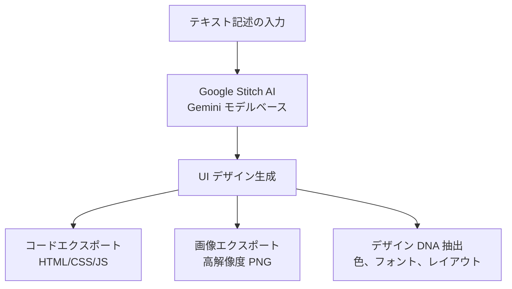
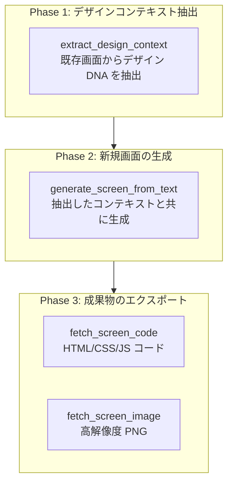
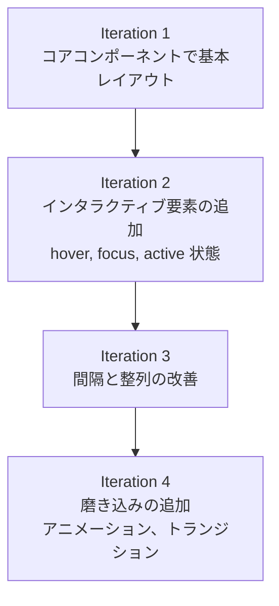

Google Stitch MCP サーバーを活用して AI ベースの UI/UX デザインを生成する方法を詳しく解説します。エージェンティック・ハーネスはコードだけに留まりません — デザイン生成ツールを MCP で接続すれば、UI プロトタイピングも同じエージェンティックワークフローの中で流れます。


**ひと言要約**: Google Stitch は **テキスト記述だけで UI 画面を生成する AI デザインツール** です。MCP サーバーを通じて Claude Code から直接 UI を生成し、デザインコンテキストを抽出し、プロダクションコードとしてエクスポートできます。


## Google Stitch とは?

Google Stitch は Google Labs が開発した AI ベースの UI/UX デザイン生成ツールです。Gemini AI モデルを使い、自然言語の説明をプロフェッショナルレベルの UI 画面に変換します。

デザイナーがいない開発環境でも、Stitch を活用すれば一貫したデザインシステムを維持しながら素早く UI をプロトタイピングできます。



### 主な機能

| 機能 | 説明 |
|------|------|
| **AI デザイン生成** | テキストプロンプトで完全な UI 画面を生成 |
| **デザイン DNA 抽出** | 既存画面から色、フォント、レイアウトパターンを抽出 |
| **コードエクスポート** | HTML/CSS/JavaScript のプロダクションコードを生成 |
| **画像エクスポート** | 高解像度 PNG スクリーンショットのダウンロード |
| **プロジェクト管理** | 画面をプロジェクト単位で構成・管理 |
| **Figma 連携** | 生成したデザインを Figma へコピー可能 |


Google Stitch は **無料** で使えます。Standard Mode で月 350 回、Experimental Mode で月 50 回の生成が可能です。Google アカウントさえあれば OK です。


## 事前準備

Google Stitch MCP を使うには次の 4 ステップの設定が必要です。

### Step 1: Google Cloud プロジェクトの作成

Google Cloud Console で新しいプロジェクトを作成するか、既存プロジェクトを選択します。

```bash
# gcloud CLI がなければまずインストール
# https://cloud.google.com/sdk/docs/install

# Google Cloud 認証
gcloud auth login

# プロジェクト設定 (既存プロジェクトを使う場合)
gcloud config set project YOUR_PROJECT_ID
```

### Step 2: Stitch API の有効化

```bash
# beta コンポーネントのインストール (初回のみ)
gcloud components install beta

# Stitch API の有効化
gcloud beta services mcp enable stitch.googleapis.com --project=YOUR_PROJECT_ID
```

### Step 3: Application Default Credentials の設定

```bash
# アプリケーションデフォルト認証情報でログイン
gcloud auth application-default login

# クォータプロジェクトの設定
gcloud auth application-default set-quota-project YOUR_PROJECT_ID
```

### Step 4: 環境変数の設定

```bash
# .bashrc または .zshrc に追加
export GOOGLE_CLOUD_PROJECT="YOUR_PROJECT_ID"
```


**Google Cloud プロジェクトに課金** (Billing) が有効化されている必要があります。Stitch 自体は無料ですが、API 呼び出しには課金が設定されたプロジェクトが必要です。また、プロジェクトに `roles/serviceusage.serviceUsageConsumer` IAM ロールが付与されている必要があります。


## MCP 設定

### .mcp.json 設定

プロジェクトルートの `.mcp.json` ファイルに Stitch MCP サーバーを追加します。

```json
{
  "mcpServers": {
    "stitch": {
      "command": "${SHELL:-/bin/bash}",
      "args": ["-l", "-c", "exec npx -y stitch-mcp"],
      "env": {
        "GOOGLE_CLOUD_PROJECT": "YOUR_PROJECT_ID"
      }
    }
  }
}
```

`YOUR_PROJECT_ID` を実際の Google Cloud プロジェクト ID に置き換えてください。

### settings.json 権限設定

MCP ツールを使うには `permissions.allow` への登録が必要です。

```json
{
  "permissions": {
    "allow": [
      "mcp__stitch__*"
    ]
  }
}
```

### settings.local.json での有効化

個人環境で Stitch MCP を有効化します。

```json
{
  "enabledMcpjsonServers": ["stitch"]
}
```

### 接続確認

設定が完了したら、Claude Code でプロジェクト一覧を照会して接続を確認します。

```bash
# Claude Code で実行
> Stitch プロジェクトの一覧を見せて
```

## MCP ツール一覧

Stitch MCP は 9 つのツールを提供します。

### ツール全一覧

| ツール | 用途 |
|------|------|
| `create_project` | 新しい Stitch プロジェクト (ワークスペース) の作成 |
| `get_project` | プロジェクト詳細メタデータの照会 |
| `list_projects` | アクセス可能なすべてのプロジェクトの一覧 |
| `list_screens` | プロジェクト内のすべての画面の一覧 |
| `get_screen` | 個別画面のメタデータ照会 |
| `generate_screen_from_text` | テキストプロンプトで新しい UI 画面を生成 |
| `fetch_screen_code` | 画面の HTML/CSS/JS コードのダウンロード |
| `fetch_screen_image` | 画面の高解像度スクリーンショットのダウンロード |
| `extract_design_context` | 画面のデザイン DNA 抽出 (色、フォント、レイアウト) |

### ツール選択ガイド

| 目的 | 使うツール |
|------|-------------|
| 新しいデザインを生成したい | `generate_screen_from_text` |
| 既存デザインを分析したい | `extract_design_context` |
| デザインをコードとしてエクスポートしたい | `fetch_screen_code` |
| デザイン画像が必要 | `fetch_screen_image` |
| 複数デザインをプロジェクトで管理したい | `create_project`, `list_projects` |

## Designer Flow ワークフロー

AI エージェントで複数画面を生成するときの最大の問題は **デザインの一貫性** です。各画面を独立して生成すると、フォント、色、レイアウトがバラバラになります。

**Designer Flow** はこの問題を解決する 3 段階パターンです。



### 実践例: E-Commerce アプリ

```bash
# Phase 1: 既存のホーム画面からデザインコンテキストを抽出
> ホーム画面のデザインコンテキストを抽出して
# → extract_design_context(screen_id="home-screen-001")
# → カラーパレット、フォント、間隔パターンを抽出

# Phase 2: 抽出したコンテキストで商品リスト画面を生成
> 商品リストページを生成して。3 列グリッド、左フィルターサイドバー、
#   各カードに画像/タイトル/価格/カートボタンを含む
# → generate_screen_from_text(prompt=..., design_context=抽出したコンテキスト)

# Phase 3: コードと画像のエクスポート
> 生成した画面のコードと画像をエクスポートして
# → fetch_screen_code(screen_id="product-listing-001")
# → fetch_screen_image(screen_id="product-listing-001")
```


**核心**: 新しい画面を生成する前に **必ず** 既存画面で `extract_design_context` を実行してください。こうすることでプロジェクト全体で一貫したデザインを維持できます。


## プロンプト作成ガイド

Stitch で良い結果を得るには構造化されたプロンプトが重要です。

### 5-Part プロンプト構造

| 順序 | 要素 | 説明 | 例 |
|------|------|------|------|
| 1 | **コンテキスト** | 画面の目的と対象ユーザー | 「E-commerce 商品リストページ」 |
| 2 | **デザイン** | 全体の視覚的スタイル | 「ミニマルモダン、明るい背景」 |
| 3 | **コンポーネント** | 必要な UI 要素の全リスト | 「ヘッダー、検索、フィルター、カードグリッド」 |
| 4 | **レイアウト** | コンポーネントの配置方式 | 「3 列グリッド、左フィルターサイドバー」 |
| 5 | **スタイル** | 色、フォント、視覚属性 | 「青のプライマリ、Inter フォント」 |

### 良いプロンプト vs 悪いプロンプト

| 悪いプロンプト | 良いプロンプト |
|--------------|--------------|
| 「かっこいいログインページを作って」 | 「ログイン画面: メール/パスワード入力、ログインボタン (青の primary)、ソーシャルログイン (Google, Apple)、パスワード再設定リンク。センターカードレイアウト、モバイルは縦スタック」 |
| 「ダッシュボードを 1 つ作って」 | 「分析ダッシュボード: 上部 3 つの指標カード (売上、ユーザー、転換率)、下にラインチャート、最下部に最近の取引テーブル。サイドバーナビゲーション。モバイル: サイドバー非表示、カード縦配置」 |
| 「375px 幅のボタン」 | 「モバイル全幅ボタン、大きなタッチ領域」 |

### 効果的なプロンプトテンプレート

```
[画面タイプ]を生成して。[コンポーネントリスト] を含む。
[レイアウトタイプ]で配置し [コンテンツ階層] を適用。
[インタラクティブ要素]と [レスポンシブ動作] を含む。
[デザインスタイル/コンテキスト] を適用。
```


**Golden Rule**: プロンプトあたり **1 つの画面**、**1〜2 個の調整** だけをリクエストしてください。プロンプトは **500 文字以下** に保つのが良いです。複雑な画面は基本レイアウトから始めて段階的に改善しましょう。


## ベストプラクティス

| 原則 | 説明 |
|------|------|
| **一貫性優先** | 新規画面の生成前は常に `extract_design_context` を実行してデザインの一貫性を維持します |
| **段階的アプローチ** | 基本レイアウトから生成し、後続プロンプトでインタラクションと詳細を追加します |
| **アクセシビリティを含む** | ARIA ラベル、キーボードナビゲーション、フォーカスインジケーターを常に明示します |
| **レスポンシブの明示** | モバイルとデスクトップの動作を常にプロンプトに含めます |
| **セマンティック HTML** | header, main, section, nav, footer などのセマンティック要素をリクエストします |
| **プロジェクト構成** | 関連する画面を同じプロジェクトにグループ化して管理します |

### 段階的改善戦略

複雑な画面は数回に分けて生成すると品質が向上します。イテレーションの一回一回が観測・改善ループです。



## 避けるべきアンチパターン


次のパターンを避けるとより良い結果が得られます。

- **過剰な仕様**: 「375px 幅」「48px 高さのボタン」のようなピクセル単位の指定の代わりに、「モバイル幅」「大きなタッチ領域」のような相対的な用語を使ってください
- **曖昧なプロンプト**: 「かっこいいログインページ」ではなく、コンポーネントリスト、レイアウト、コンテンツ階層を具体的に明示してください
- **デザインコンテキストの無視**: 既存画面があれば必ず `extract_design_context` で抽出してから渡してください
- **関心事の混在**: 「サイドバーを追加してヘッダーも固定して」のようにレイアウト変更とコンポーネント追加を 1 つのプロンプトに混ぜないでください
- **長いプロンプト**: 500 文字を超えると結果が不安定になります。核心要素だけを含め段階的に改善してください
- **レスポンシブ未指定**: Stitch は自動でモバイル最適化をしません。モバイル/デスクトップの動作を常に明示してください


## トラブルシューティング

| 問題 | 原因 | 解決方法 |
|------|------|-----------|
| 認証エラー | ADC 設定未完了 | `gcloud auth application-default login` を再実行 |
| API 未有効化 | Stitch API が無効状態 | `gcloud beta services mcp enable stitch.googleapis.com` を実行 |
| 権限拒否 | IAM ロール未付与 | プロジェクトの Owner または Editor ロールを確認、課金の有効化を確認 |
| クォータ超過 | 日次/月次の使用量制限 | クォータのリセットを待つ (Standard: 月 350 回、Experimental: 月 50 回) |
| 生成結果の不良 | プロンプトが曖昧 | コンポーネントリスト、レイアウトタイプ、コンテンツ階層を追加 |
| 一貫性の不足 | design_context 未使用 | 既存画面で `extract_design_context` 後に渡す |

### 認証問題の解決

```bash
# 1. 再認証
gcloud auth application-default login

# 2. API 有効化の確認
gcloud services list --enabled | grep stitch

# 3. プロジェクト ID の確認
echo $GOOGLE_CLOUD_PROJECT

# 4. API の有効化 (無効状態の場合)
gcloud beta services mcp enable stitch.googleapis.com --project=YOUR_PROJECT_ID
```

## 関連ドキュメント

- [MCP サーバー活用](/ja/advanced/mcp-servers) - MCP プロトコル概要と他の MCP サーバー
- [settings.json ガイド](/ja/advanced/settings-json) - MCP サーバー権限設定
- [スキルガイド](/ja/advanced/skill-guide) - moai-platform-stitch スキル活用
- [エージェントガイド](/ja/advanced/agent-guide) - エージェントシステムとの連携


**ヒント**: Google Stitch を最大限に活用する鍵は **Designer Flow パターン** です。既存画面からデザインコンテキストを抽出してから新しい画面を生成すれば、プロジェクト全体で一貫したデザインを維持できます。

