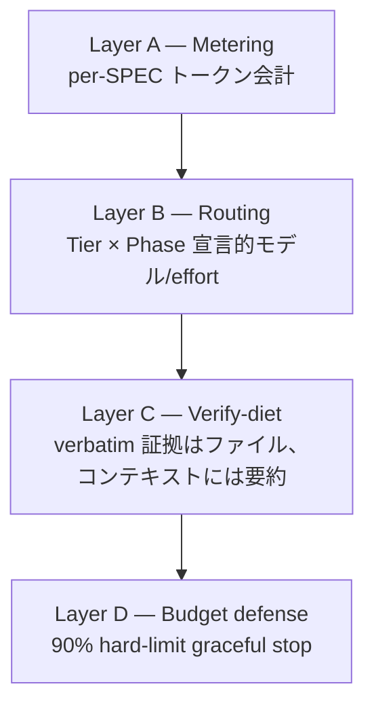

トークノミクス(Token Economics)はMoAI-ADK v3.0の第一の柱です。トークン単価が下がっても、エージェント的開発はトークンを大量に消費するため、コストを決めるのはモデル価格ではなくトークンの運用方法です。このページはトークノミクスの全体構造を概観し、各サブトピックの深掘りページへリンクします。

## なぜトークノミクスか

エージェントが複数走り、コンテキストが長くなり、推論が深まるほど、単一セッションのトークン消費は急激に増加します。トークン単価の下落がトークン使用量の増加に追いつかない状況では、ハーネスがトークンをどのように測定し、ルーティングし、ダイエットし、防御するかがコスト競争力の中核になります。

MoAI-ADKの答えは3点です。

1. **タスクごとに適切なモデルと推論深度を割り当てる** — 計画は深く、実装は安く、検証は独立して。
2. **コンテキストをダイエットする** — 常時ロードされる指示を最小化し、プロンプトキャッシュ命中率を測定する。
3. **予算をシステムが守る** — トークン使用を追跡し、しきい値超過前に優雅に停止する。

## 3本柱の物語

v3.0の製品差別化は3本柱で構成されます。トークノミクスはその最初の柱であり、残り2本柱と密接に接続されます。

 **トークノミクス** (このページ) — 測定し、ルーティングし、ダイエットし、防御する。

 **自律連続ループ** — いつ止まり、いつ続くか。[自律連続ループ](/ja/advanced/autonomous-loops/)ページで扱います。

 **エージェント的ハーネス** — どのエージェントが、どのティアで、どう進化するか。[3層アーキテクチャ](/ja/advanced/no-haiku-3tier/)、[plan_type ティアプロファイル](/ja/advanced/plan-type-profiles/)、[ハーネス自己進化](/ja/advanced/self-evolving/)ページで扱います。

## 4層トークノミクス構造

トークノミクスは4つの層で構成されます。各層は独立して動作しながら相互に補完します。

### Layer A — 計測 (Metering)

 全エージェント呼び出しのトークン使用量をper-SPEC単位で会計します。`moai spec audit`出力のトークンカラムとprogress.mdのトークン会計セクションがこの層の成果物です。何がトークンを消費したかを知らなければ最適化できません。

### Layer B — ルーティング (Routing)

 作業フェーズ(plan / run / sync)とSPECサイズ(Tier S / M / L)に応じてモデルと推論深度(effort)を宣言的に割り当てます。深い推論が必要な計画フェーズには高推論モデルを、機械的反復の多い実装フェーズには軽いモデルを割り当て、コスト対品質を最大化します。詳細な60セルプロファイルマトリクスは[plan_type ティアプロファイル](/ja/advanced/plan-type-profiles/)ページを参照してください。

### Layer C — 検証ダイエット (Verify-diet)

 検証コマンドの長文出力をディスクファイルにリダイレクトし、コンテキストにはexit codeとbounded tail(最大50行)のみ残します。このファイルリダイレクト契約(file-redirect contract)は検証証拠の完全性を維持しながらコンテキスト消費を削減します。詳細なメカニズムは[トークン予算管理とgraceful stop](/ja/advanced/token-budget/)ページを参照してください。

### Layer D — 予算防御 (Budget defense)

 エージェントのトークン使用量がhard-limit(デフォルト90%)に達するとgraceful abortを実行します。進行状況をprogress.mdに保存し、ペースト可能なresumeメッセージ(paste-ready resume)を発行し、自動`/clear`は決して行いません。詳細な手順は[トークン予算管理とgraceful stop](/ja/advanced/token-budget/)ページを参照してください。

## モデルティアルーティング

Layer Bのルーティングを具体化するのがモデルティアポリシーです。MoAI-ADK v3.0はHaikuをルーティングモデルセットから除外し、3層構造(Sonnet / Opus / Fable)で作業を分散します。この設計の根拠とApplyTierProfile実装は次の2ページで扱います。

- [3層エージェントアーキテクチャ](/ja/advanced/no-haiku-3tier/) — なぜHaikuを除外したか、DeepSWEリーダーボード根拠
- [plan_type ティアプロファイル](/ja/advanced/plan-type-profiles/) — api vs サブスクリプション課金ごとの60セルプロファイルマトリクス

## CGモード (コスト最適化)

`moai cg`はClaudeリーダーとGLMワーカーを組み合わせたハイブリッドモードです。戦略、計画、監査はClaudeが担当し、大規模実装作業はGLMが担当します。実装中心の作業で60-70%のコスト削減効果があります。

GLM-5.2は1Mコンテキストの単一モデルで、入力$2 / 出力$8 (1Mトークンあたり)の単価で、z.ai暗黙プロンプトキャッシュが自動適用されます。CGモードとGLM単独セッション(`moai glm`)の詳細はMulti-LLMセクションを参照してください。

## 検証された事実とロードマップ

このページの記載内容のうち、実装状態を明確に区別します。

 **実装完了 (配信中)** — 4層構造(A/B/C/D)全層、3層モデルポリシー(ApplyTierProfile)、CGモード、検証ダイエットファイルリダイレクト契約、graceful abortメカニズム。

 **設計段階 (ロードマップ)** — GLMバックエンドeffortオーバーレイのwire有効性はライブGLMセッションのアウトバウンド観測が必要な実証課題です。plan_type ティアプロファイルページでこの区別を明示します。

## 次のステップ

- [トークン予算管理とgraceful stop](/ja/advanced/token-budget/) — Layer Dの深掘り (モデルごとのしきい値、paste-ready resume構造)
- [3層エージェントアーキテクチャ](/ja/advanced/no-haiku-3tier/) — ハーネスアーキテクチャの基礎
- [plan_type ティアプロファイル](/ja/advanced/plan-type-profiles/) — 60セルプロファイルマトリクス
