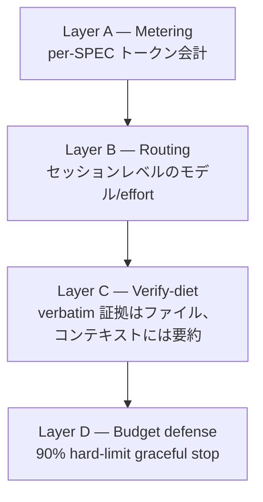
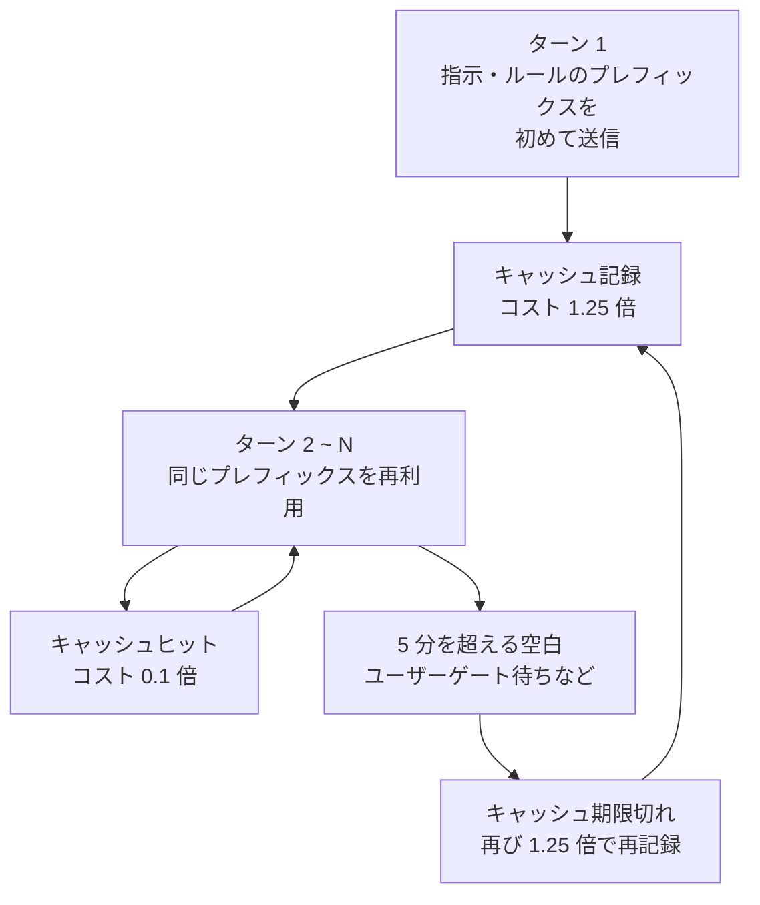

トークノミクス(Token Economics)はMoAI-ADK v3.0の第一の柱です。トークン単価が下がっても、エージェント的開発はトークンを大量に消費するため、コストを決めるのはモデル価格ではなくトークンの運用方法です。このページはトークノミクスの全体構造を概観し、各サブトピックの深掘りページへリンクします。

## なぜトークノミクスか

エージェントが複数走り、コンテキストが長くなり、推論が深まるほど、単一セッションのトークン消費は急激に増加します。トークン単価の下落がトークン使用量の増加に追いつかない状況では、ハーネスがトークンをどのように測定し、ルーティングし、ダイエットし、防御するかがコスト競争力の中核になります。

MoAI-ADKの答えは3点です。

1. **セッションに合ったモデルと推論深度を決める** — メインセッションのモデルと effort がすべてのサブエージェントにそのまま引き継がれるので、セッション 1 つをうまく選ぶことが全体の割り当てになります。
2. **コンテキストをダイエットする** — 常時ロードされる指示を最小化し、プロンプトキャッシュ命中率を測定する。
3. **予算をシステムが守る** — トークン使用を追跡し、しきい値超過前に安全に停止する。

## 3本柱の物語

v3.0の製品差別化は3本柱で構成されます。トークノミクスはその最初の柱であり、残り2本柱と密接に接続されます。

 **トークノミクス** (このページ) — 測定し、ルーティングし、ダイエットし、防御する。

 **自律連続ループ** — いつ止まり、いつ続くか。[自律連続ループ](/ja/advanced/autonomous-loops/)ページで扱います。

 **エージェント的ハーネス** — どのエージェントが、どのプロファイルで、どう進化するか。[3層アーキテクチャ](/ja/advanced/no-haiku-3tier/)、[プロファイルマトリクス](/ja/advanced/profile-matrix/)、[ハーネス自己進化](/ja/advanced/self-evolving/)ページで扱います。

## 4層トークノミクス構造

トークノミクスは4つの層で構成されます。各層は独立して動作しながら相互に補完します。

```mermaid
flowchart TD
    A["Layer A — Metering<br/>per-SPEC トークン会計"]
    B["Layer B — Routing<br/>セッションレベルのモデル/effort"]
    C["Layer C — Verify-diet<br/>verbatim 証拠はファイル、コンテキストには要約"]
    D["Layer D — Budget defense<br/>90% hard-limit graceful stop"]

    A --> B
    B --> C
    C --> D
```

### Layer A — 計測 (Metering)

 全エージェント呼び出しのトークン使用量をper-SPEC単位で会計します。`moai spec audit`出力のトークンカラムとprogress.mdのトークン会計セクションがこの層の成果物です。何がトークンを消費したかを知らなければ最適化できません。

### Layer B — ルーティング (Routing)

 セッションが使うモデルと推論深度(effort)を決めます。v3.2 からルーティングの単位はエージェントではなく**セッション**です — メインセッションのモデルと effort はすべてのサブエージェントにそのまま継承され、セッション effort は `/effort`·`ultrathink` で調整し、プロファイルウィザードのセッションモデルポリシーは推論強度を別に選ばなかったときの既定フォールバックを決めます。かつてのようなエージェント別割り当て表の管理はもう要りません。MoAI-ADK v3.0 は Haiku をルーティングモデル集合から除外しており、作業の性格に合わせた3層構造 — 単発の作業には Sonnet、エージェンティックな階梯には Opus、より高い effort は判断の仕事（監査・助言・調整）に集める — はセッションモデルを選ぶときの判断基準として残ります。この設計の根拠と継承の規則は[3層エージェントアーキテクチャ](/ja/advanced/no-haiku-3tier/)、[プロファイルマトリクス](/ja/advanced/profile-matrix/)、[モデルポリシー](/ja/multi-llm/model-policy/)ページで扱います。

### Layer C — 検証ダイエット (Verify-diet)

 検証コマンドの長文出力をディスクファイルにリダイレクトし、コンテキストにはexit codeとbounded tail(最大50行)のみ残します。このファイルリダイレクト契約(file-redirect contract)は検証証拠の完全性を維持しながらコンテキスト消費を削減します。ダイエットは検証出力に限定されません。常時ロードされる指示を減らし、プロンプトキャッシュ命中率を高めることもこの層に属します。詳細なメカニズムは[トークン予算管理と安全な中止](/ja/advanced/token-budget/)ページを参照してください。

### Layer D — 予算防御 (Budget defense)

 エージェントのトークン使用量がhard-limit(デフォルト90%)に達すると安全な中止(graceful abort)を実行します。進行状況をprogress.mdに保存し、ペースト可能なresumeメッセージ(paste-ready resume)を発行し、自動`/clear`は決して行いません。詳細な手順は[トークン予算管理と安全な中止](/ja/advanced/token-budget/)ページを参照してください。

## プロンプトキャッシュ: 同じ指示を 2 回目からは安く

トークノミクスでよく見落とされるコスト構造がプロンプトキャッシュ (以前に送信した入力を一時的に保存しておく機能) です。Anthropic のプロンプトキャッシュは、レンダリングされたリクエストの先頭部分 (tools → system → messages の順序) に対してプレフィックス一致で動作します。最初の 1 回はそのプレフィックスをキャッシュに記録する必要があるため 1.25 倍のコストがかかりますが、以降同じプレフィックスを再利用するターンでは 0.1 倍のコストで読み出せます。1 ターンの入力を 10 倍近く安くできる構造です。

ここには 2 つの落とし穴があります。

第一に、キャッシュの寿命は 5 分です。ただしこの 5 分は「5 分後に期限切れ」ではなく「5 分を超える空き時間が挟まると期限切れ」です。ユーザーゲートで回答を待つ時間が長びくとキャッシュが期限切れとなり、次のターンはプレフィックス全体を改めて 1.25 倍で記録し直さなければなりません。だからこそ、遅くに尋ねる質問ほどコストが大きくなります。

第二に、キャッシュは書き込み中には読めません。同じ定義を持つエージェントを複数同時に立ち上げると、同時に出発したリクエストは最初の 1 つがキャッシュに書き込んでいる間を待ってくれないため、すべてがコールド (cold) 状態でプレフィックスをそれぞれ記録し直すことになります。

```mermaid
flowchart TD
    T1["ターン 1<br/>指示・ルールのプレフィックスを<br/>初めて送信"]
    W["キャッシュ記録<br/>コスト 1.25 倍"]
    T2["ターン 2 ~ N<br/>同じプレフィックスを再利用"]
    H["キャッシュヒット<br/>コスト 0.1 倍"]
    GAP["5 分を超える空白<br/>ユーザーゲート待ちなど"]
    MISS["キャッシュ期限切れ<br/>再び 1.25 倍で再記録"]

    T1 --> W
    W --> T2
    T2 --> H
    H --> T2
    T2 --> GAP
    GAP --> MISS
    MISS --> W
```

この構造のため、MoAI-ADK は実行順序を意識的に調整します。ユーザーゲートはコンテキストが小さいうちに早めに尋ね、同じ種類のエージェントを並列に立ち上げるときは 1 つを先に立ち上げてキャッシュを温めてから残りを続けて立ち上げ (stagger-spawn)、セッション開始時にロードされる指示ファイルを途中で編集せず作業の終わりに回します。キャッシュはゲートの意味を変えません。承認ゲートはそのまま必須であり、ただそのゲートを「いつ、どの順序で」尋ねるかだけを抑えるのがキャッシュ認識実行です。

## モデル別コンテキストしきい値

予算ガードがいつ停止するかを決める運用しきい値はモデルごとに異なります。ウィンドウが大きいほど高い使用率まで耐えられ、ウィンドウが小さいほど絶対的な余裕は少なくなります。

| モデルクラス | ウィンドウ | ハンドオフしきい値 | 絶対上限 |
|--------------|-----------|-------------------|----------|
| Opus 5.5 (1M) | 1,000,000 トークン | 50% | ~500,000 トークン |
| GLM-5.3 (1M) | 1,000,000 トークン | 50% | ~500,000 トークン |
| Fable / Sonnet 5 (1M) | 1,000,000 トークン | 50% | ~500,000 トークン |
| Sonnet 4.5 以前 (200K) | 200,000 トークン | 90% | ~180,000 トークン |

1M コンテキストモデル (Opus 5.5, GLM-5.3) は 50% でのハンドオフを推奨します。ウィンドウが広いからといって最後まで使い切るのではなく、むしろ早めに折ってキャッシュと余裕を守るほうが安定します。statusline のコンテキストゲージ (CW%) を見て、しきい値に近づいたら `/clear` を準備します。詳細な手順とハンドオフメッセージの構造は[トークン予算管理と安全な中止](/ja/advanced/token-budget/)ページにあります。

## CG の廃止と設定の移行

`moai cg` は廃止されました。Claude や GLM を起動せず、移行案内を表示して終了します。`moai cc` の別名ではありません。`llm.team_mode: cg` が残るプロジェクトでは、セッションを起動する前に移行先を明示的に選ぶ必要があります。 [CG の廃止と設定の移行](/ja/multi-llm/cg-mode/)

`llm.team_mode: claude`、`llm.gateway.teammate_mode: in-process`、`llm.gateway.teammate_provider: inherit` を保存します。従来の混合構成の役割分担を解除する変更です。Claude リーダーと GLM チームメイトのペインを維持する移行ではありません。

`claude-glm` は Claude リーダーと tmux 内の GLM チームメイトを表します。現在は TEAMMATE の統合検証を通過していないため、適用と起動は利用できず、プレビューのみ可能です。tmux のインストールや `verified: true` の設定では、この制限は解除されません。

## 検証された事実とロードマップ

このページの記載内容のうち、実装状態を明確に区別します。

 **実装完了 (配信中)** — 4層構造(A/B/C/D)全層、セッション継承モデルポリシー(セッションのモデル·effort がサブエージェントに継承、セッションモデルポリシーは effort フォールバック)、検証ダイエットファイルリダイレクト契約、安全な中止メカニズム。

 **設計段階 (ロードマップ)** — GLMバックエンドeffortオーバーレイのwire有効性はライブGLMセッションのアウトバウンド観測が必要な実証課題です。プロファイルマトリクスページでこの区別を明示します。

## 次のステップ

- [トークン予算管理と安全な中止](/ja/advanced/token-budget/) — Layer Dの深掘り (モデルごとのしきい値、paste-ready resume構造)
- [3層エージェントアーキテクチャ](/ja/advanced/no-haiku-3tier/) — ハーネスアーキテクチャの基礎
- [プロファイルマトリクス](/ja/advanced/profile-matrix/) — マトリクスが退いた場所とセッション継承の規則
