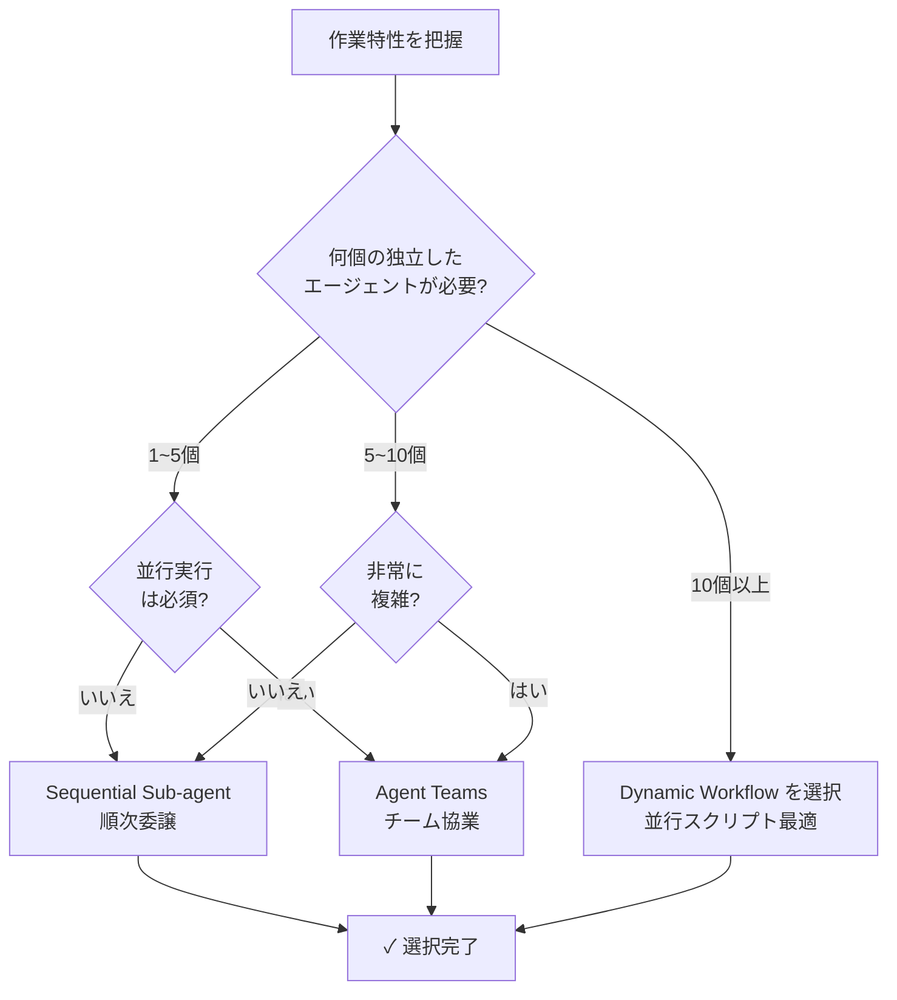

Claude Code の動的ワークフロープリミティブと MoAI-ADK の Ultracode 統合についてガイドします。


**一行要約**: 動的ワークフローは JavaScript で記述された自動化スクリプトで、数十~数百のエージェントを並行調整します。Ultracode は `/effort ultracode` またはウルトラコード キーワードでトリガーされます。


## 3つのオーケストレーションプリミティブ

MoAI-ADK は**3つの異なるオーケストレーションプリミティブ**を提供しており、各々は異なる用途に最適化されています。

### 1. Sequential Sub-agents（順次委譲）

MoAI デフォルトモード — 1ターンごとに1つのエージェントを順番に委譲します。

| 特性 | 説明 |
|------|------|
| **計画位置** | Claude のコンテキスト（turn-by-turn 判断） |
| **中間結果** | Claude のコンテキストウィンドウに累積 |
| **並行度** | 順次実行（1エージェント per ターン） |
| **スケール** | 通常 3~5エージェント |
| **コンテキストコスト** | 各エージェント結果がコンテキスト消費 |

**使用時点**:
- シンプルな 1~5エージェント作業
- コーディング中心の run-phase 作業
- エージェント間依存性が多い場合

### 2. Agent Teams（チーム協業）

複数チームメンバーが**共有 TaskList** で協業する高度なモードです。

| 特性 | 説明 |
|------|------|
| **計画位置** | 共有 TaskList（チーム間調整） |
| **中間結果** | TaskList + 各チームメンバーのコンテキスト |
| **並行度** | 3~5名同時実行（Anthropic 推奨） |
| **スケール** | 小規模チーム（3~5名） |
| **コンテキストコスト** | チームメンバー別独立コンテキスト |

**使用時点**:
- 複数チームメンバーが並行作業
- クロスレイヤー依存性（バックエンド ↔ フロントエンド）
- チームメンバー間のハンドオフとレビュー必要

### 3. Dynamic Workflows（動的ワークフロー）

JavaScript で記述された**自動化スクリプト**で多数のエージェントを調整します。

| 特性 | 説明 |
|------|------|
| **計画位置** | スクリプトコード（宣言型計画） |
| **中間結果** | スクリプト変数（コンテキスト非累積） |
| **並行度** | 最大 16 同時（最大 1000 計） |
| **スケール** | 非常に大きい（数十~数百エージェント） |
| **コンテキストコスト** | 最終結果のみコンテキスト消費 |

**使用時点**:
- 大規模並行作業（数十~数百エージェント）
- コードベース全体スキャン
- 大規模マイグレーション
- クロスソース検証

## 選択決定ツリー

どのプリミティブを選択するか判断するフローチャートです。



## Ultracode と Dynamic Workflows

### /effort ultracode

```bash
/effort ultracode
```

現在のセッションのすべての substantive 作業に対して**自動ワークフロー生成**を活性化します。

**効果**:
- Reasoning effort: `xhigh` に設定
- 自動ワークフロー生成活性化
- 各作業ごとに最適オーケストレーションプリミティブ選択

**使用時点**:
- 非常に複雑なマルチフェーズ作業
- 自動オーケストレーションが必要な大規模プロジェクト

### ultracode キーワード

単一リクエストでワークフローをトリガーします。

```bash
> コードベースのすべての TODO コメントを見つけて分類してください。
> (ウルトラコード キーワードを含まない場合は通常の sub-agent 実行)

vs

> ultracode: コードベースのすべての TODO コメントを見つけて分類してください。
> (ワークフロー自動生成)
```

## Dynamic Workflow 構造

### 基本スクリプトテンプレート

```javascript
// ワークフロースクリプト: コードベース全体 TODO 分類
const packages = [
  "internal/auth",
  "internal/api",
  "internal/db",
  "pkg/utils"
];

const results = [];

for (const pkg of packages) {
  // 各パッケージごとに独立エージェント生成
  const result = await agent({
    agentType: "Explore",
    model: "haiku",
    effort: "low",
    prompt: `
      ${pkg} パッケージのすべての TODO コメントを見つけて分類してください。
      形式: [ファイル] [行] [カテゴリ] [内容]
    `
  });
  results.push({ pkg, todos: result });
}

// 最終統合
const summary = {
  total_packages: packages.length,
  package_summaries: results,
  grand_total_todos: results.reduce((sum, r) => sum + r.todos.length, 0)
};

return summary;
```

### 特徴

| 項目 | 説明 |
|------|------|
| **エージェント生成** | ループで動的生成（`await agent({...})`） |
| **中間結果** | スクリプト変数に保存（コンテキスト非累積） |
| **並行実行** | 独立作業は自動並行（最大 16 同時） |
| **最終返却** | 統合結果のみ現在のセッションに返却 |

## MoAI 統合上の考慮事項

### AskUserQuestion 制約

ワークフロー エージェントはユーザーと**直接相互作用できません**。

```
❌ ワークフロー エージェントがユーザー質問を発生 → 不可
✓ MoAI オーケストレータが事前にすべての選択肢を収集 → ワークフロー実行
```

**解決方式**:
1. MoAI オーケストレータが `AskUserQuestion` 呼び出し
2. ユーザー応答を収集
3. 応答をワークフロー入力に含めて実行

### Implementation Kickoff Approval

ワークフロー実行も通常の run-phase と同様にユーザー承認が必要です。

```
/moai run --workflow SPEC-XXX

→ MoAI: "この SPEC をワークフロー で実行します。進めますか?"
→ AskUserQuestion 承認必須
```

### コスト意識

動的ワークフローは**高いトークン消費**をもたらす可能性があります。

| 作業 | エージェント数 | 予想コスト |
|------|-----------|---------|
| 小規模パッケージスキャン | 5 | 低 |
| 中規模コードベース | 20 | 中程度 |
| 全体リポスキャン | 100以上 | 高 |

**コスト調整**:
- モデル: `haiku` を使用（読取専用抽出）
- エージェント数: 範囲制限（`packages.slice(0, 20)`）
- 並行度: 最大 16 から手動調整

## Workflow 活性化と設定

### 活性化条件

動的ワークフローは以下の条件でのみ実行されます:

1. Claude Code v2.1.154+
2. 有料プラン（Pro または Team）
3. `/config` で `"disableWorkflows": false`

### 無効化

組織またはユーザーレベルで無効化可能:

```bash
/config
# Dynamic workflows トグルをオフ

OR

export CLAUDE_CODE_DISABLE_WORKFLOWS=1
```

## 関連ドキュメント

- [Harness v4 Builder](/advanced/builder-agents) - 動的チーム生成
- [エージェントガイド](/advanced/agent-guide) - エージェントシステム概要
- [SPEC ベース開発](/workflow-commands/moai-plan) - 統合ワークフロー


**ヒント**: スケールが小さい場合は Sequential Sub-agents で充分です。動的ワークフローは「数十~数百個の独立した作業を並行調整する必要があるとき」のみ使用してください。

