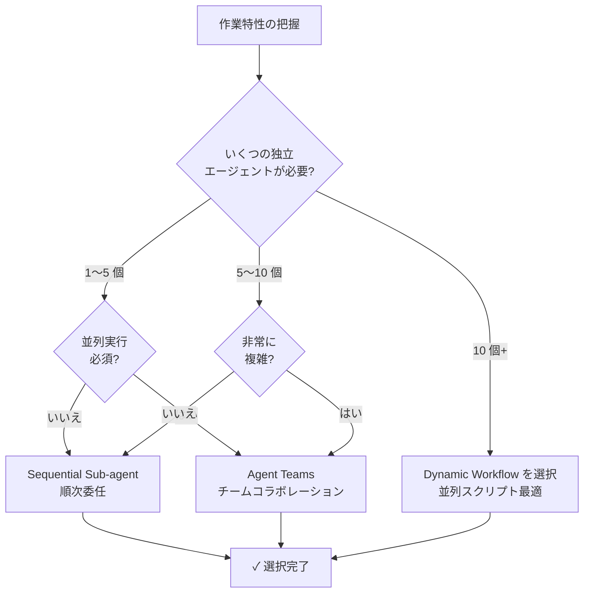

エージェント 100 個を順次委任すると、先にコンテキストが崩壊します。動的ワークフローは計画を Claude のコンテキストではなく **スクリプト変数** に置くことでこの問題を解きます — 中間結果はスクリプトに留まり、最終結果だけがセッションに戻ります。大規模なファンアウトを可能にしながらコンテキストコストは抑制する、トークノミクスとループエンジニアリングが交差する地点です。


**ひと言要約**: 動的ワークフローは JavaScript で書かれた自動化スクリプトで、数十〜数百のエージェントを並列調整します。Ultracode は `/effort ultracode` または `ultracode` キーワードでトリガーされます。


## 3 つのオーケストレーションプリミティブ

MoAI-ADK は **3 つのオーケストレーションプリミティブ** を提供し、選択基準は「計画を誰が持っているか」です。

### 1. Sequential Sub-agents (順次委任)

MoAI のデフォルトモード — 1 ターンごとに 1 つのエージェントを順に委任します。

| 特性 | 説明 |
|------|------|
| **計画の位置** | Claude のコンテキスト (turn-by-turn 判断) |
| **中間結果** | Claude のコンテキストウィンドウに蓄積 |
| **並列度** | 順次実行 (1 エージェント per turn) |
| **規模** | 一般的に 3〜5 エージェント |
| **コンテキストコスト** | 各エージェントの結果がコンテキストを消費 |

**使用タイミング**:
- 単純な 1〜5 エージェントの作業
- コーディング中心の run-phase 作業
- エージェント間の依存関係が多い場合

### 2. Agent Teams (チームコラボレーション)

複数のメンバーが **共有 TaskList** で協業するモードです。

| 特性 | 説明 |
|------|------|
| **計画の位置** | 共有 TaskList (チーム間調整) |
| **中間結果** | TaskList + 各メンバーのコンテキスト |
| **並列度** | 3〜5 名の同時実行 (Anthropic 推奨) |
| **規模** | 小規模チーム (3〜5 名) |
| **コンテキストコスト** | メンバーごとの独立コンテキスト |

**使用タイミング**:
- 複数メンバーの並列作業
- クロスレイヤー依存 (バックエンド ↔ フロントエンド)
- メンバー間のコラボレーションとレビューが必要


v3.0 で MoAI の Agent Teams **静的オーケストレーション階層は引退** しました。`--team` を強制すると sub-agent モードへフォールバックします。ネイティブの Claude Code teammate ランタイム (`moai cg` の GLM ペインなど) は引き続き動作します。


### 3. Dynamic Workflows (動的ワークフロー)

JavaScript で書かれた **自動化スクリプト** で多数のエージェントを調整します。

| 特性 | 説明 |
|------|------|
| **計画の位置** | スクリプトコード (宣言的な計画) |
| **中間結果** | スクリプト変数 (コンテキスト蓄積なし) |
| **並列度** | 最大 16 同時 (最大 1000 総数) |
| **規模** | 非常に大きい (数十〜数百エージェント) |
| **コンテキストコスト** | 最終結果のみコンテキストを消費 |

**使用タイミング**:
- 大規模な並列作業 (数十〜数百エージェント)
- コードベース全体のスキャン
- 大規模マイグレーション
- クロスソース検証

## 選択デシジョンツリー

どのプリミティブを選ぶかを判断するフローです。


```mermaid
flowchart TD
    START[作業特性の把握] --> Q1{いくつの独立<br>エージェントが必要?}
    
    Q1 -->|1〜5 個| Q2{並列実行<br>必須?}
    Q1 -->|5〜10 個| Q3{非常に<br>複雑?}
    Q1 -->|10 個+| WORKFLOW["Dynamic Workflow を選択<br>並列スクリプト最適"]
    
    Q2 -->|いいえ| SUBAGENT["Sequential Sub-agent<br>順次委任"]
    Q2 -->|はい| TEAMS["Agent Teams<br>チームコラボレーション"]
    
    Q3 -->|はい| TEAMS
    Q3 -->|いいえ| SUBAGENT
    
    SUBAGENT --> DONE["✓ 選択完了"]
    TEAMS --> DONE
    WORKFLOW --> DONE
```

## Ultracode と Dynamic Workflows

### /effort ultracode

```bash
/effort ultracode
```

現在のセッションのすべての substantive 作業に対して **自動ワークフロー生成** を有効化します。

**効果**:
- Reasoning effort: `xhigh` に設定
- 自動ワークフロー生成を有効化
- 各作業ごとに最適なオーケストレーションプリミティブを選択

**使用タイミング**:
- 非常に複雑なマルチフェーズ作業
- 自動オーケストレーションが必要な大規模プロジェクト

### ultracode キーワード

セッション全体ではなく単一リクエストでのみワークフローをトリガーしたい場合はキーワードを使います。

```bash
> うちの codebase のすべての TODO コメントを見つけて分類して。
> (ultracode keyword を含めなければ通常の sub-agent 実行)

VS

> ultracode: うちの codebase のすべての TODO コメントを見つけて分類して。
> (ワークフロー自動生成)
```

## Dynamic Workflow の構造

### 基本スクリプトテンプレート

```javascript
// ワークフロースクリプト: コードベース全体の TODO 分類
const packages = [
  "internal/auth",
  "internal/api",
  "internal/db",
  "pkg/utils"
];

const results = [];

for (const pkg of packages) {
  // 各パッケージごとに独立エージェントを生成
  const result = await agent({
    agentType: "Explore",
    model: "haiku",
    effort: "low",
    prompt: `
      ${pkg} パッケージですべての TODO コメントを見つけて分類してください。
      形式: [ファイル] [行] [カテゴリ] [内容]
    `
  });
  results.push({ pkg, todos: result });
}

// 最終集約
const summary = {
  total_packages: packages.length,
  package_summaries: results,
  grand_total_todos: results.reduce((sum, r) => sum + r.todos.length, 0)
};

return summary;
```

### 特徴

| 項目 | 説明 |
|------|------|
| **エージェント生成** | ループで動的生成 (`await agent({...})`) |
| **中間結果** | スクリプト変数に保存 (コンテキスト非蓄積) |
| **並列実行** | 独立した作業は自動並列 (最大 16 同時) |
| **最終返却** | 統合結果のみ現在のセッションに返却 |

## MoAI 統合の考慮事項

### AskUserQuestion 制約

ワークフローエージェントはユーザーと **直接対話できません**。

```
✗ ワークフローエージェントがユーザー質問を発生 → 不可能
✓ MoAI オーケストレーターが事前にすべての選択肢を収集 → ワークフロー実行
```

**解決方式**:
1. MoAI オーケストレーターが `AskUserQuestion` を呼び出す
2. ユーザー応答を収集
3. 応答をワークフロー入力に含めて実行

### Implementation Kickoff Approval

ワークフロー実行も通常の run-phase と同様にユーザー承認が必要です。大規模なファンアウトだからといってヒューマンゲートが消えることはありません。

```
/moai run --workflow SPEC-XXX

→ MoAI: 「この SPEC をワークフローで実行します。進めますか?」
→ AskUserQuestion での承認が必須
```

### コスト認識

動的ワークフローはコンテキストを節約する代わりに **総トークン消費は大きくなりえます**。ファンアウト規模がすなわちコストです。

| 作業 | エージェント数 | 想定コスト |
|------|-----------|---------|
| 小規模パッケージスキャン | 5 | 低 |
| 中規模コードベース | 20 | 中 |
| リポ全体スキャン | 100+ | 高 |

**コスト調整**:
- モデル: `haiku` を使用 (read-only 抽出)
- エージェント数: 範囲制限 (`packages.slice(0, 20)`)
- 並列度: 最大 16 から手動調整

## Workflow の有効化と設定

### 有効化条件

動的ワークフローは次の条件でのみ実行されます。

1. Claude Code v2.1.154+
2. 有料プラン (Pro または Team)
3. `/config` で `"disableWorkflows": false`

### 無効化

組織またはユーザーレベルで無効化できます。

```bash
/config
# Dynamic workflows toggle をオフ

OR

export CLAUDE_CODE_DISABLE_WORKFLOWS=1
```

## 関連ドキュメント

- [ビルダーエージェントとハーネス v4](/ja/advanced/builder-agents) - 動的チーム生成
- [エージェントガイド](/ja/advanced/agent-guide) - エージェントシステム概要
- [SPEC ベース開発](/ja/workflow-commands/moai-plan) - 統合ワークフロー


**ヒント**: 規模が小さければ Sequential Sub-agents で十分です。動的ワークフローは「数十〜数百の独立した作業を並列調整する必要があるとき」だけ使ってください — ファンアウト自体がコストであることを忘れないでください。

