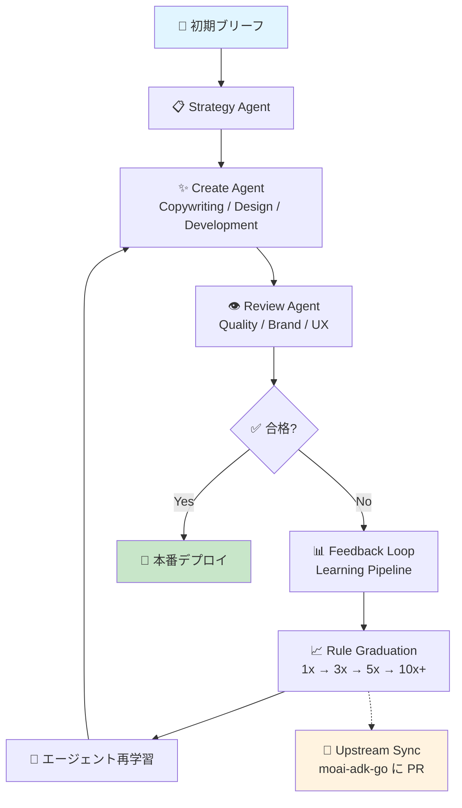

## AI Agencyとは

AI Agencyは、使うほどユーザーの業務に合わせて進化する**クリエイティブプロダクションシステム**です。継続的なフィードバックループを通じて、AI エージェントが自ら最適なプロセスを学習・改善し、ビジネス成果を最大化します。

### MoAI との違い

| 項目 | MoAI | AI Agency |
|------|------|-----------|
| **目的** | 開発ツール・フレームワーク | クリエイティブ制作エージェンシー |
| **ユーザー** | ソフトウェアエンジニア | マーケティング・デザインチーム |
| **進化方式** | マニュアル | 自動進化（GAN ループ） |
| **成果物** | コード・テスト・ドキュメント | ランディングページ・SaaS WEB・マーケティングサイト |
| **パイプライン** | Plan → Run → Sync | Strategy → Create → Review → Learn |

## 主な特徴

### 🧠 自己進化スキル
フィードバックが蓄積されるほど、AI エージェントは自動的に改善されます。Knowledge Graduation Protocol により、単一の試行（1x）から確信度の高い法則（10x+）へと段階的に昇格します。

### 🔄 GAN ループ
**生成器** （Generator） がクリエイティブコンテンツを生成し、**判別器** （Discriminator） が品質を評価。このサイクルを繰り返すことで、徐々に品質が向上します。

### 🎨 ブランドコンテキスト
プロジェクト固有のトーン・ビジュアル・メッセージングを一度設定すれば、すべての生成物に自動的に反映されます。

### 🔐 デュアルゾーン
**FROZEN ゾーン** では、核となるプロセスや重要な設定を変更しない。**EVOLVABLE ゾーン** では、スキルと知識が自動進化します。

### 🔗 アップストリーム同期
Learning Pipeline で生成された新しいルールやヒューリスティックは、モジュール化されて moai-adk-go に自動 PR される。プロジェクト固有から汎用へ。

## パイプラインアーキテクチャ

## ユースケース

### 🌐 ランディングページ
新規プロダクト・キャンペーン用の高コンバージョン LLP を数時間で生成。A/B テストを自動実施し、成果指標に応じてページを継続最適化。

### 💼 SaaS ウェブサイト
プロダクトの複雑さを正確に表現しつつ、見込み客にわかりやすいコンテンツ構成で配置。ドキュメントも自動生成。

### 📢 マーケティングサイト
ブログ記事・ケーススタディ・ホワイトペーパーを継続生成。SEO・ユーザー分析を反映して自動リライト。

## 比較表：MoAI と AI Agency

### MoAI
- **パイプライン**: Plan (30K) → Run (180K) → Sync (40K)
- **進化メカニズム**: 手動コード修正 + PR レビュー
- **成果物**: Go / TypeScript コード、テスト、ドキュメント
- **品質保証**: TRUST 5 フレームワーク（自動テスト・リント・セキュリティ）
- **スケール**: 技術チーム（10-50 名）

### AI Agency
- **パイプライン**: Strategy → Create → Review → Learn
- **進化メカニズム**: GAN ループ + Knowledge Graduation Protocol
- **成果物**: ランディングページ、SaaS サイト、マーケティングコンテンツ
- **品質保証**: Design Quality Score + Brand Consistency + UX Compliance
- **スケール**: クリエイティブチーム（3-20 名）

## 次のステップ

- [はじめに](getting-started) - 最初のブリーフ作成から進化まで
- [エージェント & スキル](agents-and-skills) - 6 つのエージェントと 5 つのスキルモジュール
- [自己進化システム](self-evolution) - Learning Pipeline と知識昇格プロトコル
- [コマンドリファレンス](command-reference) - 11 のサブコマンド完全リファレンス
