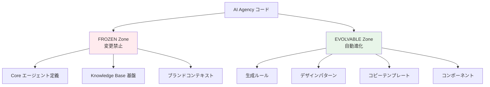
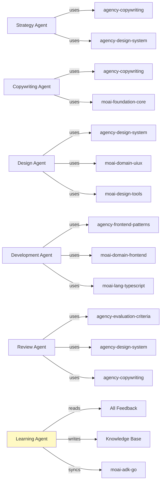

# エージェント & スキル

AI Agency には 6 つのスペシャライズド AI エージェントと 5 つのスキルモジュールが備わっており、各々が独立したドメイン専門性を発揮しながら協調動作します。

## 6 つのエージェント

### 1. Strategy Agent (戦略エージェント)

**役割**: ブリーフを分析し、全体的なコンテンツ構成と配置戦略を立案

**入力**: ブリーフ、ターゲットオーディエンス、成功指標

**出力**:
- コンテンツマップ（セクション分割・順序）
- メッセージングアーキテクチャ
- ユーザージャーニーマップ
- A/B テスト計画

**内部プロセス**:
1. ブリーフの目標から逆算してコンテンツ要素を決定
2. ターゲットペルソナの心理を分析
3. 競合他社の事例から効果的なパターンを抽出
4. CTA 配置とメッセージング順序を最適化


Strategy Agent は最も「思考深い」エージェント。複数回のフィードバックを受けると、情報建築（IA）の判断精度が向上します。


### 2. Copywriting Agent (コピーライティングエージェント)

**役割**: ヒーロー・フィーチャー・CTA などテキストコンテンツを生成

**スキルモジュール**:
- agency-copywriting (トーン・構造・アンチパターン)
- moai-foundation-core (品質フレームワーク)

**生成コンテンツ**:
- ヒーロータイトル・サブタイトル
- フィーチャー説明（ユーザー利益中心）
- ソーシャルプルーフテキスト
- FAQ セクション
- CTA メッセージ

**進化パターン**: 「この表現でコンバージョン率が上がった」というフィードバックを 5 件受けると、パターン化されて他のプロジェクトにも応用されます。

### 3. Design Agent (デザインエージェント)

**役割**: ビジュアル・レイアウト・カラースキーム・アイコンを生成

**スキルモジュール**:
- agency-design-system (カラー・タイポグラフィ・コンポーネント)
- moai-domain-uiux (アクセシビリティ・インクルーシブデザイン)
- moai-design-tools (Figma MCP 統合)

**生成アセット**:
- レスポンシブレイアウト
- アイコン・イラスト指示
- カラーコンビネーション
- ホワイトスペース配置

**WCAG 2.1 AA 準拠**: Design Agent は自動的にアクセシビリティ基準を適用します。

### 4. Development Agent (開発エージェント)

**役割**: React / Next.js / Vue コンポーネント・CSS・JavaScript を生成

**スキルモジュール**:
- moai-domain-frontend (React 19, Next.js 16 専門)
- moai-lang-typescript (TypeScript 5.9+)
- moai-ref-react-patterns (コンポーネント設計)

**生成コード**:
- Next.js App Router コンポーネント
- Tailwind CSS スタイル
- Server Components & Client Components
- API Routes

**実装パターン**:
```
├── Create Phase
│   ├── Layout 生成（Header, Hero, Features, Footer）
│   ├── 動的 CTA ロジック
│   └── SEO メタデータ
└── Generated Code
    ├── Hydration 対応
    ├── Core Web Vitals 最適化
    └── Image 最適化（next/image）
```

### 5. Review Agent (レビューエージェント)

**役割**: 品質評価・ブランド一貫性確認・UX コンプライアンス検証

**評価基準**:
- **Design Quality Score** (0-100): ビジュアル一貫性・配置精度
- **Brand Consistency** (0-100): トーン・カラー・メッセージング
- **UX Compliance** (0-100): WCAG アクセシビリティ・導線最適化
- **Copy Quality** (0-100): 説得力・明確性・簡潔性

**合格基準**: Design Quality ≥ 85 かつ Brand Consistency ≥ 90 かつ UX Compliance ≥ 95


Review Agent が不合格判定した場合、自動的に Create フェーズにループバックします。フィードバックは Learning Pipeline に記録されます。


### 6. Learning Agent (学習エージェント)

**役割**: フィードバック分析・Knowledge Graduation・Upstream Sync

**プロセス**:
1. **Feedback Analysis** - フィードバック内容を構造化
2. **Pattern Recognition** - 同一パターンのフィードバックを集約
3. **Graduation Check** - 信頼度が 5x に到達したかチェック
4. **Rule Creation** - ルール化して AI エージェント群に配信
5. **Upstream Sync** - モジュール化して moai-adk-go に PR

## FROZEN ゾーン vs EVOLVABLE ゾーン

AI Agency は重要度に応じて 2 つのゾーンに分割されます：



### FROZEN ゾーン
変更は許可されません。AI エージェントの動作ロジックや基本設定に直結します。

- エージェント定義ファイル
- Strategy・Copywriting・Design・Dev エージェントのプロンプト
- Learning Pipeline ロジック
- ブランドコンテキスト（初期設定後）

### EVOLVABLE ゾーン
自動進化します。ユーザーフィードバックに応じて AI エージェントが改善します。

- 生成ルール・ヒューリスティック
- デザインパターンライブラリ
- コピーテンプレート
- React コンポーネント実装
- CSS スタイル

## 5 つのスキルモジュール

### 1. agency-copywriting
**説明**: トーン・構造・アンチパターンをカバーするコピーライティング専門知識

**機能**:
- ユーザー利益ベースのコピー構成
- CTA テキスト最適化ルール
- 感情的訴求パターン
- メッセージング優先順位

### 2. agency-design-system
**説明**: ビジュアルデザイン・カラーパレット・タイポグラフィ・コンポーネント

**機能**:
- カラーコンビネーション生成
- アクセシビリティ準拠（WCAG 2.1 AA）
- レスポンシブレイアウト
- アイコン・イラスト指示生成

### 3. agency-frontend-patterns
**説明**: React / Next.js / Vue コンポーネント設計パターン

**機能**:
- Server / Client Components 分離戦略
- 状態管理パターン
- Performance 最適化
- SEO メタデータ

### 4. agency-evaluation-criteria
**説明**: 品質評価基準・スコアリング・レビュープロセス

**機能**:
- Design Quality Score 計算
- Brand Consistency チェック
- UX Compliance 検証
- 自動合格/不合格判定

### 5. moai スキルコピーメカニズム
**説明**: moai-adk-go の高度なスキルをエージェント群が引き継ぎ

**対象スキル**:
- moai-domain-frontend → Design / Dev エージェント
- moai-lang-typescript → Dev エージェント
- moai-library-nextra → ドキュメント生成
- moai-library-mermaid → 図解生成
- moai-ref-api-patterns → API 設計

## スキル依存関係グラフ



## 次のステップ

- [自己進化システム](self-evolution) - Learning Pipeline と Knowledge Graduation Protocol
- [コマンドリファレンス](command-reference) - エージェント制御コマンド詳細
