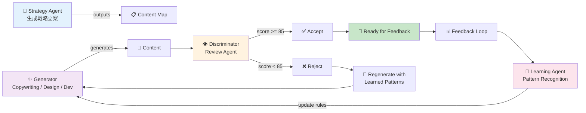

AI Agency は 11 のサブコマンドで制御されます。本セクションでは各コマンドの詳細と実例を提供します。

## コマンド一覧

| # | コマンド | 説明 | 所要時間 |
|---|---------|------|---------|
| 1 | `agency init` | 新規プロジェクト初期化 | 2 分 |
| 2 | `agency brief` | ブリーフ作成・編集 | 10 分 |
| 3 | `agency build` | コンテンツ生成・ビルド | 5-15 分 |
| 4 | `agency review` | Review Agent による品質評価 | 2-5 分 |
| 5 | `agency feedback` | フィードバック送信 | 5 分 |
| 6 | `agency learn` | Learning Pipeline 実行 | 5 分 |
| 7 | `agency status` | プロジェクト進化状況確認 | 1 分 |
| 8 | `agency export` | コンテンツ出力（HTML/CSS/JS） | 2 分 |
| 9 | `agency deploy` | 本番環境デプロイ | 3-10 分 |
| 10 | `agency history` | 進化履歴確認 | 1 分 |
| 11 | `agency sync` | Upstream Sync（moai-adk-go） | 5 分 |

## コマンド詳細

### 1. agency init

新規 AI Agency プロジェクトを初期化します。

```bash
agency init --name "TaskFlow LP" \
  --template landing-page \
  --output ./taskflow-lp
```

**オプション**:
- `--name`: プロジェクト名（必須）
- `--template`: テンプレート種別（landing-page, saas-website, marketing-site）
- `--output`: 出力ディレクトリ（デフォルト: `./{project-name}`）
- `--language`: 言語設定（en, ja, es, fr）

**出力**:
```
taskflow-lp/
├── .agency/
│   ├── brief.yaml           # テンプレートブリーフ
│   ├── brand-context.yaml   # デフォルトブランド設定
│   └── config.yaml
├── src/
└── README.md
```

### 2. agency brief

ブリーフを作成・編集します。

```bash
agency brief edit --project ./taskflow-lp
```

このコマンドはエディタを起動し、YAML 形式のブリーフを編集できます。

**ブリーフ構造**:
```yaml
project:
  name: "TaskFlow"
  tagline: "チームのタスク管理を簡単に"

goals:
  - goal: "見込み客からのメール登録 100 件/月"
    metric: "signup_count"
    target: 100
    
  - goal: "プロダクトの複雑さを分かりやすく説明"
    metric: "feature_comprehension"
    target: 85  # % of users understand all features

audience:
  persona: "Small team project managers"
  age_range: "25-45"
  pain_points:
    - 既存ツール（Asana, Monday）は高すぎる
    - セットアップが複雑
    - 学習曲線が急

messaging:
  tone: "approachable, confident, practical"
  primary_benefit: "Simple task management without complexity"
  emojis: true
```

### 3. agency build

ブリーフを基に、Strategy → Create → Review フェーズを実行してコンテンツを生成します。

```bash
agency build --project ./taskflow-lp --parallel
```

**フロー**:
1. **Strategy Phase** - Strategy Agent がコンテンツマップを立案（2-3 分）
2. **Create Phase** - Copywriting / Design / Dev エージェントが並行生成（3-5 分）
3. **Review Phase** - Review Agent が品質チェック（2 分）

**オプション**:
- `--parallel`: Create フェーズを並行実行（デフォルト: true）
- `--skip-review`: Review フェーズをスキップ（テスト用）
- `--output-format`: html, json, markdown（デフォルト: html）

**出力メッセージ**:
```
[Strategy] コンテンツマップ立案中...
[Create] Copywriting Agent 実行中...
[Create] Design Agent 実行中...
[Create] Dev Agent 実行中...
[Review] 品質評価中...
✓ Design Quality Score: 87/100
✓ Brand Consistency: 92/100
✓ UX Compliance: 96/100
✅ Build Complete! Output: ./taskflow-lp/output/
```

### 4. agency review

Review Agent による品質詳細評価を取得します。

```bash
agency review --project ./taskflow-lp --output review-report.json
```

**レポート内容**:
```json
{
  "timestamp": "2026-04-03T14:30:00Z",
  "design_quality": {
    "score": 87,
    "visual_consistency": 90,
    "layout_precision": 84,
    "accessibility": 88,
    "feedback": ["Hero image ratio needs refinement"]
  },
  "brand_consistency": {
    "score": 92,
    "color_usage": 94,
    "typography": 91,
    "tone": 90,
    "messaging": 92
  },
  "ux_compliance": {
    "score": 96,
    "wcag_level": "AA",
    "mobile_responsiveness": 95,
    "cta_clarity": 97,
    "conversion_potential": 94
  }
}
```

### 5. agency feedback

フィードバックを送信し、Learning Pipeline にトリガーをかけます。

```bash
agency feedback --project ./taskflow-lp \
  --component "CTA Button" \
  --suggestion "Start Free Trial" \
  --reason "より具体的で説得力的"
```

**または YAML ファイルで複数フィードバック**:

```bash
agency feedback --project ./taskflow-lp --file feedback.md
```

**feedback.md 形式**:
```markdown
# フィードバック - TaskFlow LP

## 改善提案 1
- コンポーネント: CTA Button
- 改善前: Get Started
- 改善後: Start Free Trial
- 理由: より具体的で、見込み客が「得られる利益」を想像しやすい
- 期待される影響: CTR +15-20%

## 改善提案 2
- コンポーネント: Features Section
- 改善内容: 機能説明の順序を入れ替え。現在：「機能一覧」優先 → 希望：「ユーザーの利益」優先
- 理由: ターゲットペルソナはテック非ネイティブ。利益から入るべき

## ポジティブフィードバック
- コンポーネント: Hero Image
- コメント: このビジュアルスタイルはプロフェッショナルで信頼感がある。他のプロジェクトでも使いたい
```

### 6. agency learn

Learning Pipeline を実行します。フィードバックをパターン分析し、必要に応じてルール化。

```bash
agency learn --project ./taskflow-lp --verbose
```

**オプション**:
- `--verbose`: 詳細ログ出力
- `--threshold`: ルール化判定の信頼度しきい値（デフォルト: 5x）
- `--check-upstream`: Upstream 同期対象を確認（マージ前）

**出力例**:
```
[Learning] フィードバック分析中...
✓ Pattern 1: CTA Button Text Optimization (3 件のフィードバック)
  - Confidence: 3x (Heuristic)
  - Status: Copied to Copywriting Agent
  
✓ Pattern 2: Feature Description Order (5 件のフィードバック)
  - Confidence: 5x (RULE)
  - Status: Rule created
  - Apply to: SaaS product landing pages
  
⏳ Pattern 3: Hero Image Style (2 件のフィードバック)
  - Confidence: 2x (Observation)
  - Status: Monitoring (rule creation at 5x)

[Upstream] 推奨される Upstream Sync:
- rule_id: cta-button-optimization (5x達成)
- target: moai-adk-go/agency-copywriting
- ready_for_pr: Yes
```

### 7. agency status

プロジェクトの進化状況を確認します。

```bash
agency status --project ./taskflow-lp
```

**出力例**:
```
ProjectName: TaskFlow LP
Status: ✅ Active

Phase Progress:
├─ Strategy: Complete (立案日: 2026-03-15)
├─ Create: Complete (生成日: 2026-03-16)
├─ Review: Complete (評価日: 2026-03-17)
└─ Learning: Active (7 フィードバック蓄積)

Evolution Metrics:
├─ Feedback Count: 7
├─ Patterns Detected: 3
├─ Rules Created (5x+): 1
├─ Average Confidence: 4.2x
└─ Estimated Improvement: +18% vs Baseline

Upcoming Milestones:
├─ Next Rule Graduation: Pattern 2 @ 5x (2 件あと)
├─ Upstream Sync Ready: Pattern 1 (check with agency learn)
└─ Estimated Sync Date: 2026-04-10
```

### 8. agency export

最終成果物を HTML / CSS / JavaScript として出力します。

```bash
agency export --project ./taskflow-lp \
  --format html \
  --output ./dist \
  --optimize
```

**オプション**:
- `--format`: html, css, js, json（複数選択可）
- `--output`: 出力ディレクトリ
- `--optimize`: 本番用最適化（画像圧縮、CSS ミニファイ）
- `--include-analytics`: GA / Mixpanel コード埋め込み

**出力構造**:
```
dist/
├── index.html
├── css/
│   ├── main.css
│   └── components.css
├── js/
│   ├── script.js
│   └── cta.js
├── images/
│   ├── hero.webp
│   ├── feature-1.png
│   └── ...
└── sitemap.xml
```

### 9. agency deploy

本番環境にデプロイします。Vercel / Netlify / AWS に対応。

```bash
agency deploy --project ./taskflow-lp \
  --target vercel \
  --domain taskflow.example.com
```

**オプション**:
- `--target`: vercel, netlify, aws, github-pages（デフォルト: vercel）
- `--domain`: カスタムドメイン
- `--analytics`: GA4 トラッキングコード
- `--env`: 環境変数ファイル

**デプロイ前チェック**:
- ✓ Build validation
- ✓ SEO meta check
- ✓ Performance audit
- ✓ Security scan

### 10. agency history

プロジェクトの進化履歴を確認します。

```bash
agency history --project ./taskflow-lp --format timeline
```

**出力**:
```
Timeline: TaskFlow LP Evolution

2026-03-15 [INIT] プロジェクト作成
2026-03-16 [BUILD] v1 生成完了 (Design Quality: 82/100)
2026-03-17 [FEEDBACK] フィードバック 3 件受信
2026-03-19 [IMPROVE] CTA Button リビジョン
2026-03-21 [BUILD] v2 生成完了 (Design Quality: 87/100)
2026-03-25 [FEEDBACK] フィードバック 4 件追加（累計 7 件）
2026-04-01 [LEARN] Learning Pipeline 実行
2026-04-03 [RULE] Pattern 2 がルール化（5x 達成）
2026-04-03 [READY] Upstream Sync 準備完了
```

### 11. agency sync

Learning Pipeline で生成されたルール・パターンを moai-adk-go にアップストリーム同期します。

```bash
agency sync --project ./taskflow-lp --dry-run
```

**ドライラン例**:
```
[Sync] Upstream 同期準備中...

PR Proposal 1:
├─ Title: "feat(agency): Add CTA Button Text Optimization Rule"
├─ Target: moai-adk-go/agency-copywriting
├─ Files: 2 files changed
│  ├─ modules/cta-patterns.md (+45 lines)
│  └─ rules/cta-optimization.yaml (new)
├─ Confidence: 5x
└─ Community Impact: 127 projects

PR Proposal 2:
├─ Title: "feat(agency): Add Feature Description Order Pattern"
├─ Target: moai-adk-go/agency-design-system
├─ Files: 1 file changed
├─ Confidence: 3x (Heuristic, monitoring)
└─ Status: ⏳ Waiting for 2 more confirmations

Ready to sync: 1 PR
Pending: 1 Pattern

Use: agency sync --project ./taskflow-lp --confirm
```

## GAN ループ詳細

GAN（Generative Adversarial Network）ループは AI Agency の中核です：



### Generator（生成）
- Copywriting Agent: テキストコンテンツ
- Design Agent: ビジュアル・レイアウト
- Dev Agent: HTML / CSS / JavaScript

### Discriminator（評価）
- Design Quality Score (0-100)
- Brand Consistency Score (0-100)
- UX Compliance Score (0-100)

### Feedback Loop
- ユーザーフィードバック
- Learning Pipeline
- Rule Creation & Agent Update

## 設定ファイルリファレンス

### brand-context.yaml

```yaml
brand:
  name: "TaskFlow"
  tagline: "Simple task management"
  
colors:
  primary: "#2563EB"
  secondary: "#F59E0B"
  neutral: "#6B7280"
  
typography:
  heading_font: "Inter"
  body_font: "Inter"
  
voice:
  tone: "approachable, confident"
  avoid: "jargon, overly technical"
  
assets:
  logo: "./assets/logo.svg"
  favicon: "./assets/favicon.ico"
```

### config.yaml

```yaml
project:
  name: "TaskFlow LP"
  type: "landing-page"
  language: "ja"
  
agents:
  strategy:
    model: sonnet
    temperature: 0.7
  copywriting:
    model: sonnet
    tone_override: null
  design:
    model: sonnet
    wcag_level: "AA"
  dev:
    model: sonnet
    framework: "next.js"
  review:
    thresholds:
      design_quality: 85
      brand_consistency: 90
      ux_compliance: 95
      
learning:
  graduation_threshold: 5  # 5x confidence
  auto_upstream_sync: true
  
deployment:
  target: "vercel"
  domain: "taskflow.example.com"
```

## 次のステップ

- [エージェント & スキル](agents-and-skills) - 各エージェントの詳細動作
- [自己進化システム](self-evolution) - Learning Pipeline と Knowledge Graduation Protocol
