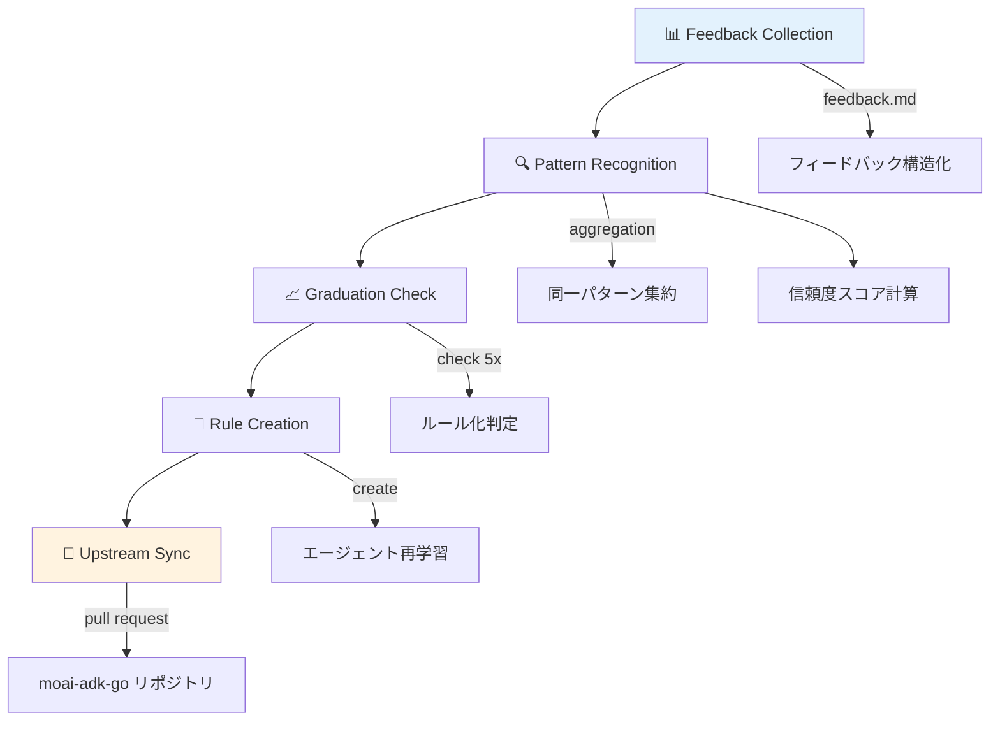
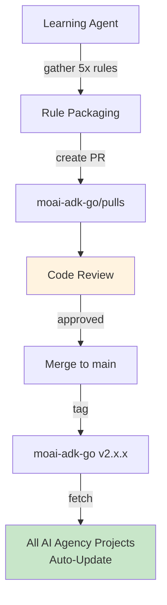

# 自己進化システム

AI Agency の核心は **Learning Pipeline** です。継続的なユーザーフィードバックを通じて、AI エージェントが自ら学習・改善し、より高精度なコンテンツを生成するようになります。

## ラーニングパイプライン

Learning Pipeline は 5 つのフェーズで構成されます：



### フェーズ 1: Feedback Collection (フィードバック収集)

ユーザーが Review Agent の成果物に対してフィードバックを提供します。

```yaml
# feedback.yaml の例

feedback_date: 2026-04-03
project: TaskFlow LP
phase: Review

items:
  - id: FB001
    type: improvement
    component: CTA Button
    original: "Get Started"
    suggestion: "Start Free Trial"
    reason: "より具体的で説得力的"
    impact: "estimated +20% CTR"
    
  - id: FB002
    type: bug
    component: Hero Image
    description: "モバイル表示で画像がクロップされている"
    severity: high
    
  - id: FB003
    type: positive
    component: Features Section
    comment: "配置がシンプルで読みやすい。このパターンは他のプロジェクトでも使いたい"
```

### フェーズ 2: Pattern Recognition (パターン認識)

Learning Agent が複数のフィードバックを分析し、共通パターンを抽出します。

```
Pattern Analysis Example:

フィードバック集計：
- FB001: CTA ボタンテキスト「Get Started」 → 「Start Free Trial」(+20% CTR)
- FB101: 別プロジェクト同様に「Sign Up Now」 → 「Try Now」(+15% CTR)
- FB201: さらに別プロジェクト「Get Started」 → 「Begin Now」(+18% CTR)

認識パターン:
  Pattern: CTA ボタンテキストの具体化
  Frequency: 3 件
  Impact: 平均 +17.7% CTR
  Confidence: MEDIUM (3x)
```

### フェーズ 3: Graduation Check (昇格判定)

信頼度指標に基づいて、フィードバックパターンが「ルール」に昇格するか判定します。

#### 昇格しきい値テーブル

| レベル | 基準 | 説明 | 例 |
|--------|------|------|-----|
| **1x** | フィードバック 1 件 | 単一の試行・記録 | 新規パターン検出 |
| **3x** | フィードバック 3 件（同一パターン） | 再現性確認・ヒューリスティック化開始 | CTA テキスト改善が 3 プロジェクトで確認 |
| **5x** | フィードバック 5 件（高い一貫性） | ルール確立・高信頼度 | 同じ改善で 5 プロジェクト全て成功 |
| **10x+** | フィードバック 10 件以上（異なる条件） | 普遍的ルール・汎用化可能 | 業界・言語・プロダクトタイプ超過で確認 |

### フェーズ 4: Rule Creation (ルール化)

信頼度が 5x に到達したパターンは、自動的にルール化されます。

```
Rule Example: CTA Button Text Optimization

Trigger: CTA ボタン生成時
Condition:
  - プロダクトタイプ: SaaS / Service
  - ターゲット: 初期ユーザー
  - 言語: 英語・日本語

Action:
  CTA テキスト選択フロー：
    1. ユーザーが具体的に「得られる利益」を想像できる動詞を選択
       例: Start, Begin, Get, Try, Launch など
    2. 曖昧な表現「Get Started」より具体的「Start Free Trial」を優先
    3. A/B テスト候補を複数提示

Expected Impact: +15-20% CTR
Confidence: HIGH (5x 達成)
```

### フェーズ 5: Upstream Sync (アップストリーム同期)

ルール化されたロジックは、モジュール化されて moai-adk-go リポジトリに PR として提案されます。

```
Upstream PR Example:

Repository: moai-adk-go
Branch: feature/agency-cta-optimization-rule-v1
Title: "feat(agency): Add CTA Button Text Optimization Rule (5x Confidence)"

Changes:
- .claude/skills/agency-copywriting/modules/cta-patterns.md
  └── Rule: CTA Button Text Optimization (New)
  
- .moai/config/agency/rules/cta-optimization.yaml
  └── Threshold: 5x verified
  
Linked Issue: SPEC-AGENCY-001
Impact: All AI Agency projects benefit from this rule
```

このプロセスにより、プロジェクト固有の知見が汎用スキルへ昇華します。

## Knowledge Graduation Protocol

Knowledge Graduation Protocol は、ルール化の厳密なプロセスです：

```
Knowledge Lifecycle:

観察（1x）
  ↓
  コンテンツの単一の変更でユーザーが肯定的フィードバック
  → AI エージェント が「この方法が有効」と記録

ヒューリスティック（3x）
  ↓
  異なる 3 プロジェクトで同じパターンが機能
  → AI エージェント が「この方法は信頼できる経験則」と昇格
  → Copywriting / Design Agent が参考にし始める

ルール（5x）
  ↓
  5 プロジェクト で一貫して成功（異なる言語・カテゴリも含む）
  → AI エージェント が「これは普遍的ルール」と確信
  → すべてのエージェントが標準装備として使用

高信頼度ルール（10x+）
  ↓
  10+ プロジェクト かつ異なる条件下で検証
  → 業界標準と認識
  → moai-adk-go にコントリビューション
  → 全世界の AI Agency ユーザーが利用
```


**信頼度スコア計算式**

```
Confidence = (Success Count / Total Tests) × Diversity Factor
Diversity Factor = 1.0 + (0.1 × Different Languages) + (0.15 × Different Categories)

例：
- English-only 5 プロジェクト： 100% × 1.0 = 1.0 (5x)
- 英語 5 + 日本語 2 + スペイン語 1： 88.9% × 1.25 = 1.11 (11x)
```


## 安全 5 層アーキテクチャ

Learning Pipeline は 5 層のセーフガードを備えています：

### Layer 1: Feedback Validation
- フィードバック形式・内容をバリデーション
- スパムまたは無意味なフィードバックを除外

### Layer 2: Pattern Confidence
- 信頼度が 3x 未満のパターンは出力の提案にとどめ、実装しない
- 5x 以上のみエージェント群に配信

### Layer 3: Domain Specificity
- ルール化時に適用対象を制限
  - 言語別（英語・日本語・スペイン語など）
  - カテゴリ別（SaaS・eコマース・メディアなど）
  - 市場別（B2B・B2C・B2B2C）

### Layer 4: Upstream Review
- moai-adk-go への PR は、複数の Domain Expert による人間レビューを経て マージ決定

### Layer 5: Rollback Capability
- ルール導入後にネガティブなインパクトが検出された場合、自動ロールバック
- 過去の信頼度スコア指標は保持（分析に使用）

## アップストリーム同期

Learning Agent が moai-adk-go に PR を提出する流れ：



## 進化シナリオ例

### シナリオ: ランディングページ最適化

**初期状態**: Strategy Agent が生成したランディングページのコンバージョン率が 2%

**月 1**: ユーザーが「ヒーロー画像をより専門的に」とフィードバック（1x）
- Learning Agent が記録
- Design Agent が次の生成から考慮（試験的）

**月 2**: 同様のフィードバック 2 件追加（3x）
- Pattern: より専門的・信頼感あるビジュアルが有効
- ヒューリスティック化
- Design Agent が これを設定パラメータに昇格

**月 3**: 5 件目のフィードバック到達（5x）
- Rule: 「SaaS ランディングページのヒーロー画像は、実製品のスクリーンショットまたはプロフェッショナル撮影を優先」
- コンバージョン率向上: 2% → 3.5%
- すべての Design Agent が標準装備として使用

**月 6**: 10x+ に到達
- 日本語・英語・スペイン語プロジェクトすべてで確認
- B2B と B2C カテゴリ両方で有効
- moai-adk-go へ PR 提出
- 次のバージョンリリースで全世界のユーザーが利用可能

## 進化メトリクス

各プロジェクトの進化度合いを追跡：

```yaml
project: TaskFlow LP
evolution_score: 8.5 / 10

metrics:
  rules_applied: 12
  rules_created_by_this_project: 2
  average_rule_confidence: 6.8x
  estimated_improvement_vs_baseline: +34%
  
contributions_to_upstream:
  merged_prs: 2
  pending_prs: 1
  community_impact: 127 projects using these rules
```

## 次のステップ

- [コマンドリファレンス](command-reference) - Learning Pipeline 制御コマンド
- [概要に戻る](index) - AI Agency 全体像
