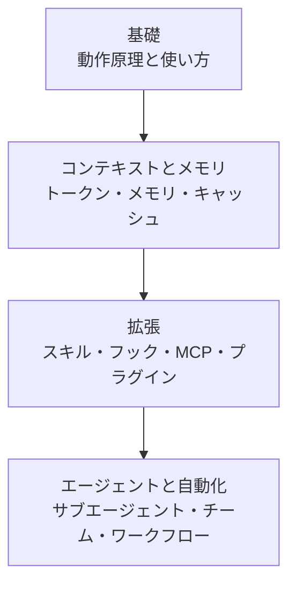

このセクションは、Anthropic のターミナル CLI である Claude Code を基礎から理解するための学習パスです。Claude Code に触れたばかりの開発者、そして MoAI-ADK の動作基盤を正確に把握したい方のための案内書です。

Claude Code はターミナル上で実行されるコーディングエージェントで、コードを読み取り、修正し、コマンドを実行しながら、開発者との対話を通じて作業します。MoAI-ADK はこの Claude Code の上で動作するオーケストレーション層であり、SPEC ベースのワークフローと専門エージェントへの委譲を追加します。したがって、MoAI-ADK を十分に活用するには、まずその土台となるプラットフォーム (Claude Code 自体) を理解することが重要です。


**ひとことで言うと**: このセクションは、ツール (プラットフォーム) である Claude Code 自体を習得する段階です。MoAI 固有の活用法は、コアコンセプトおよび応用学習のセクションで続きます。


## 学習の流れ

まず基礎グループで Claude Code の動作原理を習得し、コンテキストとメモリの管理で長期セッションの要点を固めます。その後、拡張で機能を広げ、最後にエージェントと自動化で自律実行まで進みます。

## 目次

| ドキュメント | 説明 |
|------|------|
| [基礎](/claude-code/foundations) | Claude Code の動作原理と基本的な使い方 |
| [コンテキストとメモリ](/claude-code/context-memory) | トークン・コンテキスト・メモリ・キャッシュ・チェックポイントの管理 |
| [拡張](/claude-code/extensibility) | スキル・フック・MCP・プラグインによる機能拡張 |
| [エージェントと自動化](/claude-code/agentic) | サブエージェント・チーム・ワークフロー・自律実行 |

4 つのグループを順番に終えると、Claude Code プラットフォーム全体を理解できるようになります。その次は、MoAI-ADK のコアコンセプトのセクションに移り、この土台の上でどのように SPEC ベースの開発を行うのかを確認してください。
