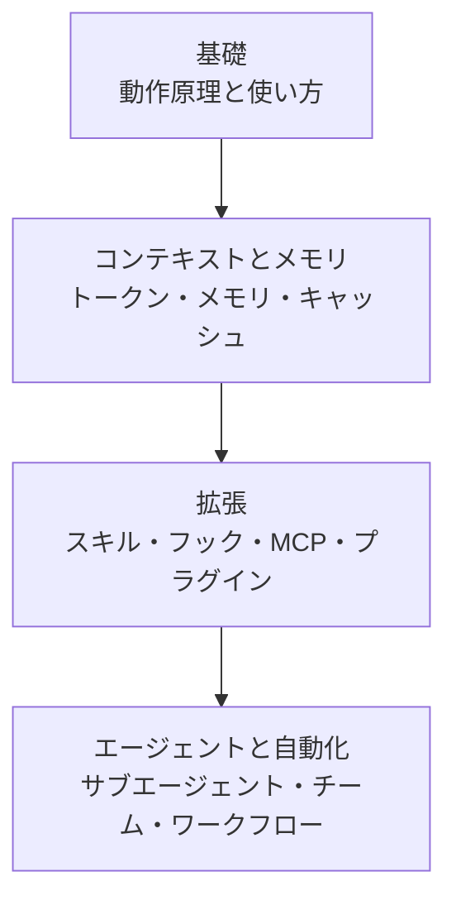

このセクションは、Anthropic のターミナル CLI である Claude Code を基礎から理解するための学習パスです。Claude Code に触れたばかりの開発者、そして MoAI-ADK の動作基盤を正確に把握したい方のための案内書です。

Claude Code はターミナル上で実行されるコーディングエージェントで、コードを読み取り、修正し、コマンドを実行しながら、開発者との対話を通じて作業します。MoAI-ADK はこの Claude Code の上で動作するオーケストレーション層であり、3 つのコアバリュー — **トークノミクス** (Token Economics)、**エージェンティックループエンジニアリング** (再帰的な自己学習)、**エージェンティックハーネス** (Agentic Harness) — はすべて、このセクションで扱う Claude Code の基本メカニズムの上に築かれています。コンテキストウィンドウとプロンプトキャッシュを知らなければトークノミクスは設計できず、サブエージェントと `/goal` を知らなければエージェンティックループは理解できず、スキル・フック・MCP を知らなければハーネスは作れません。


**ひとことで言うと**: このセクションは、ツール (プラットフォーム) である Claude Code 自体を習得する段階です。MoAI-ADK がこの土台の上に三本柱をどう立てるのかは、コアコンセプトおよび応用学習のセクションで続きます。


## 学習の流れ

```mermaid
flowchart TD
    A[基礎<br/>動作原理と使い方] --> B[コンテキストとメモリ<br/>トークン・メモリ・キャッシュ]
    B --> C[拡張<br/>スキル・フック・MCP・プラグイン]
    C --> D[エージェントと自動化<br/>サブエージェント・チーム・ワークフロー]
```

まず基礎グループで Claude Code のエージェンティックループがどう回るのかを習得し、コンテキストとメモリの管理でトークン経済の基本を固めます。その後、拡張でハーネスの素材を揃え、最後にエージェントと自動化で自律実行ループまで進みます。

## 目次 — 4 グループと三本柱の対応

| ドキュメント | 説明 | つながる MoAI の柱 |
|------|------|--------------------|
| [基礎](/claude-code/foundations) | Claude Code の動作原理と基本的な使い方 | 三本柱の共通土台 |
| [コンテキストとメモリ](/claude-code/context-memory) | トークン・コンテキスト・メモリ・キャッシュ・チェックポイントの管理 | トークノミクス |
| [拡張](/claude-code/extensibility) | スキル・フック・MCP・プラグインによる機能拡張 | エージェンティックハーネス |
| [エージェントと自動化](/claude-code/agentic) | サブエージェント・チーム・ワークフロー・自律実行 | エージェンティックループエンジニアリング |

4 つのグループを順番に終えると、Claude Code プラットフォーム全体を理解できるようになります。その次は、MoAI-ADK のコアコンセプトのセクションに移り、この土台の上で SPEC ベースの開発とトークン効率設計がどのように結び付くのかを確認してください。
