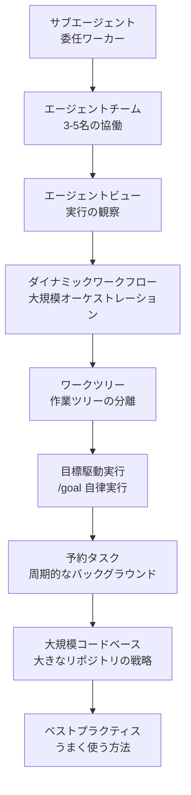

このグループでは、Claude Code のエージェントオーケストレーションと自律実行を扱います。単一の対話を超えて複数のワーカーに委任し、チームで協働し、スクリプトで大規模な作業を展開する方法を学びたい開発者向けの内容です。

サブエージェント・エージェントチーム・ダイナミックワークフローという3つのオーケストレーションプリミティブを中心に、ワークツリー分離・目標駆動実行・予約タスク・大規模コードベース探索・ベストプラクティスまで順を追って解説します。


**ひとことで言うと**: どの作業を誰（サブエージェント・チーム・ワークフロー）が実行するかを選んだ上で、ワークツリーと目標・予約・規模の戦略によって自律実行を安定して運用する方法を身につけます。


## 学習の流れ

3つのオーケストレーションプリミティブ（サブエージェント → エージェントチーム → ダイナミックワークフロー）をまず理解した上で、ワークツリーと目標・予約・規模の戦略へ拡張し、最後にベストプラクティスで締めくくる順序をおすすめします。

## 目次

| ドキュメント | 説明 |
|------|------|
| [サブエージェント](/claude-code/agentic/sub-agents) | 隔離されたコンテキストの委任ワーカー |
| [エージェントチーム](/claude-code/agentic/agent-teams) | 3-5名のチーム協働 |
| [エージェントビュー](/claude-code/agentic/agent-view) | 実行を観察する画面 |
| [ダイナミックワークフロー](/claude-code/agentic/workflows) | スクリプトベースの大規模オーケストレーション |
| [ワークツリー](/claude-code/agentic/worktrees) | 作業ツリーの分離 |
| [目標駆動実行 (/goal)](/claude-code/agentic/goal) | 条件を満たすまでの自律実行 |
| [予約タスク](/claude-code/agentic/scheduled-tasks) | 周期的なバックグラウンド実行 |
| [大規模コードベース](/claude-code/agentic/large-codebases) | 大きなリポジトリの探索戦略 |
| [ベストプラクティス](/claude-code/agentic/best-practices) | Claude Code をうまく使う方法 |

まず [サブエージェント](/claude-code/agentic/sub-agents) から読んで委任の基本単位を身につけた上で、次のドキュメントへ進んでください。
