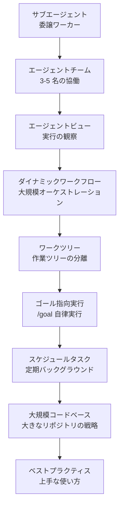

このグループは、Claude Code のエージェントオーケストレーションと自律実行を扱います。単一の会話を超えて複数のワーカーへ委譲し、チームで協働し、スクリプトで大規模な作業を展開する方法を学びたい開発者向けの内容です。

サブエージェント・エージェントチーム・ダイナミックワークフローという 3 つのオーケストレーション基本要素を中心に、ワークツリー分離・ゴール指向実行・スケジュールタスク・大規模コードベース探索・ベストプラクティスへと順に進みます。MoAI-ADK の言う **エージェンティックループエンジニアリング** — 人が毎ターン介入する代わりにループ自体を設計し、ループが残した観察でハーネスを学習させること — は、まさにこのグループのメカニズム (`/goal` の条件評価ループ、サブエージェント委譲、ワークフローのファンアウト) の上に築かれています。




**ひとことで言うと**: どの作業を誰が (サブエージェント・チーム・ワークフロー) 実行するかを選んだうえで、ワークツリーとゴール・スケジュール・スケール戦略により、自律実行ループを安定的に運用する方法を身につけます。


## 学習の流れ

```mermaid
flowchart TD
    A[サブエージェント<br>委譲ワーカー] --> B[エージェントチーム<br>3-5 名の協働]
    B --> C[エージェントビュー<br>実行の観察]
    C --> D[ダイナミックワークフロー<br>大規模オーケストレーション]
    D --> E[ワークツリー<br>作業ツリーの分離]
    E --> F[ゴール指向実行<br>/goal 自律実行]
    F --> G[スケジュールタスク<br>定期バックグラウンド]
    G --> H[大規模コードベース<br>大きなリポジトリの戦略]
    H --> I[ベストプラクティス<br>上手な使い方]
```

3 つのオーケストレーション基本要素 (サブエージェント → エージェントチーム → ダイナミックワークフロー) をまず理解したうえで、ワークツリーとゴール・スケジュール・スケール戦略へ拡張し、最後にベストプラクティスで締めくくる順序を推奨します。

## 目次

| ドキュメント | 説明 |
|------|------|
| [サブエージェント](/claude-code/agentic/sub-agents) | 分離コンテキストの委譲ワーカー |
| [エージェントチーム](/claude-code/agentic/agent-teams) | 3-5 名のチーム協働 |
| [エージェントビュー](/claude-code/agentic/agent-view) | 実行を観察する画面 |
| [ダイナミックワークフロー](/claude-code/agentic/workflows) | スクリプトベースの大規模オーケストレーション |
| [ワークツリー](/claude-code/agentic/worktrees) | 作業ツリーの分離 |
| [ゴール指向実行 (/goal)](/claude-code/agentic/goal) | 条件充足まで自律実行 |
| [スケジュールタスク](/claude-code/agentic/scheduled-tasks) | 定期的なバックグラウンド実行 |
| [大規模コードベース](/claude-code/agentic/large-codebases) | 大きなリポジトリの探索戦略 |
| [ベストプラクティス](/claude-code/agentic/best-practices) | Claude Code を上手に使う方法 |

まず [サブエージェント](/claude-code/agentic/sub-agents) から読み、委譲の基本単位を理解してから次のドキュメントへ進んでください。
