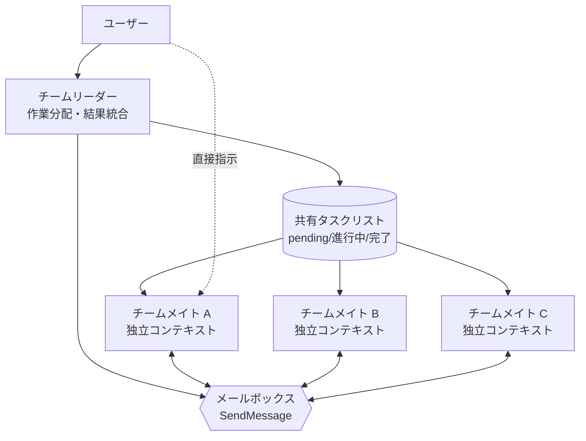

エージェントチーム (Agent Teams) は、複数の Claude Code セッションを 1 つのチームにまとめ、共有タスクリストと相互メッセージングによって協働させる実験的な機能です。


**ひとことで言うと**: サブエージェントがリーダーにのみ報告する一方向の働き手なら、エージェントチームは互いに会話し、作業を直接引き取り、検証まで交わし合う仲間の集まりです。


## エージェントチームとは

エージェントチームは、複数の Claude Code インスタンスが一緒に働くよう調整する構造です。あるセッションが **チームリーダー (team lead)** となって作業を分配し結果をまとめ、残りの **チームメイト (teammate)** はそれぞれ独立したコンテキストウィンドウで作業しながら、互いに直接通信します。

サブエージェントとの決定的な違いは通信の方向です。サブエージェントはメインエージェントにのみ結果を報告し、互いに会話できませんが、エージェントチームのチームメイトは共有タスクリストを見て自ら作業を引き取り、チームメイト同士で直接メッセージをやり取りします。リーダーを経由せず、ユーザーが特定のチームメイトに直接指示することもできます。

エージェントチームは、**並列探索** が実質的な価値をもたらす作業で最も強力です。

| 適した作業 | 理由 |
| --- | --- |
| リサーチ / レビュー | 複数のチームメイトが異なる側面を同時に調査し、発見を相互検証 |
| 新規モジュール / 機能 | チームメイトごとに別領域を所有し、衝突なく並列作業 |
| 競合仮説のデバッグ | 異なる理論を並列検証し、より速く収束 |
| レイヤー横断作業 | フロントエンド / バックエンド / テストをチームメイトごとに分担 |

逆に、順次的な作業、同じファイルを一緒に修正する作業、依存関係が多い作業は、単一セッションやサブエージェントの方が効率的です。エージェントチームは調整コストとトークン使用量が単一セッションより大きく増えます。

## サブエージェント vs エージェントチーム

|  | サブエージェント | エージェントチーム |
| --- | --- | --- |
| **コンテキスト** | 自身のコンテキストウィンドウ、結果は呼び出し元に返す | 自身のコンテキストウィンドウ、完全に独立 |
| **通信** | メインエージェントにのみ結果を報告 | チームメイト同士で直接メッセージ交換 |
| **調整** | メインエージェントがすべての作業を管理 | 共有タスクリストに基づく自律調整 |
| **適した用途** | 結果だけが必要な集中作業 | 議論と協働が必要な複合作業 |
| **トークンコスト** | 低い (結果をメインコンテキストへ要約) | 高い (チームメイトごとに別 Claude インスタンス) |

速く集中した働き手が報告だけすればよい場合はサブエージェントを、チームメイトが発見を共有し互いを検証して自律的に調整する必要がある場合はエージェントチームを選びます。

## 推奨規模: 3 〜 5 名

チームメイト数に強制的な上限はありませんが、現実的な制約があります。

- **トークンコストは線形に増加** します。チームメイトごとに独立したコンテキストウィンドウを持ち、トークンを別々に消費します。
- チームメイトが増えるほど **通信と調整の負担** が大きくなり、衝突の可能性も増えます。
- 一定数を超えると **収穫逓減** が発生します。追加のチームメイトが作業速度を比例して高めてはくれません。

公式ガイドは、ほとんどのワークフローで **3 〜 5 名** から始めることを推奨しています。チームメイトあたり 5 〜 6 個の作業 (task) を割り当てると、過度なコンテキストスイッチなしに全員を忙しく保てます。たとえば独立した 15 個の作業があるなら、3 名が良い出発点です。集中した 3 名が散らばった 5 名より良い結果を出すことが少なくありません。

## 協働メカニズム

エージェントチームは 4 つの構成要素で動作します。

| 構成要素 | 役割 |
| --- | --- |
| **チームリーダー (team lead)** | チームを作成しチームメイトをスポーンして作業を調整するメインセッション |
| **チームメイト (teammate)** | 割り当てられた作業を実行する独立した Claude Code インスタンス |
| **タスクリスト (Task list)** | チームメイトが引き取って完了する共有タスクリスト |
| **メールボックス (Mailbox)** | エージェント間通信を担うメッセージングシステム |

### 共有タスクリストと SendMessage

作業は `pending`、`in progress`、`completed` の 3 つの状態を持ち、作業間の依存関係も設定できます。依存が解消されていない `pending` 作業は、先行作業が完了するまで引き取れません。あるチームメイトが先行作業を完了すると、依存していた作業が自動的にロック解除されます。

作業の分配は 2 通りの方法で行われます。

- **リーダー割り当て**: リーダーが特定の作業を特定のチームメイトに明示的に割り当てます。
- **自律クレーム (self-claim)**: チームメイトが作業を終えると、割り当てられておらずブロックされていない次の作業を自ら引き取ります。

作業のクレームは **ファイルロック (file locking)** を使い、複数のチームメイトが同時に同じ作業を引き取ろうとしたときに発生する競合状態を防ぎます。チームメイト間の通信は `SendMessage` で行われ、送られたメッセージは受信者へ自動的に届けられます。リーダーがポーリングする必要なくメッセージが到着し、チームメイトが作業を終えて停止すると自動的にリーダーへ通知します。

### ファイル所有権

2 名のチームメイトが同じファイルを編集すると上書きが発生します。したがって各チームメイトが **異なるファイル集合を所有** するよう作業を分割することが重要なベストプラクティスです。新規モジュールやレイヤー横断作業のように領域が自然に分かれる場合に、エージェントチームが特によく動作する理由でもあります。

### 協働構造



リーダーはタスクリストを通じて作業を分配し、チームメイトはメールボックスで互いに直接会話し、ユーザーはリーダーを経由せず個別のチームメイトにも指示できます。

## 有効化の要件 (v2.1.178+)

エージェントチームは **実験的な機能であり、デフォルトで無効化** されています。Claude Code v2.1.178 以上が必要で、環境変数 `CLAUDE_CODE_EXPERIMENTAL_AGENT_TEAMS` を `1` に設定して有効化します。

### v2.1.178 の変化

- **Implicit Teams**: チーム生成がより簡単になりました。リーダーが最初のチームメイトをスポーンすると自動的にチームが形成され、セッション終了時に自動的に整理されます。
- **TeamCreate/TeamDelete 削除**: v2.1.178 からこれらのコマンドは廃止されました (手動でチームを生成・削除する必要がなくなりました)。
- **`team_name` accepted-but-ignored**: Hook ペイロードで `team_name` フィールドは引き続き含まれていますが、実際には無視されます (レガシー互換性のため)。

シェル環境に直接指定するか、`settings.json` に登録します。

```json
{
  "env": {
    "CLAUDE_CODE_EXPERIMENTAL_AGENT_TEAMS": "1"
  }
}
```

有効化後は、自然言語でチーム作成を依頼すればよいだけです。Claude がチームを作り、チームメイトをスポーンしてから作業を調整します。

```text
TODO コメントをコードベース全体で追跡する CLI ツールを設計中です。
異なる観点から探索するエージェントチームを作ってください。
1 人は UX、1 人は技術アーキテクチャ、1 人は批判者の役割で。
```

## 表示モードとチームメンバーのモデル

エージェントチームは 2 つの表示モードをサポートします。

| モード | 特徴 | 必要条件 |
|------|------|---------|
| **インプロセス (in-process)** | すべてのチームメイトがメインターミナル内で動作 | 追加設定なし (デフォルト) |
| **分割ペイン (split panes)** | チームメイトごとに別のウィンドウを表示 | tmux または iTerm2 が必要 (v2.1.186+) |

デフォルトは **in-process** (v2.1.179 以降、以前は `"auto"`) なので、どこでも追加設定なしで使えます。分割ペインモードを強制したい場合は:

```json
{
  "teammateMode": "in-process"
}
```

上記の値を希望するモードに変更するか、単一セッション限定で `--teammate-mode in-process` フラグで強制できます。

チームメイトはデフォルトでリーダーの `/model` 選択を継承しません。プロンプトでモデルを指定しなかった場合に使うモデルは、`/config` の **Default teammate model** で設定します。

## 品質ゲート hook

[hook](/claude-code/extensibility/hooks) を使うと、チームメイトが作業を終えたとき、または作業が作成・完了されるときにルールを強制できます。

| hook イベント | 発動タイミング | 終了コード 2 の意味 |
| --- | --- | --- |
| `TeammateIdle` | チームメイトがアイドル状態へ遷移する直前 | フィードバックを送り、作業を継続させる |
| `TaskCreated` | 作業が作成されようとするとき | 作成を阻止しフィードバックを送信 |
| `TaskCompleted` | 作業が完了処理されようとするとき | 完了を阻止しフィードバックを送信 |

## 知っておくべき制限

エージェントチームは実験的な機能なので、次の制限を認識して使います。

- **セッション再開は未対応**: `/resume` と `/rewind` はインプロセスのチームメイトを復元できません。再開後はリーダーに新しいチームメイトをスポーンするよう指示します。
- **作業状態の遅延**: チームメイトが作業の完了表示を見落とし、依存作業がブロックされることがあります。
- **一度に 1 チーム**: リーダーは 1 つのチームのみ管理します。新しいチームを作る前に現在のチームを整理する必要があります。
- **ネストチーム不可**: チームメイトは自身のチームやチームメイトをスポーンできません。チーム管理はリーダーのみ可能です。
- **リーダー固定**: チームを作ったセッションが寿命の間リーダーであり、リーダーシップを移譲できません。

チームの整理は常にリーダーを通じて行います。作業が終わったらリーダーに整理を依頼しますが、実行中のチームメイトが残っていると整理が失敗するため、先に終了させる必要があります。

## MoAI CG モードとの連携

MoAI-ADK はエージェントチームの上に **CG モード (Claude + GLM)** を重ねてコストを最適化します。リーダーは Claude でワークフローを調整し、チームメイトは tmux セッション単位の環境隔離を通じて GLM 環境を継承して実装作業を行う方式です。実装中心の SPEC、コード生成、テスト作成のようにトークン消費が大きい作業でコストを大幅に削減できます。

CG モードの設定と運用方法は別ドキュメントで詳しく扱うため、下記のリンクを参照します。

## 関連ドキュメント

- [ダイナミックワークフロー](/claude-code/agentic/workflows)
- [CG モード (Claude + GLM)](/multi-llm/cg-mode)

## 参考資料

- [Claude Code Docs — Orchestrate teams of Claude Code sessions](https://code.claude.com/docs/en/agent-teams)


エージェントチームが初めてなら、コードを書かない作業から始めましょう。PR レビュー、ライブラリリサーチ、バグ調査のように境界が明確な作業は、並列実装の調整負担なしに並列探索の価値をすぐに体感させてくれます。

