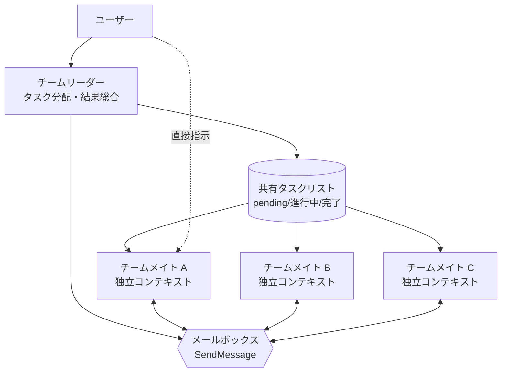

# エージェントチーム

エージェントチーム (Agent Teams) は、複数の Claude Code セッションを 1 つのチームに束ね、共有タスクリストと相互メッセージングで協働させる実験的機能です。


**ひとことで言うと**: サブエージェントがリーダーにだけ報告する一方向のワーカーだとすれば、エージェントチームは互いに会話し、タスクを自ら取りに行き、検証までやり取りする同僚集団です。


## エージェントチームとは

エージェントチームは、複数の Claude Code インスタンスが一緒に働くよう調律する構造です。1 つのセッションが **チームリーダー** (team lead) となってタスクを分配し結果を総合し、残りの **チームメイト** (teammate) はそれぞれ独立したコンテキストウィンドウで働きながら、互いに直接通信します。

サブエージェントとの決定的な違いは通信の方向です。サブエージェントはメインエージェントにだけ結果を報告し互いに会話できませんが、エージェントチームのチームメイトは共有タスクリストを見て仕事を自ら取りに行き、チームメイト同士で直接メッセージをやり取りします。リーダーを介さず、ユーザーが特定のチームメイトへ直接指示することもできます。

エージェントチームは、**並列探索** が実質的な価値を加える作業で最も強力です。

| 適した作業 | 理由 |
| --- | --- |
| リサーチ / レビュー | 複数のチームメイトが異なる側面を同時に調査し、発見を相互検証 |
| 新規モジュール / 機能 | チームメイトごとに別の領域を所有し、衝突なく並行作業 |
| 競合仮説のデバッグ | 異なる理論を並行検証し、より早く収束 |
| レイヤー横断作業 | フロントエンド / バックエンド / テストをチームメイト別に分担 |

逆に、逐次的な作業、同じファイルを一緒に直す作業、依存関係の多い作業は、単一セッションやサブエージェントのほうが効率的です。エージェントチームは、調律コストとトークン使用量が単一セッションより大きく増えます。

## サブエージェント vs エージェントチーム

|  | サブエージェント | エージェントチーム |
| --- | --- | --- |
| **コンテキスト** | 自前のコンテキストウィンドウ、結果は呼び出し元へ返す | 自前のコンテキストウィンドウ、完全に独立 |
| **通信** | メインエージェントにのみ結果を報告 | チームメイト同士で直接メッセージ交換 |
| **調律** | メインエージェントがすべてのタスクを管理 | 共有タスクリストに基づく自律調律 |
| **適した用途** | 結果だけが必要な集中作業 | 議論と協働が必要な複合作業 |
| **トークンコスト** | 低い (結果をメインコンテキストへ要約) | 高い (チームメイトごとに別の Claude インスタンス) |

速く集中したワーカーが報告だけすればよい場合はサブエージェントを、チームメイトが発見を共有し互いを検証し自律的に調律すべき場合はエージェントチームを選びます。

## 推奨規模: 3-5 名

チームメイト数に強制的な上限はありませんが、現実的な制約があります。

- **トークンコストは線形に増加** します。チームメイトごとに独立したコンテキストウィンドウを持ち、トークンを別々に消費します。
- チームメイトが増えるほど **通信と調律の負担** が大きくなり、衝突の可能性も増えます。
- 一定数を超えると **収穫逓減** が発生します。追加のチームメイトが作業速度を比例して高めてはくれません。

公式ガイドは、ほとんどのワークフローで **3-5 名** から始めることを推奨しています。チームメイトあたり 5-6 個のタスク (task) を割り当てれば、過度なコンテキスト切り替えなしに全員を稼働させ続けられます。たとえば独立した 15 個のタスクがあるなら 3 名が良い出発点です。集中した 3 名のほうが散らばった 5 名より良い結果を出すことが多いのです。

## 協働のメカニズム

エージェントチームは 4 つの構成要素で動作します。

| 構成要素 | 役割 |
| --- | --- |
| **チームリーダー** (team lead) | チームを作成しチームメイトをスポーンし、タスクを調律するメインセッション |
| **チームメイト** (teammate) | 割り当てられたタスクを遂行する独立した Claude Code インスタンス |
| **タスクリスト** (Task list) | チームメイトが取りに行き完了する共有タスクリスト |
| **メールボックス** (Mailbox) | エージェント間の通信を担うメッセージングシステム |

### 共有タスクリストと SendMessage

タスクは `pending`、`in progress`、`completed` の 3 つの状態を持ち、タスク間の依存関係も設定できます。依存関係が解消されていない `pending` タスクは、先行タスクが完了するまで取りに行けません。あるチームメイトが先行タスクを完了すると、依存していたタスクが自動的にロック解除されます。

タスクの分配は 2 つの方式で行われます。

- **リーダー割り当て**: リーダーが特定のタスクを特定のチームメイトへ明示的にアサインします。
- **自律クレーム (self-claim)**: チームメイトがタスクを終えると、未割り当てでブロックされていない次のタスクを自ら取りに行きます。

タスクのクレームは **ファイルロック** (file locking) を使い、複数のチームメイトが同時に同じタスクを取ろうとしたときの競合状態を防ぎます。チームメイト間の通信は `SendMessage` で行われ、送ったメッセージは受信者へ自動的に届きます。リーダーがポーリングする必要なくメッセージが到着し、チームメイトが作業を終えて止まると自動的にリーダーへ知らせます。

### ファイル所有権

2 人のチームメイトが同じファイルを編集すると上書きが発生します。したがって各チームメイトが **互いに異なるファイル集合を所有** するようタスクを分割することが、中核のベストプラクティスです。新規モジュールやレイヤー横断作業のように領域が自然に分かれる場合に、エージェントチームが特にうまく機能する理由でもあります。

### 協働の構造


```mermaid
flowchart TD
    User[ユーザー] --> Lead[チームリーダー<br/>タスク分配・結果総合]
    Lead --> TaskList[(共有タスクリスト<br/>pending/進行中/完了)]
    Lead --> Mailbox{{メールボックス<br/>SendMessage}}
    TaskList --> T1[チームメイト A<br/>独立コンテキスト]
    TaskList --> T2[チームメイト B<br/>独立コンテキスト]
    TaskList --> T3[チームメイト C<br/>独立コンテキスト]
    T1 <--> Mailbox
    T2 <--> Mailbox
    T3 <--> Mailbox
    User -.直接指示.-> T1
```

リーダーはタスクリストを通じて仕事を分配し、チームメイトはメールボックスで互いに直接会話し、ユーザーはリーダーを介さず個々のチームメイトへも指示できます。

## 有効化の要件 (v2.1.178+)

エージェントチームは **実験的機能であり、デフォルトでは無効** です。Claude Code v2.1.178 以上が必要で、環境変数 `CLAUDE_CODE_EXPERIMENTAL_AGENT_TEAMS` を `1` に設定して有効化します。

### v2.1.178 での変化

- **Implicit Teams**: チーム作成がよりシンプルになりました。リーダーが最初のチームメイトをスポーンすると自動的にチームが形成され、セッション終了時に自動的に片付けられます。
- **TeamCreate/TeamDelete の削除**: v2.1.178 からこれらのコマンドはなくなりました (もはや手動でチームを作成・削除する必要はありません)。
- **`team_name` は accepted-but-ignored**: Hook のペイロードで `team_name` フィールドは引き続き含まれますが、実際には無視されます (レガシー互換用)。

シェル環境に直接指定するか、`settings.json` に登録します。

```json
{
  "env": {
    "CLAUDE_CODE_EXPERIMENTAL_AGENT_TEAMS": "1"
  }
}
```

有効化後は、自然言語でチーム作成を依頼すればよいのです。Claude がチームを作り、チームメイトをスポーンし、タスクを調律します。

```text
TODO 주석을 코드베이스 전반에서 추적하는 CLI 도구를 설계 중입니다.
서로 다른 관점에서 탐색할 에이전트 팀을 만들어 주세요.
한 명은 UX, 한 명은 기술 아키텍처, 한 명은 비판자 역할로요.
```

## 表示モードとチームメイトのモデル

エージェントチームは 2 つの表示モードをサポートします。

| モード | 特徴 | 必要条件 |
|------|------|---------|
| **インプロセス (in-process)** | すべてのチームメイトがメインターミナル内で動作 | 追加設定なし (デフォルト) |
| **スプリットペイン (split panes)** | チームメイトごとに別のペインを表示 | tmux または iTerm2 が必要 (v2.1.186+) |

デフォルトは **in-process** (v2.1.179 から。以前は `"auto"`) なので、どこでも追加設定なしに使えます。もし split-pane モードを強制したいなら:

```json
{
  "teammateMode": "in-process"
}
```

上の値を目的のモードに変えるか、単一セッション限定で `--teammate-mode in-process` フラグで強制できます。

チームメイトはデフォルトではリーダーの `/model` 選択を継承しません。プロンプトでモデルを指定しなかったときに使うモデルは、`/config` の **Default teammate model** で設定します。

## 品質ゲート hook

[hook](/claude-code/extensibility/hooks) を使えば、チームメイトが作業を終えたときやタスクが作成・完了されるときにルールを強制できます。

| hook イベント | 発動タイミング | 終了コード 2 の意味 |
| --- | --- | --- |
| `TeammateIdle` | チームメイトがアイドル状態へ移行する直前 | フィードバックを送り作業を継続させる |
| `TaskCreated` | タスクが作成されようとするとき | 作成をブロックしフィードバックを送信 |
| `TaskCompleted` | タスクが完了処理されようとするとき | 完了をブロックしフィードバックを送信 |

## 知っておくべき制限

エージェントチームは実験的機能なので、次の制限を認識して使います。

- **セッション再開は未対応**: `/resume` と `/rewind` はインプロセスのチームメイトを復元できません。再開後はリーダーに新しいチームメイトをスポーンするよう指示します。
- **タスク状態の遅延**: チームメイトがタスク完了のマークを漏らし、依存タスクが詰まることがあります。
- **一度に 1 チーム**: リーダーは 1 つのチームだけを管理します。新しいチームを作る前に現在のチームを片付ける必要があります。
- **ネストされたチームは不可**: チームメイトは自分のチームやチームメイトをスポーンできません。チーム管理はリーダーのみ可能です。
- **リーダーは固定**: チームを作ったセッションが寿命の間リーダーであり、リーダーシップは移譲できません。

チームの片付けは常にリーダーを通じて行います。作業が終わったらリーダーに片付けを依頼しますが、実行中のチームメイトが残っていると片付けは失敗するため、先に終了させる必要があります。

## MoAI CG モードとの連携 — チーム構造をトークノミクスへ

MoAI-ADK はこのネイティブなチームランタイムの上に **CG モード** (`moai cg`、Claude + GLM ハイブリッド) を載せてコストを最適化します。リーダーは Claude で戦略・計画・監査を調律し、チームメイトは tmux セッション単位の環境分離を通じて GLM 環境を継承し、大量の実装作業を遂行する方式です。「誰が何をするのか」というチーム構造の問いに、「どのモデルがいくらの仕事をするのか」というトークノミクスの答えを組み合わせたもので、実装中心の SPEC・コード生成・テスト作成のようにトークン消費が大きい作業で **60-70% のコスト削減** を得ます。

1 つ区別しておくことがあります。MoAI-ADK は自身のワークフローオーケストレーションでは静的なエージェントチーム階層を引退させ、逐次サブエージェントと動的ワークフローをデフォルトとして使いますが、このページで扱った Claude Code のネイティブなチームランタイム (tmux ペイン、共有タスクリスト) は CG モードがそのまま活用します。つまり「チーム」という実行形態は生きており、その用途が協働の調律からコストルーティングへ移ったわけです。

CG モードの設定と運用方法は別のドキュメントで詳しく扱うため、以下のリンクを参照してください。

## 関連ドキュメント

- [ダイナミックワークフロー](/claude-code/agentic/workflows)
- [CG モード (Claude + GLM)](/multi-llm/cg-mode)

## 参考資料

- [Claude Code Docs — Orchestrate teams of Claude Code sessions](https://code.claude.com/docs/en/agent-teams)


エージェントチームが初めてなら、コードを書かない作業から始めましょう。PR レビュー、ライブラリのリサーチ、バグ調査のように境界が明確な作業は、並行実装の調律負担なしに、並列探索の価値をすぐに体感させてくれます。

