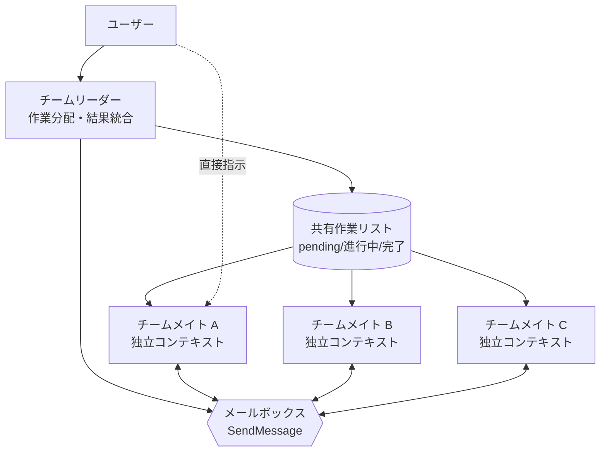

# エージェントチーム

エージェントチーム (Agent Teams) は複数の Claude Code セッションを 1 つのチームにまとめ、共有作業リストと相互メッセージングで協業させる実験的機能です。



**一行要約**: サブエージェントがリーダーにだけ報告する一方向のワーカーだとすれば、エージェントチームは互いに対話し作業を自ら取りに行き、検証まで交わす同僚集団です。


## エージェントチームとは

エージェントチームは複数の Claude Code インスタンスが一緒に働くよう調整する構造です。1 つのセッションが **チームリーダー (team lead)** になって作業を分配し結果を統合し、残りの **チームメイト (teammate)** はそれぞれ独立したコンテキストウィンドウで働きながら互いに直接通信します。

サブエージェントとの決定的な違いは通信の方向です。サブエージェントはメインエージェントにだけ結果を報告し互いに対話できませんが、エージェントチームのチームメイトは共有作業リストを見て仕事を自ら取りに行き、チームメイト同士で直接メッセージをやり取りします。リーダーを介さずユーザーが特定のチームメイトに直接指示することもできます。

エージェントチームは **並列探索** が実質的な価値を加える作業に最も強力です。

| 適した作業 | 理由 |
| --- | --- |
| リサーチ / レビュー | 複数のチームメイトが異なる側面を同時に調査し発見を交差検証 |
| 新規モジュール / 機能 | チームメイトごとに別の領域を所有し、衝突なく並列作業 |
| 競合仮説のデバッグ | 異なる理論を並列検証しより速く収束 |
| レイヤー横断作業 | フロントエンド / バックエンド / テストをチームメイト別に分担 |

逆に順次的な作業、同じファイルを一緒に修正する作業、依存性が多い作業は単一セッションやサブエージェントがより効率的です。エージェントチームは調整コストとトークン使用量が単一セッションより大きく増えます。

## サブエージェント vs エージェントチーム

|  | サブエージェント | エージェントチーム |
| --- | --- | --- |
| **コンテキスト** | 独自のコンテキストウィンドウ、結果は呼び出し元に返す | 独自のコンテキストウィンドウ、完全に独立 |
| **通信** | メインエージェントにだけ結果報告 | チームメイト同士で直接メッセージ交換 |
| **調整** | メインエージェントがすべての作業を管理 | 共有作業リストベースの自律調整 |
| **適した用途** | 結果だけが必要な集中作業 | 議論と協業が必要な複合作業 |
| **トークンコスト** | 低い (結果をメインコンテキストに要約) | 高い (チームメイトごとに別の Claude インスタンス) |

速くて集中したワーカーが報告だけすればよい場合はサブエージェントを、チームメイトが発見を共有し互いを検証しながら自律的に調整する必要がある場合はエージェントチームを選びます。

## 推奨規模: 3-5 名

チームメイト数に強制的な上限はありませんが現実的な制約があります。

- **トークンコストは線形に増加** します。チームメイトごとに独立したコンテキストウィンドウを持ちトークンを別々に消費します。
- チームメイトが多くなるほど **通信と調整の負担** が大きくなり衝突の可能性も増えます。
- 一定数を超えると **収穫逓減** が発生します。追加のチームメイトが作業速度を比例して高めてくれるわけではありません。

公式ガイドはほとんどのワークフローで **3-5 名** から始めることを推奨します。チームメイトあたり 5-6 個の作業 (task) を割り当てると、過度なコンテキストスイッチングなしで全員を忙しく保てます。たとえば独立した 15 個の作業があれば 3 名が良い出発点です。集中した 3 名が散らばった 5 名より良い結果を出す場合が多いです。

## 協業メカニズム

エージェントチームは 4 つの構成要素で動作します。

| 構成要素 | 役割 |
| --- | --- |
| **チームリーダー (team lead)** | チームを生成しチームメイトをスポーンし作業を調整するメインセッション |
| **チームメイト (teammate)** | 割り当てられた作業を行う独立した Claude Code インスタンス |
| **作業リスト (Task list)** | チームメイトが取りに行き完了する共有作業リスト |
| **メールボックス (Mailbox)** | エージェント間の通信を担当するメッセージングシステム |

### 共有作業リストと SendMessage

作業は `pending`、`in progress`、`completed` の 3 つの状態を持ち、作業間の依存性も設定できます。依存性が解消されていない `pending` 作業は先行作業が完了するまで取りに行けません。あるチームメイトが先行作業を完了すると依存していた作業が自動的にロック解除されます。

作業の分配は 2 つの方式で行われます。

- **リーダー割り当て**: リーダーが特定の作業を特定のチームメイトに明示的に割り当てます。
- **自律クレーム (self-claim)**: チームメイトが作業を終えると、割り当てられておらず塞がれていない次の作業を自ら取りに行きます。

作業のクレームは **ファイルロック (file locking)** を使って、複数のチームメイトが同時に同じ作業を取りに行こうとするときに発生する競合状態を防ぎます。チームメイト間の通信は `SendMessage` で行われ、送られたメッセージは受信者に自動的に届けられます。リーダーがポーリングする必要なくメッセージが届き、チームメイトが作業を終えて止まると自動的にリーダーに知らせます。

### ファイル所有権

2 人のチームメイトが同じファイルを編集すると上書きが発生します。したがって各チームメイトが **異なるファイル集合を所有** するよう作業を分割するのが核心的なベストプラクティスです。新規モジュールやレイヤー横断作業のように領域が自然に分かれる場合にエージェントチームが特にうまく動作する理由でもあります。

### 協業構造


```mermaid
flowchart TD
    User[ユーザー] --> Lead[チームリーダー<br/>作業分配・結果統合]
    Lead --> TaskList[(共有作業リスト<br/>pending/進行中/完了)]
    Lead --> Mailbox{{メールボックス<br/>SendMessage}}
    TaskList --> T1[チームメイト A<br/>独立コンテキスト]
    TaskList --> T2[チームメイト B<br/>独立コンテキスト]
    TaskList --> T3[チームメイト C<br/>独立コンテキスト]
    T1 <--> Mailbox
    T2 <--> Mailbox
    T3 <--> Mailbox
    User -.直接指示.-> T1
```

リーダーは作業リストを通じて仕事を分配し、チームメイトはメールボックスで互いに直接対話し、ユーザーはリーダーを介さず個別のチームメイトにも指示できます。

## 有効化要件 (v2.1.178+)

エージェントチームは **実験的機能でデフォルトで無効化** されています。Claude Code v2.1.178 以上が必要で、環境変数 `CLAUDE_CODE_EXPERIMENTAL_AGENT_TEAMS` を `1` に設定して有効化します。

### v2.1.178 の変化

- **Implicit Teams**: チーム生成がより簡単になりました。リーダーが最初のチームメイトをスポーンすると自動的にチームが形成され、セッション終了時に自動的に整理されます。
- **TeamCreate/TeamDelete の除去**: v2.1.178 からこのコマンドは消えました (もはや手動でチームを生成したり削除したりする必要なし)。
- **`team_name` accepted-but-ignored**: Hook payload で `team_name` フィールドは依然として含まれますが、実際には無視されます (レガシー互換性用)。

シェル環境に直接指定するか、`settings.json` に登録します。

```json
{
  "env": {
    "CLAUDE_CODE_EXPERIMENTAL_AGENT_TEAMS": "1"
  }
}
```

有効化後は自然言語でチーム生成を依頼すればよいです。Claude がチームを作りチームメイトをスポーンした後、作業を調整します。

```text
TODO コメントをコードベース全体で追跡する CLI ツールを設計中です。
異なる観点から探索するエージェントチームを作ってください。
1 人は UX、1 人は技術アーキテクチャ、1 人は批判者の役割で。
```

## 表示モードとチームメイトのモデル

エージェントチームは 2 つの表示モードをサポートします。

| モード | 特徴 | 必要条件 |
|------|------|---------|
| **インプロセス** (in-process) | すべてのチームメイトがメインターミナル内で動作 | 追加設定なし (デフォルト値) |
| **スプリットペイン** (split panes) | チームメイトごとに別のウィンドウを表示 | tmux または iTerm2 (`it2` CLI) が必要 |

デフォルト値は `in-process` です (v2.1.179 から、以前は `auto` でした)。どこでも追加設定なしで使え、split-pane モードに切り替えるには `teammateMode` 設定値を変更します。

`teammateMode` に指定できる値は 4 つです。

| 値 | 動作 | 備考 |
|------|------|------|
| `in-process` | すべてのチームメイトがメインターミナルで動作 | デフォルト値 (v2.1.179+) |
| `auto` | tmux セッション内か `it2` CLI がインストールされた iTerm2 なら split pane、それ以外は in-process にフォールバック | v2.1.179 以前のデフォルト値 |
| `tmux` | split-pane 強制 — ターミナル環境に応じて tmux または iTerm2 を自動検出 | tmux のインストールが必要 |
| `iterm2` | iTerm2 ネイティブ split pane 強制 | v2.1.186+、`it2` CLI が必要 |

`~/.claude/settings.json` で指定します。

```json
{
  "teammateMode": "auto"
}
```

単一セッション限定で `--teammate-mode auto` フラグで上書きすることもできます。

split-pane モードには外部ツールが必要です。tmux はシステムパッケージマネージャーでインストールし、iTerm2 は [`it2` CLI](https://github.com/mkusaka/it2) をインストールした後 iTerm2 設定 (Settings → General → Magic → Enable Python API) で Python API を有効化する必要があります。

チームメイトはデフォルトではリーダーの `/model` 選択を継承しません。プロンプトでモデルを指定しなかったときに使うモデルは `/config` の **Default teammate model** で設定します。ただし v2.1.186 からチームメイトはリーダーの effort level を継承します (split-pane モードでは v2.1.186 から適用、以前のバージョンはリーダーの effort を伝えません)。

## 品質ゲート hook

[hook](/ja/claude-code/extensibility/hooks) を使うと、チームメイトが作業を終えたり作業が生成・完了したりするときにルールを強制できます。

| hook イベント | 発動タイミング | 終了コード 2 の意味 |
| --- | --- | --- |
| `TeammateIdle` | チームメイトがアイドル状態に移行する直前 | フィードバックを送って作業を続けさせる |
| `TaskCreated` | 作業が生成されようとするとき | 生成を防ぎフィードバックを送信 |
| `TaskCompleted` | 作業が完了処理されようとするとき | 完了を防ぎフィードバックを送信 |

## 知っておくべき限界

エージェントチームは実験的機能なので次の限界を認識して使います。

- **セッション再開の未対応**: `/resume` と `/rewind` はインプロセスのチームメイトを復元できません。再開後はリーダーに新しいチームメイトをスポーンするよう指示します。
- **作業状態の遅延**: チームメイトが作業完了マークを漏らして依存作業が塞がれることがあります。
- **一度に 1 チーム**: リーダーは 1 つのチームだけを管理します。新しいチームを作る前に現在のチームを整理する必要があります。
- **ネストしたチーム不可**: チームメイトは自分のチームやチームメイトをスポーンできません。チーム管理はリーダーだけが可能です。
- **リーダー固定**: チームを作ったセッションが寿命の間リーダーであり、リーダーシップを移譲できません。

チームの整理は常にリーダーを通じて行います。作業が終わったらリーダーに整理を依頼しますが、実行中のチームメイトが残っていると整理が失敗するので先に終了させる必要があります。

## MoAI CG モードとの連携 — チーム構造をトークノミクスへ

MoAI-ADK はこのネイティブなチームランタイムの上に **CG モード** (`moai cg`、Claude + GLM ハイブリッド) を載せてコストを最適化します。リーダーは Claude で戦略・計画・監査を調整し、チームメイトは tmux セッション単位の環境隔離を通じて GLM 環境を継承し大量の実装作業を行う方式です。「誰が何をするか」というチーム構造の問いに「どのモデルがいくら分の仕事をするか」というトークノミクスの答えを結合したもので、実装中心の SPEC・コード生成・テスト作成のようにトークン消費が大きい作業で **60-70% のコスト削減** を得ます。

1 つ区別しておくべきことがあります。MoAI-ADK は自身のワークフローオーケストレーションでは静的なエージェントチーム階層を引退させ、順次サブエージェントと動的ワークフローをデフォルトで使いますが、このページで扱った Claude Code のネイティブなチームランタイム (tmux ペイン、共有作業リスト) は CG モードがそのまま活用します。つまり「チーム」という実行形態は生きており、その用途が協業調整からコストルーティングへ移った形です。

CG モードの設定と運用方法は別のドキュメントで詳しく扱うので、以下のリンクを参考にします。

## 関連ドキュメント

- [ダイナミックワークフロー](/ja/claude-code/agentic/workflows)
- [CG モード (Claude + GLM)](/ja/multi-llm/cg-mode)

## 参考資料

- [Claude Code Docs — Orchestrate teams of Claude Code sessions](https://code.claude.com/docs/en/agent-teams)


エージェントチームが初めてなら、コードを書かない作業から始めてください。PR レビュー、ライブラリリサーチ、バグ調査のように境界が明確な作業は、並列実装の調整負担なしに並列探索の価値をすぐに体感させてくれます。

